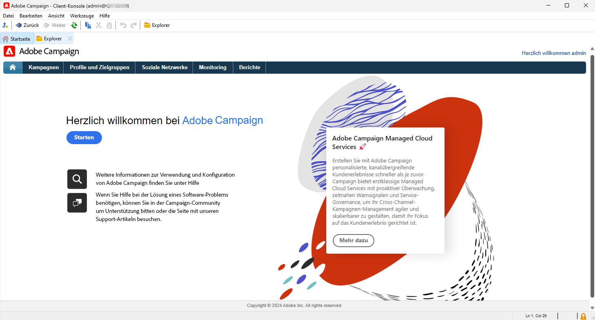

# Erste Schritte für Admins und Entwickelnde {#acs-gs-admin}

Diese Seite liefert einen Überblick über die wichtigsten Verwaltungs- und Daten-Management-Funktionen von Campaign v8. Sie richtet sich an Admins und technische Marketing-Fachleute, die von Campaign Standard zu Campaign v8 wechseln.

Der wichtigste Unterschied besteht in der nun verfügbaren Client-Konsole, der nativen Anwendung, die mit dem Adobe Campaign-Anwendungs-Server kommuniziert.

In der Campaign-Client-Konsole sind alle Funktionen und Einstellungen zentral verfügbar. Sie wird mit der Campaign Web-Benutzeroberfläche synchronisiert, um die Einheitlichkeit beider Umgebungen sicherzustellen.

{zoomable="yes"}

[Erfahren Sie mehr über die Client-Konsolen-Benutzeroberfläche von Adobe Campaign v8](https://experienceleague.adobe.com/de/docs/campaign/campaign-v8/new/campaign-ui#ui-access){target="_blank"}.

## Architektur von Campaign v8 {#acs-gs-admi-archi}

Die Campaign-Architektur wird in der Dokumentation zu Campaign v8 (Konsole) beschrieben. Grundlegende Informationen finden Sie auf [dieser Seite](https://experienceleague.adobe.com/de/docs/campaign/campaign-v8/config/architecture/general-architecture){target="_blank"}.

Nützliche Links für den Beginn:

* Die Komponenten und die globale Architektur von Adobe Campaign werden auf [dieser Seite](https://experienceleague.adobe.com/de/docs/campaign/campaign-v8/new/ac-components){target="_blank"} beschrieben.

* Unter [Erste Schritte mit der Architektur von Campaign](https://experienceleague.adobe.com/de/docs/campaign/campaign-v8/config/architecture/architecture){target="_blank"} finden Sie Informationen, um sich mit der Architektur von Campaign vertraut zu machen, bevor Sie mit der Strukturierung Ihrer Instanz beginnen.

<!--Two deployment models are available: **Campaign FDA deployment** (P1-P3) and **Campaign Enterprise (FFDA)** deployment (P4). As a customer transitioning from Campaign Standard, your deployment model is **Campaign FDA**.-->

* „Transaktionsnachrichten (Message Center)“ ist das Modul von Campaign v8, das zum Verwalten ausgelöster Nachrichten entwickelt wurde. Es beruht auf einem bestimmten Architekturmodell, das in [diesem Abschnitt](https://experienceleague.adobe.com/de/docs/campaign/campaign-v8/config/architecture/architecture#transac-msg-archi){target="_blank"} beschrieben wird.

## Client-Konsole von Campaign {#acs-gs-console}

### Installieren der Client-Konsole {#acs-gs-admin-console}

Administrations- und Konfigurationsaufgaben werden in der Admin Console durchgeführt. Der erste Schritt besteht darin, Ihre Umgebung einzurichten.

Die Campaign-Client-Konsole ist eine native Anwendung, die über Standard-Internet-Protokolle wie SOAP und HTTP mit dem Adobe Campaign-Anwendungs-Server kommuniziert. In der Campaign Client-Konsole sind alle Funktionen und Einstellungen verfügbar. Sie benötigt minimale Bandbreite, da sie auf einem lokalen Cache beruht. Die für einfache Bereitstellungen entwickelte Campaign-Client-Konsole kann über einen Internet-Browser bereitgestellt sowie automatisch aktualisiert werden und erfordert keine spezielle Netzwerkkonfiguration, da sie ausschließlich HTTP(S)-Traffic erzeugt.

Das folgende Video erklärt, wie Sie die Adobe Campaign-Client-Konsole herunterladen und installieren und wie Sie die Verbindung zu Ihrer Instanz verwalten.

>[!VIDEO](https://video.tv.adobe.com/v/335375?quality=12&learn=on){transcript=true}

Weitere Informationen finden Sie unter [Herstellen einer Verbindung mit Campaign über die Client-Konsole](https://experienceleague.adobe.com/de/docs/campaign/campaign-v8/new/connect){target="_blank"}.

Beachten Sie, dass die Client-Konsole in einer unterstützten Umgebung installiert werden muss. Weitere Informationen finden Sie in der [Kompatibilitätsmatrix für Campaign v8 (Konsole)](https://experienceleague.adobe.com/de/docs/campaign/campaign-v8/releases/compatibility-matrix#ClientConsoleoperatingsystems){target="_blank"}.

### Erkunden der Benutzeroberfläche der Client-Konsole  {#acs-gs-ui}

In diesem Tutorial-Video erfahren Sie mehr über die Benutzeroberfläche von Adobe Campaign v8 und darüber, wie Sie durch die Hauptfunktionen navigieren.

>[!VIDEO](https://video.tv.adobe.com/v/3426435?captions=ger&quality=12&learn=on){transcript=true}

Weitere Informationen finden Sie unter [Arbeiten mit der Client-Konsole](https://experienceleague.adobe.com/de/docs/campaign/campaign-v8/new/campaign-ui){target="_blank"}.

## Verwalten der Umgebung {#acs-gs-admin-env}

Führen Sie nach der Installation der Client-Konsole die unter [Herstellen einer Verbindung mit Campaign über die Client-Konsole](https://experienceleague.adobe.com/de/docs/campaign/campaign-v8/new/connect#create-your-connection){target="_blank"} beschriebenen Schritte aus, um die Verbindung zum Anwendungs-Server herzustellen.

Sicherheitsmaßnahmen sind tief in unsere internen Prozesse und Tools rund um die Entwicklung und den Betrieb von Software implementiert und werden von unseren Teams über alle Funktionsbereiche hinweg strikt befolgt, um Sicherheitsvorfällen vorzubeugen bzw. diese schnellstmöglich zu erkennen und zu beheben. Weitere Informationen finden Sie in den [Best Practices für die Campaign-Sicherheit](https://experienceleague.adobe.com/de/docs/campaign/campaign-v8/privacy/security){target="_blank"}.

### Zugriffsrechte und Berechtigungen {#acs-gs-admin-rights}

Mit Adobe Campaign können Sie die Benutzenden zugewiesenen Rechte definieren und verwalten. Diese Berechtigungen werden durch die Kombination von Benutzergruppenberechtigungen, spezifischen Berechtigungen und Berechtigungen für Ordner definiert.

Wenn Sie von Campaign Standard zu Campaign v8 wechseln, bleiben Ihre Berechtigungen und Zugriffsrechte unverändert erhalten. Sicherheitsgruppen wurden von Adobe in die Benutzergruppen von Campaign v8 verschoben und Ihre Berechtigungen für Organisationseinheiten wurden auf Ordnerberechtigungen umgestellt. Campaign-Benutzende verbinden sich über ihre Adobe ID mit Campaign v8 und können dann dieselben Anmelde- und Kennwortdaten wie in Campaign Standard verwenden.

Campaign-[Ordner](https://experienceleague.adobe.com/de/docs/campaign/campaign-v8/config/configuration/folders-and-views){target="_blank"} werden im Explorer-Baum der Client-Konsole als Knoten dargestellt. Je nach Typ enthalten sie bestimmte Datentypen. Programme werden durch Ordner in Campaign v8 materialisiert. Sie können Ordner erstellen und Berechtigungen für sie verwalten, um den Zugriff zu beschränken. [Weitere Informationen](https://experienceleague.adobe.com/de/docs/campaign/campaign-v8/admin/permissions/folder-permissions){target="_blank"}.

Weitere Informationen finden Sie in der [Dokumentation zu Benutzerberechtigungen](https://experienceleague.adobe.com/de/docs/campaign/campaign-v8/admin/permissions/gs-permissions){target="_blank"}.

### Campaign Control Panel {#acs-gs-admin-cp}

Wie bei Campaign Standard können Sie Ihre Umgebung über das Control Panel verwalten. Beachten Sie, dass das Control Panel für v8 zusätzliche Funktionen bietet.

Das Campaign Control Panel ermöglicht Produktadministratoren von Adobe Campaign effizienteres Arbeiten. Sie können damit die Einstellungen aller Instanzen verwalten und deren Nutzung erfassen. Mit der intuitiven Benutzeroberfläche können Sie die Nutzung von Schlüsselressourcen einfach überwachen und administrative Aufgaben wie das Hinzufügen von IP-Adressen, die Überwachung von SFTP-Speicher, die Schlüsselverwaltung und vieles mehr durchführen.

Weitere Informationen finden Sie in den [Tutorials zum Control Panel](https://experienceleague.adobe.com/de/docs/control-panel-learn/tutorials/control-panel-overview){target="_blank"} und in der [Dokumentation zum Control Panel](https://experienceleague.adobe.com/docs/control-panel/using/control-panel-home.html?lang=de){target="_blank"}.

* **IP-Adressen hinzufügen**: Im Control Panel von Campaign können Sie neue Verbindungen zu Ihren Instanzen einrichten, indem Sie IP-Adressbereiche auf die Zulassungsliste setzen. Weitere Informationen finden Sie in der [Dokumentation zur IP-Zulassungsauflistung](https://experienceleague.adobe.com/de/docs/control-panel/using/instances-settings/ip-allow-listing-instance-access){target="_blank"}

* **Subdomain konfigurieren**: Sie können einen Teil Ihrer Domain (technisch eine „DNS-Zone“) für die Verwendung mit Adobe Campaign konfigurieren.
Weitere Informationen finden Sie in der [Dokumentation zur Subdomain-Delegierung](https://experienceleague.adobe.com/de/docs/control-panel/using/subdomains-and-certificates/subdomains-branding){target="_blank"}

* **SFTP-Server verwalten**: Über das Control Panel können Sie mit allen SFTP-Servern interagieren, die mit Campaign-Instanzen verbunden sind, auf die Sie Zugriff haben. Weitere Informationen finden Sie in der [Dokumentation zur SFTP-Verwaltung](https://experienceleague.adobe.com/de/docs/control-panel/using/sftp-management/about-sftp-management){target="_blank"}

### Audit-Protokoll {#acs-gs-admin-audit-trail}

Das Audit-Protokoll, das bereits in Campaign Standard verfügbar gewesen ist, kann in Campaign v8 verwendet werden, um auf den vollständigen Verlauf der in Ihrer Instanz vorgenommenen Änderungen zuzugreifen.

In der Adobe Campaign Web-Benutzeroberfläche bietet die Funktion „Audit-Protokoll“ Benutzenden vollständige Einsicht in alle Änderungen, die an wichtigen Entitäten in Ihrer Instanz vorgenommen wurden. Dies sind typischerweise Änderungen, die den reibungslosen Betrieb der Instanz wesentlich beeinflussen. Weitere Informationen finden Sie in der [Dokumentation zum Audit-Protokoll](../../v8/reporting/audit-trail.md).

### Daten-Packages {#acs-gs-admin-audit-packages}

Ähnlich wie in Campaign Standard können Admins Packages definieren, mit denen der Austausch von Ressourcen zwischen verschiedenen Adobe Campaign-Instanzen über strukturierte XML-Dateien ermöglicht wird. Packages können Konfigurationsparameter oder Daten enthalten.

Sie können Daten-Packages verwenden, um benutzerdefinierte Plattformeinstellungen und -daten zu exportieren und zu importieren. Daten-Packages können verschiedene Arten von Konfigurationen und Komponenten enthalten, gefiltert oder ungefiltert. Weitere Informationen zum Arbeiten mit Daten-Packages in Campaign v8 finden Sie in [dieser Dokumentation](https://experienceleague.adobe.com/de/docs/campaign/campaign-v8/developer/packages){target="_blank"}.

<!--
MISSING LINKS: 

- System options
- Data Encryption/Decryption-->

### Personalisieren der Benutzeroberfläche {#acs-gs-admin-ui}

In der Client-Konsole stehen verschiedene Optionen zum Anpassen der Benutzeroberfläche zur Verfügung, z. B.:

* **Listen- und Datenanzeige**: Richtlinien zum Verwalten von Benutzeroberflächeneinstellungen wie Listen, Einheiten oder Datenanzeige finden Sie in der [Dokumentation zu Benutzeroberflächeneinstellungen](https://experienceleague.adobe.com/de/docs/campaign/campaign-v8/config/configuration/ui-settings){target="_blank"}

* **Ordnerverwaltung**: Ordner sind Objekte in Adobe Campaign, mit denen Sie Ihre Komponenten und Daten konfigurieren können. Sie werden auch zur Verwaltung von Berechtigungen eingesetzt. Weitere Informationen finden Sie unter [Arbeiten mit Ordnern](../../v8/get-started/work-with-folders.md).

* **Benutzerdefinierte Felder**: Benutzerdefinierte Felder sind zusätzliche Attribute, die über die Adobe Campaign-Konsole zu vorkonfigurierten Schemata hinzugefügt werden. Diese benutzerdefinierten Felder werden in verschiedenen Bildschirmen angezeigt, z. B. in den Details eines Profils oder Testprofils. Weitere Informationen finden Sie in der [Dokumentation zur Konfiguration von benutzerdefinierten Feldern](../../v8/administration/custom-fields.md).

## Konfigurieren des Brandings {#acs-gs-admin-branding}

Jedes Unternehmen verfügt über Markenrichtlinien, die sowohl visuelle Elemente als auch technische Details definieren. Was Adobe Campaign Standard angeht, hilft Ihnen Adobe Campaign v8 bei der zentralen Verwaltung dieser Richtlinien, sodass Sie Ihrer Kundschaft ein konsistentes Markenbild präsentieren können – von den Logos in E-Mails bis hin zu den in Ihren Kampagnen verwendeten URLs und Domains. Als Mitglied der Gruppe der technischen Admins haben Sie die Möglichkeit, mehrere Marken in Adobe Campaign zu erstellen und zu verwalten.

Weitere Informationen finden Sie in der [Dokumentation zum Branding](https://experienceleague.adobe.com/de/docs/experience-cloud/campaign/branding/branding-gs){target="_blank"}

## Grundlegendes zur Erstellung von Datenmodellen {#acs-gs-admin-data-model-creation}

Ähnlich wie Campaign Standard enthält Adobe Campaign v8 ein vordefiniertes Datenmodell. Adobe Campaign stützt sich auf eine Cloud-Datenbank mit Tabellen, die miteinander verknüpft sind. Weitere Informationen finden Sie in der [Dokumentation zum Datenmodell](https://experienceleague.adobe.com/de/docs/campaign/campaign-v8/developer/datamodel){target="_blank"}.

Ein Schema ist ein mit einer Datenbanktabelle verknüpftes XML-Dokument. Es definiert die Datenstruktur und beschreibt die SQL-Definition der Tabelle. Weitere Informationen finden Sie in der [Dokumentation zur Schemaerstellung](https://experienceleague.adobe.com/de/docs/campaign/campaign-v8/developer/shemas-forms/schemas){target="_blank"}

In diesem Video erfahren Sie, wie Sie in Campaign v8 ein Schema erstellen und ein vorhandenes Schema erweitern:

>[!VIDEO](https://video.tv.adobe.com/v/337939?quality=12&learn=on){transcript=true}

Ähnlich wie bei den in Campaign Standard verfügbaren Funktionen können Sie auch benutzerdefinierte Ressourcen erstellen. In Campaign v8 sind benutzerdefinierte Ressourcen benutzerdefinierte oder erweiterte **Schemata**.

* Weitere Informationen zum Arbeiten mit Schemata finden Sie auf [dieser Seite](https://experienceleague.adobe.com/de/docs/campaign/campaign-v8/developer/shemas-forms/schemas){target="_blank"}.

* Weitere Informationen zum Erweitern eines vorhandenen Schemas finden Sie auf [dieser Seite](https://experienceleague.adobe.com/de/docs/campaign/campaign-v8/developer/shemas-forms/extend-schema){target="_blank"}.

* Weitere Informationen zum Erstellen eines neuen Schemas finden Sie auf [dieser Seite](https://experienceleague.adobe.com/de/docs/campaign/campaign-v8/developer/shemas-forms/create-schema){target="_blank"}.

* Wenn Sie ein Schema erstellen oder erweitern, müssen Sie die zugehörigen Formulare für die Eingabe erstellen oder ändern, um diese Änderungen für die Endbenutzenden sichtbar zu machen. Mit einem Formular können Sie eine Instanz, die mit einem Datenschema verknüpft ist, über die Adobe Campaign-Client-Konsole bearbeiten. Das Formular wird anhand seines Namens und seines Namespace identifiziert. Weitere Informationen finden Sie in der [Dokumentation zur Erstellung von Eingabeformularen](https://experienceleague.adobe.com/de/docs/campaign/campaign-v8/developer/shemas-forms/forms){target="_blank"}.

## Workflows und Daten-Management {#acs-gs-admin-data-management}

So wie Adobe Campaign Standard enthält Adobe Campaign v8 ein Workflow-Modul, mit dem Sie die gesamte Bandbreite von Prozessen und Aufgaben über die verschiedenen Module des Anwendungs-Servers hinweg orchestrieren können. In dieser vielseitigen grafischen Umgebung können Sie Prozesse erstellen, wie etwa die Segmentierung, die Kampagnenausführung, die Dateiverarbeitung und den Eingriff durch Personen. Die Workflow-Engine führt diese Prozesse aus und verfolgt sie. Informationen zu den ersten Schritten mit Workflows in Campaign v8 finden Sie in [dieser Dokumentation](https://experienceleague.adobe.com/de/docs/campaign/campaign-v8/data/workflows){target="_blank"}.

Links zu anderen nützlichen Ressourcen finden Sie im folgenden Abschnitt:

* In diesem Video erfahren Sie, was Zielgruppendimensionen und Arbeitstabellen sind und wie Adobe Campaign Daten aus verschiedenen Datenquellen verwaltet:

  >[!VIDEO](https://video.tv.adobe.com/v/3452603?captions=ger&quality=12&learn=on){transcript=true}

* Mit Campaign können Sie der Cloud-Datenbank Kontakte hinzufügen. Sie können eine Datei laden, mehrere Kontaktaktualisierungen planen und automatisieren, Daten im Internet sammeln oder Profilinformationen direkt in die Empfängertabelle eingeben. Weitere Informationen finden Sie in der [Dokumentation zum Importieren von Daten (Konsole)](https://experienceleague.adobe.com/de/docs/campaign/campaign-v8/data/import){target="_blank"}.

* Sie können verschiedene Berichte einfach in das PDF- oder CSV-Format exportieren, sodass Sie sie weitergeben, bearbeiten oder drucken können. Weitere Informationen finden Sie in der [Dokumentation zum Exportieren von Daten](../../v8/reporting/export-reports.md).

## REST APIs {#acs-gs-admin-apis}

Mit Campaign REST-APIs können Sie Integrationen für Adobe Campaign erstellen und Ihr eigenes Ökosystem einrichten, indem Sie Adobe Campaign mit den von Ihnen verwendeten Technologien verbinden.

Wenn Sie von Campaign Standard zu Campaign v8 wechseln, stehen Ihnen REST-APIs zur Verfügung.

Weitere Informationen finden Sie in der [Dokumentation zu REST-APIs](https://experienceleague.adobe.com/de/docs/experience-cloud/campaign/apis/get-started-apis){target="_blank"}.

Beim Wechsel von Campaign Standard zu Campaign v8 gelten verschiedene Empfehlungen und Einschränkungen für REST-APIs. Diese sind auf [dieser Seite](https://experienceleague.adobe.com/de/docs/experience-cloud/campaign/apis/limitations){target="_blank"} aufgeführt. Beim Wechsel zu Campaign v8 bestehen bestimmte Einschränkungen, wie im unten stehenden Hinweis zur Verfügbarkeit beschrieben:

>[!AVAILABILITY]
>
>* Die PKEY-Werte verändern sich zwischen der vorhandenen Campaign Standard-Instanz und der migrierten Campaign v8-Instanz. Falls PKEYs in einer externen Datenbank gespeichert werden, muss die Implementierung so geändert werden, dass ein Aufruf der Haupt-APIs von Adobe Campaign v8 erforderlich wird, die Pkeys/href-Links mit PKEYs bereitstellen. Außerdem müssen nachfolgende API-Aufrufe dynamisch gebildet werden, indem die Pkeys/hrefs aus vorherigen API-Aufrufen genutzt werden.
>
>* In Campaign v8 führt die Eigenschaft „firstName“ für denselben Hauptteil, bei dem das Fahrzeug mit einem Profil verknüpft ist, zu einem Fehler, wonach die Eigenschaft „firstName“ für `cusVehicle` nicht gültig ist. Dagegen funktioniert ein Anfragetext nur mit den Attributen und ohne Link einwandfrei. `{ "vehicleNumber": "20009", "vehicleName": "Model E", "vehicleOwner":{   "firstName":"tester 11", "lastName":"Smith 11" } }&#x200B;`
>
>* Die Zeitzone wird den Benutzenden im Zuge des REST-API-Aufrufs `profileAndServicesExt/profile` und nicht des REST-API-Aufrufs `profileAndServices/profile` angezeigt, da sie im Rahmen der Datenmigration in einem erweiterten Schema hinzugefügt wird.
>
>* `ccpaOptOut` wird den Benutzenden nur im Zuge des REST-API-Aufrufs `profileAndServicesExt/profile` und nicht des REST-API-Aufrufs `profileAndServices/profile` angezeigt, da dieses Element im Rahmen der Datenmigration in einem erweiterten Schema hinzugefügt wird.
>

<!--
## Working with templates - TO REMOVE?

Workflow templates contain pre-configured settings and activities which can be reused for creating new workflows.
[Workflow template documentation](../../v8/workflows/create-workflow.md)

You can design your landing page content, and save it for future reuse. See the [landing page template documentation](../../v8/landing-pages/lp-templates.md).

Each event can trigger a personalized message. For this to happen, you need to create a message template to match each event type. Templates contain the necessary information for personalizing the transactional message. See the [Transactional messaging template documentation](https://experienceleague.adobe.com/de/docs/campaign/campaign-v8/send/real-time/transactional-template)

Using a workflow template is a best practice if you need to regularly import files with the same structure. See the [Import template documentation](https://experienceleague.adobe.com/de/docs/campaign/automation/workflows/use-cases/data-management/recurring-import-workflow){target="_blank"}
-->

## Datenschutz und Einverständniserklärung

Beim Wechsel von Campaign Standard zu Campaign v8 ist es wichtig zu überprüfen, wie sich Datenschutzbestimmungen auf Ihre Datenvorgänge auswirken. Abhängig von Ihrem Unternehmen und den Gerichtsbarkeiten, in denen Sie tätig sind, haben Kundinnen und Kunden möglicherweise das gesetzliche Recht, auf die Daten zuzugreifen, die Sie über sie besitzen, oder ihre Löschung zu beantragen.

In Campaign v8 müssen alle Datenschutzanfragen über die Integration von **Adobe Privacy Service** verwaltet werden. Weitere Informationen finden Sie in der [Dokumentation zu Campaign v8 (Konsole)](https://experienceleague.adobe.com/de/docs/campaign/campaign-v8/privacy/privacy).

Beachten Sie, dass Ihre Campaign Standard-Umgebung nach der Umstellung noch einige Zeit aktiv bleibt. Während dieser Zeit können Datenschutzanfragen auf beiden Systemen eintreffen. Um die Einhaltung von Vorschriften sicherzustellen und Lücken zu vermeiden, stimmen Sie sich mit der für die Adobe-Umstellung verantwortlichen Person ab, damit sie die Anfragen in beiden Umgebungen ordnungsgemäß bearbeiten können.

## Anmeldedienste {#acs-gs-admin-sub}

Wie in Campaign Standard können Sie als Admin Anmeldedienste erstellen und Marketing-Fachleute können Nachrichten an ihre Abonnentinnen und Abonnenten senden. Die wichtigsten Konzepte und Implementierungsschritte sind auf Campaign Standard abgestimmt. Nachstehend finden Sie nützliche Links und Videos.

Erfahren Sie, wie Sie Anmeldungen und Abonnements einrichten und verwalten und Zielgruppen adressieren.

>[!VIDEO](https://video.tv.adobe.com/v/3426550?captions=ger&quality=12&learn=on){transcript=true}

* Weitere Informationen zu den Anmeldediensten finden Sie in der [Dokumentation zur Web-Benutzeroberfläche](../../v8/audience/manage-subscribers.md).

* Informationen zum Einrichten von Abonnementdiensten in der Client-Konsole finden Sie zudem in [diesem Abschnitt](https://experienceleague.adobe.com/de/docs/campaign/campaign-v8/audience/subscriptions){target="_blank"}.

## Nachrichten und Sendungen{#acs-gs-msg}

### Konfigurieren der Versandkanäle {#acs-gs-admin-channels}

Wie Campaign Standard können Sie mit Adobe Campaign v8 Cross-Channel-Kampagnen wie E-Mails, SMS, Push-Benachrichtigungen und Briefpost senden und deren Effektivität mithilfe verschiedener dedizierter Berichte messen. Diese Nachrichten werden mittels Sendungen entworfen und gesendet und können für jede Empfängerin und jeden Empfänger personalisiert werden. Zu den Kernfunktionen zählen Zielgruppenbestimmung, Definition und Personalisierung von Nachrichten, Ausführung der Kommunikation und die damit verbundenen operativen Berichte. Der wichtigste funktionale Zugangspunkt ist der Versandassistent. Dieser Zugriffspunkt führt zu mehreren Funktionen, die von Adobe Campaign abgedeckt werden.

Als Admin müssen Sie Ihre Kanalkonfigurationen definieren. Weitere Informationen finden Sie über die unten stehenden Links.

* **E-Mail**: Alle E-Mail-Einstellungen werden auf [dieser Seite](https://experienceleague.adobe.com/de/docs/campaign/campaign-v8/send/emails/email-parameters){target="_blank"} beschrieben.
* **SMS**: Informationen zum Konfigurieren des SMS-Kanals finden Sie in [dieser Dokumentation](https://experienceleague.adobe.com/de/docs/campaign/campaign-v8/send/sms/sms){target="_blank"}.
* **Push-Benachrichtigungen**: Die Schritte zum Konfigurieren des Push-Benachrichtigungskanals werden in [diesem Abschnitt](https://experienceleague.adobe.com/de/docs/campaign/campaign-v8/send/push/push-data-collection){target="_blank"} beschrieben.
* **Transaktionsnachrichten**: Die Schritte zum Konfigurieren von [Transaktionsnachrichten](https://experienceleague.adobe.com/de/docs/campaign/campaign-v8/send/real-time/transactional){target="_blank"} in Campaign v8 werden in [diesem Abschnitt](https://experienceleague.adobe.com/de/docs/campaign/campaign-v8/config/configuration/transactional-msg-settings) beschrieben.

### Externe Konten {#acs-gs-ext-accounts}

Als Admin sind Sie für die Konfiguration und Pflege externer Campaign-Konten verantwortlich. Wie in Campaign Standard werden externe Konten von technischen Prozessen wie technischen Workflows oder Kampagnen-Workflows verwendet.

Beim Wechsel zu Campaign v8 werden auch Ihre vorhandenen externen Campaign Standard-Konten berücksichtigt.

Weitere Informationen finden Sie in der [Dokumentation zu externen Konten](../../v8/administration/external-account.md).

<!--
**Email**

MISSING LINKS :
- general email channel parameters 
- email routing accounts 
- email processing rules 
- email properties
-->

<!--
MISSING LINKS: 
- Setting external account 
- Adding vender details etc. -->

<!--
**Mobile app**
MISSING LINKS: 
- Configuring a mobile application using AEP SDKs 
- Sync Mobile app AEPSDK  
- Setting up your application in Adobe Campaign 
- Channel-specific application configuration
-->

### Dynamische Inhalte {#acs-gs-dyn-content}

Verwenden Sie Campaign, um dynamische Inhalte zu erstellen und personalisierte Nachrichten zu versenden. Personalisierungsfunktionen können kombiniert werden, um Ihre Nachrichten zu verbessern und ein individuelles Benutzererlebnis zu schaffen.

In diesem Video erfahren Sie, wie Sie als Admin mit Campaign v8 dynamische Inhaltsbausteine definieren und festlegen, wie diese zur Personalisierung des Inhalts Ihres E-Mail-Versands verwendet werden:

>[!VIDEO](https://video.tv.adobe.com/v/3449015?captions=ger&quality=12&learn=on){transcript=true}

Nützliche Links:

* [Erste Schritte mit der Personalisierung](https://experienceleague.adobe.com/de/docs/campaign/campaign-v8/send/personalize/personalize){target="_blank"}
* [Verwenden von Gestaltungsbausteinen](https://experienceleague.adobe.com/de/docs/campaign/campaign-v8/send/personalize/personalization-blocks){target="_blank"}
* [Erstellen bedingter Inhalte](https://experienceleague.adobe.com/de/docs/campaign/campaign-v8/send/personalize/conditions){target="_blank"}
* [Quellen von Personalisierungsdaten](https://experienceleague.adobe.com/de/docs/campaign/campaign-v8/send/personalize/personalization-data){target="_blank"}

### Versandvorlagen {#acs-gs-templates}

Die Verwendung von Versandvorlagen ist in Campaign v8 wie in Campaign Standard eine Voraussetzung.

Erstellen Sie Versandvorlagen, um benutzerdefinierte Inhalte und Einstellungen in Ihren Kampagnen einfach wiederzuverwenden und so den Design-Prozess zu beschleunigen und zu verbessern. Diese Funktion ermöglicht es Ihnen, das kreative Look-and-Feel zu standardisieren, um Kampagnen schneller durchführen und starten zu können. Erfahren Sie, wie Sie in der [Campaign-Web-Benutzeroberfläche](../../v8/msg/delivery-template.md) Versandvorlagen erstellen. Informationen zum Erstellen von Versandvorlagen in der Client-Konsole finden Sie in [diesem Abschnitt](https://experienceleague.adobe.com/de/docs/campaign/campaign-v8/send/create-templates){target="_blank"}.

### Typologieregeln {#acs-gs-admin-rules}

Als Admin sind Sie für die Erstellung und Pflege der Typologieregeln für Ihre Sendungen verantwortlich. So wie in Adobe Campaign Standard sind Typologieregeln in Campaign v8 Geschäftsregeln, mit denen Sie eine Nachricht vor dem Versand prüfen und filtern können.

Beim Wechsel von einer Campaign Standard-Umgebung zu Campaign v8 werden Ihre Typologieregeln nach Campaign v8 verschoben.

In Campaign v8 verfügen Typologieregeln über einen speziellen Modus zur Kampagnenoptimierung. Mit diesem Modul können Sie die Durchführung von Sendungen steuern, filtern und überwachen. Zur Vermeidung von Konflikten zwischen Kampagnen kann Adobe Campaign verschiedene Kombinationen testen, indem es spezifische Beschränkungsregeln anwendet. Auf diese Weise werden ein ideal auf Kundenbedürfnisse abgestimmter Nachrichtenversand sowie eine kohärente Unternehmenskommunikation sichergestellt. Weitere Informationen finden Sie in der [Dokumentation zu Topologieregeln](https://experienceleague.adobe.com/de/docs/campaign/automation/campaign-optimization/campaign-typologies){target="_blank"}.

### Quarantäneverwaltung {#acs-gs-admin-quarantine}

Alle unter Quarantäne gestellten Adressen und Quarantäneregeln wurden von Ihrer Campaign Standard-Umgebung zu Campaign v8 migriert. Für die Quarantäneverwaltung sind keine speziellen Aktionen erforderlich.

Als Admin sollten Sie sich mit der Quarantäneverwaltung in Campaign v8 vertraut machen. [Diese Seite](../../v8/audience/quarantine.md) ist ein erster Schritt dazu. Weitere Informationen zur Quarantäneverwaltung finden Sie in [diesem Abschnitt](https://experienceleague.adobe.com/de/docs/campaign/campaign-v8/send/failures/quarantines#access-quarantined-addresses){target="_blank"} der ausführlichen Dokumentation der Client-Konsole.

## Verwalten von Adobe Campaign-Integrationen {#acs-gs-integrations}

Sie können Ihre Campaign-Instanz mit Adobe Experience Cloud-Lösungen verbinden, um Funktionen zu kombinieren. Adobe Campaign verfügt über mehrere Connectoren, über die Sie mit externen Anwendungen kommunizieren, eine Verbindung zu Datenbank-Engines herstellen sowie Daten freigeben und synchronisieren können. Informationen zum Kombinieren Ihrer Lösungen finden Sie [dieser Dokumentation](https://experienceleague.adobe.com/de/docs/campaign/campaign-v8/connect/integration){target="_blank"}.

Wenn Sie von Campaign Standard zu Campaign v8 migrieren, gilt Folgendes:

* Wenn Sie diese Integrationen mit Campaign Standard verwendet haben, werden Ihre **Adobe Analytics**- und **Audience Manager**-Konfigurationen sowie -Daten von Adobe migriert.
* Wenn Ihre Campaign Standard-Umgebung mit **Adobe Experience Manager** integriert wurde, empfiehlt Adobe, zu **Adobe Experience Manager as a Cloud Service** zu wechseln. Dadurch können Sie diese Funktion beim Erstellen von E-Mails in der Campaign Web-Benutzeroberfläche verwenden. Außerdem wird eine optimierte Verwaltung von E-Mail-Versandinhalten und Formularen direkt in Ihrer Adobe Experience Manager-Umgebung ermöglicht. Weitere Informationen finden Sie auf [dieser Seite](../../v8/integrations/aem-content.md).
Beachten Sie, dass Campaign auch mit Adobe Experience Manager 6.5 integriert werden kann. Informationen zum Konfigurieren dieser Integration finden Sie in [dieser Dokumentation](https://experienceleague.adobe.com/de/docs/campaign/campaign-v8/connect/ac-aem){target="_blank"}.
* Wenn Ihre Campaign Standard-Umgebung mit **Triggers** integriert wurde, müssen Sie diese Integration in Campaign v8 einrichten und konfigurieren, wie auf [dieser Seite](https://experienceleague.adobe.com/de/docs/campaign/campaign-v8/connect/ac-triggers){target="_blank"} beschrieben.
* Wenn Ihre Campaign Standard-Umgebung mit **Adobe Target** integriert wurde, müssen Sie diese Integration in Campaign v8 einrichten und konfigurieren, wie auf [dieser Seite](https://experienceleague.adobe.com/de/docs/campaign/campaign-v8/connect/ac-at){target="_blank"} beschrieben.
