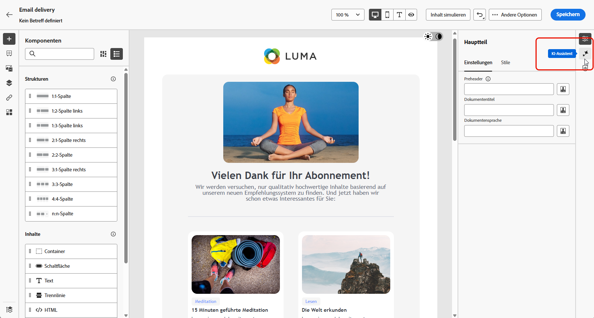

# Von Campaign Standard zu v8 {#ac-acs}

Herzlich willkommen bei Adobe Campaign v8!

Wenn Sie von Campaign Standard zu Campaign v8 wechseln, ist dieses Referenzhandbuch genau das Richtige für Sie. Es hilft Ihnen, sich mit Ihrer neuen Campaign-Umgebung vertraut zu machen, und führt Sie gezielt durch die ersten Schritte für Ihre Rolle.

1. Machen Sie sich zuerst mit den [neuen Funktionen in Adobe Campaign v8](#new) vertraut.

1. Informieren Sie sich als Nächstes über die [Unterschiede, die gemäß Ihrer Rolle in Bezug auf das Erlebnis zwischen Adobe Campaign Standard und Adobe Campaign v8 bestehen](#experiences).

## Neue Funktionen {#new}

Auf dieser Seite erhalten Sie einen Einblick in die neuesten Verbesserungen der Adobe Campaign Web-Benutzeroberfläche. Eine umfassende Liste der wichtigsten Funktionen und Versionsaktualisierungen finden Sie in [diesem Abschnitt](../../v8/rn/whats-new.md).

### Verbesserungen mit Campaign v8 {#ac-enhancements}

Die wichtigsten Verbesserungen, die Adobe Campaign v8 bietet, sind nachstehend aufgeführt.

* **Web-Benutzeroberfläche**

  Adobe Campaign v8 verfügt sowohl über eine Client-Konsole als auch über eine Web-Benutzeroberfläche, die den unterschiedlichen Vorlieben und Anforderungen von Benutzenden gerecht wird. Die Client-Konsole ermöglicht ein leistungsstarkes Desktop-Anwendungserlebnis, während die Web-Benutzeroberfläche intuitiv und zugänglich gestaltet ist. Sie ist daher für Marketing-Fachleute, die mit Adobe Campaign Standard vertraut sind, ideal geeignet.

  Die Web-Benutzeroberfläche weist zwar viele Ähnlichkeiten mit Adobe Campaign Standard auf, einige Begriffe können aber unterschiedlich sein.

  Weitere Informationen über die Adobe Campaign Web-Benutzeroberfläche finden Sie [hier](../../v8/campaign-web-home.md).

  {zoomable="yes"}

  Alle neuen Funktionen und Verbesserungen sind in den [Versionshinweisen](../../v8/rn/release-notes.md) aufgeführt. Die Versionen der Adobe Campaign Web-Benutzeroberfläche basieren auf einem kontinuierlichen Bereitstellungsmodell, das einen besser skalierbaren, schrittweisen Ansatz für die Implementierung von Funktionen ermöglicht. Dementsprechend werden diese Versionshinweise mehrmals im Monat aktualisiert. Sie sollten daher regelmäßig nachschauen.

* **Leistung**

  Adobe Campaign v8 nutzt fortschrittliche Cloud-basierte Datenbanktechnologien, was die Leistung und Effizienz deutlich verbessert. Diese neu gestaltete Architektur bietet verschiedene wesentliche Vorteile:

   * *Skalierung*: Das System unterstützt nun deutlich höhere Verarbeitungskapazitäten, mit einem Batch-Verarbeitungsdurchsatz von bis zu **20 Millionen Vorgängen pro Stunde**. Mit dieser neuen Architektur können noch höhere Profile mit vorhersehbarer Leistung verwaltet werden.
   * *Geschwindigkeit*: Das System wurde für jedwede Marketing-Aktivität verbessert: Segmentierung, Versandvorbereitung und Durchsatz für Transaktionsnachrichten, der nun **1 Million pro Stunde** beträgt.

  Die vollständig verwalteten Cloud-Services bieten Benutzenden Folgendes:

   * Datenexploration in Echtzeit: Sie können sofort auf Daten zugreifen und diese analysieren, um schnelle Erkenntnisse zu erhalten und fundiertere Entscheidungen zu treffen.

   * Schnelles Erstellen von Zielgruppen: Sie können innerhalb von Minuten zielgerichtete Zielgruppen für eine effizientere Kampagnensegmentierung erstellen.

  Allgemein bietet die robuste Architektur von Adobe Campaign v8 eine leistungsstarke Grundlage für die Verwaltung umfangreicher und komplexer Marketing-Kampagnen mit höherer Geschwindigkeit und Effizienz.

### Neue Funktionen in Adobe Campaign v8 {#ac-new-features}

Wenn Sie von Campaign Standard zu Campaign v8 wechseln, stehen Ihnen nun die folgenden Funktionen zur Verfügung:

* **Rich-Push**

  Adobe Campaign v8 bietet die Möglichkeit, Rich-Push-Benachrichtigungen zu versenden, um die Aufmerksamkeit der Benutzenden zu wecken und sie zum Handeln zu ermutigen. Diese Benachrichtigungen können eine Vielzahl von Elementen umfassen, z. B. Text, Bilder, Schaltflächen, Countdown-Timer, Audio usw.

  {zoomable="yes"}

  Um die Erstellung dieser Rich-Benachrichtigungen zu erleichtern, stellt Adobe Campaign v8 verschiedene Vorlagen bereit, mit denen Sie den Inhalt komplexer Benachrichtigungen, wie Karussells oder Timer, entwerfen und anpassen können.

  Sie können Ihre Benachrichtigungen abhängig vom Kundensystem anpassen:

   * Für [Android-Vorlagen](../../v8/push/rich-push.md)

   * Für [iOS-Vorlagen](../../v8/push/rich-push.md)

  Push-Benachrichtigungen sind ein wichtiges Instrument, um App-Benutzende anzusprechen und diese auch dann zu erreichen, wenn sie Ihre App nicht aktiv nutzen.

* **Adobe Experience Manager as a Cloud Service**

  Adobe Campaign v8 ist nahtlos mit Adobe Experience Manager as a Cloud Service integriert, sodass Sie für Ihre Kundschaft personalisierte und inhaltsreiche Erlebnisse schaffen können. Diese native Integration optimiert das Content-Management und nutzt die robusten Funktionen von Adobe Experience Manager zur Optimierung Ihrer Marketing-Maßnahmen.

  Im Folgenden finden Sie die wichtigsten Funktionen, die durch diese Integration bereitgestellt werden:

   * *Asset-Management*: In Adobe Campaign v8 bietet der E-Mail-Designer eine Auswahl für den Zugriff auf und die Verwaltung von Assets. Diese Funktion vereinfacht die Integration von Elementen aus Adobe Experience Manager in Ihren Versand und sorgt so für ein effizienteres Content-Mangagement. [Weitere Informationen über das Asset-Management](../../v8/integrations/aem-assets.md)

     {zoomable="yes"}

   * *Import von E-Mail-Vorlagen*: Mit Adobe Campaign v8 können Sie E-Mail-Vorlagen von Adobe Experience Manager direkt in Campaign durchsuchen und importieren. [Weitere Informationen über den Import von E-Mail-Vorlagen](../../v8/integrations/aem-content.md)

     {zoomable="yes"}

  Adobe Experience Manager as a Cloud Service bietet Cloud-native Agilität, mit der Sie die Time-to-Value verkürzen und sich auf die sich wandelnden Geschäftsanforderungen einstellen können. Diese Integration verbessert nicht nur Ihre Content-Management-Funktionen, sondern ermöglicht Ihnen auch, Ihrer Kundschaft personalisiertere und ansprechendere Erlebnisse an allen Touchpoints bereitzustellen.

* **KI-Assistent**

  Der KI-Assistent von Campaign macht die Erstellung und Durchführung von Marketing-Kampagnen über Kanäle wie E-Mail, SMS und Push intuitiv, einfach und mühelos, spart gleichzeitig Zeit, erhöht die Effizienz und führt zu besseren Ergebnissen.

  {zoomable="yes"}

  Der KI-Assistent revolutioniert die kanalübergreifende Erstellung professioneller und markenkonsistenter Inhalte. Mit fortschrittlichen GenAI-Modellen und einem tiefgreifenden Verständnis der Markenrichtlinien generiert der KI-Assistent automatisch personalisierte, ansprechende und effektive Inhalte auf der Grundlage des Marketing-Ziels, wobei die Inhalte für die von der Marke vorgegebenen Stile, Layouts, die Tonalität und mehr optimiert sind.

  Der KI-Assistent macht die Erstellung und Durchführung von Marketing-Kampagnen über Kanäle intuitiv, einfach und mühelos, spart gleichzeitig Zeit, erhöht die Effizienz und führt zu besseren Ergebnissen.

  {zoomable="yes"}

  Er bietet eine Reihe von E-Mail-Vorlagen und generiert Bilder (neu). Weitere Informationen zum KI-Assistenten finden [ in diesem Abschnitt](../../v8/email/generative-content.md). Adobe Campaign v8 verfügt über einen KI-Assistenten für [E-Mail](../../v8/email/generative-content.md), [SMS](../../v8/email/generative-sms.md) und [Push](../../v8/email/generative-push.md).

* **Aktualisierte SMS-Infrastruktur – SMS v2.0**

  Die Einfachheit und Anwenderfreundlichkeit von SMS machen sie neben ihrer Robustheit und der konkurrenzlosen Kompatibilität mit Milliarden von Endgeräten zu einem sehr wertvollen Kommunikationskanal.

  Adobe Campaign v8 verfügt über eine neue Infrastruktur, die den SMS-Versand verbessert. [Erfahren Sie mehr über neue SMS-Einstellungen](https://experienceleague.adobe.com/de/docs/campaign/campaign-v8/send/sms/sms){target="_blank"}.

* **Aktualisierte Push-Infrastruktur**

  Adobe Campaign v8 führt unseren neuesten Push-Benachrichtigungsdienst ein. Dieser wird durch ein robustes Framework gestützt, das auf moderner Spitzentechnologie aufbaut. Dieser Dienst wurde entwickelt, um neue Ebenen der Skalierbarkeit zu erschließen und sicherzustellen, dass Ihre Benachrichtigungen eine größere Zielgruppe mit nahtloser Effizienz erreichen können. Mit unserer verbesserten Infrastruktur und optimierten Prozessen können Sie höhere Skalierbarkeit und Zuverlässigkeit erwarten, die es Ihnen ermöglicht, mit Ihren App-Nutzenden wie nie zuvor in Kontakt zu treten und Verbindungen herzustellen.

  [Erfahren Sie mehr über die aktualisierte Push-Infrastruktur](https://experienceleague.adobe.com/de/docs/campaign/campaign-v8/send/push/push-data-collection){target="_blank"}.

## Managed Services {#ac-managed-services}

Adobe Campaign v8 ist als Managed Cloud Service verfügbar und bietet proaktive Überwachung, zeitgerechte Warnmeldungen und Service-Governance. Adobe Managed Cloud Service bietet Marketing-Experten eine agilere, sicherere und skalierbarere Lösung für das Cross-Channel-Kampagnen-Management mit niedrigen Gesamtbetriebskosten. Das neue Angebot kombiniert Services mit einer proaktiven Überwachung und rechtzeitigen Warnmeldungen.

## In v8 hinzugefügte Campaign Standard-Funktionen {#ac-v8-added}

Damit Sie reibungslos zu Campaign v8 wechseln können, wurden wichtige Funktionen von Campaign Standard in Campaign v8 aufgenommen. Weitere Informationen finden Sie in [dieser Dokumentation](https://experienceleague.adobe.com/docs/experience-cloud/campaign/campaign-standard-migration-home.html?lang=de){target="_blank"}.

* **Dynamisches Reporting**: Das dynamische Reporting ermöglicht vollständig anpassbare und in Echtzeit aktualisierte Berichte, um die Wirkung Ihrer Marketing-Aktivitäten zu messen. Dadurch kann auf Profildaten zugegriffen werden, was die demografische Analyse nach Profildimensionen wie Geschlecht, Ort und Alter sowie nach Daten von E-Mail-Kampagnen wie Öffnungen und Klicks ermöglicht. [Weitere Informationen](https://experienceleague.adobe.com/docs/experience-cloud/campaign/reporting/get-started-reporting.html?lang=de){target="_blank"}.

* **Zentrales Branding**: Jedes Unternehmen hat seine Richtlinien bezüglich der Darstellung und technischen Charakteristika seiner Marken. Mit Adobe Campaign können Sie Spezifikationen festlegen, um Ihre Marke Ihren Kundinnen und Kunden einheitlich zu präsentieren, angefangen bei den Logos bis hin zu technischen Aspekten wie E-Mail-Absenderinnen und -Absendern, URLs oder Domains. [Weitere Informationen](https://experienceleague.adobe.com/docs/experience-cloud/campaign/branding/branding-gs.html?lang=de)

* **Rest-APIs**: Wenn Sie von Campaign Standard migriert sind, können Sie REST-APIs verwenden, um Integrationen für Adobe Campaign zu erstellen und Ihr eigenes Ökosystem zu erstellen, indem Sie Adobe Campaign mit den von Ihnen verwendeten Technologien verbinden. [Weitere Informationen](https://experienceleague.adobe.com/docs/experience-cloud/campaign/apis/get-started-apis.html?lang=de){target="_blank"}.

* **Landingpages**: An den Landingpages von Campaign v8 wurden einige Verbesserungen vorgenommen, damit die Funktionen mit denen von Campaign Standard vergleichbar sind. Weitere Informationen finden Sie in den [Versionshinweisen](../../v8/rn/release-notes.md#new-24-4) und in der [Dokumentation](../../v8/landing-pages/get-started-lp.md) zu Landingpages.

* **Visuelle Fragmente**: Visuelle Fragmente sind wiederverwendbare visuelle Komponenten, die in einer oder mehreren E-Mail-Sendungen oder in Inhaltsvorlagen referenziert werden können. Wenn Sie ein Fragment ändern, wird jeder Inhalt, der dieses Fragment verwendet, aktualisiert. Diese Funktionalität ermöglicht es, mehrere benutzerdefinierte Inhaltsbausteine vorab zu erstellen, die anschließend von Benutzenden aus dem Bereich Marketing verwendet werden können, um NachrichtenInhalte in einem verbesserten Designprozess schnell zusammenzustellen. [Weitere Informationen](../../v8//content/use-visual-fragments.md)

## Hauptunterschiede zwischen Campaign Standard und Campaign v8 {#experiences}

Die meisten Konzepte in Adobe Campaign v8 und Adobe Campaign Standard sind sich ähnlich. Es gibt jedoch einige Unterschiede, wie nachfolgend beschrieben.

### Terminologieänderungen {#terminology-changes}

Im Folgenden sind einige terminologische Unterschiede zwischen Campaign Standard und Campaign v8 aufgeführt:

* Benutzerdefinierte Ressourcen sind **Schemata**
* Nachrichten werden als **Sendungen** bezeichnet
* Benutzende des Produkts bleiben **Benutzende**. (Im Englischen wird jedoch zwischen „Users“ und „Operators“ unterschieden.)
* Rollen werden mit **spezifischen Berechtigungen** konfiguriert
* Sicherheitsgruppen sind **Benutzergruppen**
* Organisationseinheiten werden über **Ordnerberechtigungen** verwaltet

Bestehende Campaign-Benutzende sollten zudem beachten, dass einige Konzepte entsprechend den aktuellen Terminologiestandards umbenannt wurden. Diese Änderungen betreffen nur die Campaign Web-Benutzeroberfläche, nicht aber die Client-Konsole. Sie sind unten zusammengefasst.

* Empfängerinnen und Empfänger werden jetzt als **Profile** bezeichnet. [Weitere Informationen](../../v8/audience/gs-audiences-recipients.md).
* Testadressen werden jetzt als **Testprofile** bezeichnet. [Weitere Informationen](../../v8/preview-test/test-deliveries.md).
* Die Versandanalyse heißt jetzt **Versandvorbereitung**. Wenn Sie die Vorbereitung von Nachrichten starten möchten, klicken Sie auf die Schaltfläche **Vorbereiten**.  [Weitere Informationen](../../v8/monitor/prepare-send.md).
* Die E-Mail-Vorschau ist jetzt über die Schaltfläche **Inhalt simulieren** verfügbar. [Weitere Informationen](../../v8/preview-test/preview-test.md)
* Listen heißen jetzt **Zielgruppen**. [Weitere Informationen](../../v8/audience/gs-audiences-recipients.md).

## Neues Anwendererlebnis

Rufen Sie das entsprechende Referenzhandbuch für Ihre Rolle auf, um sich mit dem neuen Anwendererlebnis von Adobe Campaign v8 vertraut zu machen.

<table>
<tr>
  <td>
    
    

  </td>
  <td>
  
    

  </td>
  </tr>
  <tr>
    <td>
    <a href="marketers.md">
    <strong>Marketing-Fachleute</strong>
    </a>
    </td>
    <td>
      <a href="admin-developers.md">
      <strong>Admins oder Entwicklerinnen bzw. Entwickler</strong>
      </a>
    </td>
  </tr>
    <td>
    <em>Kampagnen-Managerinnen und -Manager, Fachleute für Medien-Marketing</em>
    </td>
    <td>
      <em> Systemadmins, Fachleute für technisches Marketing</em>
    </td>
  <tr>
    <td>
    <b>Zu den wichtigsten Aufgaben/Verantwortlichkeiten gehören:</b>
    </td>
      <td>
    <b>Zu den wichtigsten Aufgaben/Verantwortlichkeiten gehören:</b>
    </td>
  </tr>
  <tr>
    <td>
      <li>Erstellen von Marketing-Kampagnen
      <li>Entwerfen von Workflows
      <li>Testen und Ausführen von Kampagnen
      <li>Bereitstellen von Multi-Channel-Kampagnen
      <li>Optimieren von Kampagnen
      <li>Optimieren von automatisierten Kampagnen
    </td>
    <td>
        <li>Zugriffsverwaltung 
        <li>Systemkonfiguration
        <li>Systemanpassung
    </td>
</tr>
</table>

<!--
## Deprecated items

Adobe constantly evaluates product capabilities to identify older features that should be replaced with more modern alternatives to improve overall customer value, always under careful consideration of backward compatibility.

Please refer to [this documentation for information on deprecated items](https://experienceleague.adobe.com/de/docs/campaign-standard/using/release-notes/deprecated-features).-->
