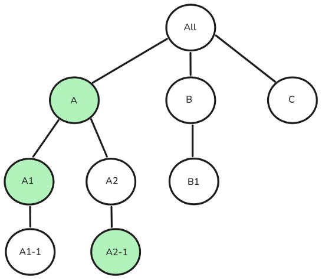

# Verwaltung des Benutzerzugriffs von Campaign Standard auf Campaign v8 {#user-management-acs}

Sowohl Adobe Campaign Standard als auch Adobe Campaign v8 ermöglichen es Benutzern, Berechtigungen für verschiedene Benutzer/Benutzer zu definieren und zu verwalten. Diese Berechtigungen bestehen aus spezifischen Rechten, die Benutzern Zugriff auf verschiedene Funktionen des Produkts gewähren. Die beiden Produkte verwenden jedoch unterschiedliche Ansätze und Implementierungen für die Verwaltung des Benutzerzugriffs.

Die folgenden Konzepte werden in Adobe Campaign Standard und Campaign v8 verwendet, um die Benutzerzugriffsverwaltung zu ermöglichen:

| Campaign Standard | Campaign v8 |
|---------|----------|
| Benutzer | Operator |
| Rolle | Spezifische Berechtigung |
| Sicherheitsgruppe | Benutzergruppe |
| Organizational unit | Ordnerberechtigung |

## Migrationsansatz von der Sicherheitsgruppe zur Benutzergruppe

>[!IMPORTANT]
>
>Die Funktionen dieser Rollen/spezifischen Berechtigungen können in der Implementierung variieren und möglicherweise zu Autorisierungsproblemen führen (z. B. Berechtigungserweiterung oder Funktionsstörungen). Wir empfehlen Benutzern, diese Zuordnungen nach der Transition zu überprüfen, um eine ordnungsgemäße Zugriffssteuerung sicherzustellen. [Erfahren Sie mehr über Berechtigungen](https://experienceleague.adobe.com/de/docs/campaign/campaign-v8/admin/permissions/manage-permissions).

In der folgenden Tabelle wird der Migrationsansatz für Benutzergruppen beim Wechsel von Adobe Campaign Standard zu Campaign v8 beschrieben. In Campaign Standard wird eine **Sicherheitsgruppe** in Campaign v8 als **Benutzergruppe** bezeichnet, um einem Benutzer eine Reihe von Rollen zuzuweisen. Einige Sicherheitsgruppen/Benutzergruppen sind zwar vorkonfiguriert verfügbar, Benutzer können jedoch neue Gruppen erstellen oder bei Bedarf vorhandene ändern.

| | **Campaign Standard** | **Campaign v8** |
|---------|----------|---------|
| **Terminologie**  | Sicherheitsgruppe | Benutzergruppe |

Sowohl in Adobe Campaign Standard als auch in Campaign v8 **Sicherheitsgruppen** und **Benutzergruppen** Produktprofilen in der Admin Console zugeordnet. Wenn Sie einem Benutzer eine **Sicherheitsgruppe** oder **Benutzergruppe** zuweisen möchten, können Sie das entsprechende **Produktprofil** in der Admin Console verknüpfen. Diese Zuordnung wird bei der Anmeldung des Benutzers synchronisiert. [Weitere Informationen zum Produktprofil](https://experienceleague.adobe.com/de/docs/campaign/campaign-v8/admin/permissions/manage-permissions)

| **Campaign Standard-Sicherheitsgruppe** | **Benutzergruppe von Campaign v8** |
|----------|---------|
| Administratoren | Administratoren |
| Versand-Verantwortliche | Administratoren |
| Workflow-Verantwortliche | Workflow-Supervisoren  |

## Migrationsansatz von Benutzerrollen zu spezifischen Berechtigungen

>[!IMPORTANT]
>
>Während der Migration von Adobe Campaign Standard zu Campaign v8 erhalten Benutzende mit der **Datenmodell**-Rolle, aber nicht **Administration** automatisch **Administration**-Zugriff, da für die Schemaerstellung in Campaign v8 Administratorrechte erforderlich sind. Um dies zu verhindern, entfernen Sie vor **Migration die** „Datenmodell“.

In Adobe Campaign Standard wird der Begriff **Benutzerrolle** in Campaign v8 **Spezifische Berechtigung** bezeichnet. In der folgenden Tabelle ist die Terminologie aufgeführt, die für **Spezifische Berechtigungen** in Campaign v8 verwendet wird und **Benutzerrollen** in Campaign Standard entspricht.

| **Campaign Standard-Benutzerrolle** | **Spezifische Berechtigung für Campaign v8** | **Beschreibung**  |
|----------|---------|---------|
| Administration | Administration | Ein Benutzer mit der Berechtigung Administration hat vollen Zugriff auf die Instanz. |
| Datenmodell  | Administration | Berechtigung zum Ausführen von Veröffentlichungen und Erstellen benutzerdefinierter Ressourcen. Funktion zur Schemaerstellung verfügbar für Admins in Campaign v8.  |
| Zustellbarkeit  | Administration  | Recht auf Validierung zuvor analysierter Sendungen.  |
| Exportieren | Exportieren | Recht auf Datenexport.  |
| Dateizugriff  | Dateizugriff  | Recht auf Validierung zuvor analysierter Sendungen.  |
| Allgemeiner Import  | importieren  | Recht auf allgemeinen Datenimport |
| Sendungen vorbereiten | Sendungen vorbereiten | Berechtigung zur Erstellung, Änderung, Vorbereitung und Löschung von Sendungen.  |
| Ausführung von SQL-Scripts | Ausführung von SQL-Scripts | Berechtigung zur Ausführung eines beliebigen SQL-Befehls direkt in der Datenbank. |
| Sendungen starten  | Sendungen starten  | Recht auf Validierung zuvor analysierter Sendungen.  |
| Ausführung des Systembefehls | Programmausführung | Berechtigung zur Ausführung von Systembefehlen auf dem Server. |
| Workflow | Workflow | Berechtigung zur Verwaltung der Ausführung von Workflows, Start, Stopp, Pause usw. |

## Migrationsansatz von der Organisationseinheit

>[!IMPORTANT]
>
>Organisationseinheiten in Adobe Campaign Standard ohne **Alle (alle)** als direkt oder indirekt übergeordnetes Element werden nicht nach Campaign v8 migriert.
> 
>Benutzern in mehreren Sicherheitsgruppen wird die Organisationseinheit der höchsten Sicherheitsgruppe zugewiesen. Wenn mehrere Gruppen parallele Einheiten der obersten Ebene haben, wählt das System die Organisationseinheit für den Benutzer in Campaign Standard aus, und der Benutzer hätte nur Zugriff auf die vom System ausgewählte Organisationseinheit und deren untergeordnete Elemente. In Campaign v8 hätte der Benutzer nach der Migration Zugriff auf **alle zugewiesenen Organisationseinheiten und ihre untergeordneten Elemente** was zu einer möglichen Eskalation der Berechtigungen führen könnte. Um dies zu verhindern, vermeiden Sie die Zuweisung von Benutzern zu Sicherheitsgruppen mit parallelen Organisationseinheiten. Weitere Informationen über [parallele Zuweisung von Organisationseinheiten](#parallel-assignments).

In Adobe Campaign Standard wird die **Organisationseinheit** dem in Campaign v8 vorhandenen **Ordner**-Hierarchiemodell zugeordnet, um eine ähnliche Zugriffssteuerung zu gewährleisten. [Weitere Informationen zur Ordnerverwaltung](https://experienceleague.adobe.com/de/docs/campaign/campaign-v8/admin/permissions/folder-permissions?lang=de)

| | **Campaign Standard** | **Campaign v8** |
|---------|----------|---------|
| **Terminologie**  | Organizational unit | Ordner |

### Über die Zuweisung paralleler Organisationseinheiten {#parallel-assignments}

Eine parallele Zuweisung von Organisationseinheiten tritt auf, wenn ein Benutzer Zugriff auf mehrere Einheiten (die über Sicherheitsgruppen zugewiesen werden) hat, die in separaten Zweigen der Hierarchie vorhanden sind, ohne Zugriff auf eine gemeinsame übergeordnete Organisationseinheit zu haben. Dies stellt ein Sicherheitsrisiko während der Migration dar.

Betrachten Sie beispielsweise die folgende Organisationseinheitshierarchie:

{width="50%" zoomable="yes"}

Eine Zuweisung ohne parallele Organisationseinheiten würde wie folgt aussehen:

{width="50%" zoomable="yes"}

Hier hat der Benutzer Zugriff auf die Organisationseinheiten A, A1 und A2-1, die alle unter der übergeordneten Organisationseinheit A verbunden sind. Der Benutzer kann auf alles unter A zugreifen.

Die folgende Zuweisung enthält parallele Organisationseinheiten:

{width="50%" zoomable="yes"}

Der Benutzer hat Zugriff auf A1-1, A2 und A2-1, die in separaten Verzweigungen ohne gemeinsames übergeordnetes Element vorhanden sind.

**Auswirkungen auf die Sicherheit**

* In Campaign Standard wählt das System eine Organisationseinheit der obersten Ebene (A1-1 oder A2) für den Benutzer aus und beschränkt den Zugriff auf diese Einheit und ihre untergeordneten Elemente.
* Nach der Migration auf Campaign v8 erhält der Benutzer Zugriff auf Ressourcen in allen zugewiesenen Organisationseinheiten und deren untergeordneten Elemente.

**Auflösung**

Die parallele Zuweisung von Organisationseinheiten kann aufgelöst werden, indem sichergestellt wird, dass alle Organisationseinheiten, die einem Benutzer zugewiesen sind, unter eine einzige, gemeinsame übergeordnete Einheit fallen, die auch dem Benutzer zugewiesen ist.

Im Folgenden werden einige Möglichkeiten zur Erreichung dieses Ziels beschrieben:

1. Entfernen des Zugriffs auf mehrere Verzweigungen: Widerrufen Sie den Zugriff auf mehrere parallele Verzweigungen und stellen Sie sicher, dass sich der gesamte Zugriff unter einem einzigen übergeordneten Element befindet.
1. Gemeinsam übergeordnetes Element zuweisen: Gewähren Sie Zugriff auf eine entsprechende gemeinsame übergeordnete Organisationseinheit, die alle erforderlichen Zugriffspunkte enthält.
1. Hierarchie neu strukturieren: Ändern Sie die Struktur der Organisationseinheit, um den gesamten erforderlichen Zugriff in einer einzigen Verzweigung zu platzieren.

Im obigen Beispiel, bei dem ein Benutzer Zugriff auf A1-1, A2 und A2-1 hat, lauten die spezifischen Auflösungsschritte:

1. Entfernen des Zugriffs auf mehrere Verzweigungen:

   1. den Zugriff auf A1-1 zu widerrufen, sodass nur der Zugriff auf A2 (einschließlich A2-1) verbleibt, oder
   1. Widerrufen des Zugriffs auf A2 und A2-1, sodass nur der Zugriff auf A1-1 verbleibt

1. Einem gemeinsamen übergeordneten Element zuweisen:

   1. Zugriff auf die Organisationseinheit A gewähren, die das gemeinsame übergeordnete Element sowohl von A1-1 als auch von A2 ist, oder
   1. Zugriff auf alle gewähren, sodass die gesamte Hierarchie abgedeckt ist

1. Strukturieren Sie die Hierarchie um:

   1. A1-1 unter A2 verschieben oder
   1. A2 und A2-1 unter A1-1 verschieben

## Aus dem Programm stammender Migrationsansatz

In Campaign v8 werden **Programme** als **Ordner** dargestellt. Campaign v8 ermöglicht die Erstellung von Ordnern und die Einschränkung des Zugriffs darauf.

Durch die Verwendung von **Gruppen** und **spezifischen Berechtigungen** kann **Benutzern** Zugriff auf bestimmte **Ordner** innerhalb der Navigationshierarchie gewährt werden, mit der Möglichkeit, Lese-, Schreib- und Löschberechtigungen zuzuweisen. [Weitere Informationen zur Ordnerverwaltung](https://experienceleague.adobe.com/de/docs/campaign/campaign-v8/admin/permissions/folder-permissions?lang=de)

Da ein **Programm** in Campaign v8 als **Ordner** behandelt wird, kann sein Zugriff auf dieselbe Weise wie für jeden anderen Ordner verwaltet werden. Nach der Migration können Campaign Standard-Administratoren die folgenden Schritte ausführen:

1. Klicken Sie im Explorer mit der rechten Maustaste auf einen beliebigen Ordner und wählen Sie **[!UICONTROL Eigenschaften…]**.

1. Navigieren Sie zur Registerkarte **[!UICONTROL Sicherheit]** .

1. Ändern Sie die Benutzergruppenberechtigungen entsprechend dem gewünschten Zugriffsmodell. 

## Produktprofilzuordnung für den Zugriff auf REST-APIs 

Für den Zugriff auf Transaktions-APIs über die Ausführungsinstanz in Campaign v8 ist **neues** Produktprofil) zusätzlich zu den Produktprofilen **Administrator** und **Message Center** erforderlich. Dieses **Produktprofil** wird bestehenden oder vorab erstellten technischen Konten in Campaign Standard hinzugefügt.

Nach der Migration sollten Campaign Standard-Benutzende ihre **Produktprofilzuordnungen** überprüfen und das entsprechende **Produktprofil** zuweisen, wenn sie ihre **technischen Konten** nicht mit dem **Administrator** Produktprofil verknüpfen möchten. Für zukünftige Integrationen empfehlen wir die Verwendung von Campaign v8 **Mandanten** in der **REST-URL** anstelle der vorherigen Campaign Standard **Mandanten-ID**.

## Migration des Zugriffs auf integrierte Campaign-Ressourcen für Campaign Standard-Benutzer

Benutzende, die von Campaign Standard migriert wurden, haben Lesezugriff auf bestimmte integrierte Ressourcen in Campaign v8.

## Nicht migrierte Sicherheitsgruppen und -rollen {#non-migrated-groups-roles}

Nachfolgend finden Sie eine Liste der Campaign Standard-Rollen, die noch nicht umgestellt wurden:

* Standard-Relais-Konto 

* Message Center-Push 

Nachfolgend finden Sie eine Liste der Campaign Standard-Sicherheitsgruppenzuordnungen, die nicht übergegangen wurden.

* Message Center-Agenten

* Push-Agenten für Message Center

* Anwendungsverantwortlicher für Adobe Experience Manager

* Relais-Konto

>[!NOTE]
>
>Benutzerdefinierte Rollen, die in Adobe Campaign Standard erstellt und Benutzenden zugewiesen wurden, werden nicht nach Adobe Campaign v8 migriert.
