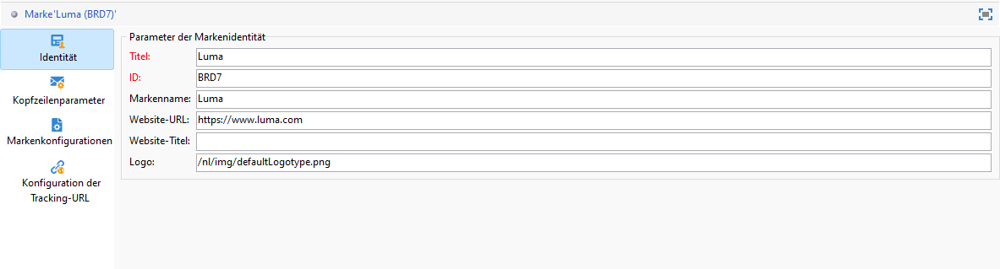
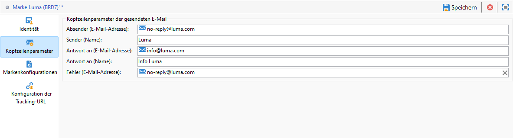
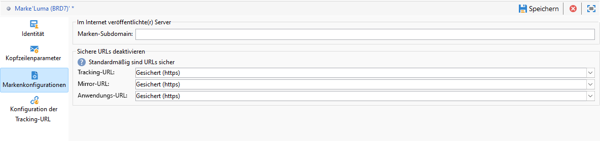

# Konfigurieren von Marken {#branding-configure}

>[!IMPORTANT]
>
>Marken können von Endnutzenden nicht erstellt oder geändert werden. Diese Tätigkeiten müssen von technischen Adobe Campaign-Admins vorgenommen werden. Bei Fragen wenden Sie sich an die Adobe-Kundenunterstützung.

In Adobe Campaign V8 finden Sie Marken im Menü **[!UICONTROL Administration > Plattform > Branding]**.

Eine **[!UICONTROL Marke]** wird durch die folgenden Eigenschaften definiert:

* eine **[!UICONTROL Identität]**, durch die Ihre Marke definiert und personalisiert wird. Dieser Abschnitt weist folgende Felder auf:

   * **[!UICONTROL Titel]** (in der Benutzeroberfläche sichtbar)
   * **[!UICONTROL Kennung]**
   * **[!UICONTROL Markenname]**
   * **[!UICONTROL URL]** und **[!UICONTROL Titel]** der Marken-Website
   * **[!UICONTROL Markenlogo]**

  

* **[!UICONTROL In Header-Parameter für ausgehende E-Mails]** kann der Inhalt für die Empfänger Ihrer Kampagnen personalisiert werden. Dieser Abschnitt weist folgende Felder auf:

   * **[!UICONTROL Absender (E-Mail)]** mit der E-Mail-Adresse der Marke.
   * **[!UICONTROL Absender (Name)]** mit dem Namen der Marke.
   * **[!UICONTROL Antwortadresse (E-Mail)]** mit der E-Mail-Adresse, an die der Kunde eine Antwort senden kann.
   * **[!UICONTROL Antwortadresse (Name)]** mit dem Namen der Marke.
   * **[!UICONTROL Fehler (E-Mail)]** mit der E-Mail-Adresse, die im Falle eines Fehlers verwendet werden soll.

  >[!IMPORTANT]
  >
  >Sollten nach der Aktualisierung der E-Mail-Header-Parameter Name und E-Mail-Adresse des Absenders in einer neuen, auf dieser Vorlage basierenden E-Mail nicht geändert sein, überprüfen Sie die erweiterten Parameter der Vorlage.

  

* Über **[!UICONTROL Markenkonfigurationen]** werden die Server definiert, die für das Tracking sowie den Zugriff auf Landingpages verwendet werden. Dieser Abschnitt weist folgende Felder auf:

   * **[!UICONTROL Marken-Subdomain]** bezieht sich auf die für diese Marke spezifische designierte Subdomain-URL, die von Adobe delegiert werden soll.

  Beachten Sie, dass die Konfiguration für Tracking-, Mirror- und Anwendungs-Server in separaten externen Konten gespeichert ist, die mit dem Routing verbunden sind. Diese Einstellungen werden während der Bereitstellung angewendet und sollten nicht geändert werden. Um URLs anzuzeigen, greifen Sie über Ihr externes Konto auf die Registerkarte **[!UICONTROL Branding-Präfixe]** zu.

  

* Über das Menü **[!UICONTROL Konfiguration der Tracking-URL]** können Sie das URL-Tracking verbessern, indem Sie zusätzliche Parameter für die Integration mit Web-Analyse-Tools wie Adobe Analytics und Google Analytics definieren.

  Verwenden Sie das Menü **[!UICONTROL Zusätzliche URL-Parameter]**, um zusätzliche Parameter als Schlüssel-Wert-Paare zusammen mit ihren Anwendungsbedingungen zu erstellen. Alle Parameternamen müssen eindeutig und dürfen nicht leer sein. Alle Parameterwerte dürfen nicht leer sein. Die Anwendungsbedingung kann leer sein, aber keiner dieser Werte darf JST-Tags enthalten.

  Diese Parameter werden auf getrackte URLs angewendet, die mit einem in der **[!UICONTROL Liste der Domain-Namen]** angegebenen Domain-Namen übereinstimmen, der reguläre Ausdrücke enthalten kann.

  **Beispiel:** Eine nachverfolgte URL wie `https://www.example.com` wird `https://www.example.com/?age=21&deliveryName=DM101`, wenn die zusätzlichen Parameter `age=21` und `deliveryName=DM101` für diese Domain konfiguriert sind.

## Konfigurieren von Branding für Transaktions-Messaging {#branding-transactional-config}

>[!IMPORTANT]
>
>Dieser Abschnitt gilt nur für Transaktions-Messaging (Message Center).
>
>Auch wenn in der Campaign Web-Benutzeroberfläche Transaktionsfunktionen verfügbar sind, müssen die nachfolgenden Schritte in der Client-Konsole von Campaign v8 (Kontrollinstanz) ausgeführt werden.

Wenn Sie Transaktions-Messaging (Message Center) mit Branding verwenden, ist eine zusätzliche Konfiguration erforderlich.

### Tracking-Formeln für Real-Time-Instanzen

Wenn das Branding auf einer Real-Time-Kontrollinstanz (RT) aktiviert wird, werden spezifische Tracking-Optionen zur Verwaltung von Tracking-Formeln verwendet. Diese Formeln werden zentral auf der RT-Kontrollinstanz und nicht einzeln auf jeder RT-Ausführungsinstanz konfiguriert.

Die folgenden Optionen definieren die von RT-Sendungen verwendeten Tracking-Formeln:

* **`NmsTracking_RT_ClickFormula`**: gibt die Formel an, die für das Klick-Tracking auf RT-Instanzen verwendet wird

* **`NmsTracking_RT_OpenFormula`**: gibt die Formel an, die für das Öffnungs-Tracking auf RT-Instanzen verwendet wird

Wenn für Ihre Implementierung benutzerdefinierte Tracking-Formeln für Transaktions-Messaging erforderlich sind, verwenden Sie die folgende Option:

* **`Branding_RT_ListXtkOptions_toPublish`**: Listen Sie hier die XTK-Optionsnamen für Ihre benutzerdefinierten Formeln auf (durch Kommata getrennt). Dadurch wird sichergestellt, dass RT-Sendungen die benutzerdefinierten Tracking-Formeln anwenden können.