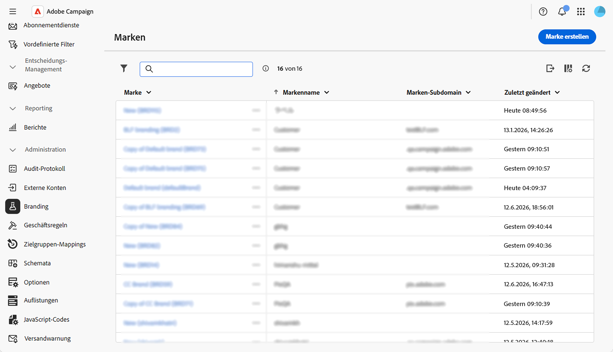
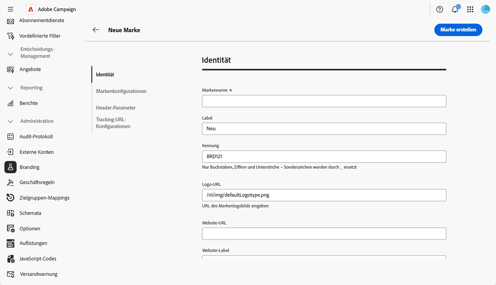
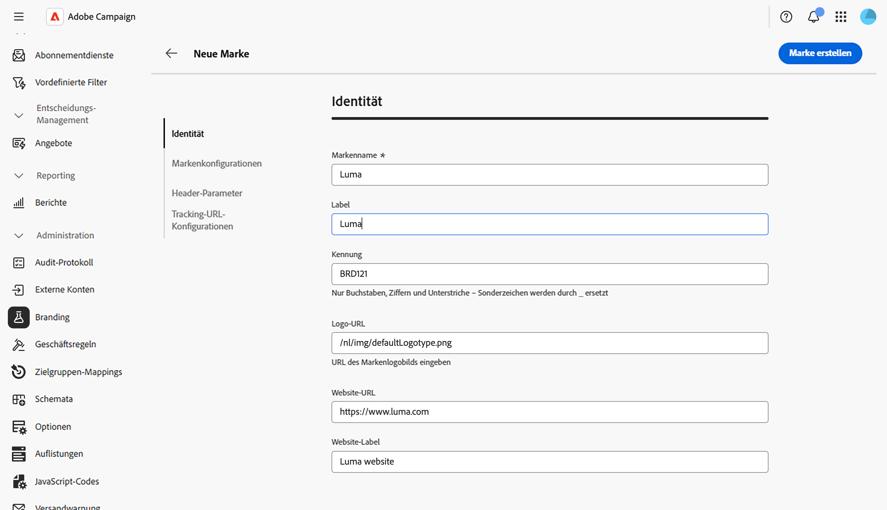
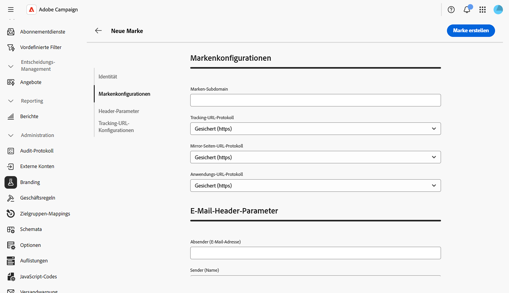
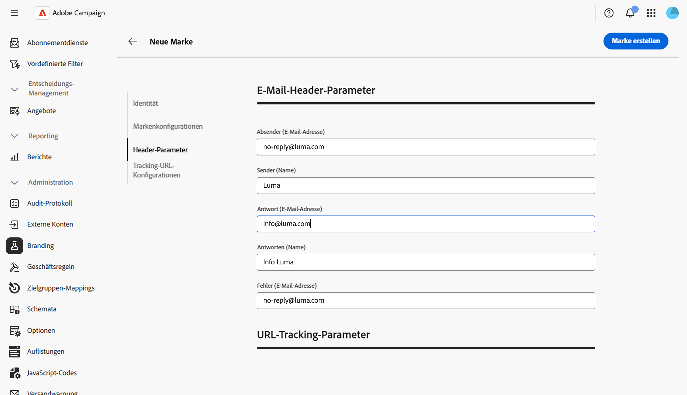
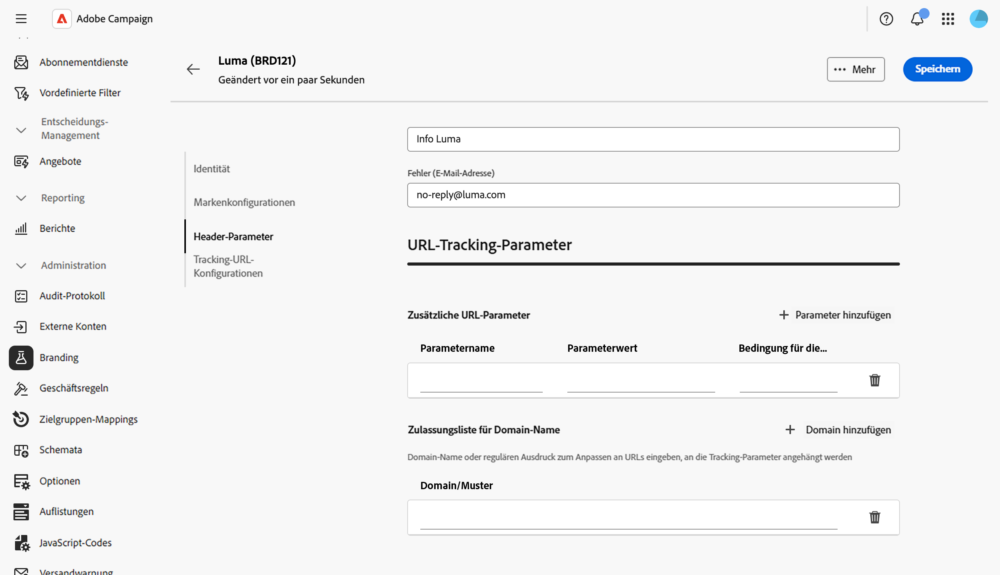

# Konfigurieren von Marken {#branding-configure}

Technische Administratoren können mehrere Marken direkt über die Web-Benutzeroberfläche erstellen und verwalten. Auf diese Weise können Sie alle Elemente definieren, aus denen Ihre Markenidentität besteht, einschließlich Logos und sogar E-Mail-Tracking-Einstellungen.

>[!NOTE]
>
>Diese Funktion erfordert das Branding-Paket auf Ihrer Instanz. Wenden Sie sich an den Adobe-Support, wenn das Menü **Branding** nicht angezeigt wird.

## Erstellen oder Bearbeiten einer Marke {#create-edit-brand}

>[!CONTEXTUALHELP]
>id="acw_branding_create"
>title="Marke erstellen"
>abstract="Klicken Sie **Marke erstellen**, um eine neue Markenidentität zu definieren. Füllen Sie auf den Konfigurationsregisterkarten die Markendetails aus und klicken Sie dann zum Speichern **Marke** Erstellen). Die Marke wird verfügbar und kann mit Versandvorlagen und eigenständigen Sendungen verknüpft werden."

Gehen Sie wie folgt vor, um eine neue Marke zu erstellen:

1. Navigieren Sie **[!UICONTROL linken Menü zu]** Administration > Branding“ oder vom **[!UICONTROL Explorer]** zu **[!UICONTROL Administration > Plattform]** Branding“.

1. Klicken Sie auf **[!UICONTROL Marke erstellen]** oberhalb der Liste.

   

1. Füllen Sie die Markendetails in den verschiedenen Abschnitten aus. Jedes Feld wird im Abschnitt [Markenattribute](#brand-attributes) unten beschrieben.

   

1. Klicken Sie **[!UICONTROL Marke erstellen]** um zu speichern. Die Marke kann jetzt mit Versandvorlagen und eigenständigen Sendungen verknüpft werden. [Erfahren Sie, wie Sie eine Marke zuweisen](branding-assign.md).

Um eine vorhandene Marke zu bearbeiten, wählen Sie sie aus der Liste aus, aktualisieren Sie die Felder und speichern Sie die Änderungen.

## Markenattribute {#brand-attributes}

Eine **[!UICONTROL Marke]** wird in vier Abschnitten konfiguriert: **[!UICONTROL Identität]**, **[!UICONTROL Markenkonfigurationen]**, **[!UICONTROL E-Mail-]** und **[!UICONTROL URL-Tracking-Parameter]**.

### Identität {#identity}

Im **[!UICONTROL Identität]** können Sie Ihre Marke definieren und personalisieren.

Dieser Abschnitt weist folgende Felder auf:

* **[!UICONTROL Markenname]**: Der Name Ihrer Marke. Dieses Feld ist erforderlich.
* **[!UICONTROL label]**: Die in der Benutzeroberfläche sichtbare Bezeichnung.
* **[!UICONTROL ID]**: Die automatisch generierte interne Kennung. Man kann es ändern. Nur Buchstaben, Ziffern und Unterstriche sind zulässig. Sonderzeichen werden durch Unterstriche ersetzt.
* **[!UICONTROL Logo-]**: Die URL des Markenlogo-Bildes.
* **[!UICONTROL Website]** URL und **[!UICONTROL Website-]**: Die Website-URL und der Titel, die mit der Marke verknüpft sind.

### Markenkonfigurationen {#brand-configs}

Im Abschnitt **[!UICONTROL Markenkonfigurationen]** definieren Sie die Subdomain- und URL-Protokolle für das Tracking und den Zugriff auf Landingpages.

Dieser Abschnitt weist folgende Felder auf:

* **[!UICONTROL Marken-Subdomain]**: Die für diese Marke spezifische Subdomain-URL, die von Adobe delegiert werden soll.
* **[!UICONTROL Tracking URL Protocol]**, **[!UICONTROL Mirror Page URL Protocol]** und **[!UICONTROL Application URL Protocol]**: Das Protokoll, das für jeden URL-Typ verwendet wird (z. B. **Secure (https)**.

>[!NOTE]
>
>Die Konfiguration für Tracking-, Mirror- und Anwendungs-Server wird in separaten externen Konten gespeichert, die mit dem Routing verbunden sind. Diese Einstellungen werden während der Bereitstellung angewendet und sollten nicht geändert werden. Um URLs anzuzeigen, greifen Sie über Ihr externes Konto auf die Registerkarte **[!UICONTROL Branding-Präfixe]** zu.

### E-Mail-Header-Parameter {#header-param}

Mit den **[!UICONTROL E-Mail]** Header-Parametern können Sie personalisieren, was die Empfänger im Header-Abschnitt Ihrer Kampagnen sehen werden.

Dieser Abschnitt weist folgende Felder auf:

* **[!UICONTROL Absender (E-Mail-Adresse)]**: Die E-Mail-Adresse der Marke.
* **[!UICONTROL Absender (Name)]**: Der Name der Marke.
* **[!UICONTROL Antwort an (E-Mail-Adresse)]**: Die E-Mail-Adresse, auf die der Kunde antworten kann.
* **[!UICONTROL Antwort an (Name)]**: Der Anzeigename für Antworten.
* **[!UICONTROL Fehler (E-Mail-Adresse)]**: Die im Fehlerfall zu verwendende E-Mail-Adresse.

<!--
>[!IMPORTANT]
>
>After having updated the header parameters of the emails, if the name and email address of the sender have not changed in the email created from the template, check the template's advanced settings.
-->

### URL-Trackingparameter {#tracking-param}

Im Abschnitt **[!UICONTROL URL-Tracking]** Parameter können Sie das URL-Tracking verbessern, indem Sie zusätzliche Parameter für die Integration mit Web-Analyse-Tools wie Adobe Analytics und Google Analytics definieren.

Dieser Abschnitt weist folgende Felder auf:

* **[!UICONTROL Zusätzliche URL-]**: Fügen Sie Parameter als Schlüssel-Wert-Paare zusammen mit ihren Anwendungsbedingungen hinzu. Alle Parameternamen müssen eindeutig und dürfen nicht leer sein. Alle Parameterwerte dürfen nicht leer sein. Die Anwendungsbedingung kann leer sein, aber keiner dieser Werte darf JST-Tags enthalten.

* **[!UICONTROL Zulassungsliste für Domain-Namen]**: Fügen Sie Domain-Namen oder reguläre Ausdrücke hinzu, um URLs zu entsprechen, an die Tracking-Parameter angehängt werden.

**Beispiel:** Eine nachverfolgte URL wie `https://www.luma.com` wird `https://www.luma.com/?age=21&deliveryName=DM101`, wenn die zusätzlichen Parameter `age=21` und `deliveryName=DM101` für diese Domain konfiguriert sind.

## Konfigurieren von Branding für Transaktions-Messaging {#branding-transactional-config}

>[!IMPORTANT]
>
>Dieser Abschnitt gilt nur für Transaktions-Messaging (Message Center).
>
>Auch wenn in der Campaign Web-Benutzeroberfläche Transaktionsfunktionen verfügbar sind, müssen die nachfolgenden Schritte in der Client-Konsole von Campaign v8 (Kontrollinstanz) ausgeführt werden.

Wenn Sie Transaktions-Messaging (Message Center) mit Branding verwenden, ist eine zusätzliche Konfiguration erforderlich.

### Tracking-Formeln für Real-Time-Instanzen

Wenn das Branding auf einer Real-Time-Kontrollinstanz (RT) aktiviert wird, werden spezifische Tracking-Optionen zur Verwaltung von Tracking-Formeln verwendet. Diese Formeln werden zentral auf der RT-Kontrollinstanz und nicht einzeln auf jeder RT-Ausführungsinstanz konfiguriert.

Die folgenden Optionen definieren die von RT-Sendungen verwendeten Tracking-Formeln:

* **`NmsTracking_RT_ClickFormula`**: gibt die Formel an, die für das Klick-Tracking auf RT-Instanzen verwendet wird

* **`NmsTracking_RT_OpenFormula`**: gibt die Formel an, die für das Öffnungs-Tracking auf RT-Instanzen verwendet wird

Wenn für Ihre Implementierung benutzerdefinierte Tracking-Formeln für Transaktions-Messaging erforderlich sind, verwenden Sie die folgende Option:

* **`Branding_RT_ListXtkOptions_toPublish`**: Listen Sie hier die XTK-Optionsnamen für Ihre benutzerdefinierten Formeln auf (durch Kommata getrennt). Dadurch wird sichergestellt, dass RT-Sendungen die benutzerdefinierten Tracking-Formeln anwenden können.
