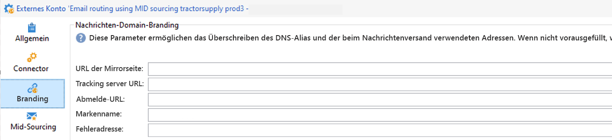

# Erste Schritte mit Branding {#branding-gs}

>[!AVAILABILITY]
>
>Diese Funktion ist nur auf Anfrage und nur für neue Implementierungen verfügbar. Wenden Sie sich für Zugriff an den Adobe-Support.

>[!IMPORTANT]
>
>Marken können von Endnutzenden nicht erstellt oder geändert werden. Diese Tätigkeiten müssen von technischen Adobe Campaign-Admins vorgenommen werden. Bei Fragen wenden Sie sich an die Adobe-Kundenunterstützung.

Jedes Unternehmen verfügt über Markenrichtlinien, die sowohl visuelle Elemente als auch technische Details definieren. Adobe Campaign unterstützt Sie bei der zentralen Verwaltung dieser Richtlinien, sodass Sie Ihrer Kundschaft immer und überall ein konsistentes Markenbild präsentieren können – von den Logos in E-Mails bis hin zu den in Ihren Kampagnen verwendeten URLs und Domains. 

Technische Admins können in Adobe Campaign mehrere Marken erstellen und verwalten. Auf diese Weise können Sie alle Elemente definieren, aus denen Ihre Markenidentität besteht, einschließlich Logos und sogar E-Mail-Tracking-Einstellungen. Nach der Erstellung können diese Marken einfach mit Ihren Sendungen verknüpft werden.

Sie können in Campaign neue Entitäten Ihrer Organisation hinzufügen oder einen neuen E-Mail-Typ erstellen, den Sie unter einer anderen Subdomain senden müssen. Gehen Sie dazu wie folgt vor:

1. **Neue Subdomain konfigurieren**: Damit eine neue Subdomain von Adobe verwendet werden kann, müssen Sie sie zunächst konfigurieren. Sie können dies über das [Control Panel](https://experienceleague.adobe.com/docs/control-panel/using/subdomains-and-certificates/subdomains-branding.html?lang=de) in Campaign durchführen oder sich an Ihren technischen Ansprechpartner bei Adobe wenden. Weitere Informationen zur Konfiguration von Subdomains finden Sie [auf dieser Seite](https://experienceleague.adobe.com/de/docs/deliverability-learn/deliverability-best-practice-guide/additional-resources/campaign/ac-domain-name-setup).

   >[!NOTE]
   >
   >Das Control Panel steht allen Administratoren zur Verfügung. Die Schritte, um einem Benutzer Administratorzugriff zu gewähren, finden Sie auf [dieser Seite](https://experienceleague.adobe.com/docs/control-panel/using/discover-control-panel/managing-permissions.html?lang=de#discover-control-panel).

1. **Versandvorlage erstellen**: Sobald die neue Marke verfügbar ist, sollten Sie mindestens eine neue leere Versandvorlage erstellen, die auf diese neue Marke verweist. [Mehr dazu](branding-assign.md).

1. **Zustellbarkeitsrichtlinien prüfen**: Bevor Sie mit der Verwendung der neuen Domain beginnen, sollte die Strategie mit dem Adobe Zustellbarkeits-Team besprochen werden. Sie unterstützen bei der Definition von Best Practices sowie bei der Entscheidung, ob eine neue Affinität erstellt werden soll, beispielsweise zur Aufspaltung von IPs zwischen Domains, und/oder ob ein Anlaufplan definiert werden soll. 

## Kompatibilitätshinweis {#compatibility-note}

Das neue zentralisierte Branding-Modell ist nicht mit der [veralteten Branding](https://experienceleague.adobe.com/docs/campaign-classic/using/transactional-messaging/configure-transactional-messaging/additional-configurations.htmml#configuring-multibranding){target="_blank"}-Konfiguration kompatibel, die zuvor in der Client-Konsole verwendet wurde.

Im alten Ansatz implementierten Kunden das Branding, indem sie das extAccount-Formular erweiterten und die Registerkarte **Branding** verwendeten.

Wenn Ihre bestehende Umgebung diese alte Konfiguration verwendet, kann sie nicht direkt zum neuen zentralisierten Branding-Modell migriert werden. Um das neue System zu übernehmen, müssen die Branding-Einstellungen vollständig neu implementiert werden.