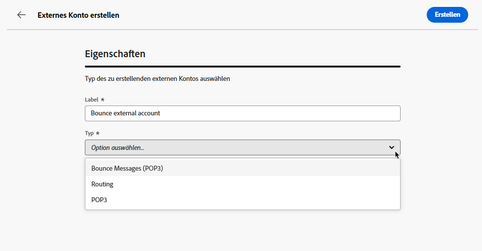

# Erstellen eines externen Kontos {#create-external-account}

>[!CONTEXTUALHELP]
>id="acw_homepage_welcome_rn2"
>title="Erstellen externer Konten"
>abstract="Als Campaign-Admin können Sie nun über die Campaign Web-Benutzeroberfläche neue Verbindungen mit externen Systemen einrichten. Sie haben zudem die Möglichkeit, vorhandene externe Konten anzuzeigen, zu aktualisieren und zu verwalten."
>additional-url="https://experienceleague.adobe.com/docs/campaign-web/v8/release-notes/release-notes.html?lang=de" text="Siehe Versionshinweise"

Gehen Sie wie folgt vor, um ein neues externes Konto zu erstellen. Die konkreten Konfigurationseinstellungen hängen vom Typ des externen Kontos ab, das Sie erstellen.

1. Wählen Sie im Menü im linken Fensterbereich unter **[!UICONTROL Administration]** die Option **[!UICONTROL Externe Konten]** aus.

1. Klicken Sie auf **[!UICONTROL Externes Konto erstellen]**.

   

1. Geben Sie Ihren **[!UICONTROL Label]** ein und wählen Sie den **[!UICONTROL Typ]** des externen Kontos aus.

   * [Campaign-spezifische Typen](external-account.md)
   * [Integration von Adobe-Lösungen](integration-external-account.md)
   * [Übertragen von Daten](transfer-external-account.md)
   * [Externe Datenbank](external-account-database.md)

   

1. Klicken Sie auf **[!UICONTROL Erstellen]**.

1. Ändern Sie bei Bedarf über die Dropdown-Liste **[!UICONTROL Weitere Optionen]** den **[!UICONTROL internen Namen]** oder den Pfad des **[!UICONTROL Ordners]**.

   

1. Aktivieren Sie die Option **[!UICONTROL Automatisch in Pakete exportiert]**, um von diesem externen Konto verwaltete Daten automatisch zu exportieren. <!--Exported where??-->

   

1. Konfigurieren Sie im Abschnitt **[!UICONTROL Details]** den Zugriff auf das Konto, indem Sie die Anmeldedaten basierend auf dem gewählten externen Kontotyp angeben. [Weitere Informationen](#bounce)

1. Klicken Sie auf **[!UICONTROL Verbindung testen]**, um zu prüfen, ob Ihre Konfiguration korrekt ist.

1. Sie können Ihr externes Konto über das Menü **[!UICONTROL Details...]** duplizieren oder löschen.

   

1. Klicken Sie nach Abschluss der Konfiguration auf **[!UICONTROL Speichern]**.
