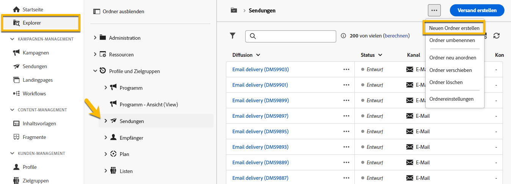

# Erstellen und Verwalten eines Ordners

In Adobe Campaign können Sie neue Ordner erstellen, um Ihren Navigationsbaum zu verwalten. Navigieren Sie dazu in **[!UICONTROL Explorer]** zu dem Ordner, in dem Sie Ihren neuen Ordner erstellen möchten.

Unter der Schaltfläche **[!UICONTROL …]** finden Sie die Option **[!UICONTROL Neuen Ordner erstellen]**.

{zoomable="yes"}

Wenn Sie einen neuen Ordner erstellen, ist der Ordner standardmäßig vom gleichen Typ wie der übergeordnete Ordner.
In unserem Beispiel erstellen wir einen Ordner im Ordner **[!UICONTROL Sendungen]**.

{zoomable="yes"}

Sie können den Ordnertyp ändern, indem Sie auf das Symbol vom Typ Ordner klicken und ihn in der angezeigten Liste auswählen:

{zoomable="yes"}

Sie richten den Ordnertyp ein, indem Sie auf die Schaltfläche **[!UICONTROL Bestätigen]** klicken.

Wenn Sie einen Ordner ohne bestimmten Typ erstellen möchten, wählen Sie den Typ **[!UICONTROL Allgemeiner Ordner]** aus.

In der Adobe Campaign-Konsole wird die Erstellung und Verwaltung eines Ordners [hier](https://experienceleague.adobe.com/de/docs/campaign/campaign-v8/config/configuration/folders-and-views) erläutert. Sie haben dabei die Möglichkeit, Berechtigungen für Ordner einzurichten. [Weitere Informationen](https://experienceleague.adobe.com/de/docs/campaign/campaign-v8/admin/permissions/folder-permissions)
