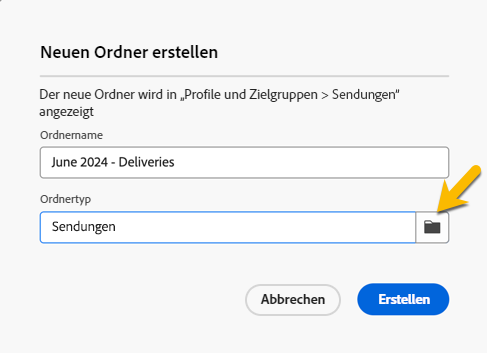

# Erstellen und Verwalten von Ordnern

In Adobe Campaign können Sie neue Ordner erstellen, um Ihre Navigationsstruktur zu verwalten. In **[!UICONTROL Explorer]**, wechseln Sie zu dem Ordner, in dem Sie den neuen Ordner erstellen möchten.

Unter dem **[!UICONTROL ...]** Schaltfläche, Sie haben **[!UICONTROL Neuen Ordner erstellen]**

{zoomable="yes"}

Wenn Sie einen neuen Ordner erstellen, ist der Ordnertyp standardmäßig der Typ des übergeordneten Ordners.
In unserem Beispiel erstellen wir einen Ordner im **[!UICONTROL Sendungen]** Ordner.

{zoomable="yes"}

Sie können den Ordnertyp ändern, indem Sie auf das Symbol vom Typ Ordner klicken und ihn in der angezeigten Liste auswählen:

{zoomable="yes"}

Sie richten den Ordnertyp ein, indem Sie auf **[!UICONTROL Bestätigen]** Schaltfläche.

Wenn Sie einen Ordner ohne bestimmten Typ erstellen möchten, wählen Sie **[!UICONTROL Generischer Ordner]** Typ.

In der Adobe Campaign-Konsole wird die Erstellung und Verwaltung eines Ordners erläutert [here](https://experienceleague.adobe.com/en/docs/campaign/campaign-v8/config/configuration/folders-and-views)und Sie haben die Möglichkeit, Berechtigungen für Ordner einzurichten. [Weitere Informationen](https://experienceleague.adobe.com/en/docs/campaign/campaign-v8/admin/permissions/folder-permissions)
