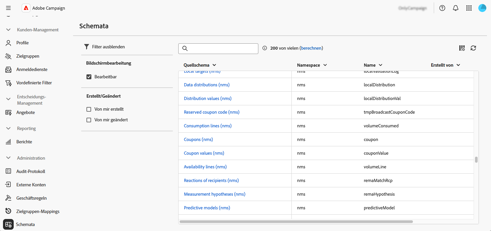
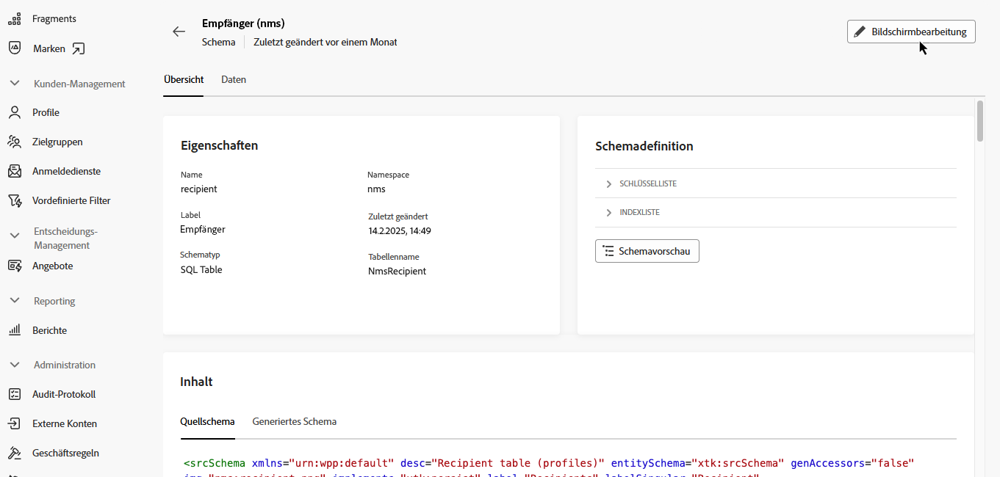
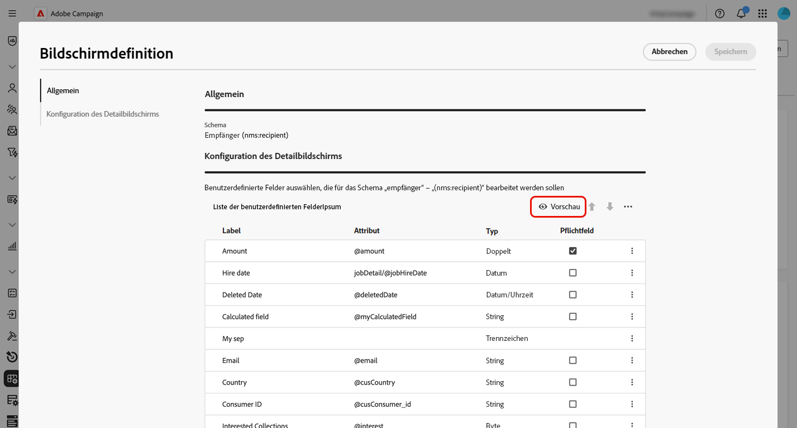
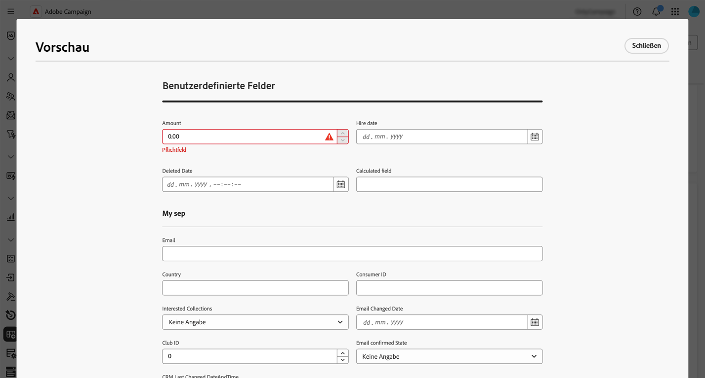
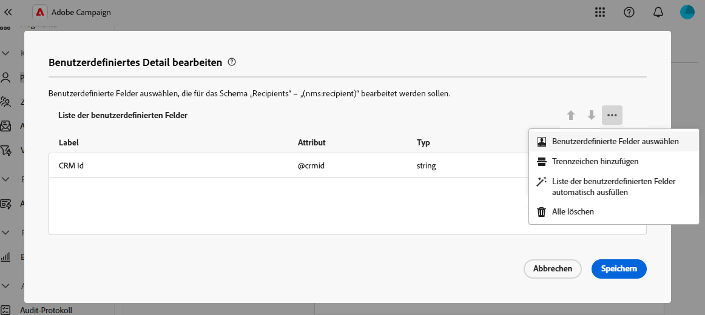
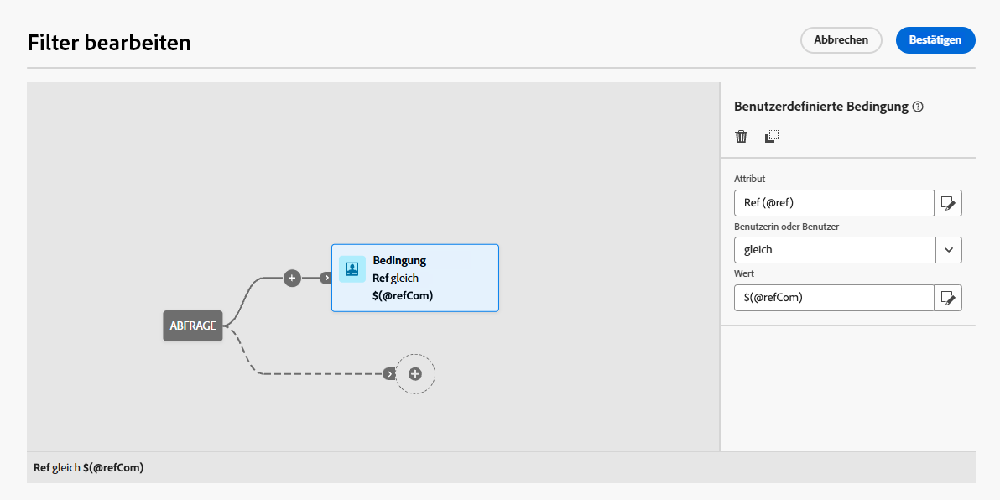
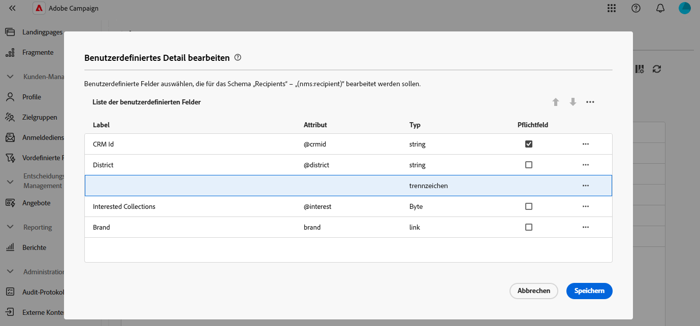
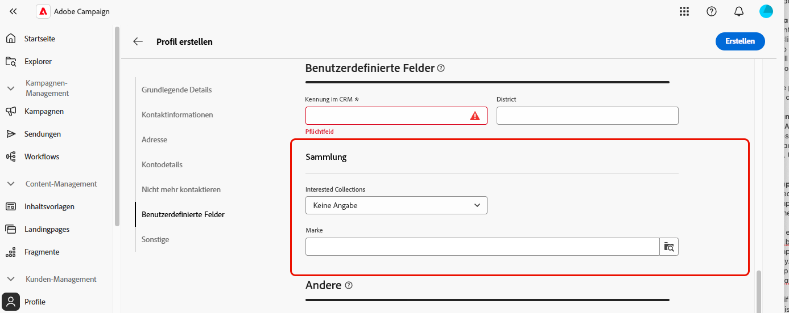

# Konfigurieren benutzerdefinierter Felder {#custom-fields}

>[!CONTEXTUALHELP]
>id="acw_schema_editcustomfields"
>title="Bildschirmbearbeitung"
>abstract="Alle benutzerdefinierten Felder, die in der Benutzeroberfläche für das ausgewählte Schema angezeigt werden, werden eingeblendet. Sie können die Reihenfolge, in der sie in der Benutzeroberfläche angezeigt werden, mithilfe der Pfeile nach oben und unten ändern und Felder durch Hinzufügen von Trennzeichen in Unterabschnitte gruppieren. Um ein benutzerdefiniertes Feld zu löschen oder Einstellungen wie etwa Sichtbarkeitsbedingungen zu bearbeiten, klicken Sie auf die Schaltfläche mit den Auslassungspunkten."

>[!CONTEXTUALHELP]
>id="acw_schema_editcustomfields_settings_general"
>title="Allgemein"
>abstract="Hier werden die allgemeinen Einstellungen des benutzerdefinierten Felds definiert. Wenn kein Titel angegeben wird, wird der im Schema definierte Titel angezeigt. Verwenden Sie das Feld **In folgenden Fällen sichtbar**, um eine Bedingung mithilfe eines xtk-Ausdrucks zu definieren, der steuert, wann das Feld angezeigt wird. Sie können das Feld in der Benutzeroberfläche auch als obligatorisch oder schreibgeschützt markieren."

>[!CONTEXTUALHELP]
>id="acw_schema_editcustomfields_settings_link"
>title="Verknüpfungseigenschaften"
>abstract="Verwenden Sie den Abfrage-Modeler, um Regeln für die Anzeige eines benutzerdefinierten Felds vom Typ „Link“ anzugeben. Beschränken Sie beispielsweise Listenwerte auf Grundlage der Eingabe eines anderen Felds."

>[!CONTEXTUALHELP]
>id="acw_schema_editcustomfields_settings_layout"
>title="Layout"
>abstract="Standardmäßig werden benutzerdefinierte Felder in der Benutzeroberfläche in zwei Spalten angezeigt. Schalten Sie diese Option ein, um das benutzerdefinierte Feld über die gesamte Breite des Bildschirms und nicht in zwei Spalten anzuzeigen."

>[!CONTEXTUALHELP]
>id="acw_schema_editcustomfields_separatorproperties"
>title="Trennzeicheneigenschaften"
>abstract="Geben Sie den Namen an, der in der Benutzeroberfläche für den Unterabschnitt angezeigt werden soll."

<!-- NOT USED IN THE UI?-->

>[!CONTEXTUALHELP]
>id="acw_schema_editcustomfields_settings"
>title="Attributeinstellungen"
>abstract="Attributeinstellungen"

Benutzerdefinierte Felder sind zusätzliche Attribute, die über die Adobe Campaign-Konsole zu vorkonfigurierten Schemata hinzugefügt werden. Sie ermöglichen es Ihnen, Schemata anzupassen, indem neue Attribute entsprechend den Anforderungen Ihrer Organisation eingefügt werden. Wie Sie ein Schema erweitern, erfahren Sie in der [Dokumentation zu Adobe Campaign v8](https://experienceleague.adobe.com/docs/campaign/campaign-v8/developer/shemas-forms/extend-schema.html?lang=de){target="_blank"}.

Benutzerdefinierte Felder können auf verschiedenen Bildschirmen angezeigt werden, z. B. in den Profildetails der Campaign Web-Benutzeroberfläche. Admins können steuern, welche Felder sichtbar sind und wie sie angezeigt werden. Diese Änderungen gelten für alle Campaign-Benutzenden.

>[!NOTE]
>
>Sie müssen über Administratorrechte verfügen, um benutzerdefinierte Felder zu verwalten.

Benutzerdefinierte Felder sind für die folgenden Schemata verfügbar:

* Kampagnen (nms)
* Pläne (nms)
* Programme (nms)
* Empfängende (nms)
* Testadressen (nms)
* Sendungen (nms)

## Hinzufügen benutzerdefinierter Felder zur Benutzeroberfläche {#add}

Gehen Sie wie folgt vor, um benutzerdefinierte Felder in der Benutzeroberfläche anzuzeigen:

1. Navigieren Sie im linken Navigationsbereich zum Menü **[!UICONTROL Schemata]** und suchen Sie das gewünschte Schema.

   Verwenden Sie im Bereich „Filter“ den Filter **[!UICONTROL Bearbeitbar]**, um Schemata mit benutzerdefinierten Feldern schnell zu identifizieren.

   

1. Wählen Sie den Schemanamen in der Liste aus, um das Schema zu öffnen. Es wird eine detaillierte Schemaansicht angezeigt. [Erfahren Sie mehr über Schemadetails](../administration/schemas.md). Klicken Sie auf die Schaltfläche **[!UICONTROL Bildschirmbearbeitung]**, um auf benutzerdefinierte Felder zuzugreifen. In diesem Beispiel werden Felder für das Schema **[!UICONTROL Empfangende]** hinzugefügt.

   

   Die Liste der benutzerdefinierten Felder, die in der Benutzeroberfläche für das Schema angezeigt werden, wird eingeblendet.

1. Klicken Sie auf die Schaltfläche **[!UICONTROL Vorschau]**, um die benutzerdefinierten Felder auf einem Beispielbildschirm anzuzeigen.

   

   Hier wurde das Feld „Betrag“ als Pflichtfeld markiert.

   

1. Um der Benutzeroberfläche ein benutzerdefiniertes Feld hinzuzufügen, klicken Sie auf die Schaltfläche mit den Auslassungspunkten und wählen Sie eine der folgenden Optionen:

   * **[!UICONTROL Benutzerdefinierte Felder auswählen]**: Wählen Sie ein oder mehrere benutzerdefinierte Felder aus, die in der Benutzeroberfläche angezeigt werden sollen.
   * **[!UICONTROL Liste der benutzerdefinierten Felder automatisch ausfüllen]**: Fügen Sie der Benutzeroberfläche alle benutzerdefinierten Felder hinzu, die für das Schema definiert sind.

   

1. Wenn benutzerdefinierte Felder hinzugefügt wurden, können Sie:

   * **Felder neu anordnen**: Verwenden Sie die Pfeile nach oben und unten, oder verschieben Sie Felder per Drag-and-Drop.
   * **Felder als Pflichtfelder festlegen**: Aktivieren Sie das Kontrollkästchen **Pflichtfeld**.
   * **Feldeinstellungen bearbeiten**: Klicken Sie auf die Schaltfläche mit den Auslassungspunkten und wählen Sie bearbeiten **[!UICONTROL Bearbeiten]**. [Weitere Informationen](#settings)
   * **Felder löschen**: Klicken Sie auf die Schaltfläche mit den Auslassungspunkten und wählen Sie **[!UICONTROL Löschen]**.
   * **Felder in der Benutzeroberfläche in Unterabschnitte unterteilen**: Klicken Sie auf die Schaltfläche mit den Auslassungspunkten neben den Pfeilen nach oben und unten und wählen Sie **[!UICONTROL Trennzeichen hinzufügen]**. [Weitere Informationen](#separator)

## Konfigurieren der Einstellungen für benutzerdefinierte Felder {#settings}

Um bestimmte Einstellungen für jedes benutzerdefinierte Feld zu konfigurieren, klicken Sie auf die Schaltfläche mit den Auslassungspunkten neben dem gewünschten Feld und wählen Sie **[!UICONTROL Bearbeiten]** aus.

Folgende Einstellungen sind verfügbar:

* **[!UICONTROL Attribut]**: Der Name des benutzerdefinierten Felds.
* **[!UICONTROL Titel (benutzerdefiniert)]**: Der Titel, der in der Benutzeroberfläche angezeigt werden soll. Wenn kein Titel angegeben wird, wird der im Schema definierte Titel angezeigt.
* **[!UICONTROL In folgenden Fällen sichtbar]**: Definieren Sie eine Bedingung mithilfe eines xtk-Ausdrucks, der steuert, wann das Feld angezeigt wird. Blenden Sie beispielsweise dieses Feld aus, wenn ein anderes Feld leer ist.
* **[!UICONTROL Pflichtfeld]**: Legt das Feld in der Benutzeroberfläche als Pflichtfeld fest.
* **[!UICONTROL Schreibgeschützt]**: Legt das Feld in der Benutzeroberfläche als schreibgeschützt fest. Benutzende können den Wert des Felds nicht bearbeiten.
* **[!UICONTROL Filtereinstellungen]** (für Felder vom Typ „Link“): Verwenden Sie den Abfrage-Modeler, um Regeln für die Anzeige eines benutzerdefinierten Felds vom Typ „Link“ anzugeben. Beschränken Sie beispielsweise Listenwerte auf Grundlage der Eingabe eines anderen Felds.

  Sie können mit der Syntax `$(<field-name>)` auch den Wert referenzieren, der in andere Felder in Ihren Bedingungen eingegeben wurde. Auf diese Weise können Sie auf den aktuellen Wert eines Felds verweisen, wie er im Formular eingegeben wurde, auch wenn dieser noch nicht in der Datenbank gespeichert wurde.

  Im folgenden Beispiel prüft die Bedingung, ob der Wert des Felds @ref mit dem im Feld @refCom eingegebenen Wert übereinstimmt. Wenn Sie dagegen `@refCom` anstelle von `$(@refCom)` verwenden, wird auf den Wert des Felds @ref verwiesen, so wie in der Datenbank vorhanden.

  +++Beispiel anzeigen

  

+++

* **[!UICONTROL Zwei Spalten umfassen]**: Standardmäßig werden benutzerdefinierte Felder in der Benutzeroberfläche in zwei Spalten angezeigt. Schalten Sie diese Option ein, um das benutzerdefinierte Feld über die gesamte Breite des Bildschirms und nicht in zwei Spalten anzuzeigen.

## Organisieren benutzerdefinierter Felder in Unterabschnitten {#separator}

In der Campaign Web-Benutzeroberfläche können Sie Trennzeichen hinzufügen, um benutzerdefinierte Felder in der Benutzeroberfläche zu gruppieren und so die Lesbarkeit zu verbessern. Gehen Sie dazu wie folgt vor:

1. Klicken Sie auf die Schaltfläche mit den Auslassungspunkten neben den Pfeilen nach oben und unten und wählen Sie **[!UICONTROL Trennzeichen hinzufügen]**.

1. Der Liste wird eine neue Zeile für das Trennzeichen hinzugefügt. Klicken Sie auf die Schaltfläche mit den Auslassungspunkten und wählen Sie **[!UICONTROL Bearbeiten]** aus, um den Unterabschnitt zu benennen.

1. Verschieben Sie das Trennzeichen mithilfe der Pfeile nach oben und unten an die gewünschte Position. Die unter dem Trennzeichen aufgelisteten Felder werden darunter gruppiert.

   In diesem Beispiel werden die Felder „Interessante Sammlungen“ und „Marke“ im Unterabschnitt „Sammlung“ gruppiert.

   | Konfiguration benutzerdefinierter Felder | Rendern in der Benutzeroberfläche |
   |  ---  |  ---  |
   | {zoomable="yes"} | {zoomable="yes"} |