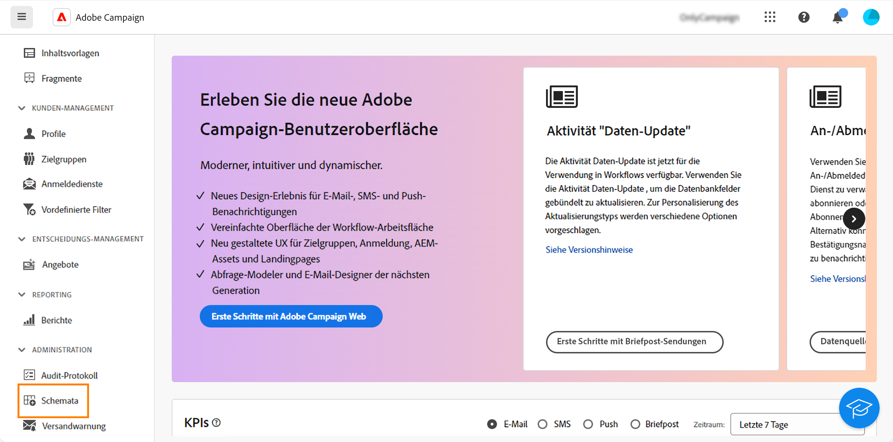
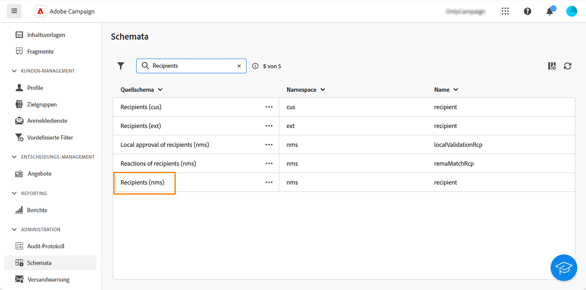
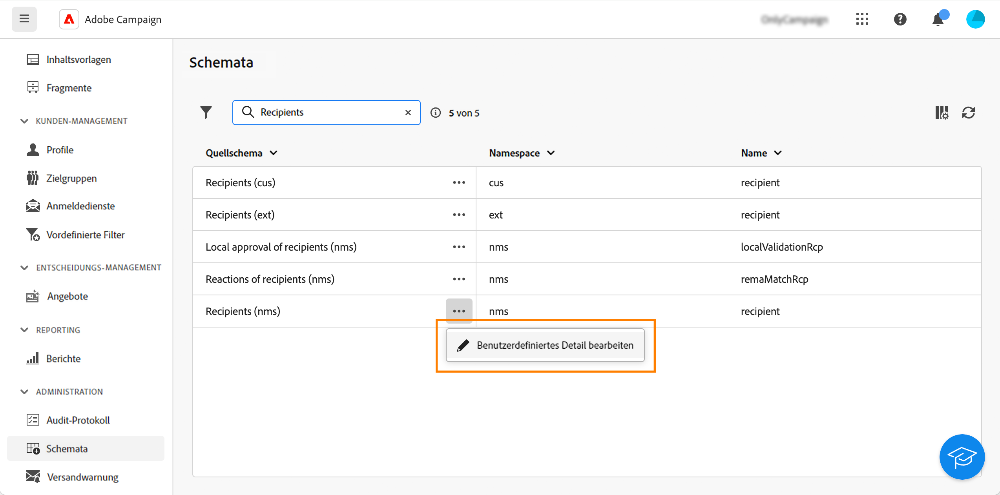
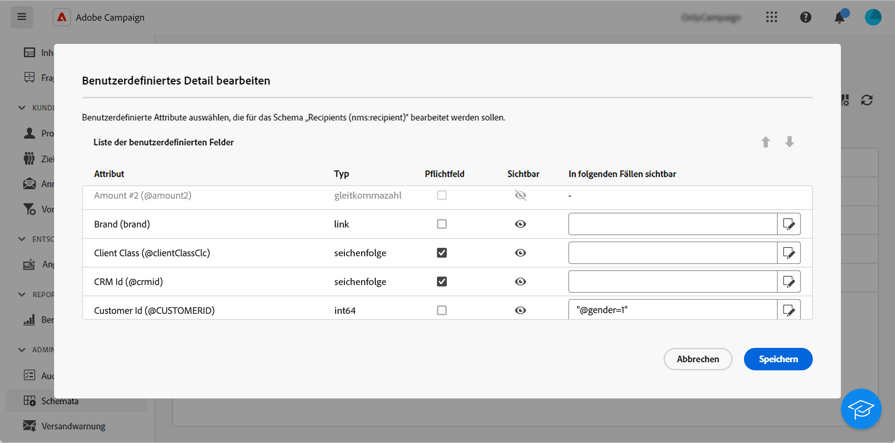
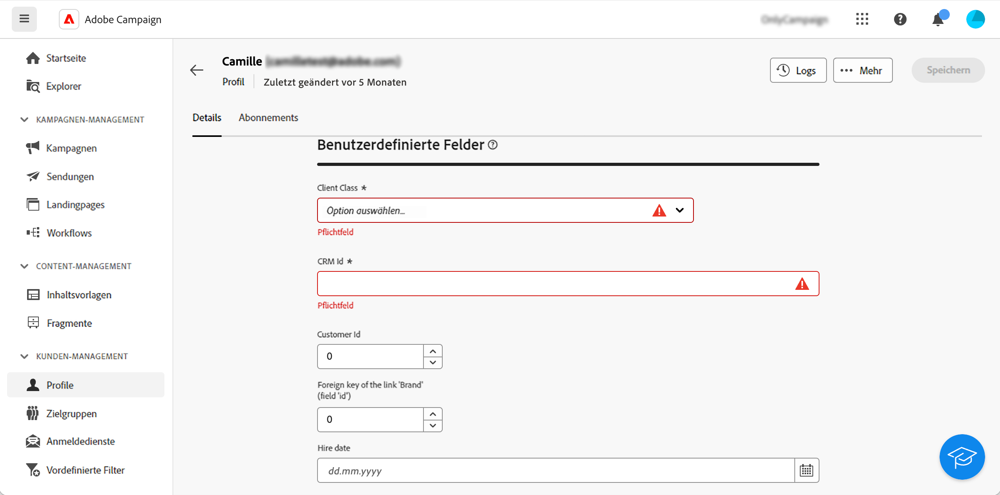

# Konfigurieren benutzerdefinierter Felder {#custom-fields}

Benutzerdefinierte Felder sind zusätzliche Attribute, die über die Adobe Campaign-Konsole zu nativen Schemata hinzugefügt werden. Weitere Informationen finden Sie in der [Dokumentation zu Adobe Campaign v8](https://experienceleague.adobe.com/docs/campaign/campaign-v8/developer/shemas-forms/extend-schema.html?lang=de){target="_blank"}.

Diese benutzerdefinierten Felder werden in verschiedenen Bildschirmen sichtbar, z. B. in den Details eines Profils oder eines Testprofils.

In der Web-Benutzeroberfläche können Sie zwar keine benutzerdefinierten Felder erstellen, dafür aber ihre Anzeige ändern. Diese Änderungen gelten für alle Campaign-Benutzenden.

>[!NOTE]
>
>Sie müssen über Administratorrechte verfügen, um benutzerdefinierte Felder zu ändern.

Benutzerdefinierte Felder sind in den folgenden Schemata verfügbar:

* Empfängende (nms)
* Kampagnen (nms)
* Sendungen (nms)
* Testadressen (nms)

Gehen Sie wie folgt vor, um benutzerdefinierte Felder zu konfigurieren:

1. Klicken Sie unter **Administration** auf **Schemata**.

   {zoomable="yes"}

1. Suchen Sie das gewünschte Schema, z. B. das Schema **Empfangende (nms)**.

   {zoomable="yes"}

1. Klicken Sie auf die Schaltfläche **Mehr Aktionen** und wählen Sie **Benutzerdefiniertes Detail bearbeiten**.

   {zoomable="yes"}

   Auf dem Bildschirm **Benutzerdefiniertes Detail bearbeiten** werden alle benutzerdefinierten Felder und deren Typ angezeigt.

   {zoomable="yes"}

   Auf diesem Bildschirm können Sie die folgenden Aktionen durchführen:

   * Die Reihenfolge der verschiedenen Felder anhand der Nach-oben- und Nach-unten-Pfeile ändern
   * Das Feld obligatorisch machen: Aktivieren Sie das Kästchen **Obligatorisch**.
   * Das Feld sichtbar machen oder ausblenden: Klicken Sie auf die Schaltfläche **Sichtbar**.
   * Eine Sichtbarkeitsbedingung hinzufügen: Klicken Sie auf die Schaltfläche **Sichtbar, wenn** und schreiben Sie Ihren xtk-Ausdruck mit den verfügbaren xtk-Funktionen.

1. Navigieren Sie zu dem Bildschirm, auf dem das benutzerdefinierte Feld angezeigt wird. Im vorliegenden Beispiel handelt es sich um den Bildschirm mit den Profildetails.

   {zoomable="yes"}
