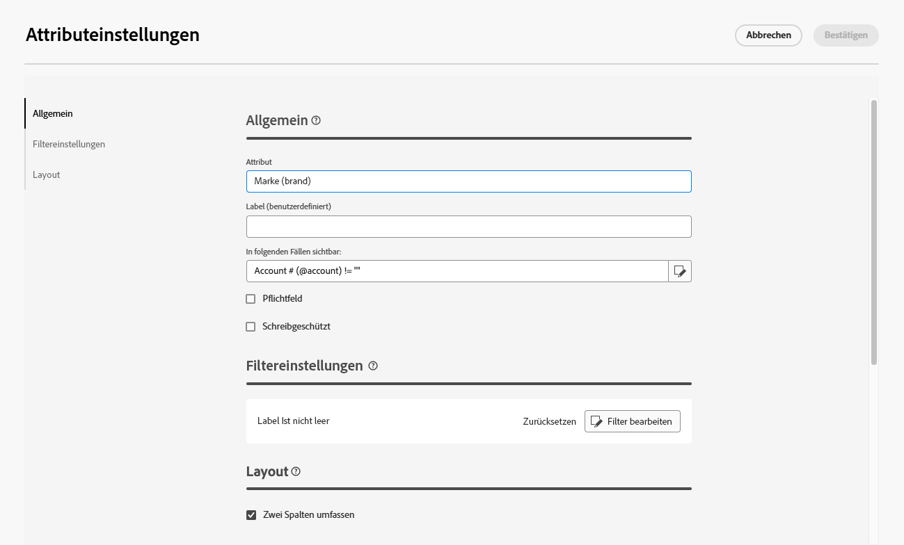

# Konfigurieren benutzerdefinierter Felder {#custom-fields}

>[!CONTEXTUALHELP]
>id="acw_schema_editcustomfields"
>title="Bearbeiten benutzerdefinierter Details"
>abstract="Alle benutzerdefinierten Felder, die in der Benutzeroberfläche für das ausgewählte Schema angezeigt werden, werden eingeblendet. Sie können die Reihenfolge, in der sie in der Benutzeroberfläche angezeigt werden, mithilfe der Pfeile nach oben und unten ändern und Felder durch Hinzufügen von Trennzeichen in Unterabschnitte gruppieren. Um ein benutzerdefiniertes Feld zu löschen oder Einstellungen wie etwa Sichtbarkeitsbedingungen zu bearbeiten, klicken Sie auf die Schaltfläche mit den Auslassungspunkten."

>[!CONTEXTUALHELP]
>id="acw_schema_editcustomfields_settings_general"
>title="Allgemein"
>abstract="Hier werden die allgemeinen Einstellungen des benutzerdefinierten Felds definiert. Wenn kein Titel angegeben wird, wird der im Schema definierte Titel angezeigt. Verwenden Sie das Feld **In folgenden Fällen sichtbar**, um eine Bedingung mithilfe eines xtk-Ausdrucks zu definieren, der steuert, wann das Feld angezeigt wird. Sie können das Feld in der Benutzeroberfläche auch als obligatorisch oder schreibgeschützt markieren."

>[!CONTEXTUALHELP]
>id="acw_schema_editcustomfields_settings_link"
>title="Verknüpfungseigenschaften"
>abstract="Verwenden Sie den Abfrage-Modeler, um Regeln für die Anzeige eines benutzerdefinierten Felds vom Typ „Link“ anzugeben. Beschränken Sie beispielsweise Listenwerte auf Grundlage der Eingabe eines anderen Felds."

>[!CONTEXTUALHELP]
>id="acw_schema_editcustomfields_settings_layout"
>title="Layout"
>abstract="Standardmäßig werden benutzerdefinierte Felder in der Benutzeroberfläche in zwei Spalten angezeigt. Schalten Sie diese Option ein, um das benutzerdefinierte Feld über die gesamte Breite des Bildschirms und nicht in zwei Spalten anzuzeigen."

>[!CONTEXTUALHELP]
>id="acw_schema_editcustomfields_separatorproperties"
>title="Trennzeicheneigenschaften"
>abstract="Geben Sie den Namen an, der in der Benutzeroberfläche für den Unterabschnitt angezeigt werden soll."

<!-- NOT USED IN THE UI?-->
>[!CONTEXTUALHELP]
>id="acw_schema_editcustomfields_settings"
>title="Attributeinstellungen"
>abstract="Attributeinstellungen"

Benutzerdefinierte Felder sind zusätzliche Attribute, die vordefinierten Schemata über die Adobe Campaign-Konsole hinzugefügt werden. Sie ermöglichen es Ihnen, Schemata anzupassen, indem neue Attribute entsprechend den Anforderungen Ihres Unternehmens eingefügt werden. Wie Sie ein Schema erweitern, erfahren Sie in der Dokumentation zu [Adobe Campaign v8](https://experienceleague.adobe.com/docs/campaign/campaign-v8/developer/shemas-forms/extend-schema.html?lang=de){target="_blank"}.

Benutzerdefinierte Felder können auf verschiedenen Bildschirmen angezeigt werden, z. B. in Profildetails in der Web-Benutzeroberfläche von Campaign. Admins können steuern, welche Felder sichtbar sind und wie sie angezeigt werden. Diese Änderungen gelten für alle Campaign-Benutzer.

>[!NOTE]
>
>Sie benötigen Administratorrechte, um benutzerdefinierte Felder zu verwalten.

Benutzerdefinierte Felder sind für die folgenden Schemata verfügbar:

* Kampagnen (nms)
* Pläne (nms)
* Programme (nms)
* Empfängende (nms)
* Testadressen (nms)
* Sendungen (nms)

## Hinzufügen benutzerdefinierter Felder zur Benutzeroberfläche {#add}

Gehen Sie wie folgt vor, um benutzerdefinierte Felder in der Benutzeroberfläche anzuzeigen:

1. Navigieren Sie zum Menü **[!UICONTROL Schemata]** im linken Navigationsbereich und suchen Sie das gewünschte Schema.

   Verwenden Sie den Filter **[!UICONTROL Bearbeitbar]** im Bereich „Filter“, um Schemas mit benutzerdefinierten Feldern schnell zu identifizieren.

   

1. Klicken Sie auf das Stiftsymbol neben dem Schemanamen, um auf die benutzerdefinierten Felder zuzugreifen. In diesem Beispiel möchten wir Felder für das Schema **[!UICONTROL Empfänger]** hinzufügen.

1. Die Liste der benutzerdefinierten Felder, die in der Benutzeroberfläche für die Anzeige des Schemas angezeigt werden. Hier ist das Feld „CRM-ID“ im Detailbildschirm des Profils sichtbar und wurde als Pflichtfeld markiert.

   | Konfiguration benutzerdefinierter Felder | Rendern in der Benutzeroberfläche |
   |  ---  |  ---  |
   | {zoomable="yes"} | {zoomable="yes"} |

1. Um ein benutzerdefiniertes Feld zur Benutzeroberfläche hinzuzufügen, klicken Sie auf die **[!UICONTROL Hinzufügen]**-Schaltfläche in der oberen rechten Ecke des Bildschirms und wählen Sie eine der folgenden Optionen:

   * **[!UICONTROL Benutzerdefinierte Attribute]**: Wählen Sie ein oder mehrere benutzerdefinierte Felder aus, die auf der Benutzeroberfläche angezeigt werden sollen.
   * **[!UICONTROL Liste der benutzerdefinierten Felder automatisch ausfüllen]**: Fügen Sie der Benutzeroberfläche alle benutzerdefinierten Felder hinzu, die für das Schema definiert sind.

   

1. Nachdem benutzerdefinierte Felder hinzugefügt wurden, können Sie:

   * **Felder neu anordnen**: Verwenden Sie die Pfeile nach oben und unten.
   * **Felder als Pflichtfelder festlegen**: Aktivieren Sie das Kontrollkästchen **Pflichtfelder**.
   * **Feldeinstellungen bearbeiten**: Klicken Sie auf die Schaltfläche mit den Auslassungspunkten und wählen Sie **[!UICONTROL Bearbeiten]**. [Weitere Informationen](#settings)
   * **Felder löschen**: Klicken Sie auf die Schaltfläche mit den Auslassungspunkten und wählen Sie **[!UICONTROL Löschen]**.
   * **Felder in der Benutzeroberfläche in Unterabschnitte unterteilen**: Klicken Sie auf **[!UICONTROL Hinzufügen]** und wählen Sie **[!UICONTROL Trennzeichen]**. [Weitere Informationen](#separator)

## Einstellungen für benutzerdefinierte Felder konfigurieren {#settings}

Um spezifische Einstellungen für jedes benutzerdefinierte Feld zu konfigurieren, klicken Sie auf die Schaltfläche mit den Auslassungspunkten neben dem gewünschten Feld und wählen Sie **[!UICONTROL Bearbeiten]**.

Verfügbare Einstellungen sind:

* **[!UICONTROL Attribut]**: Der Name des benutzerdefinierten Felds.
* **[!UICONTROL Beschriftung (benutzerdefiniert)]**: Die Beschriftung, die auf der Benutzeroberfläche angezeigt werden soll. Wenn keine Beschriftung angegeben wird, wird die im Schema definierte Beschriftung angezeigt.
* **[!UICONTROL Sichtbar, wenn]**: Definieren Sie eine Bedingung mithilfe eines xtk-Ausdrucks, der steuert, wann das Feld angezeigt wird. Blenden Sie beispielsweise dieses Feld aus, wenn ein anderes Feld leer ist.
* **[!UICONTROL Obligatorisch]**: Machen Sie das Feld in der Benutzeroberfläche zu einem Pflichtfeld.
* **[!UICONTROL Schreibgeschützt]**: Das Feld in der Benutzeroberfläche als schreibgeschützt festlegen. Benutzende können den Wert des Felds nicht bearbeiten.
* **[!UICONTROL Filtereinstellungen]** (für Felder vom Typ „Link„): Verwenden Sie den Abfrage-Modellierer, um Regeln für die Anzeige eines benutzerdefinierten Felds vom Typ „Link“ anzugeben. Beschränken Sie beispielsweise Listenwerte auf Grundlage der Eingabe eines anderen Felds.

  Sie können auch den Wert referenzieren, der in andere Felder in Ihren Bedingungen eingegeben wurde, indem Sie die `$(<field-name>)` Syntax verwenden. Auf diese Weise können Sie auf den aktuellen Wert eines Feldes verweisen, wie er im Formular eingegeben wurde, auch wenn dieser noch nicht in der Datenbank gespeichert wurde.

  Im folgenden Beispiel prüft die Bedingung, ob der Wert des @ref mit dem im @refCom Feld eingegebenen Wert übereinstimmt. Wenn Sie dagegen `@refCom` anstelle von `$(@refCom)` verwenden, wird auf den Wert des @ref Felds verwiesen, so wie es in der Datenbank vorhanden ist.

  +++Beispiel anzeigen

  

+++

* **[!UICONTROL Über zwei Spalten]**: Standardmäßig werden benutzerdefinierte Felder in der Benutzeroberfläche in zwei Spalten angezeigt. Schalten Sie diese Option ein, um das benutzerdefinierte Feld über die gesamte Breite des Bildschirms und nicht in zwei Spalten anzuzeigen.

## Organisieren von benutzerdefinierten Feldern in Unterabschnitten {#separator}

In der Web-Benutzeroberfläche von Campaign können Sie Trennzeichen hinzufügen, um benutzerdefinierte Felder in der Benutzeroberfläche zu gruppieren und so die Lesbarkeit zu verbessern. Gehen Sie dazu wie folgt vor:

1. Klicken Sie auf **[!UICONTROL Hinzufügen]** und wählen Sie **[!UICONTROL Trennzeichen]** aus.

1. Der Liste wird eine neue Zeile für das Trennzeichen hinzugefügt. Klicken Sie auf die Schaltfläche mit den Auslassungspunkten und wählen **[!UICONTROL Bearbeiten]**, um den Unterabschnitt zu benennen.

1. Verschieben Sie die Trennlinie mit den Pfeilen nach oben und unten an die gewünschte Position. Die unter dem Trennzeichen aufgelisteten Felder werden darunter gruppiert.

   In diesem Beispiel werden die Felder „Interessante Sammlungen“ und „Marke“ in einem Unterabschnitt „Sammlung“ gruppiert.

   | Konfiguration benutzerdefinierter Felder | Rendern in der Benutzeroberfläche |
   |  ---  |  ---  |
   | {zoomable="yes"} | {zoomable="yes"} |
