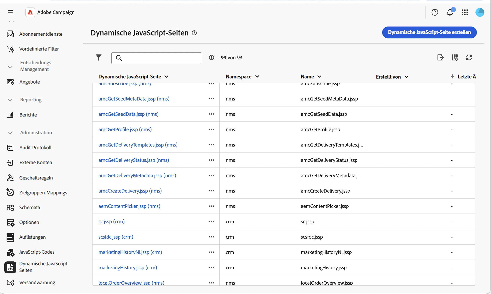
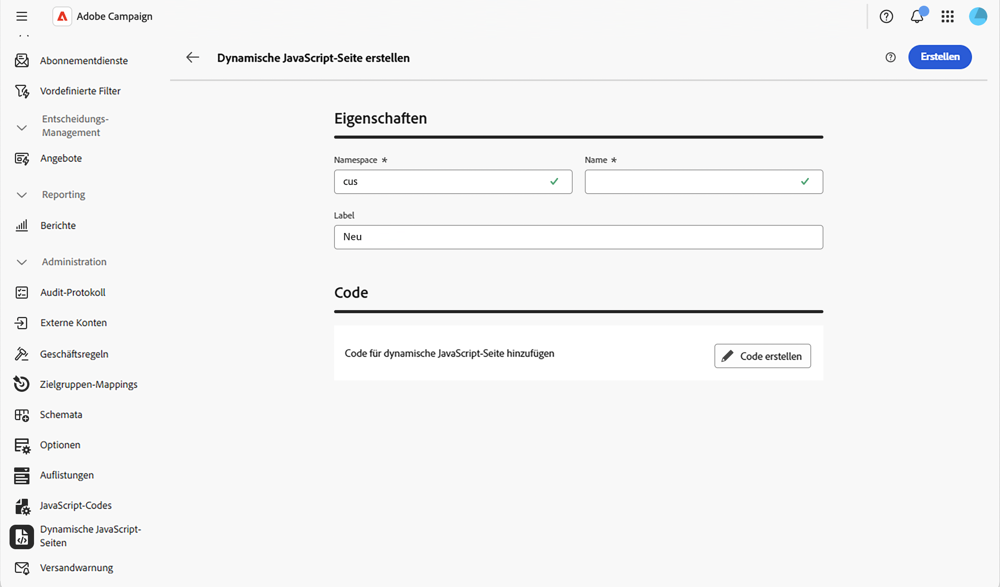
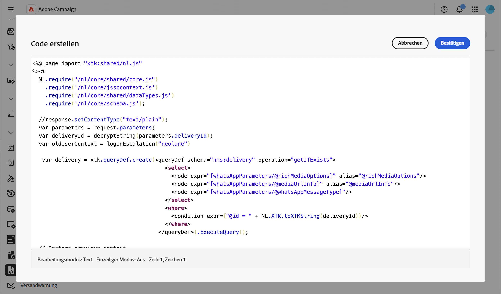

# Arbeiten mit dynamischen JavaScript-Seiten {#dynamic-javascript-pages}

>[!CONTEXTUALHELP]
>id="acw_dynamic_javascript_pages_list"
>title="Dynamische JavaScript-Seiten"
>abstract="Mit Dynamic JavaScript Pages (JSSP) können Sie Server-seitige Seiten erstellen, die dynamische Inhalte generieren, wenn über eine URL zugegriffen wird, z. B. benutzerdefinierte APIs, Exporte oder Web-Anwendungslogik. In dieser Liste können Sie eine dynamische JavaScript-Seite erstellen, ändern, duplizieren oder löschen."

>[!CONTEXTUALHELP]
>id="acw_dynamic_javascript_pages_create"
>title="Dynamische JavaScript-Seite erstellen"
>abstract="Definieren Sie einen Namespace, einen Namen und einen Titel für Ihre dynamische JavaScript-Seite und schreiben Sie dann den Inhalt mit JavaScript-Code. Nach der Erstellung können Namespace und Name nicht mehr geändert werden."

## Über dynamische JavaScript-Seiten {#about}

Mit Dynamic JavaScript Pages (JSSP) können Sie Server-seitige Seiten erstellen, die dynamische Inhalte generieren, wenn über eine URL zugegriffen wird, z. B. benutzerdefinierte APIs, Exporte oder Web-Anwendungslogik. Diese Seiten werden im Menü **[!UICONTROL Administration]** > **[!UICONTROL Dynamische JavaScript]** im linken Navigationsbereich gespeichert.

In der Liste „Dynamic JavaScript-Seiten“ haben Sie folgende Möglichkeiten:

* **Seite duplizieren oder löschen**: Klicken Sie auf die Schaltfläche mit den Auslassungspunkten und wählen Sie die gewünschte Aktion aus.
* **Seite ändern**: Klicken Sie auf den Namen einer Seite, um ihre Eigenschaften zu öffnen, Ihre Änderungen vorzunehmen und zu speichern.
* **Neue dynamische JavaScript-Seite erstellen**: Klicken Sie auf die Schaltfläche **[!UICONTROL Dynamische JavaScript-Seite erstellen]**.

<!--
>[!NOTE]
>
>In the Campaign console, dynamic JavaScript pages are available under **[!UICONTROL Administration]** > **[!UICONTROL Configuration]** > **[!UICONTROL Dynamic JavaScript pages]**. Although the menu location differs from the Web user interface, the list is identical and operates like a mirror.
-->

## Erstellen einer dynamischen JavaScript-Seite {#create}

Gehen Sie wie folgt vor, um eine dynamische JavaScript-Seite zu erstellen:

1. Navigieren Sie zum Menü **[!UICONTROL Dynamische JavaScript]** und klicken Sie auf die Schaltfläche **[!UICONTROL Dynamische JavaScript-Seite erstellen]**.

1. Definieren Sie die Eigenschaften der Seite:

   * **[!UICONTROL Namespace]**: Geben Sie den Namespace an, der für Ihre benutzerdefinierten Ressourcen relevant ist. Standardmäßig lautet der Namespace „cus“, er kann jedoch je nach Implementierung variieren.
   * **[!UICONTROL Name]**: Die eindeutige Kennung, die zum Verweisen auf die Seite verwendet wird.
   * **[!UICONTROL label]**: Der beschreibende Titel, der in der Liste der dynamischen JavaScript-Seiten angezeigt wird.

   

   >[!NOTE]
   >
   >Nach der Erstellung können die Felder **[!UICONTROL Namespace]** und **[!UICONTROL Name]** nicht mehr geändert werden. Um Änderungen vorzunehmen, duplizieren Sie die Seite und aktualisieren Sie sie nach Bedarf.

1. Klicken Sie auf **[!UICONTROL Code erstellen]**, um den Inhalt der Seite zu definieren, und schreiben Sie dann Ihren JSSP-Code mithilfe von `<%@ page %>`-Anweisungen und `NL.require()` Aufrufen zum Laden von Kernbibliotheken.

   

1. Klicken Sie auf **[!UICONTROL Bestätigen]**, um Ihren Code zu speichern.

1. Wenn Ihre dynamische JavaScript-Seite fertig ist, klicken Sie auf **[!UICONTROL Erstellen]**. Der Zugriff auf die Seite erfolgt jetzt über eine URL, die aus dem Namespace und dem Namen im Format `https://<your-instance>/<namespace>/<name>` erstellt wurde. Beispielsweise ist eine Seite mit dem Namen `recipientAPI.jssp` im `cus`-Namespace unter `https://<your-instance>/cus/recipientAPI.jssp` zugänglich.

Weitere Informationen zu wiederverwendbaren JavaScript-Funktionen finden Sie unter [Arbeiten mit JavaScript-Codes](javascript-codes.md).
