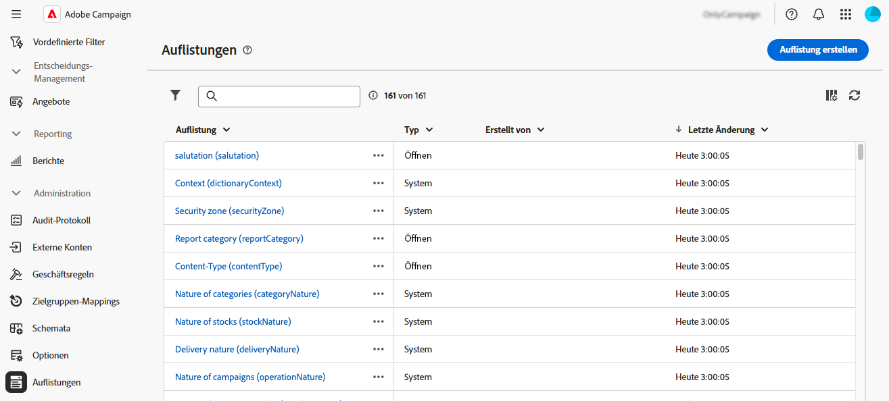
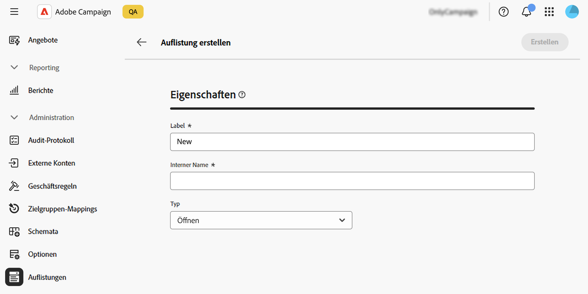
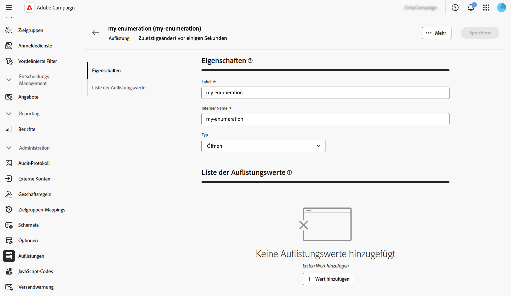
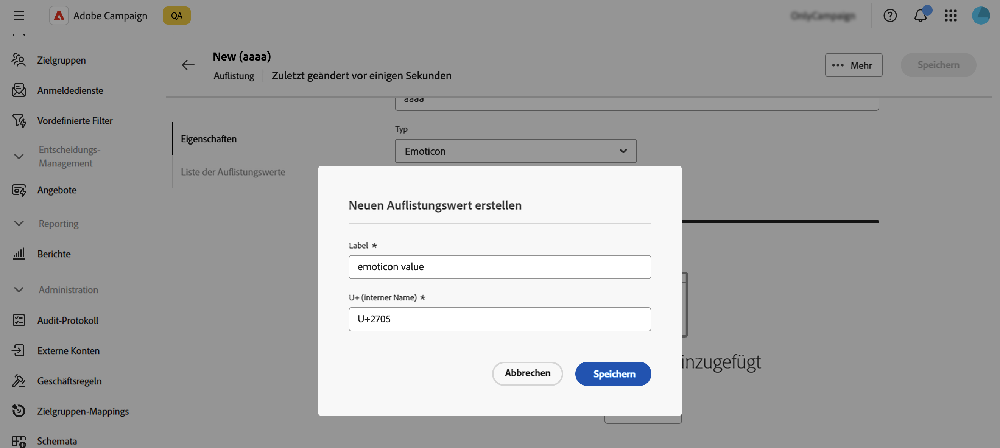
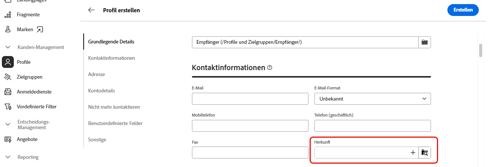
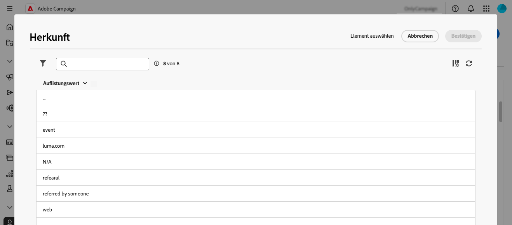
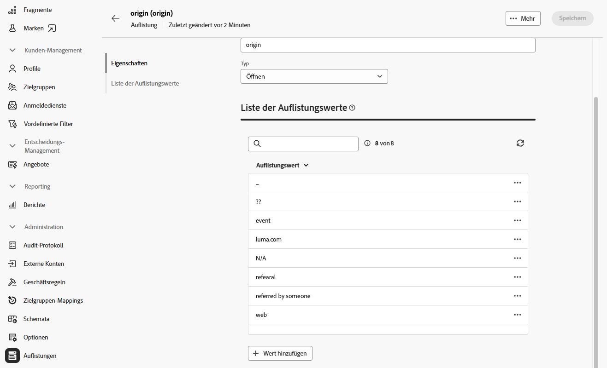
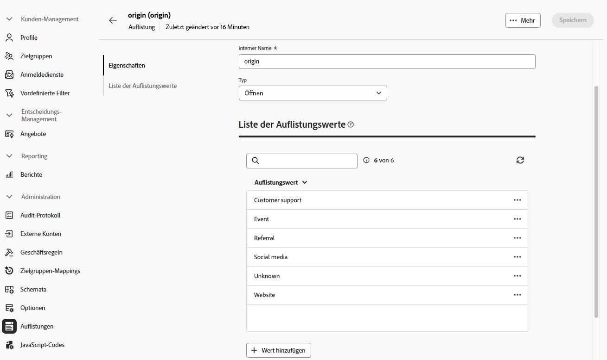
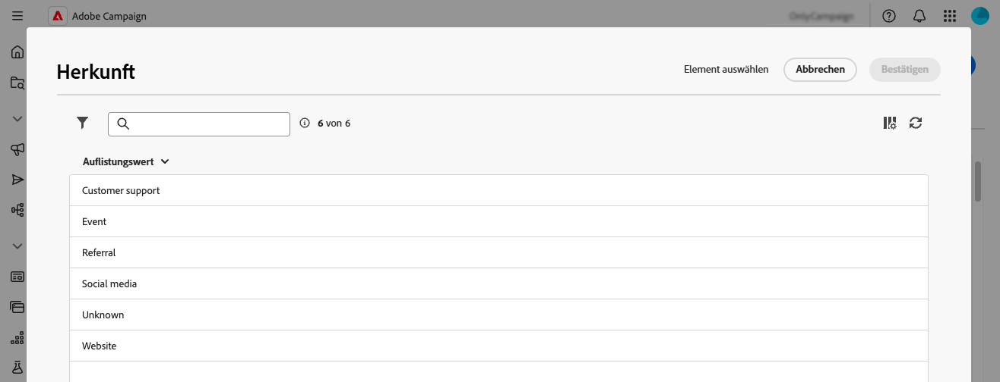

# Verwalten von Auflistungen {#enumerations}

>[!CONTEXTUALHELP]
>id="acw_homepage_welcome_rn4"
>title="Auflistungen erstellen"
>abstract="Sie können Auflistungen nun direkt über die Adobe Campaign Web-Benutzeroberfläche erstellen. Eine Auflistung ist eine Liste von Werten, die vom System zum Ausfüllen von Feldern vorgeschlagen werden."
>additional-url="https://experienceleague.adobe.com/docs/campaign-web/v8/release-notes/release-notes.html?lang=de" text="Siehe Versionshinweise"

>[!CONTEXTUALHELP]
>id="acw_enumerations_list"
>title="Auflistungen"
>abstract="Eine Auflistung ist eine Liste von Werten, die vom System zum Auffüllen von Feldern vorgeschlagen werden. Verwenden Sie Auflistungen, um die Werte dieser Felder zu standardisieren, die Dateneingabe zu unterstützen oder sie in Abfragen zu verwenden."

>[!CONTEXTUALHELP]
>id="acw_enumerations_properties"
>title="Eigenschaften"
>abstract="Hier werden die Eigenschaften der Auflistung definiert, z. B. ihr Name, interner Name und Typ. Auflistungen vom Typ **[!UICONTROL Geschlossen]** verfügen über eine feste Liste von Werten, die nur über das Menü **[!UICONTROL Auflistungen]** geändert werden kann. Auflistungen vom Typ **[!UICONTROL Offen]** ermöglichen es den Benutzenden, neue Werte direkt in die auf dieser Auflistung basierenden Felder einzufügen. Auflistungen vom Typ **[!UICONTROL System]** sind mit Systemfeldern verknüpft. Auflistungen vom Typ **[!UICONTROL Emoticon]** werden verwendet, um die Liste der Smileys zu aktualisieren. "

>[!CONTEXTUALHELP]
>id="acw_enumerations_values"
>title="Liste der Auflistungswerte"
>abstract="Um der Auflistung einen Wert hinzuzufügen, klicken Sie auf die Schaltfläche **[!UICONTROL Wert hinzufügen]** und konfigurieren Sie den Wert dann nach Bedarf."

## Was sind Auflistungen? {#about}

Eine Auflistung ist eine Liste von Werten, die vom System zum Auffüllen von Feldern vorgeschlagen werden. Verwenden Sie Auflistungen, um die Werte dieser Felder zu standardisieren, die Dateneingabe zu unterstützen oder sie in Abfragen zu verwenden. Die Werteliste erscheint als Dropdown-Liste, aus der Sie den im Feld einzufügenden Wert auswählen können. Die Dropdown-Liste ermöglicht auch eine prädiktive Eingabe: Beim Eingeben der ersten Buchstaben füllt die Anwendung den Rest aus.

Die Werte für diesen Feldtyp werden über das Menü **[!UICONTROL Administration]** / **[!UICONTROL Auflistungen]** im linken Navigationsbereich definiert.

## Erstellen einer Auflistung {#create}

Gehen Sie wie folgt vor, um eine Auflistung zu erstellen:

1. Navigieren Sie zum Menü **[!UICONTROL Auflistungen]** und klicken Sie auf die Schaltfläche **[!UICONTROL Auflistung erstellen]**.

1. Geben Sie einen **[!UICONTROL Titel]** und einen **[!UICONTROL internen Namen]** für die Auflistung ein.

   

1. Wählen Sie die Auflistung **[!UICONTROL Typ]**:

   * **[!UICONTROL Geschlossene]** Auflistungen verfügen über eine feste Liste von Werten, die nur über das Menü **[!UICONTROL Auflistungen]** geändert werden kann.
   * **[!UICONTROL Open]**-Auflistungen ermöglichen es Benutzenden, neue Werte direkt in die auf dieser Auflistung basierenden Felder einzufügen.
   * **[!UICONTROL System]**-Auflistungen sind mit Systemfeldern verknüpft.
   * Auflistungen vom Typ **[!UICONTROL Emoticon]** werden verwendet, um die Liste der Smileys zu aktualisieren. 

1. Klicken Sie auf **[!UICONTROL Erstellen]**. Die Auflistungsdetails werden angezeigt, sodass Sie der Liste Werte hinzufügen können.

   

1. Um einen Wert hinzuzufügen, klicken Sie auf die Schaltfläche **[!UICONTROL Wert hinzufügen]** und konfigurieren Sie ihn dann nach Bedarf:

   * **[!UICONTROL label]**: Der in der Auflistung anzuzeigende Titel.
   * **[!UICONTROL Interner Name]**: Der interne Name des Werts (für Systemauflistungen).
   * **[!UICONTROL U+ (interner Name)]** (Emoticon-Auflistungen): Der Unicode für das Emoticon (für Emoticon-Auflistungen).

   

1. Speichern Sie Ihre Änderungen. Die Auflistung wird jetzt in den Bildschirmen aktualisiert, in denen sie verwendet wird.

## Anwendungsfall: Hinzufügen vordefinierter Werte zu einer Auflistung {#uc}

Standardmäßig können Benutzer im Feld „Herkunft“ im Bildschirm „Profildetails“ einen beliebigen Wert frei eingeben.

Jedes Mal, wenn Benutzende einen Wert für das Feld eingeben, wird der Wert automatisch zur Auflistung „Herkunft“ hinzugefügt, was im Laufe der Zeit zu redundanten, inkonsistenten oder fehlerhaften Werten in der Werteliste führen kann.

Um die Datenkonsistenz zu gewährleisten und Benutzende beim Ausfüllen des Felds zu unterstützen, können Sie einen Satz vordefinierter Werte definieren. Führen Sie folgende Schritte aus:

1. Rufen Sie das Menü **[!UICONTROL Auflistungen]** auf und öffnen Sie die Auflistung „Herkunft“.

2. Überprüfen Sie die Liste der vom Benutzer eingegebenen Werte und bereinigen Sie sie. Klicken Sie auf die Schaltfläche mit den Auslassungspunkten neben einem Wert, um ihn zu löschen. Wenn die Liste zu viele Inkonsistenzen enthält, löschen Sie die gesamte Auflistung und erstellen Sie sie von Grund auf neu.

   

3. Vordefinierte Werte hinzufügen. Klicken Sie dazu auf die Schaltfläche **[!UICONTROL Wert hinzufügen]** und geben Sie die vordefinierten Werte ein, aus denen Benutzer auswählen sollen.

   

4. Um Konsistenz zu erzwingen, wechseln Sie den Auflistungstyp zu **[!UICONTROL Geschlossen]**, wodurch Benutzer auf vordefinierte Werte beschränkt werden.
Wenn Flexibilität erforderlich ist, lassen Sie sie **[!UICONTROL Offen]**, um neue Benutzereinträge zuzulassen.

5. Kehren Sie zum Bildschirm Profildetails zurück. Das Feld „Herkunft“ zeigt nun die vordefinierten Werte zur Auswahl an.

   
