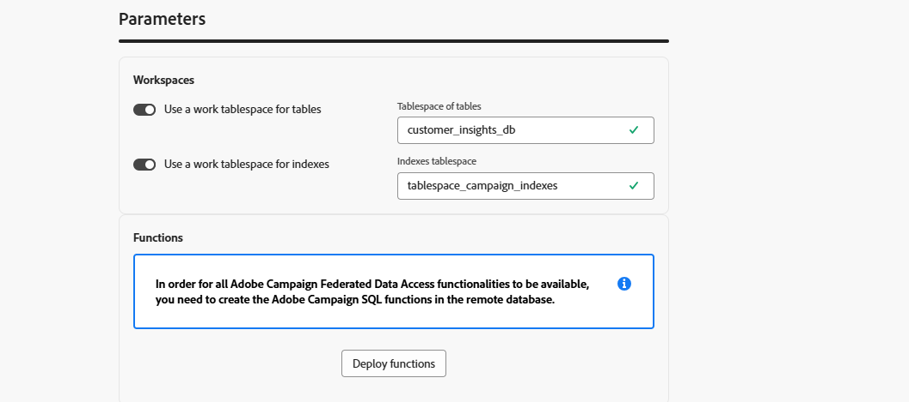

# Externe Datenbankkonten {#external-accounts}

Verwenden Sie ein externes Konto vom Typ Externe Datenbank , um Adobe Campaign mit einer Drittanbieterdatenbank zu verbinden.

Die Konfigurationseinstellungen für das externe Konto variieren je nach der Datenbank-Engine, mit der Sie eine Verbindung herstellen. Detaillierte Anweisungen zu den einzelnen unterstützten Datenbanken finden Sie in den folgenden Abschnitten.

## Amazon Redshift

Mit dem externen Konto von Amazon Redshift können Sie Ihre Campaign-Instanz mit Ihrer externen Amazon Redshift-Datenbank verbinden.

Konfigurieren Sie in der Adobe Campaign-Web-Benutzeroberfläche Ihr externes Amazon Redshift-Konto.

1. [Erstellen Sie Ihr externes ](external-account.md) und wählen Sie **[!UICONTROL Externe]**) als **[!UICONTROL Typ]** Ihres externen Kontos und Amazon Redshift als **[!UICONTROL Anbietertyp]**.

1. Klicken Sie auf **[!UICONTROL Erstellen]**.

1. Um das externe Konto **[!UICONTROL Amazon Redshift]** zu konfigurieren, füllen Sie die folgenden Felder aus:

   * **[!UICONTROL Type]**: Amazon Redshift

   * **[!UICONTROL Server]**: Geben Sie den DNS-Namen Ihres Redshift-Servers ein.

   * **[!UICONTROL Konto]**: Geben Sie den RedShift-Benutzernamen an, der für die Authentifizierung verwendet wird.

   * **[!UICONTROL Kennwort]**: Geben Sie das mit dem Benutzerkonto verknüpfte Kennwort ein.

   * **[!UICONTROL Datenbank]**: Geben Sie den Datenbanknamen an, sofern er nicht bereits im DSN definiert ist. Lassen Sie dieses Feld leer, wenn das DSN die Datenbank enthält.

   * **[!UICONTROL Arbeitsschema]**: Geben Sie den Schemanamen ein, in dem Adobe Campaign ausgeführt werden soll.

   * **[!UICONTROL Optionen]**: Fügen Sie alle erweiterten Konfigurationsoptionen hinzu, die für Ihre Umgebung erforderlich sein können.

   * **[!UICONTROL Zeitzone]**: Wählen Sie die Zeitzone des Servers aus oder geben Sie sie ein, um genaue zeitbasierte Vorgänge sicherzustellen.

   

1. Erstellen Sie nach dem Einrichten der Verbindung die Adobe Campaign SQL-Funktionen in Ihrer Remote Redshift-Datenbank. Sobald diese Funktionen verfügbar sind, klicken Sie auf **[!UICONTROL Funktionen bereitstellen]** um sie zu aktivieren.

1. Verknüpfen Sie Ihr **[!UICONTROL Speicherkonto]**, um die Leistung zu optimieren und schnellere Datenladevorgänge zwischen Adobe Campaign und Amazon Redshift zu ermöglichen.

1. Geben Sie Ihre **[!UICONTROL Kontorolle]** ein, die die Berechtigungen bestimmt, die Adobe Campaign bei der Interaktion mit Ihrer Redshift-Umgebung verwenden wird.

## Amazon Redshift (veraltet)

Mit dem externen Konto Amazon Redshift (Legacy) können Sie Ihre Campaign-Instanz mit Ihrer externen Amazon Redshift-Datenbank verbinden.

Konfigurieren Sie in der Adobe Campaign-Web-Benutzeroberfläche Ihr externes Amazon Redshift-Konto (veraltetes Konto).

1. [Erstellen Sie Ihr externes ](external-account.md) und wählen Sie **[!UICONTROL Externe Datenbank]** als **[!UICONTROL Typ]** Ihres externen Kontos und Amazon Redshift (veraltet) als **[!UICONTROL Anbietertyp]**.

1. Klicken Sie auf **[!UICONTROL Erstellen]**.

1. Um das externe Konto **[!UICONTROL Amazon Redshift (Legacy)]** zu konfigurieren, füllen Sie die folgenden Felder aus:

   * **[!UICONTROL Type]**: Amazon Redshift (veraltet)

   * **[!UICONTROL Server]**: Geben Sie den DNS-Namen Ihres Redshift-Servers ein.

   * **[!UICONTROL Konto]**: Geben Sie den RedShift-Benutzernamen an, der für die Authentifizierung verwendet wird.

   * **[!UICONTROL Kennwort]**: Geben Sie das mit dem Benutzerkonto verknüpfte Kennwort ein.

   * **[!UICONTROL Datenbank]**: Geben Sie den Datenbanknamen an, sofern er nicht bereits im DSN definiert ist. Lassen Sie dieses Feld leer, wenn das DSN die Datenbank enthält.

   * **[!UICONTROL Arbeitsschema]**: Geben Sie den Schemanamen ein, in dem Adobe Campaign ausgeführt werden soll.

   * **[!UICONTROL Zeitzone]**: Wählen Sie die Zeitzone des Servers aus oder geben Sie sie ein, um genaue zeitbasierte Vorgänge sicherzustellen.

   

1. Erstellen Sie nach dem Einrichten der Verbindung die Adobe Campaign SQL-Funktionen in Ihrer Remote Redshift-Datenbank. Sobald diese Funktionen verfügbar sind, klicken Sie auf **[!UICONTROL Funktionen bereitstellen]** um sie zu aktivieren.

## Azure Synapse Analytics

Mit dem externen Konto Azure Synapse Analytics können Sie Ihre Campaign-Instanz mit Ihrer externen Azure Synapse-Datenbank verbinden.

Konfigurieren Sie in der Adobe Campaign-Web-Benutzeroberfläche Ihr externes Azure Synapse Analytics-Konto.

1. [Erstellen Sie Ihr externes ](external-account.md) und wählen Sie **[!UICONTROL Externe]**) als **[!UICONTROL Typ]** Ihres externen Kontos und Amazon Redshift als **[!UICONTROL Anbietertyp]**.

1. Klicken Sie auf **[!UICONTROL Erstellen]**.

1. Um das externe Konto **[!UICONTROL Azure Synapse Analytics]** zu konfigurieren, füllen Sie die folgenden Felder aus:

   * **[!UICONTROL Typ]**: Azurblase Synapse Analytics

   * **[!UICONTROL Server]**: Geben Sie die URL des Azure Synapse-Servers ein.

   * **[!UICONTROL Konto]**: Geben Sie den Benutzernamen an, der sich bei der Synapse-Datenbank authentifiziert.

   * **[!UICONTROL Kennwort]**: Geben Sie das mit dem Konto verknüpfte Kennwort ein.

   * **[!UICONTROL Datenbank]**: Geben Sie die Zieldatenbank an, mit der Adobe Campaign eine Verbindung herstellen soll.

   * **[!UICONTROL Präfix für Tabellen und Funktionen]**: Standardmäßig ist dies auf den Kontonamen festgelegt. Sie können sie anpassen, wenn Sie ein anderes Präfix zum Identifizieren von Campaign-bezogenen Objekten verwenden möchten.

   * **[!UICONTROL Optionen]**: Fügen Sie alle erweiterten Konfigurationsoptionen hinzu, die für Ihre Umgebung erforderlich sein können.

   * **[!UICONTROL Zeitzone]**: Wählen Sie die Zeitzone des Servers aus oder geben Sie sie ein, um genaue zeitbasierte Vorgänge sicherzustellen.

   

1. Sie können die Option **[!UICONTROL Arbeits-Tablespace für Tabellen verwenden]** aktivieren und dann den **[!UICONTROL Tablespace für Tabellen]** angeben, in dem Ihre Arbeitstabellen gespeichert werden.

1. Aktivieren Sie bei Bedarf die Option **[!UICONTROL Arbeits-Tablespace für Indizes verwenden]** und geben Sie dann den **[!UICONTROL Index-Tablespace]** an.

   

1. Erstellen Sie nach dem Einrichten der Verbindung die Adobe Campaign SQL-Funktionen in Ihrer Remote-Azure Synapse Analytics-Datenbank. Sobald diese Funktionen verfügbar sind, klicken Sie auf **[!UICONTROL Funktionen bereitstellen]** um sie zu aktivieren.

## Databricks

Mit dem externen Konto Databricks können Sie Ihre Campaign-Instanz mit Ihrer externen Databricks-Datenbank verbinden.

Konfigurieren Sie in der Adobe Campaign-Web-Benutzeroberfläche Ihr externes DataBricks-Konto.

1. [Erstellen Sie Ihr externes ](external-account.md) und wählen Sie **[!UICONTROL Externe Datenbank]** als **[!UICONTROL Typ]** und Datenblöcke als **[!UICONTROL Anbietertyp]**.

1. Klicken Sie auf **[!UICONTROL Erstellen]**.

1. Um das externe Konto **[!UICONTROL Databricks]** zu konfigurieren, füllen Sie die folgenden Felder aus:

   * **[!UICONTROL type]**: Databricks

   * **[!UICONTROL Server]**: Geben Sie den DNS-Namen Ihres Databricks-Servers ein.

   * **[!UICONTROL Konto]**: Geben Sie den Databricks-Benutzernamen an, der für die Authentifizierung verwendet wird.

   * **[!UICONTROL Kennwort]**: Geben Sie das mit dem Benutzerkonto verknüpfte Kennwort ein.

   * **[!UICONTROL Katalog]**: Geben Sie den Katalog an, den Sie verwenden möchten.

   * **[!UICONTROL Arbeitsschema]**: Geben Sie den Namen des Schemas ein, in dem Adobe Campaign seine Arbeitsobjekte erstellt und verwaltet.

   * **[!UICONTROL Optionen]**: Fügen Sie alle erweiterten Konfigurationsoptionen hinzu, die für Ihre Umgebung erforderlich sein können.

   

1. Erstellen Sie nach dem Einrichten der Verbindung die Adobe Campaign SQL-Funktionen in Ihrer Remote-Datenbank von Databricks. Sobald diese Funktionen verfügbar sind, klicken Sie auf **[!UICONTROL Funktionen bereitstellen]** um sie zu aktivieren.

1. Verknüpfen Sie Ihr **[!UICONTROL Speicherkonto]**, um die Leistung zu optimieren und schnellere Datenladevorgänge zwischen Adobe Campaign und Databricks zu ermöglichen.

## Google BigQuery

Mit dem externen Google BigQuery-Konto können Sie Ihre Campaign-Instanz mit Ihrer externen Google BigQuery-Datenbank verbinden.

Konfigurieren Sie in der Adobe Campaign-Web-Benutzeroberfläche Ihr externes Google BigQuery-Konto.

1. [Erstellen Sie Ihr externes ](external-account.md) und wählen Sie **[!UICONTROL Externe]** Datenbank) als **[!UICONTROL Typ]** und Google BigQuery als **[!UICONTROL Anbietertyp]**.

1. Klicken Sie auf **[!UICONTROL Erstellen]**.

1. Um das externe Konto **[!UICONTROL Google BigQuery]** zu konfigurieren, füllen Sie die folgenden Felder aus:

   * **[!UICONTROL Type]**: Google BigQuery

   * **[!UICONTROL Konto]**: Geben Sie den Benutzernamen oder das Dienstkonto ein, das Adobe Campaign für die Verbindung mit BigQuery verwenden wird.

   * **[!UICONTROL Methode zum Hochladen der Anmeldedatei]**: Wählen Sie aus, wie der Schlüssel für das Service-Konto bereitgestellt werden soll, indem Sie entweder den Pfad der Schlüsseldatei manuell eingeben oder die Schlüsseldatei direkt auf den Server hochladen.

   * **[!UICONTROL Server]**: Wenn Sie die Option für die manuelle Eingabe auswählen, geben Sie die Server-URL an.

   * **[!UICONTROL Projekt]**: Geben Sie die Google Cloud-Projekt-ID an, die Ihrer BigQuery-Instanz zugeordnet ist.

   * **[!UICONTROL Datensatz]**: Geben Sie den Namen des Datensatzes ein, in dem Adobe Campaign Daten speichert und abfragt.

   * **[!UICONTROL Optionen]**: Fügen Sie alle erweiterten Konfigurationsoptionen hinzu, die für Ihre Umgebung erforderlich sein können.

   

1. Fügen **[!UICONTROL unter &quot;]**&quot; den Inhalt der JSON-Datei des Service-Kontoschlüssels ein, um Adobe Campaign mit Google BigQuery zu authentifizieren.

1. Erstellen Sie nach dem Einrichten der Verbindung die Adobe Campaign SQL-Funktionen in Ihrer Remote-Google BigQuery-Datenbank. Sobald diese Funktionen verfügbar sind, klicken Sie auf **[!UICONTROL Funktionen bereitstellen]** um sie zu aktivieren.

1. Wenn Ihre Umgebung Proxy-Zugriff benötigt, um eine Verbindung zum BigQuery-Server herzustellen, konfigurieren Sie die Proxy-Einstellungen.

   Wählen Sie zunächst Ihren Proxy-Typ aus: http, http_no_tunnel, socks4 oder socks5.

1. Füllen Sie die folgenden Proxy-Konfigurationsfelder aus, um einen sicheren Zugriff zu ermöglichen:

   * **[!UICONTROL Proxy-Host]**: Die Adresse des Proxy-Servers.
   * **[!UICONTROL Proxy-Port]**: Der vom Proxy-Server verwendete Port.
   * **[!UICONTROL Proxy UID]**: Die Benutzer-ID für die Authentifizierung beim Proxy-Server, falls erforderlich.
   * **[!UICONTROL Proxy-Host]**: Das Kennwort, das dem Proxy-UID entspricht (falls zutreffend).

   

## Microsoft SQL Server

Mit dem externen Microsoft SQL Server-Konto können Sie Ihre Campaign-Instanz mit Ihrer externen Microsoft SQL Server-Datenbank verbinden.

Konfigurieren Sie in der Adobe Campaign-Web-Benutzeroberfläche Ihr externes Microsoft SQL Server-Konto.

1. [Externes Konto erstellen](external-account.md) und wählen Sie **[!UICONTROL Externe]** Datenbank) als **[!UICONTROL Typ]** und Microsoft SQL Server als **[!UICONTROL Anbietertyp]**.

1. Klicken Sie auf **[!UICONTROL Erstellen]**.

1. Um das externe Konto **[!UICONTROL Microsoft SQL Server]** zu konfigurieren, füllen Sie die folgenden Felder aus:

   * **[!UICONTROL Type]**: Microsoft SQL Server

   * **[!UICONTROL Server]**: Geben Sie den DNS-Namen Ihres Microsoft SQL Servers ein.

   * **[!UICONTROL Konto]**: Geben Sie den Microsoft SQL Server-Benutzernamen an, der für die Authentifizierung verwendet wird.

   * **[!UICONTROL Kennwort]**: Geben Sie das mit dem Benutzerkonto verknüpfte Kennwort ein.

   * **[!UICONTROL Datenbank]**: Geben Sie den Datenbanknamen an, sofern er nicht bereits im DSN definiert ist. Lassen Sie dieses Feld leer, wenn das DSN die Datenbank enthält.

   * **[!UICONTROL Optionen]**: Fügen Sie alle erweiterten Konfigurationsoptionen hinzu, die für Ihre Umgebung erforderlich sein können.

   * **[!UICONTROL Präfix für Tabellen und Funktionen]**: Standardmäßig ist dies auf den Kontonamen festgelegt. Sie können sie anpassen, wenn Sie ein anderes Präfix zum Identifizieren von Campaign-bezogenen Objekten verwenden möchten.

   * **[!UICONTROL Zeitzone]**: Wählen Sie die Zeitzone des Servers aus oder geben Sie sie ein, um genaue zeitbasierte Vorgänge sicherzustellen.

   

1. Sie können die Option **[!UICONTROL Arbeits-Tablespace für Tabellen verwenden]** aktivieren und dann den **[!UICONTROL Tablespace für Tabellen]** angeben, in dem Ihre Arbeitstabellen gespeichert werden.

1. Aktivieren Sie bei Bedarf die Option **[!UICONTROL Arbeits-Tablespace für Indizes verwenden]** und geben Sie dann den **[!UICONTROL Index-Tablespace]** an.

1. Erstellen Sie nach dem Einrichten der Verbindung die Adobe Campaign SQL-Funktionen in Ihrer Remote-Microsoft SQL Server-Datenbank. Sobald diese Funktionen verfügbar sind, klicken Sie auf **[!UICONTROL Funktionen bereitstellen]** um sie zu aktivieren.

## MySQL

Mit dem externen MySQL-Konto können Sie Ihre Campaign-Instanz mit Ihrer externen MySQL-Datenbank verbinden.
Konfigurieren Sie in der Adobe Campaign-Web-Benutzeroberfläche Ihr externes MySQL-Konto.

1. [Erstellen Sie Ihr externes ](external-account.md) und wählen Sie **[!UICONTROL Externe Datenbank]** als **[!UICONTROL Typ]** Ihres externen Kontos und MySQL als **[!UICONTROL Anbietertyp]**.

1. Klicken Sie auf **[!UICONTROL Erstellen]**.

1. Um das externe **[!UICONTROL MySQL]**-Konto zu konfigurieren, füllen Sie die folgenden Felder aus:

   * **[!UICONTROL Type]**: MySQL

   * **[!UICONTROL Server]**: Geben Sie den DNS-Namen Ihres MySQL-Servers ein.

   * **[!UICONTROL Konto]**: Geben Sie den MySQL-Benutzernamen an, der für die Authentifizierung verwendet wird.

   * **[!UICONTROL Kennwort]**: Geben Sie das mit dem Benutzerkonto verknüpfte Kennwort ein.

   * **[!UICONTROL Datenbank]**: Geben Sie den Datenbanknamen an, sofern er nicht bereits im DSN definiert ist. Lassen Sie dieses Feld leer, wenn das DSN die Datenbank enthält.

   * **[!UICONTROL Zeitzone]**: Wählen Sie die Zeitzone des Servers aus oder geben Sie sie ein, um genaue zeitbasierte Vorgänge sicherzustellen.

   

1. Sie können die Option **[!UICONTROL Arbeits-Tablespace für Tabellen verwenden]** aktivieren und dann den **[!UICONTROL Tablespace für Tabellen]** angeben, in dem Ihre Arbeitstabellen gespeichert werden.

1. Aktivieren Sie bei Bedarf die Option **[!UICONTROL Arbeits-Tablespace für Indizes verwenden]** und geben Sie dann den **[!UICONTROL Index-Tablespace]** an.

1. Erstellen Sie nach dem Verbindungsaufbau die Adobe Campaign SQL-Funktionen in Ihrer entfernten MySQL-Datenbank. Sobald diese Funktionen verfügbar sind, klicken Sie auf **[!UICONTROL Funktionen bereitstellen]** um sie zu aktivieren.

## Netezza

Mit dem externen Konto Netezza können Sie Ihre Campaign-Instanz mit Ihrer externen Netezza-Datenbank verbinden.

Konfigurieren Sie in der Adobe Campaign-Web-Benutzeroberfläche Ihr externes Netezza-Konto.

1. [Erstellen Sie Ihr externes ](external-account.md) und wählen Sie **[!UICONTROL Externe]**) als **[!UICONTROL Typ]** und Netezza als **[!UICONTROL Anbietertyp]**.

1. Klicken Sie auf **[!UICONTROL Erstellen]**.

1. Um das externe Konto **[!UICONTROL Netezza]** zu konfigurieren, füllen Sie die folgenden Felder aus:

   * **[!UICONTROL Typ]**: Netezza

   * **[!UICONTROL Server]**: Geben Sie den DNS-Namen Ihres Netezza-Servers ein.

   * **[!UICONTROL Konto]**: Geben Sie den Netezza-Benutzernamen an, der für die Authentifizierung verwendet wird.

   * **[!UICONTROL Kennwort]**: Geben Sie das mit dem Benutzerkonto verknüpfte Kennwort ein.

   * **[!UICONTROL Datenbank]**: Geben Sie den Datenbanknamen an, sofern er nicht bereits im DSN definiert ist. Lassen Sie dieses Feld leer, wenn das DSN die Datenbank enthält.

   * **[!UICONTROL Zeitzone]**: Wählen Sie die Zeitzone des Servers aus oder geben Sie sie ein, um genaue zeitbasierte Vorgänge sicherzustellen.

   

1. Sie können die Option **[!UICONTROL Arbeits-Tablespace für Tabellen verwenden]** aktivieren und dann den **[!UICONTROL Tablespace für Tabellen]** angeben, in dem Ihre Arbeitstabellen gespeichert werden.

1. Aktivieren Sie bei Bedarf die Option **[!UICONTROL Arbeits-Tablespace für Indizes verwenden]** und geben Sie dann den **[!UICONTROL Index-Tablespace]** an.

1. Erstellen Sie nach dem Einrichten der Verbindung die Adobe Campaign SQL-Funktionen in Ihrer Remote-Netezza-Datenbank. Sobald diese Funktionen verfügbar sind, klicken Sie auf **[!UICONTROL Funktionen bereitstellen]** um sie zu aktivieren.

## ODBC (Sybase ASE, Sybase IQ)

Mit dem externen ODBC-Konto (Sybase ASE, Sybase IQ) können Sie Ihre Campaign-Instanz mit Ihrer externen ODBC-Datenbank (Sybase ASE, Sybase IQ) verbinden.
Konfigurieren Sie in der Web-Benutzeroberfläche von Adobe Campaign Ihr externes ODBC-Konto (Sybase ASE, Sybase IQ).

1. [Externes Konto erstellen](external-account.md) und **[!UICONTROL Externe Datenbank]** als **[!UICONTROL Typ]** und ODBC (Sybase ASE, Sybase IQ) als **[!UICONTROL Anbietertyp]**.

1. Klicken Sie auf **[!UICONTROL Erstellen]**.

1. Um das externe **[!UICONTROL ODBC (Sybase ASE, Sybase IQ)]** konfigurieren, füllen Sie die folgenden Felder aus:

   * **[!UICONTROL Typ]**: ODBC (Sybase ASE, Sybase IQ)

   * **[!UICONTROL Server]**: Geben Sie den DNS-Namen Ihres ODBC-Servers (Sybase ASE, Sybase IQ) ein.

   * **[!UICONTROL Konto]**: Geben Sie den ODBC-Servernamen (Sybase ASE, Sybase IQ) an, der für die Authentifizierung verwendet wird.

   * **[!UICONTROL Kennwort]**: Geben Sie das mit dem Benutzerkonto verknüpfte Kennwort ein.

   * **[!UICONTROL Datenbank]**: Geben Sie den Datenbanknamen an, sofern er nicht bereits im DSN definiert ist. Lassen Sie dieses Feld leer, wenn das DSN die Datenbank enthält.

   * **[!UICONTROL Optionen]**: Fügen Sie alle erweiterten Konfigurationsoptionen hinzu, die für Ihre Umgebung erforderlich sein können.

   * **[!UICONTROL Sammel-Einfügewerkzeug]**: Geben Sie den vollständigen Pfad zur ausführbaren Datei des Sammel-Einfügewerkzeugs an.

   * **[!UICONTROL Zeitzone]**: Wählen Sie die Zeitzone des Servers aus oder geben Sie sie ein, um genaue zeitbasierte Vorgänge sicherzustellen.

   

1. Sie können die Option **[!UICONTROL Arbeits-Tablespace für Tabellen verwenden]** aktivieren und dann den **[!UICONTROL Tablespace für Tabellen]** angeben, in dem Ihre Arbeitstabellen gespeichert werden.

1. Aktivieren Sie bei Bedarf die Option **[!UICONTROL Arbeits-Tablespace für Indizes verwenden]** und geben Sie dann den **[!UICONTROL Index-Tablespace]** an.

1. Erstellen Sie nach dem Einrichten der Verbindung die Adobe Campaign SQL-Funktionen in Ihrer Remote-ODBC-Datenbank. Sobald diese Funktionen verfügbar sind, klicken Sie auf **[!UICONTROL Funktionen bereitstellen]** um sie zu aktivieren.

## HTTP-Weiterleitung auf Remote-Datenbank

Mit dem externen Konto HTTP-Weiterleitung auf Remote-Datenbank können Sie Ihre Campaign-Instanz mit Ihrem HTTP-Weiterleitungskonto mit der externen Remote-Datenbank verbinden.

Konfigurieren Sie in der Adobe Campaign-Web-Benutzeroberfläche Ihr externes HTTP-Weiterleitungskonto zur Remote-Datenbank.

1. [Erstellen Sie Ihr externes ](external-account.md) und wählen Sie **[!UICONTROL Externe]**) als **[!UICONTROL Typ]** Ihres externen Kontos und Amazon Redshift als **[!UICONTROL Anbietertyp]**.

1. Klicken Sie auf **[!UICONTROL Erstellen]**.

1. Um das externe Konto **[!UICONTROL HTTP-Weiterleitung auf Remote-Datenbank]** zu konfigurieren, füllen Sie die folgenden Felder aus:

   * **[!UICONTROL Type]**: HTTP-Weiterleitung auf Remote-Datenbank

   * **[!UICONTROL Server]**: Geben Sie die vollständige URL des HTTP-Weiterleitungsservers ein, der eine Verbindung zu Ihrer Remote-Datenbank herstellt.

   * **[!UICONTROL Konto]**: Geben Sie den Benutzernamen an, der für die Authentifizierung beim HTTP-Weiterleitungsserver verwendet wird.

   * **[!UICONTROL Kennwort]**: Geben Sie das diesem Konto zugeordnete Kennwort ein.

   * **[!UICONTROL Datenquelle]**: Geben Sie die Zieldatenbank an, mit der sich Adobe Campaign über das Relais verbinden soll.

   * **[!UICONTROL Optionen]**: Fügen Sie alle erweiterten Konfigurationsoptionen hinzu, die für Ihre Umgebung erforderlich sein können.

   

1. Sie können die Option **[!UICONTROL Arbeits-Tablespace für Tabellen verwenden]** aktivieren und dann den **[!UICONTROL Tablespace für Tabellen]** angeben, in dem Ihre Arbeitstabellen gespeichert werden.

1. Aktivieren Sie bei Bedarf die Option **[!UICONTROL Arbeits-Tablespace für Indizes verwenden]** und geben Sie dann den **[!UICONTROL Index-Tablespace]** an.

1. Erstellen Sie nach dem Einrichten der Verbindung die Adobe Campaign SQL-Funktionen in Ihrem Remote-HTTP-Relais zur Remote-Datenbank. Sobald diese Funktionen verfügbar sind, klicken Sie auf **[!UICONTROL Funktionen bereitstellen]** um sie zu aktivieren.

## Oracle

Mit dem externen Konto Oracle können Sie Ihre Campaign-Instanz mit Ihrer externen Oracle-Datenbank verbinden.
Konfigurieren Sie in der Adobe Campaign-Web-Benutzeroberfläche Ihr externes Oracle-Konto.

1. [Erstellen Sie Ihr externes ](external-account.md) und wählen Sie **[!UICONTROL Externe]**) als **[!UICONTROL Typ]** und Oracle als **[!UICONTROL Anbietertyp]**.

1. Klicken Sie auf **[!UICONTROL Erstellen]**.

1. Um das externe Konto **[!UICONTROL Oracle]** zu konfigurieren, füllen Sie die folgenden Felder aus:

   * **[!UICONTROL Typ]**: Oracle

   * **[!UICONTROL Server]**: Geben Sie den DNS-Namen Ihres Oracle-Servers ein.

   * **[!UICONTROL Konto]**: Geben Sie den Oracle-Benutzernamen an, der für die Authentifizierung verwendet wird.

   * **[!UICONTROL Kennwort]**: Geben Sie das mit dem Benutzerkonto verknüpfte Kennwort ein.

   * **[!UICONTROL Zeitzone]**: Wählen Sie die Zeitzone des Servers aus oder geben Sie sie ein, um genaue zeitbasierte Vorgänge sicherzustellen.

   

1. Sie können die Option **[!UICONTROL Arbeits-Tablespace für Tabellen verwenden]** aktivieren und dann den **[!UICONTROL Tablespace für Tabellen]** angeben, in dem Ihre Arbeitstabellen gespeichert werden.

1. Aktivieren Sie bei Bedarf die Option **[!UICONTROL Arbeits-Tablespace für Indizes verwenden]** und geben Sie dann den **[!UICONTROL Index-Tablespace]** an.

1. Erstellen Sie nach dem Einrichten der Verbindung die Adobe Campaign SQL-Funktionen in Ihrer Remote-Oracle-Datenbank. Sobald diese Funktionen verfügbar sind, klicken Sie auf **[!UICONTROL Funktionen bereitstellen]** um sie zu aktivieren.

## PostgreSQL

Mit dem externen PostgreSQL-Konto können Sie Ihre Campaign-Instanz mit Ihrer externen PostgreSQL-Datenbank verbinden.
Konfigurieren Sie in der Adobe Campaign-Web-Benutzeroberfläche Ihr externes PostgreSQL-Konto.

1. [Erstellen Sie Ihr externes ](external-account.md) und wählen Sie **[!UICONTROL Externe Datenbank]** als **[!UICONTROL Typ]** Ihres externen Kontos und PostgreSQL als **[!UICONTROL Anbietertyp]**.

1. Klicken Sie auf **[!UICONTROL Erstellen]**.

1. Um das externe **[!UICONTROL PostgreSQL]**-Konto zu konfigurieren, füllen Sie die folgenden Felder aus:

   * **[!UICONTROL Type]**: PostgreSQL

   * **[!UICONTROL Server]**: Geben Sie den DNS-Namen Ihres PostgreSQL-Servers ein.

   * **[!UICONTROL Konto]**: Geben Sie den PostgreSQL-Benutzernamen an, der für die Authentifizierung verwendet wird.

   * **[!UICONTROL Kennwort]**: Geben Sie das mit dem Benutzerkonto verknüpfte Kennwort ein.

   * **[!UICONTROL Datenbank]**: Geben Sie den Datenbanknamen an, sofern er nicht bereits im DSN definiert ist. Lassen Sie dieses Feld leer, wenn das DSN die Datenbank enthält.

   * **[!UICONTROL Arbeitsschema]**: Geben Sie den Namen des Schemas ein, in dem Adobe Campaign seine Arbeitsobjekte erstellt und verwaltet.

   * **[!UICONTROL Zeitzone]**: Wählen Sie die Zeitzone des Servers aus oder geben Sie sie ein, um genaue zeitbasierte Vorgänge sicherzustellen.

   

1. Sie können die Option **[!UICONTROL Arbeits-Tablespace für Tabellen verwenden]** aktivieren und dann den **[!UICONTROL Tablespace für Tabellen]** angeben, in dem Ihre Arbeitstabellen gespeichert werden.

1. Aktivieren Sie bei Bedarf die Option **[!UICONTROL Arbeits-Tablespace für Indizes verwenden]** und geben Sie dann den **[!UICONTROL Index-Tablespace]** an.

1. Erstellen Sie nach dem Einrichten der Verbindung die Adobe Campaign SQL-Funktionen in Ihrer Remote-PostgreSQL-Datenbank. Sobald diese Funktionen verfügbar sind, klicken Sie auf **[!UICONTROL Funktionen bereitstellen]** um sie zu aktivieren.

## SAP HANA

Mit dem externen Konto SAP HANA können Sie Ihre Campaign-Instanz mit Ihrer externen SAP HANA-Datenbank verbinden.

Konfigurieren Sie in der Adobe Campaign-Web-Benutzeroberfläche Ihr externes SAP HANA-Konto.

1. [Erstellen Sie Ihr externes ](external-account.md) und wählen Sie **[!UICONTROL Externe]**) als **[!UICONTROL Typ]** und SAP HANA als **[!UICONTROL Anbietertyp]**.

1. Klicken Sie auf **[!UICONTROL Erstellen]**.

1. Um das externe Konto **[!UICONTROL SAP HANA]** zu konfigurieren, füllen Sie die folgenden Felder aus:

   * **[!UICONTROL Typ]**: SAP HANA

   * **[!UICONTROL Server]**: Geben Sie den DNS-Namen Ihres SAP HANA-Servers ein.

   * **[!UICONTROL Konto]**: Geben Sie den SAP HANA-Benutzernamen an, der für die Authentifizierung verwendet wird.

   * **[!UICONTROL Kennwort]**: Geben Sie das mit dem Benutzerkonto verknüpfte Kennwort ein.

   * **[!UICONTROL Optionen]**: Fügen Sie alle erweiterten Konfigurationsoptionen hinzu, die für Ihre Umgebung erforderlich sein können.

   * **[!UICONTROL Arbeitsschema]**: Geben Sie den Namen des Schemas ein, in dem Adobe Campaign seine Arbeitsobjekte erstellt und verwaltet.

   * **[!UICONTROL Zeitzone]**: Wählen Sie die Zeitzone des Servers aus oder geben Sie sie ein, um genaue zeitbasierte Vorgänge sicherzustellen.

   

1. Sie können die Option **[!UICONTROL Arbeits-Tablespace für Tabellen verwenden]** aktivieren und dann den **[!UICONTROL Tablespace für Tabellen]** angeben, in dem Ihre Arbeitstabellen gespeichert werden.

1. Aktivieren Sie bei Bedarf die Option **[!UICONTROL Arbeits-Tablespace für Indizes verwenden]** und geben Sie dann den **[!UICONTROL Index-Tablespace]** an.

1. Erstellen Sie nach dem Einrichten der Verbindung die Adobe Campaign SQL-Funktionen in Ihrer Remote-SAP HANA-Datenbank. Sobald diese Funktionen verfügbar sind, klicken Sie auf **[!UICONTROL Funktionen bereitstellen]** um sie zu aktivieren.

## Snowflake

Mit dem externen Konto Snowflake können Sie Ihre Campaign-Instanz mit Ihrer externen Snowflake-Datenbank verbinden.

Konfigurieren Sie in der Adobe Campaign-Web-Benutzeroberfläche Ihr externes Snowflake-Konto.

1. [Erstellen Sie Ihr externes ](external-account.md) und wählen Sie **[!UICONTROL Externe]**) als **[!UICONTROL Typ]** und Snowflake als **[!UICONTROL Anbietertyp]**.

1. Klicken Sie auf **[!UICONTROL Erstellen]**.

1. Um das externe Konto **[!UICONTROL Snowflake]** zu konfigurieren, füllen Sie die folgenden Felder aus:

   * **[!UICONTROL Typ]**: Snowflake

   * **[!UICONTROL Server]**: Geben Sie den DNS-Namen Ihres Snowflake-Servers ein.

   * **[!UICONTROL Konto]**: Geben Sie den Snowflake-Benutzernamen an, der für die Authentifizierung verwendet wird.

   * **[!UICONTROL Kennwort]**: Geben Sie das mit dem Benutzerkonto verknüpfte Kennwort ein.

   * **[!UICONTROL Datenbank]**: Geben Sie den Datenbanknamen an, sofern er nicht bereits im DSN definiert ist. Lassen Sie dieses Feld leer, wenn das DSN die Datenbank enthält.

   * **[!UICONTROL Arbeitsschema]**: Geben Sie den Namen des Schemas ein, in dem Adobe Campaign seine Arbeitsobjekte erstellt und verwaltet.

   * **[!UICONTROL Optionen]**: Fügen Sie alle erweiterten Konfigurationsoptionen hinzu, die für Ihre Umgebung erforderlich sein können.

   * **[!UICONTROL Zeitzone]**: Wählen Sie die Zeitzone des Servers aus oder geben Sie sie ein, um genaue zeitbasierte Vorgänge sicherzustellen.

   

1. Erstellen Sie nach dem Einrichten der Verbindung die Adobe Campaign SQL-Funktionen in Ihrer Remote-Snowflake-Datenbank. Sobald diese Funktionen verfügbar sind, klicken Sie auf **[!UICONTROL Funktionen bereitstellen]** um sie zu aktivieren.

1. Wenn Sie die Schlüsselpaar-Authentifizierung verwenden, geben Sie im Menü **[!UICONTROL keypair.auth]** die erforderlichen Werte für Folgendes ein:

   * **[!UICONTROL Password]**: Die Passphrase zum Schutz des privaten Schlüssels, falls zutreffend.

   * **[!UICONTROL Privater Schlüssel]**: Der zur Authentifizierung des Snowflake-Kontos verwendete private Schlüssel.

## Teradata

Mit dem externen Konto Teradata können Sie Ihre Campaign-Instanz mit Ihrer externen Teradata-Datenbank verbinden.

Konfigurieren Sie in der Adobe Campaign-Web-Benutzeroberfläche Ihr externes Teradata-Konto.

1. [Erstellen Sie Ihr externes ](external-account.md) und wählen Sie **[!UICONTROL Externe]**) als **[!UICONTROL Typ]** und Teradata als **[!UICONTROL Anbietertyp]**.

1. Klicken Sie auf **[!UICONTROL Erstellen]**.

1. Um das externe Konto **[!UICONTROL Teradata]** zu konfigurieren, füllen Sie die folgenden Felder aus:

   * **[!UICONTROL Typ]**: Teradata

   * **[!UICONTROL Server]**: Geben Sie den DNS-Namen Ihres Teradata-Servers ein.

   * **[!UICONTROL Konto]**: Geben Sie den Teradata-Benutzernamen an, der für die Authentifizierung verwendet wird.

   * **[!UICONTROL Kennwort]**: Geben Sie das mit dem Benutzerkonto verknüpfte Kennwort ein.

   * **[!UICONTROL Datenbank]**: Geben Sie den Datenbanknamen an, sofern er nicht bereits im DSN definiert ist. Lassen Sie dieses Feld leer, wenn das DSN die Datenbank enthält.

   * **[!UICONTROL Optionen]**: Fügen Sie alle erweiterten Konfigurationsoptionen hinzu, die für Ihre Umgebung erforderlich sein können.

   * **[!UICONTROL Zeitzone]**: Wählen Sie die Zeitzone des Servers aus oder geben Sie sie ein, um genaue zeitbasierte Vorgänge sicherzustellen.

   

1. Sie können die Option **[!UICONTROL Arbeits-Tablespace für Tabellen verwenden]** aktivieren und dann den **[!UICONTROL Tablespace für Tabellen]** angeben, in dem Ihre Arbeitstabellen gespeichert werden.

1. Aktivieren Sie bei Bedarf die Option **[!UICONTROL Arbeits-Tablespace für Indizes verwenden]** und geben Sie dann den **[!UICONTROL Index-Tablespace]** an.

1. Erstellen Sie nach dem Einrichten der Verbindung die Adobe Campaign SQL-Funktionen in Ihrer Remote-Teradata-Datenbank. Sobald diese Funktionen verfügbar sind, klicken Sie auf **[!UICONTROL Funktionen bereitstellen]** um sie zu aktivieren.

1. Geben Sie bei Bedarf Ihr **[!UICONTROL PostConnect-Skript]** ein, wenn Sie möchten, dass ein Skript nach jeder Verbindung automatisch ausgeführt wird. Wenn das Skript jedes Mal ausgeführt werden soll, aktivieren Sie die Option **[!UICONTROL Jedes Mal ausführen]**.

## Vertica Analytics

Konfigurieren Sie in der Adobe Campaign-Web-Benutzeroberfläche Ihr externes Vertica Analytics-Konto.

1. [Erstellen Sie Ihr externes ](external-account.md) und wählen Sie **[!UICONTROL Externe]**) als **[!UICONTROL Typ]** und Vertica Analytics als **[!UICONTROL Anbietertyp]**.

1. Klicken Sie auf **[!UICONTROL Erstellen]**.

1. Um das externe Konto **[!UICONTROL Vertica Analytics]** zu konfigurieren, füllen Sie die folgenden Felder aus:

   * **[!UICONTROL Typ]**: Vertica Analytics

   * **[!UICONTROL Server]**: Geben Sie den DNS-Namen Ihres Vertica Analytics-Servers ein.

   * **[!UICONTROL Konto]**: Geben Sie den Vertica Analytics-Benutzernamen an, der für die Authentifizierung verwendet wird.

   * **[!UICONTROL Kennwort]**: Geben Sie das mit dem Benutzerkonto verknüpfte Kennwort ein.

   * **[!UICONTROL Datenbank]**: Geben Sie den Datenbanknamen an, sofern er nicht bereits im DSN definiert ist. Lassen Sie dieses Feld leer, wenn das DSN die Datenbank enthält.

   * **[!UICONTROL Arbeitsschema]**: Geben Sie den Namen des Schemas ein, in dem Adobe Campaign seine Arbeitsobjekte erstellt und verwaltet.

   * **[!UICONTROL Optionen]**: Fügen Sie alle erweiterten Konfigurationsoptionen hinzu, die für Ihre Umgebung erforderlich sein können.

   * **[!UICONTROL Zeitzone]**: Wählen Sie die Zeitzone des Servers aus oder geben Sie sie ein, um genaue zeitbasierte Vorgänge sicherzustellen.

   

1. Erstellen Sie nach dem Einrichten der Verbindung die Adobe Campaign SQL-Funktionen in Ihrer Remote-Vertica Analytics-Datenbank. Sobald diese Funktionen verfügbar sind, klicken Sie auf **[!UICONTROL Funktionen bereitstellen]** um sie zu aktivieren.

## Microsoft Fabric {#fabric}

Mit dem externen Konto Microsoft Fabric können Sie Ihre Campaign-Instanz mit Ihrer externen Microsoft Fabric-Datenbank verbinden.

Konfigurieren Sie in der Adobe Campaign-Web-Benutzeroberfläche Ihr externes Microsoft Fabric-Konto.

1. [Erstellen Sie Ihr externes ](external-account.md) und wählen Sie **[!UICONTROL Externe]** Datenbank) als **[!UICONTROL Typ]** und Microsoft Fabric als **[!UICONTROL Anbietertyp]**.

1. Klicken Sie auf **[!UICONTROL Erstellen]**.

1. Um das externe Konto **[!UICONTROL Microsoft Fabric]** zu konfigurieren, füllen Sie die folgenden Felder aus:

   * **[!UICONTROL Type]**: Microsoft-Fabric

   * **[!UICONTROL Server]**: Geben Sie den DNS-Namen Ihres Microsoft Fabric-Servers ein.

   * **[!UICONTROL Konto]**: Geben Sie den Microsoft Fabric-Benutzernamen (oder Service-Prinzipal) an, der für die Authentifizierung verwendet wird.

   * **[!UICONTROL Kennwort]**: Geben Sie das Kennwort oder das Geheimnis ein, das bzw. das mit dem Konto verknüpft ist.

   * **[!UICONTROL Optionen]**: Fügen Sie alle erweiterten Konfigurationsoptionen hinzu, die für Ihre Umgebung erforderlich sein können.

   

1. Erstellen Sie nach dem Einrichten der Verbindung die Adobe Campaign SQL-Funktionen in Ihrer Remote Redshift-Datenbank. Sobald diese Funktionen verfügbar sind, klicken Sie auf **[!UICONTROL Funktionen bereitstellen]** um sie zu aktivieren.

1. Verknüpfen Sie Ihr **[!UICONTROL Speicherkonto]**, um die Leistung zu optimieren und schnellere Datenladevorgänge zwischen Adobe Campaign und Microsoft Fabric zu ermöglichen.

1. Geben Sie Ihre **[!UICONTROL Kontorolle]** ein, die die Berechtigungen bestimmt, die Adobe Campaign bei der Interaktion mit Ihrer Redshift-Umgebung verwenden wird.
