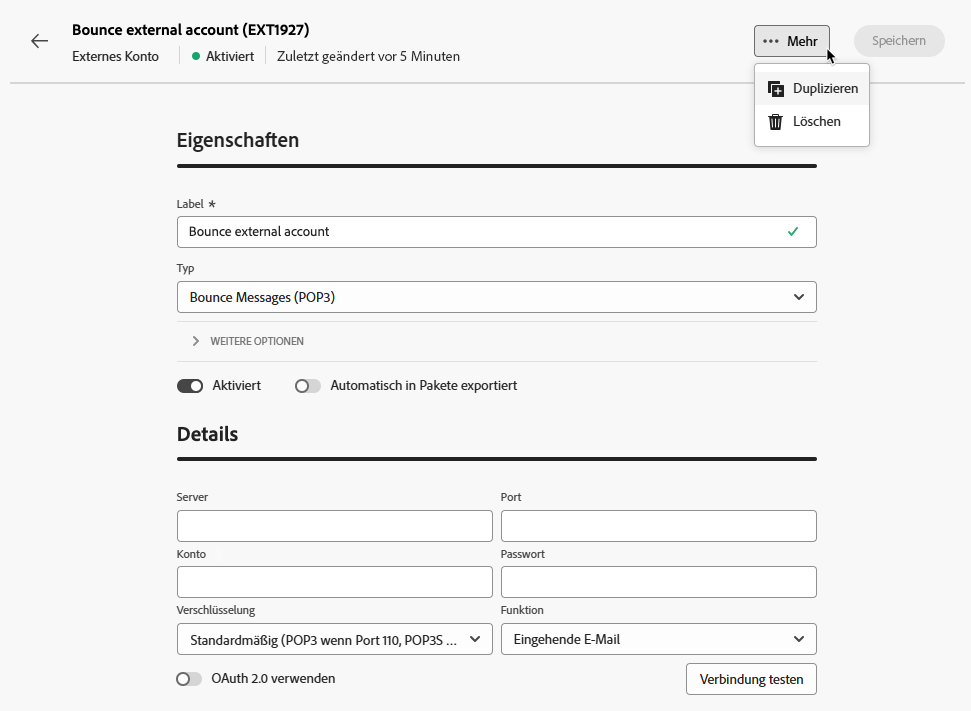

# Verwalten externer Konten {#external-accounts}

>[!AVAILABILITY]
>
>* Externe Konten sind derzeit nur für Bounce Messages (POP3), Routing und die Ausführungsinstanz verfügbar. Weitere Kontotypen werden in Zukunft hinzugefügt.
>
>* Nicht unterstützte externe Konten, die in der Adobe Campaign-Konsole erstellt wurden, sind zwar in der Web-Benutzeroberfläche sichtbar, können jedoch nicht bearbeitet oder aufgerufen werden.

Adobe Campaign verfügt über eine Reihe vordefinierter externer Konten, sodass eine einfache Integration mit verschiedenen Systeme möglich ist.  Wenn Sie eine Verbindung zu zusätzlichen Plattformen herstellen oder die Verbindungen an Ihren Workflow anpassen müssen, können Sie jetzt einfach neue externe Konten über die Web-Benutzeroberfläche erstellen, um Ihre spezifischen Anforderungen zu erfüllen und eine nahtlose Datenübertragung zu gewährleisten.

## Erstellen eines externen Kontos {#create-ext-account}

Gehen Sie wie folgt vor, um ein neues externes Konto zu erstellen.  Die detaillierten Einstellungen hängen vom Typ des externen Kontos ab. [Weitere Informationen](#campaign-specific)

1. Wählen Sie im Menü im linken Fensterbereich unter **[!UICONTROL Administration]** die Option **[!UICONTROL Externe Konten]** aus.

1. Klicken Sie auf **[!UICONTROL Externes Konto erstellen]**.

   

1. Geben Sie Ihren **[!UICONTROL Titel]** ein und wählen Sie den **[!UICONTROL Typ]** des externen Kontos aus.

   >[!NOTE]
   >
   >Die Einstellungen für kampagnenspezifische Typen sind in [diesem Abschnitt](#campaign-specific) ausführlich aufgeführt.

   

1. Klicken Sie auf **[!UICONTROL Erstellen]**.

1. Über die Dropdown-Liste **[!UICONTROL Zusätzliche Optionen]** können Sie bei Bedarf den **[!UICONTROL internen Namen]** oder den Pfad des **[!UICONTROL Ordners]** ändern.

   

1. Aktivieren Sie die Option **[!UICONTROL Automatisch in Paketen exportieren]**, wenn die von diesem externen Konto verwalteten Daten automatisch exportiert werden sollen. <!--Exported where??-->

   

1. Konfigurieren Sie im Abschnitt **[!UICONTROL Details]** den Zugriff auf das Konto, indem Sie die Anmeldedaten entsprechend dem gewählten externen Kontotyp angeben. [Weitere Informationen](#bounce)

1. Klicken Sie auf **[!UICONTROL Verbindung testen]**, um zu prüfen, ob Ihre Konfiguration korrekt ist.

1. Sie können Ihr externes Konto über das Menü **[!UICONTROL Details…]** duplizieren oder löschen.

   

1. Klicken Sie nach Abschluss der Konfiguration auf **[!UICONTROL Speichern]**.

## Campaign-spezifische externe Konten {#campaign-specific}

Gehen Sie je nach dem ausgewählten externen Kontotyp wie folgt vor, um die Kontoeinstellungen zu konfigurieren.

### Bounce Messages (POP3) {#bounce}

>[!AVAILABILITY]
>
> OAuth 2.0 wird derzeit nicht unterstützt.

Das externe Konto „Bounce-E-Mails“ gibt das externe POP3-Konto an, das für die Verbindung mit dem E-Mail-Service verwendet werden soll.  Alle Server, die für den POP3-Zugriff konfiguriert sind, können Antwort-Mails empfangen.

Um das externe Konto **[!UICONTROL Bounce Messages (POP3)]** zu konfigurieren, füllen Sie folgende Felder aus:

* **[!UICONTROL Server]**: URL des POP3-Servers

* **[!UICONTROL Port]**: Nummer des POP3-Verbindungs-Ports (der Standard-Port ist 110)

* **[!UICONTROL Konto]**: Name der Benutzerin bzw. des Benutzers

* **[!UICONTROL Passwort]**: Passwort des Benutzerkontos.

* **[!UICONTROL Verschlüsselung]**: Typ der Verschlüsselung, zu wählen zwischen:

   * Standardmäßig (POP3 wenn Port 110, POP3S wenn Port 995)
   * POP3 schaltet auf SSL nach Übermittlung von STARTTLS
   * POP3 nicht gesichert (standardmäßig Port 110)
   * POP3 gesichert über SSL (standardmäßig Port 995)

* **[!UICONTROL Funktion]**: Eingehende E-Mail, wenn das externe Konto für den Empfang eingehender E-Mails konfiguriert ist, oder SOAP-Router für die Verarbeitung von SOAP-Anfragen.

### Routing {#routing}

Gehen Sie wie folgt vor, um ein spezielles externes Konto zu konfigurieren, das in Ihren externen Sendungen verwendet wird.

1. Erstellen Sie ein externes Konto. [Weitere Informationen](../administration/external-account.md#create-ext-account)

1. Wählen Sie als Typ **[!UICONTROL Routing]** aus.

   {zoomable="yes"}

1. Wählen Sie den gewünschten Kanal aus und klicken Sie auf **[!UICONTROL Erstellen]**.

1. Im Abschnitt **[!UICONTROL Details]** des externen Kontos ist standardmäßig **[!UICONTROL Extern]** als **[!UICONTROL Versandmodus]** ausgewählt.

   {zoomable="yes"}

   >[!NOTE]
   >
   >Derzeit ist **[!UICONTROL Extern]** der einzige verfügbare Modus.

1. Um den Prozess nach der Ausführung des Versands zu verwalten, können Sie diesen in einen Nachbearbeitungs-Workflow externalisieren. Dazu müssen Sie einen Workflow mit der Aktivität [Externes Signal](../workflows/activities/external-signal.md) erstellen und aus dem Feld **[!UICONTROL Nachbearbeitung]** auswählen.

   {zoomable="yes"}

1. Im Feld **[!UICONTROL Aktivität]** können Sie den Namen der Aktivität für den Nachbearbeitungs-Workflow bearbeiten, der in den Protokollen angezeigt werden soll. <!--you can edit the name of the activity that will be created if you add an external or bulk delivery to a workflow-->

### Ausführungsinstanz {#instance-exec}

Im Falle einer segmentierten Architektur müssen Sie die mit der Kontrollinstanz verknüpften Ausführungsinstanzen identifizieren und Verbindungen zwischen ihnen herstellen. Transaktionsnachrichtenvorlagen werden in der Ausführungsinstanz bereitgestellt.

So konfigurieren Sie das externe Konto **[!UICONTROL Ausführungsinstanz]**:

* **[!UICONTROL URL]**

  URL des Servers, auf dem die Ausführungsinstanz installiert ist.

* **[!UICONTROL Konto]**

  Name des Kontos, muss mit dem Message Center Agent übereinstimmen, der im Benutzerordner definiert ist

* **[!UICONTROL Passwort]**

  Passwort des Kontos, wie es im Benutzerordner definiert ist

* **[!UICONTROL Methode]**

  Wählen Sie zwischen Web-Dienst oder Federated Data Access (FDA).
Wählen Sie im Falle der FDA-Methode Ihr FDA-Konto aus. Die Verbindung von Campaign mit externen Systemen ist erfahrenen Benutzenden vorbehalten und nur über die Client-Konsole verfügbar. [Weitere Informationen](https://experienceleague.adobe.com/de/docs/campaign/campaign-v8/connect/fda#_blank)

* **[!UICONTROL Erstellen eines Archivierungs-Workflows]**

  Für jede im Message Center registrierte Ausführungsinstanz müssen Sie, unabhängig davon, ob eine oder mehrere Instanzen vorhanden sind, einen separaten Archivierungs-Workflow für jedes externe Konto erstellen, das mit der Ausführungsinstanz verknüpft ist.
