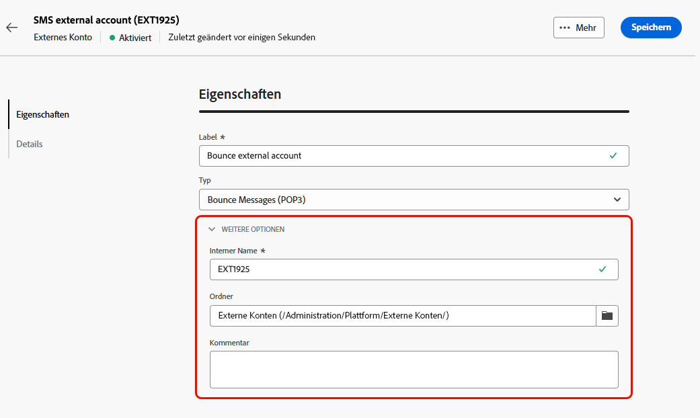

# Konfigurieren externer Konten {#external-accounts}

>[!CONTEXTUALHELP]
>id="acw_homepage_welcome_rn2"
>title="Externe Konten"
>abstract="Sie können jetzt eine Verbindung zu zusätzlichen Plattformen herstellen oder die Verbindungen an Ihren Workflow anpassen und einfach neue externe Konten erstellen, um Ihre spezifischen Anforderungen zu erfüllen und eine nahtlose Datenübertragung zu gewährleisten."
>additional-url="https://experienceleague.adobe.com/docs/campaign-web/v8/release-notes/release-notes.html?lang=de" text="Siehe Versionshinweise"

>[!AVAILABILITY]
>
> Beachten Sie, dass externe Konten derzeit nur für Bounce Messages (POP3) und die Ausführungsinstanz verfügbar sind, wobei in Zukunft zusätzliche Kontotypen hinzugefügt werden müssen.
> Nicht unterstützte externe Konten, die in der Adobe Campaign-Konsole erstellt wurden, sind in der Web-Benutzeroberfläche sichtbar, können jedoch nicht bearbeitet oder aufgerufen werden.

Adobe Campaign verfügt über eine Reihe vorkonfigurierter externer Konten, die eine einfache Integration in verschiedene Systeme ermöglichen. Wenn Sie eine Verbindung zu zusätzlichen Plattformen herstellen oder die Verbindungen an Ihren Workflow anpassen müssen, können Sie jetzt einfach neue externe Konten über die Web-Benutzeroberfläche erstellen, um Ihre spezifischen Anforderungen zu erfüllen und eine nahtlose Datenübertragung zu gewährleisten.

## Erstellen eines externen Kontos {#create-ext-account}

Gehen Sie wie folgt vor, um ein neues externes Konto zu erstellen. Detaillierte Einstellungen hängen vom Typ des externen Kontos ab.

1. Wählen Sie im Menü im linken Fensterbereich unter **[!UICONTROL Administration]** die Option **[!UICONTROL Externe Konten]** aus.

1. Klicken Sie auf **[!UICONTROL Externes Konto erstellen]**.

   

1. Geben Sie Ihren **[!UICONTROL Titel]** ein und wählen Sie Ihr externes Konto **[!UICONTROL Typ]** aus.

   

1. Klicken Sie auf **[!UICONTROL Erstellen]**.

1. Aus der Dropdown-Liste **[!UICONTROL Erweiterte Optionen]** können Sie bei Bedarf den Pfad **[!UICONTROL Interner Name]** oder den Pfad **[!UICONTROL Ordner]** ändern.

   

1. Aktivieren Sie die Option **[!UICONTROL Automatisch exportiert]** , wenn Ihre von diesem externen Konto verwalteten Daten automatisch exportiert werden sollen.

1. Konfigurieren Sie den Zugriff auf das Konto, indem Sie die Anmeldedaten entsprechend dem gewählten externen Kontotyp angeben.

1. Klicken Sie auf **[!UICONTROL Verbindung testen]** , um zu überprüfen, ob Ihre Konfiguration korrekt ist.

1. Duplizieren oder löschen Sie im Menü **[!UICONTROL Mehr...]** Ihr externes Konto.

   

1. Klicken Sie nach Abschluss der Konfiguration auf **[!UICONTROL Speichern]**.

## Campaign-spezifische externe Konten {#campaign-specific}

### Bounce Messages (POP3) {#bounce}

>[!AVAILABILITY]
>
> OAuth 2.0 wird derzeit nicht unterstützt.

Das externe Konto Bounce Message gibt das externe POP3-Konto an, das für die Verbindung mit dem E-Mail-Dienst verwendet wird. Alle Server, die für den POP3-Zugriff konfiguriert sind, können E-Mail-Rücksendungen erhalten.

So konfigurieren Sie das externe Konto **[!UICONTROL Bounce Messages (POP3)]** :

* **[!UICONTROL Server]**

  URL des POP3-Servers

* **[!UICONTROL Port]**

  Anschlussnummer der POP3-Verbindung (Standardanschluss ist 110)

* **[!UICONTROL Konto]**

  Name des Benutzers

* **[!UICONTROL Passwort]**

  Passwort des Benutzerkontos

* **[!UICONTROL Verschlüsselung]**

  Typ der gewählten Verschlüsselung:

   * Standardmäßig (POP3 wenn Port 110, POP3S wenn Port 995)
   * POP3 schaltet auf SSL nach Übermittlung von STARTTLS
   * POP3 nicht gesichert (standardmäßig Port 110)
   * POP3 gesichert über SSL (standardmäßig Port 995)

* **[!UICONTROL Funktion]**

  Eingehende E-Mails, wenn das externe Konto für den Empfang eingehender E-Mails oder SOAP Router für die Verarbeitung SOAP Anfragen konfiguriert ist.

### Ausführungsinstanz{#instance-exec}

Wenn Sie über eine segmentierte Architektur verfügen, müssen Sie die mit der Kontrollinstanz verknüpften Ausführungsinstanzen identifizieren und Verbindungen herstellen. Transaktionsnachrichten-Vorlagen werden in der Ausführungsinstanz bereitgestellt.

So konfigurieren Sie das externe Konto **[!UICONTROL Ausführungsinstanz]** :

* **[!UICONTROL URL]**

  URL des Servers, auf dem die Ausführungsinstanz installiert ist.

* **[!UICONTROL Konto]**

  Name des Kontos, muss mit dem Message Center Agent übereinstimmen, der im Benutzerordner definiert ist

* **[!UICONTROL Passwort]**

  Passwort des Kontos, wie es im Benutzerordner definiert ist

* **[!UICONTROL Methode]**

  Wählen Sie zwischen Webdienst oder Federated Data Access (FDA).
Wählen Sie bei einer FDA-Methode Ihr FDA-Konto aus. Beachten Sie, dass die Campaign-Verbindung zu externen Systemen auf erfahrene Benutzer beschränkt ist und nur über die Clientkonsole verfügbar ist. [Weitere Informationen](https://experienceleague.adobe.com/en/docs/campaign/campaign-v8/connect/fda#_blank)

* **[!UICONTROL Archivierungs-Workflow erstellen]**

  Unabhängig davon, ob Sie eine oder mehrere Instanzen haben, müssen Sie für jede im Message Center registrierte Ausführungsinstanz einen separaten Archivierungs-Workflow für jedes externe Konto erstellen, das mit der Ausführungsinstanz verknüpft ist.
