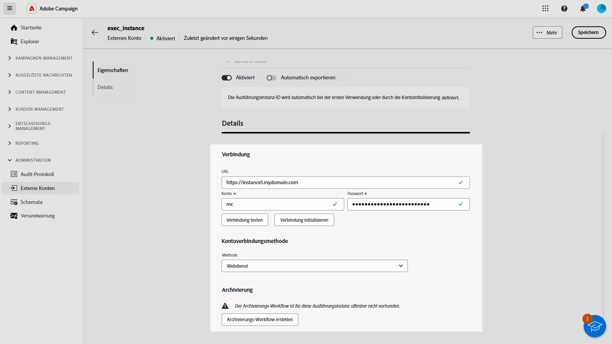

# Verwalten externer Konten {#external-accounts}

>[!AVAILABILITY]
>
>* Externe Konten sind derzeit nur für Bounce Messages (POP3), das Routing und die Ausführungsinstanz verfügbar. Weitere Kontotypen werden später hinzugefügt.
>
>* Nicht unterstützte externe Konten, die in der Adobe Campaign-Konsole erstellt wurden, sind in der Web-Benutzeroberfläche sichtbar, können jedoch nicht bearbeitet oder aufgerufen werden.

Adobe Campaign enthält vorkonfigurierte externe Konten für eine einfache Integration in verschiedene Systeme. Um eine Verbindung zu zusätzlichen Plattformen herzustellen oder Verbindungen an Ihren Workflow anzupassen, erstellen Sie neue externe Konten über die Web-Benutzeroberfläche. Dies gewährleistet eine nahtlose Datenübertragung.

## Erstellen eines externen Kontos {#create-ext-account}

Gehen Sie wie folgt vor, um ein neues externes Konto zu erstellen.  Die detaillierten Einstellungen hängen vom Typ des externen Kontos ab. [Weitere Informationen](#campaign-specific)

1. Wählen Sie im Menü im linken Fensterbereich unter **[!UICONTROL Administration]** die Option **[!UICONTROL Externe Konten]** aus.

1. Klicken Sie auf **[!UICONTROL Externes Konto erstellen]**.

   

1. Geben Sie Ihren **[!UICONTROL Titel]** ein und wählen Sie den **[!UICONTROL Typ]** des externen Kontos aus.

   >[!NOTE]
   >
   >Die Einstellungen für kampagnenspezifische Typen sind in [diesem Abschnitt](#campaign-specific) ausführlich aufgeführt.

   

1. Klicken Sie auf **[!UICONTROL Erstellen]**.

1. Ändern Sie in **[!UICONTROL Dropdown-Liste]** Zusätzliche Optionen“ bei **[!UICONTROL den Pfad Interner Name]** oder **[!UICONTROL Ordner]** .

   

1. Aktivieren Sie die Option **[!UICONTROL Automatisch in Pakete exportieren]**, um automatisch von diesem externen Konto verwaltete Daten zu exportieren. <!--Exported where??-->

   

1. Konfigurieren **[!UICONTROL im Abschnitt]** den Zugriff auf das Konto, indem Sie Anmeldeinformationen angeben, die auf dem ausgewählten externen Kontotyp basieren. [Weitere Informationen](#bounce)

1. Klicken Sie **[!UICONTROL Verbindung testen]**, um zu überprüfen, ob Ihre Konfiguration korrekt ist.

1. Sie können Ihr externes Konto über das Menü **[!UICONTROL Details...]** duplizieren oder löschen.

   

1. Klicken Sie nach Abschluss der Konfiguration auf **[!UICONTROL Speichern]**.

## Campaign-spezifische externe Konten {#campaign-specific}

Gehen Sie je nach dem ausgewählten externen Kontotyp wie folgt vor, um die Kontoeinstellungen zu konfigurieren.

### Bounce Messages (POP3) {#bounce}

>[!AVAILABILITY]
>
> OAuth 2.0 wird derzeit nicht unterstützt.

Das externe Konto „Bounce-E-Mails“ gibt das externe POP3-Konto an, das für die Verbindung mit dem E-Mail-Service verwendet werden soll.  Alle Server, die für den POP3-Zugriff konfiguriert sind, können Antwort-Mails empfangen.

Um das externe Konto **[!UICONTROL Bounce Messages (POP3)]** zu konfigurieren, füllen Sie folgende Felder aus:

* **[!UICONTROL Server]** – URL des POP3-Servers.

* **[!UICONTROL Port]** - Port-Nummer der POP3-Verbindung (Standard-Port ist 110).

* **[!UICONTROL Konto]** - Name des Benutzers.

* **[!UICONTROL Passwort]** – Passwort des Benutzerkontos.

* **[!UICONTROL Verschlüsselung]** - Typ der gewählten Verschlüsselung, einschließlich:
   * Standardmäßig (POP3 wenn Port 110, POP3S wenn Port 995).
   * POP3 wechselt nach dem Senden eines STARTTLS zu SSL.
   * POP3 nicht gesichert (standardmäßig Port 110).
   * POP3 gesichert über SSL (standardmäßig Port 995).

* **[!UICONTROL Funktion]** - Wählen Sie **[!UICONTROL Eingehende E-Mail]** aus, um das Konto für den Empfang eingehender E-Mails zu konfigurieren, oder **[!UICONTROL SOAP Router]** um SOAP-Anfragen zu verarbeiten.

### Routing {#routing}

Gehen Sie wie folgt vor, um ein bestimmtes externes Konto für externe Sendungen zu konfigurieren.

1. Erstellen Sie ein externes Konto. [Weitere Informationen](../administration/external-account.md#create-ext-account)

1. Wählen Sie als Typ **[!UICONTROL Routing]** aus.

   {zoomable="yes"}

1. Wählen Sie den gewünschten Kanal aus und klicken Sie auf **[!UICONTROL Erstellen]**.

1. Im Abschnitt **[!UICONTROL Details]** des externen Kontos ist standardmäßig **[!UICONTROL Extern]** als **[!UICONTROL Versandmodus]** ausgewählt.

   {zoomable="yes"}

   >[!NOTE]
   >
   >Derzeit ist **[!UICONTROL Extern]** der einzige verfügbare Modus.

1. Um den Prozess nach der Versandausführung zu verwalten, externalisieren Sie dies in einen Nachbearbeitungs-Workflow. Erstellen Sie einen Workflow mit der Aktivität [Externes Signal](../workflows/activities/external-signal.md) und wählen Sie ihn aus dem Feld **[!UICONTROL Nachbearbeitung]** aus.

   {zoomable="yes"}

1. Bearbeiten Sie im Feld **[!UICONTROL Aktivität]** den Namen der Workflow-Aktivität, die nach der Verarbeitung in den Protokollen angezeigt wird. <!--you can edit the name of the activity that will be created if you add an external or bulk delivery to a workflow-->

### Ausführungsinstanz {#instance-exec}

Wenn Sie über eine segmentierte Architektur verfügen, identifizieren Sie die mit der Kontrollinstanz verknüpften Ausführungsinstanzen und stellen Sie Verbindungen zwischen ihnen her. Transaktionsnachrichtenvorlagen werden in der Ausführungsinstanz bereitgestellt.

So konfigurieren Sie das externe Konto **[!UICONTROL Ausführungsinstanz]**:

* **[!UICONTROL URL]** - URL des Servers, auf dem die Ausführungsinstanz installiert ist.

* **[!UICONTROL Konto]** - Name des Kontos, der mit dem Message Center-Agenten übereinstimmt, wie im Benutzerordner definiert.

* **[!UICONTROL Kennwort]** - Kennwort des Kontos, wie im Benutzerordner definiert.

* **[!UICONTROL Methode]** - Wählen Sie zwischen Webservice oder Federated Data Access (FDA).

  Wählen Sie für FDA Ihr FDA-Konto aus. Die Verbindung von Campaign mit externen Systemen ist erfahrenen Benutzenden vorbehalten und nur über die Client-Konsole verfügbar. [Weitere Informationen](https://experienceleague.adobe.com/de/docs/campaign/campaign-v8/connect/fda#_blank)

* **[!UICONTROL Archivierungs-Workflow erstellen]** - Erstellen Sie für jede im Message Center registrierte Ausführungsinstanz, unabhängig davon, ob Sie eine oder mehrere Instanzen haben, einen separaten Archivierungs-Workflow für jedes externe Konto, das mit der Ausführungsinstanz verknüpft ist.