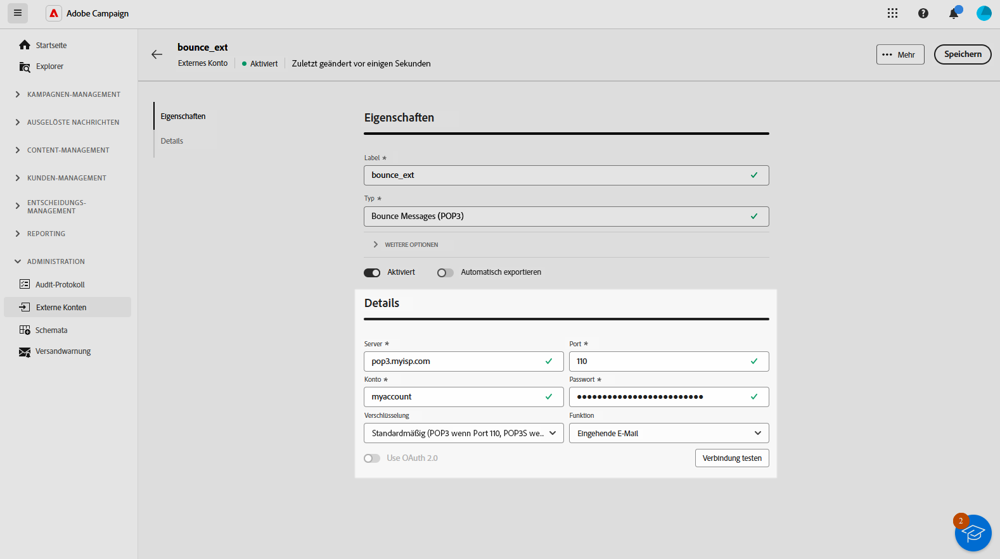
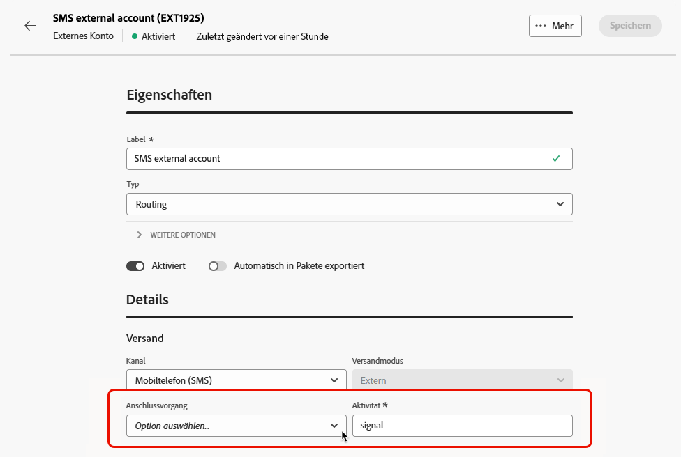
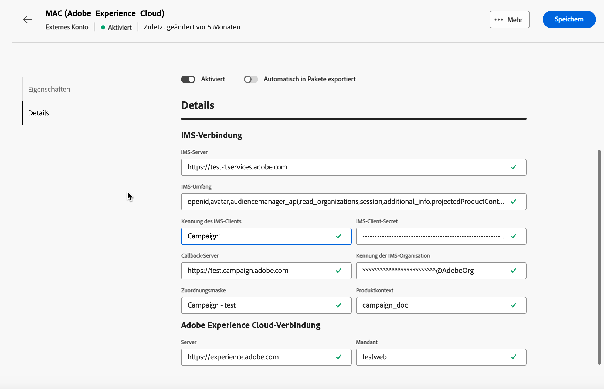

# Verwalten externer Konten {#external-accounts}

>[!CONTEXTUALHELP]
>id="acw_homepage_welcome_rn3"
>title="Erstellen externer Konten"
>abstract="Als Campaign-Admin können Sie nun über die Campaign Web-Benutzeroberfläche neue Verbindungen mit externen Systemen einrichten. Sie haben zudem die Möglichkeit, vorhandene externe Konten anzuzeigen, zu aktualisieren und zu verwalten."
>additional-url="https://experienceleague.adobe.com/docs/campaign-web/v8/release-notes/release-notes.html?lang=de" text="Siehe Versionshinweise"

Adobe Campaign verfügt über vorkonfigurierte externe Konten, sodass eine einfache Integration mit verschiedenen Systemen möglich ist.  Um eine Verbindung zu zusätzlichen Plattformen herzustellen oder Verbindungen an Ihren Workflow anzupassen, erstellen Sie neue externe Konten über die Web-Benutzeroberfläche. Dies sorgt für nahtlose Datenübertragungen.

## Erstellen eines externen Kontos {#create-ext-account}

Gehen Sie wie folgt vor, um ein neues externes Konto zu erstellen.  Die detaillierten Einstellungen hängen vom Typ des externen Kontos ab. [Weitere Informationen](#campaign-specific)

1. Wählen Sie im Menü im linken Fensterbereich unter **[!UICONTROL Administration]** die Option **[!UICONTROL Externe Konten]** aus.

1. Klicken Sie auf **[!UICONTROL Externes Konto erstellen]**.

   

1. Geben Sie Ihren **[!UICONTROL Titel]** ein und wählen Sie den **[!UICONTROL Typ]** des externen Kontos aus.

   >[!NOTE]
   >
   >Die Einstellungen für kampagnenspezifische Typen sind in [diesem Abschnitt](#campaign-specific) ausführlich aufgeführt.

   

1. Klicken Sie auf **[!UICONTROL Erstellen]**.

1. Ändern Sie bei Bedarf über die Dropdown-Liste **[!UICONTROL Weitere Optionen]** den **[!UICONTROL internen Namen]** oder den Pfad des **[!UICONTROL Ordners]**.

   

1. Aktivieren Sie die Option **[!UICONTROL Automatisch in Pakete exportiert]**, um von diesem externen Konto verwaltete Daten automatisch zu exportieren. <!--Exported where??-->

   

1. Konfigurieren Sie im Abschnitt **[!UICONTROL Details]** den Zugriff auf das Konto, indem Sie die Anmeldedaten basierend auf dem gewählten externen Kontotyp angeben. [Weitere Informationen](#bounce)

1. Klicken Sie auf **[!UICONTROL Verbindung testen]**, um zu prüfen, ob Ihre Konfiguration korrekt ist.

1. Sie können Ihr externes Konto über das Menü **[!UICONTROL Details...]** duplizieren oder löschen.

   

1. Klicken Sie nach Abschluss der Konfiguration auf **[!UICONTROL Speichern]**.

## Campaign-spezifische externe Konten {#campaign-specific}

Gehen Sie je nach dem ausgewählten externen Kontotyp wie folgt vor, um die Kontoeinstellungen zu konfigurieren.

### Bounce Messages (POP3) {#bounce}

Das externe Konto „Bounce-E-Mails“ gibt das externe POP3-Konto an, das für die Verbindung mit dem E-Mail-Service verwendet werden soll.  Alle Server, die für den POP3-Zugriff konfiguriert sind, können Antwort-Mails empfangen.

Um das externe Konto **[!UICONTROL Bounce Messages (POP3)]** zu konfigurieren, füllen Sie folgende Felder aus:

* **[!UICONTROL Server]** – URL des POP3-Servers.

* **[!UICONTROL Port]** – Nummer des POP3-Verbindungs-Ports (der Standard-Port ist 110).

* **[!UICONTROL Konto]** – Name der Benutzerin bzw. des Benutzers.

* **[!UICONTROL Passwort]** – Passwort des Benutzerkontos.

* **[!UICONTROL Verschlüsselung]** – Typ der Verschlüsselung, z. B.:
   * Standardmäßig (POP3 wenn Port 110, POP3S wenn Port 995)
   * POP3 schaltet auf SSL nach Übermittlung von STARTTLS
   * POP3 nicht gesichert (standardmäßig Port 110)
   * POP3 gesichert über SSL (standardmäßig Port 995)

* **[!UICONTROL Funktion]** – Wählen Sie **[!UICONTROL Eingehende E-Mail]** aus, um das Konto für den Empfang eingehender E-Mails zu konfigurieren, oder **[!UICONTROL SOAP-Router]**, um SOAP-Anfragen zu verarbeiten.

>[!IMPORTANT]
>
>Bevor Sie Ihr externes POP3-Konto mit Microsoft OAuth 2.0 konfigurieren, müssen Sie die Anwendung zunächst im Azure-Portal registrieren. Weitere Informationen hierzu finden Sie auf [dieser Seite](https://learn.microsoft.com/en-us/entra/identity-platform/quickstart-register-app){target=_blank}.

Um ein externes POP3-Programm mit Microsoft OAuth 2.0 zu konfigurieren, markieren Sie die Option Microsoft OAuth 2.0 und füllen Sie die folgenden Felder aus:

* **[!UICONTROL Azure-Mandant]**

  Eine Azure ID (oder Verzeichnis-ID bzw. Mandanten-ID) finden Sie in der Dropdown-Liste Grundlagen der Anwendungsübersicht im Azure-Portal.

* **[!UICONTROL Azure-Client-ID]**

  Client-ID (oder Anwendungs (Client)-ID) finden Sie in der Dropdown-Liste Grundlagen der Anwendungsübersicht im Azure-Portal.

* **[!UICONTROL Azure-Client-Geheimnis]**

  Die Client-Geheimnis-ID finden Sie in der Spalte Client-Geheimnisse im Menü Zertifikate und Geheimnisse Ihrer Anwendung im Azure-Portal.

* **[!UICONTROL Azure-Umleitungs-URL]**

  Die Umleitungs-URL finden Sie im Menü Authentifizierung Ihrer Anwendung im Azure-Portal. Sie sollte mit der folgenden Syntax enden: nl/jsp/oauth.jsp, z. B. `https://redirect.adobe.net/nl/jsp/oauth.jsp`.

Zum Einrichten und Verwenden der Schaltfläche Verbindung testen in der Client-Konsole ist ein Internetzugang erforderlich. Nach dem Setup kann der inMail-Prozess ohne Internet mit Microsoft-Servern kommunizieren.

Nachdem Sie Ihre unterschiedlichen Anmeldedaten eingegeben haben, können Sie auf Verbindung einrichten klicken, um die Konfiguration Ihres externen Kontos abzuschließen.

### Routing {#routing}

Gehen Sie wie folgt vor, um ein spezielles externes Konto für externe Sendungen zu konfigurieren.

1. Erstellen Sie ein externes Konto. [Weitere Informationen](../administration/external-account.md#create-ext-account)

1. Wählen Sie als Typ **[!UICONTROL Routing]** aus.

   {zoomable="yes"}

1. Wählen Sie den gewünschten Kanal aus und klicken Sie auf **[!UICONTROL Erstellen]**.

1. Im Abschnitt **[!UICONTROL Details]** des externen Kontos ist standardmäßig **[!UICONTROL Extern]** als **[!UICONTROL Versandmodus]** ausgewählt.

   {zoomable="yes"}

   >[!NOTE]
   >
   >Derzeit ist **[!UICONTROL Extern]** der einzige verfügbare Modus.

1. Um den Prozess nach der Ausführung des Versands zu verwalten, externalisieren Sie diesen in einen Nachbearbeitungs-Workflow. Erstellen Sie einen Workflow mit der Aktivität [Externes Signal](../workflows/activities/external-signal.md) und wählen Sie ihn aus dem Feld **[!UICONTROL Anschlussvorgang]** aus.

   {zoomable="yes"}

1. Im Feld **[!UICONTROL Aktivität]** können Sie den Namen der Aktivität für den Anschluss-Workflow bearbeiten, der in den Protokollen angezeigt wird. <!--you can edit the name of the activity that will be created if you add an external or bulk delivery to a workflow-->

### Ausführungsinstanz {#instance-exec}

Im Falle einer segmentierten Architektur müssen Sie die mit der Kontrollinstanz verknüpften Ausführungsinstanzen identifizieren und Verbindungen zwischen ihnen herstellen. Transaktionsnachrichtenvorlagen werden in der Ausführungsinstanz bereitgestellt.

So konfigurieren Sie das externe Konto **[!UICONTROL Ausführungsinstanz]**:

* **[!UICONTROL URL]**: URL des Servers, auf dem die Ausführungsinstanz installiert ist.

* **[!UICONTROL Konto]**: Name des Kontos, der mit dem Message Center Agent übereinstimmt, der im Benutzerordner definiert ist

* **[!UICONTROL Passwort]**: Passwort des Kontos, wie es im Benutzerordner definiert ist

* **[!UICONTROL Methode]**: Wählen Sie zwischen „Web-Dienst“ oder „Federated Data Access (FDA)“.

  Wählen Sie für FDA Ihr FDA-Konto aus. Die Verbindung von Campaign mit externen Systemen ist erfahrenen Benutzenden vorbehalten und nur über die Client-Konsole verfügbar. [Weitere Informationen](https://experienceleague.adobe.com/de/docs/campaign/campaign-v8/connect/fda#_blank)

* **[!UICONTROL Archivierungs-Workflow erstellen]**: Erstellen Sie für jede im Message Center registrierte Ausführungsinstanz, unabhängig davon, ob eine oder mehrere Instanzen vorhanden sind, einen separaten Archivierungs-Workflow für jedes externe Konto, das mit der Ausführungsinstanz verknüpft ist.

## Externe Konten zur Integration von Adobe-Lösungen

### Adobe Experience Cloud

Um über eine Adobe ID eine Verbindung zur Adobe Campaign-Konsole herzustellen, müssen Sie das externe Adobe Experience Cloud (MAC)-Konto konfigurieren.

* **[!UICONTROL IMS-Server]**

  URL Ihres IMS-Servers. Stellen Sie sicher, dass sowohl Staging- als auch Produktionsinstanzen auf den gleichen IMS-Produktionsendpunkt verweisen.

* **[!UICONTROL IMS-Umfang]**

  Der hier definierte Umfang muss eine Teilmenge der vom IMS bereitgestellten Perimeter sein.

* **[!UICONTROL Kennung des IMS-Clients]**

  Die ID Ihres IMS-Client

* **[!UICONTROL IMS-Client-Secret]**

  Anmeldedaten für Ihr IMS-Client-Geheimnis.

* **[!UICONTROL Callback-Server]**

  Zugriff auf die URL Ihrer Adobe Campaign-Instanz.

* **[!UICONTROL Kennung der IMS-Organisation]**

  Kennung Ihrer Organisation. Auf [ Seite erfahren Sie, wie Sie Ihre Organisations-ID ](https://experienceleague.adobe.com/docs/core-services/interface/administration/organizations.html?lang=de){target=_blank}.

* **[!UICONTROL Zuordnungsmaske]**

  Syntax, die es ermöglicht, Konfigurationsnamen im Enterprise Dashboard mit den Gruppen in Adobe Campaign zu synchronisieren

* **[!UICONTROL Server]**

  URL Ihrer Adobe Experience Cloud-Instanz

* **[!UICONTROL Mandant]**

  Name Ihres Adobe Experience Cloud-Mandanten

## Übertragen von Daten an externe Konten

### Amazon Simple Storage Service (S3) {#amazon-simple-storage-service--s3--external-account}

Der Amazon Simple Storage Service (S3)-Connector kann zum Importieren oder Exportieren von Daten in Adobe Campaign verwendet werden. Sie kann in einer Workflow-Aktivität eingerichtet werden. Weitere Informationen hierzu finden Sie auf [dieser Seite](https://experienceleague.adobe.com/de/docs/campaign-web/v8/wf/design-workflows/transfer-file){target=_blank}.

Zum Einrichten dieses neuen externen Kontos benötigen Sie die folgenden Informationen:

* **[!UICONTROL AWS-S3-Konto-Server]**

  Die URL Ihres Servers sollte folgendermaßen ausgefüllt werden:

  `  <S3bucket name>.s3.amazonaws.com/<s3object path>`

* **[!UICONTROL Kennung des AWS-Zugangsschlüssels]**

  Informationen darüber, wo Sie Ihre Kennung des AWS-Zugangsschlüssels finden, erfahren Sie auf dieser [Seite](https://docs.aws.amazon.com/general/latest/gr/aws-sec-cred-types.html#access-keys-and-secret-access-keys).

* **[!UICONTROL Geheimer AWS-Zugangsschlüssel]**

  Informationen darüber, wo Sie Ihren geheimen AWS-Zugangsschlüssel finden, erfahren Sie auf dieser [Seite](https://aws.amazon.com/fr/blogs/security/wheres-my-secret-access-key/).

* **[!UICONTROL AWS-Region]**

  Weiterführende Informationen zur AWS-Region finden Sie auf dieser [Seite](https://aws.amazon.com/about-aws/global-infrastructure/regions_az/).

* Die Checkbox **[!UICONTROL Serverseitige Verschlüsselung verwenden]** ermöglicht es Ihnen, Ihre Datei in S3 im verschlüsselten Modus zu speichern.

Informationen dazu, wo Sie die Kennung des Zugriffsschlüssels und den geheimen Zugriffsschlüssel finden, finden Sie unter Amazon Web Services [Dokumentation](https://docs.aws.amazon.com/general/latest/gr/aws-sec-cred-types.html#access-keys-and-secret-access-keys).

### Azur Blob-Speicherung {#azure-blob-external-account}

Das externe **[!UICONTROL Azure Blob Storage]**-Konto kann mithilfe einer Workflow-Aktivität vom Typ **[!UICONTROL Dateiübertragung“ zum Importieren]** Exportieren von Daten in Adobe Campaign verwendet werden. Weiterführende Informationen hierzu finden Sie in [diesem Abschnitt](https://experienceleague.adobe.com/de/docs/campaign-web/v8/wf/design-workflows/transfer-file){target=_blank}.

Um das externe **[!UICONTROL Azure]** Konto für die Verwendung mit Adobe Campaign zu konfigurieren, müssen Sie die folgenden Details angeben:

* **[!UICONTROL Server]**

  URL Ihres Azure Blob Storage-Servers

* **[!UICONTROL Verschlüsselung]**

  Typ der gewählten Verschlüsselung: **[!UICONTROL Keine]** oder **[!UICONTROL SSL]**.

* **[!UICONTROL Zugriffsschlüssel]**

  Auf dieser Seite erfahren Sie **[!UICONTROL wo Sie Ihren]** finden [Zugriffsschlüssel](https://docs.microsoft.com/de-de/azure/storage/common/storage-account-keys-manage?tabs=azure-portal).

## Hadoop

Mit dem externen Konto Hadoop können Sie Ihre Campaign-Instanz mit Ihrer externen Hadoop-Datenbank verbinden. Weitere Informationen zu Hadoop finden Sie in der Dokumentation zur [ v7-Konsole](https://experienceleague.adobe.com/de/docs/campaign-classic/using/installing-campaign-classic/accessing-external-database/configure-fda/config-databases/configure-fda-hadoop){target=_blank}.

* **[!UICONTROL Server]**

  URL Ihres Hadoop-Speicherservers.

* **[!UICONTROL Konto]**

  Name Ihres Hadoop-Serverkontos.
