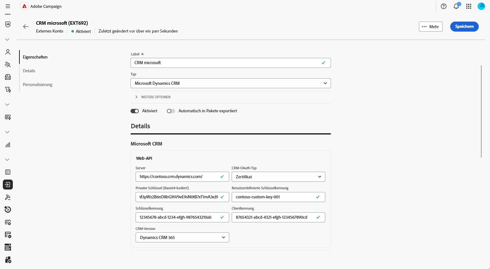
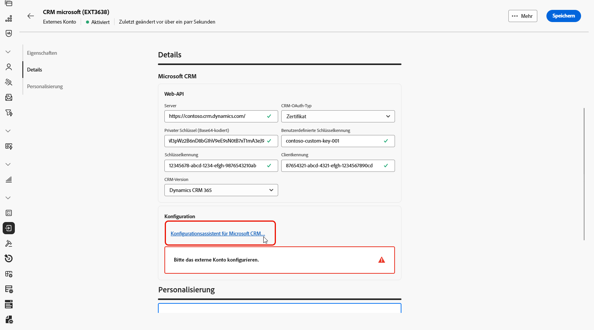
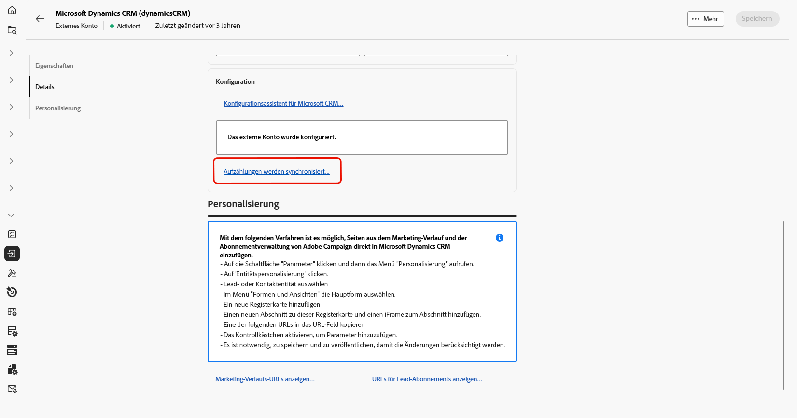
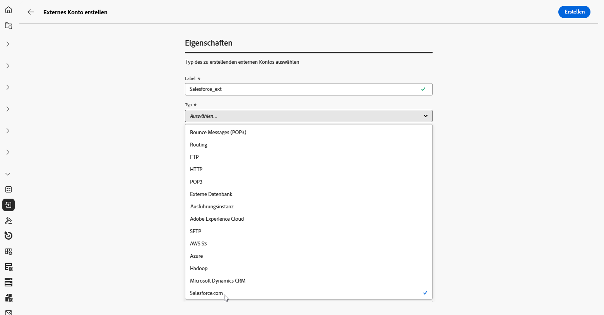
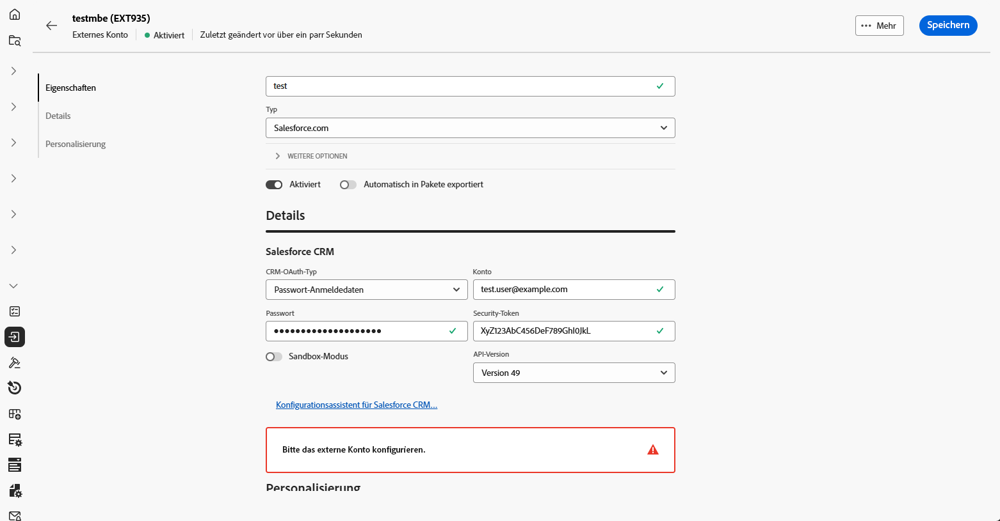
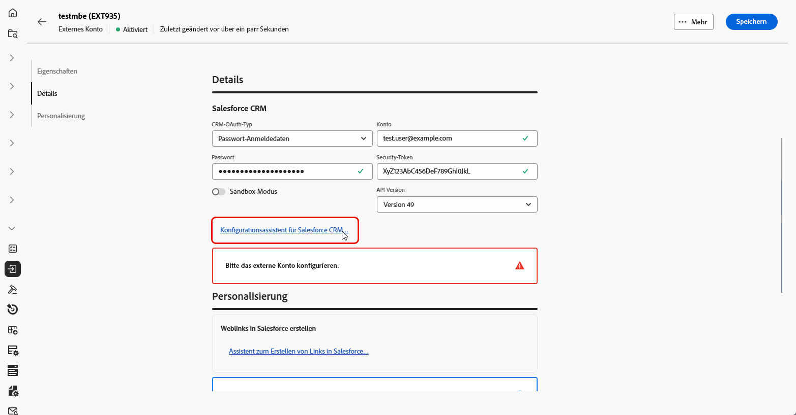
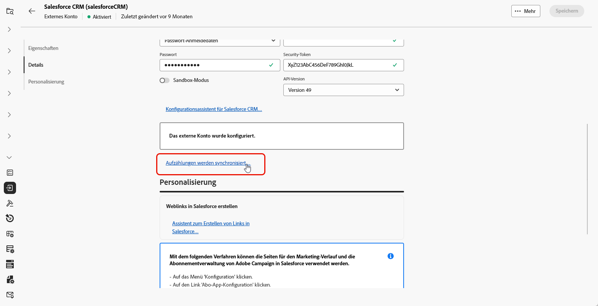
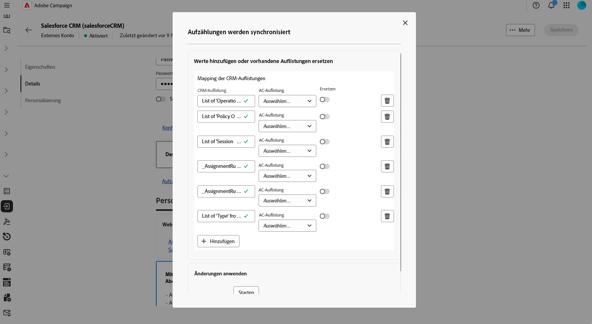

# Externes CRM-Konto {#external-crm}

Verwenden Sie ein externes Konto vom Typ CRM, um Adobe Campaign mit einer Drittanbieterdatenbank zu verbinden.

Die Konfigurationseinstellungen für dieses externe Konto hängen von der jeweiligen Datenbank-Engine ab, mit der Sie eine Verbindung herstellen. Detaillierte Setup-Anweisungen für jede unterstützte Datenbank finden Sie in den folgenden Abschnitten.

## Microsoft Dynamics CRM

Mit dem externen Microsoft Dynamics CRM -Konto können Sie Ihre Campaign-Instanz mit Ihrer externen Microsoft Dynamics CRM -Datenbank verbinden.

Konfigurieren Sie in der Web-Benutzeroberfläche von Adobe Campaign Ihr externes Microsoft Dynamics CRM-Konto.

1. [Erstellen Sie Ihr externes ](external-account.md) und wählen Sie **[!UICONTROL Externe]**) als **[!UICONTROL Typ]** Ihres externen Kontos und Microsoft Dynamics CRM als **[!UICONTROL Anbietertyp]**.

1. Klicken Sie auf **[!UICONTROL Erstellen]**.

1. Um das externe Konto **[!UICONTROL Microsoft Dynamics CRM]** zu konfigurieren, füllen Sie die folgenden Felder aus:

   

   +++ Für CRM-OAuth-Typ: Passwort-Anmeldedaten

   * **[!UICONTROL Server]**: Geben Sie die URL Ihres Microsoft CRM-Servers ein.

     Um Ihre Microsoft CRM-Server-URL zu finden, melden Sie sich bei Ihrem Microsoft Dynamics CRM-Konto an, wählen Sie Dynamics 365 aus und öffnen Sie dann Ihre App. Die Server-URL wird in der Adressleiste Ihres Browsers angezeigt, z. B.:`https://myserver.crm.dynamics.com/`.

   * **[!UICONTROL Konto]**: Geben Sie das Konto an, mit dem die Anmeldung bei Microsoft CRM erfolgt.

   * **[!UICONTROL Kennwort]**: Geben Sie das Kennwort ein, das mit dem angegebenen Konto verknüpft ist.

   * **[!UICONTROL Client-Kennung]**: Geben Sie die Client-ID ein, die sich im Verwaltungsportal von Microsoft Azure befindet.

   * **[!UICONTROL CRM-Version]**: Hier wählen Sie die CRM-Version &quot;Dynamics CRM 365&quot; aus.

   +++

    

   +++ Für CRM-OAuth-Typ: Zertifikat

   * **[!UICONTROL Server]**: Geben Sie die URL Ihres Microsoft CRM-Servers ein.

     Um Ihre Microsoft CRM-Server-URL zu finden, melden Sie sich bei Ihrem Microsoft Dynamics CRM-Konto an, wählen Sie Dynamics 365 aus und öffnen Sie dann Ihre App. Die Server-URL wird in der Adressleiste Ihres Browsers angezeigt, z. B.:`https://myserver.crm.dynamics.com/`.

   * **[!UICONTROL Privater Schlüssel (Base64-kodiert)]**: Geben Sie den im Base64-Format kodierten privaten Schlüssel an.

     Dazu können Sie einen Base64-Encoder oder die Befehlszeile `base64 -w0 private.key` für Linux verwenden.

   * **[!UICONTROL Benutzerdefinierte Schlüsselkennung]**: Geben Sie die benutzerdefinierte Schlüsselkennung ein, die für Ihr Zertifikat verwendet wird.

   * **[!UICONTROL Schlüssel-ID]**: Geben Sie die Schlüssel-ID ein, die mit Ihrem Zertifikat verknüpft ist.

   * **[!UICONTROL Client-Kennung]**: Geben Sie die Client-ID ein, die in der Microsoft Azure-Verwaltung zu finden ist.

   * **[!UICONTROL CRM-Version]**: Hier wählen Sie die CRM-Version &quot;Dynamics CRM 365&quot; aus.

   +++

1. Greifen Sie nach dem Einrichten der Verbindung auf den Konfigurationsassistenten für Microsoft CRM zu **[!UICONTROL um Ihre Microsoft CRM-Tabellenliste zu generieren.]**

   Klicken Sie **[!UICONTROL Weiter]**, um die erforderlichen Tabellen auszuwählen.

   

1. Wählen Sie die abzurufenden Microsoft CRM-Tabellen aus oder fügen Sie eine Remote-Tabelle hinzu, indem Sie die **[!UICONTROL Tabellenbezeichnung]** und **[!UICONTROL Tabelleninterner Name]** angeben und dann den Umschalter **[!UICONTROL Ausgewählt]** aktivieren.

   Klicken Sie auf **[!UICONTROL Weiter]**.

1. Klicken Sie **[!UICONTROL Start]**, um mit der Erstellung des Microsoft CRM-Schemas basierend auf den ausgewählten Tabellen zu beginnen.

1. Folgen Sie den Anweisungen auf dem Bildschirm, um Seiten aus dem Marketing-Verlauf und der Abonnementverwaltung von Adobe Campaign direkt in Microsoft Dynamics CRM einzufügen.

1. Klicken Sie auf **[!UICONTROL Marketing-Verlaufs-URLs anzeigen]**, um die URLs für die Integration von Marketing-Verlaufsseiten oder **[!UICONTROL Anzeigen-URLs für Lead-Abonnements]** anzuzeigen, um die URLs für die Integration von Abonnementverwaltungs-Seiten anzuzeigen.

   

1. Klicken Sie **[!UICONTROL Speichern]** nachdem Ihr externes Microsoft CRM-Konto konfiguriert wurde.

1. Nachdem Sie Ihr externes Konto erstellt haben, können Sie jetzt auf **[!UICONTROL Auflistungen synchronisieren…]** klicken, um Auflistungen automatisch von Microsoft CRM mit der Web-Benutzeroberfläche von Adobe Campaign zu synchronisieren.

   

1. Wählen Sie die Adobe Campaign-Auflistung aus, die der Microsoft CRM-Auflistung entspricht.

   Um Adobe Campaign-Werte durch Microsoft CRM-Werte zu ersetzen, aktivieren Sie die Option **[!UICONTROL Ersetzen]**.

## Salesforce {#salesforce}

Um das externe Salesforce-Konto für die Verwendung mit Adobe Campaign zu konfigurieren, müssen Sie die folgenden Details angeben:

1. [Erstellen Sie Ihr externes ](external-account.md) und wählen Sie **[!UICONTROL Externe Datenbank]** als **[!UICONTROL Typ]** Ihres externen Kontos und Salesforce.com als **[!UICONTROL Anbietertyp]**.

   

1. Klicken Sie auf **[!UICONTROL Erstellen]**.

1. Um das externe Konto **[!UICONTROL Salesforce]** zu konfigurieren, füllen Sie die folgenden Felder aus:

   * **[!UICONTROL CRM-OAuth-Typ]**: **[!UICONTROL Kennwortberechtigungen]** oder **[!UICONTROL Anmeldeinformationen]**

   * **[!UICONTROL Konto]**: Konto, mit dem die Anmeldung bei Salesforce CRM erfolgt.

   * **[!UICONTROL Kennwort]**: Geben Sie das Kennwort ein, das mit dem angegebenen Konto verknüpft ist.

   * **[!UICONTROL Sicherheits-Token]**: Geben Sie das Salesforce-Sicherheits-Token ein, das mit dem Konto verknüpft ist.

   * **[!UICONTROL API-Version]**: Wählen Sie Version 49.

   

1. Öffnen Sie den Konfigurationsassistenten für Salesforce CRM **** um Ihre Salesforce CRM-Tabellenliste zu generieren, und klicken Sie dann auf **[!UICONTROL Weiter]**.

   

1. Wählen Sie die abzurufenden Salesforce-Tabellen aus oder fügen Sie eine Remote-Tabelle hinzu, indem Sie die **[!UICONTROL Tabellenbezeichnung]** und **[!UICONTROL Interner Tabellenname]** eingeben und dann den Umschalter **[!UICONTROL Ausgewählt]** aktivieren.

   Klicken Sie auf **[!UICONTROL Weiter]**.

1. Klicken Sie **[!UICONTROL Start]**, um mit der Erstellung des Salesforce CRM-Schemas basierend auf den ausgewählten Tabellen zu beginnen.

1. Klicken Sie auf **[!UICONTROL Assistent zur Erstellung von Salesforce-Links…]**, um die Web-Links in Salesforce zu generieren.

   Klicken Sie dann auf **[!UICONTROL Weiter]**, um die Weblinks für **Leads** und **Kontakte** aus Salesforce abzurufen.

1. Wählen Sie die Links aus, die in die Liste der Salesforce-Weblinks exportiert werden sollen.

1. Befolgen Sie die Anweisungen auf dem Bildschirm, um **Marketing-Verlauf** und **Abonnementverwaltung** Seiten aus der Adobe Campaign Web-Benutzeroberfläche in Salesforce CRM einzufügen.

1. Klicken Sie **[!UICONTROL Speichern]** nachdem Ihr externes Salesforce CRM-Konto konfiguriert wurde.

1. Nachdem Sie Ihr externes Konto erstellt haben, können Sie jetzt auf **[!UICONTROL Auflistungen synchronisieren…]** klicken, um Auflistungen automatisch von Salesforce zur Web-Benutzeroberfläche von Adobe Campaign zu synchronisieren.

   

1. Wählen Sie die Adobe Campaign-Auflistung aus, die der Salesforce-Auflistung entspricht.

   Um Adobe Campaign-Werte durch Salesforce-Werte zu ersetzen, aktivieren Sie die Option **[!UICONTROL Ersetzen]**.

   

