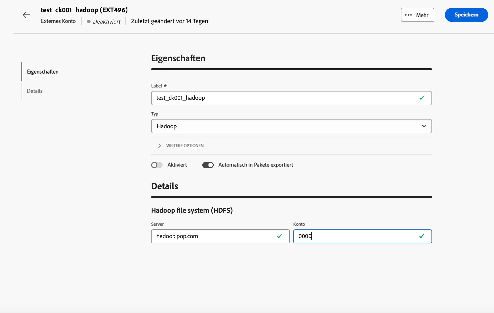

# Externes Konto „Hadoop“ {#external-hadoop}

Über das externe Hadoop-Konto können Sie Ihre Campaign-Instanz mit Ihrer externen Hadoop-Datenbank verbinden. Weitere Informationen zu Hadoop finden Sie in der [Dokumentation zur Campaign V7-Konsole](https://experienceleague.adobe.com/de/docs/campaign-classic/using/installing-campaign-classic/accessing-external-database/configure-fda/config-databases/configure-fda-hadoop){target=_blank}.

Um das externe Konto **[!UICONTROL Hadoop]** zu konfigurieren, füllen Sie folgende Felder aus:

* **[!UICONTROL Server]**

  URL Ihres Hadoop-Speicher-Servers.

* **[!UICONTROL Konto]**

  Name Ihres Hadoop-Server-Kontos.
