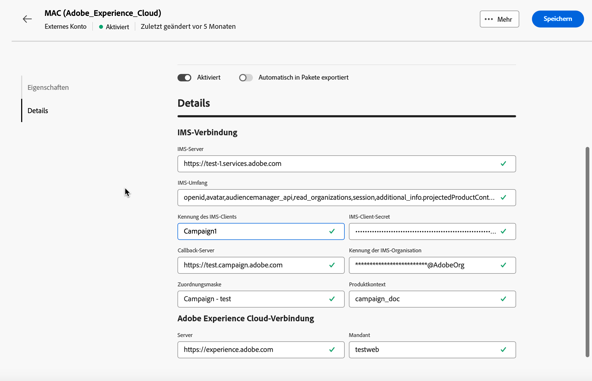

# Externe Konten zur Integration von Adobe-Lösungen {#integration-external-account}

Führen Sie je nach ausgewähltem Typ des externen Kontos für die Integration von Adobe-Lösungen die folgenden Schritte aus, um die Verbindungs- und Kontoeinstellungen für eine nahtlose Integration mit Adobe-Services zu konfigurieren.

## Adobe Experience Cloud

Um über eine Adobe ID eine Verbindung zur Adobe Campaign-Konsole herzustellen, müssen Sie das externe Adobe Experience Cloud (MAC)-Konto konfigurieren.

Um das externe Konto **[!UICONTROL Adobe Experience Cloud]** zu konfigurieren, füllen Sie folgende Felder aus:

* **[!UICONTROL IMS-Server]**

  URL Ihres IMS-Servers. Stellen Sie sicher, dass sowohl Staging- als auch Produktionsinstanzen auf den gleichen IMS-Produktionsendpunkt verweisen.

* **[!UICONTROL IMS-Umfang]**

  Der hier definierte Umfang muss eine Teilmenge der vom IMS bereitgestellten Perimeter sein.

* **[!UICONTROL Kennung des IMS-Clients]**

  Die ID Ihres IMS-Client

* **[!UICONTROL IMS-Client-Secret]**

  Anmeldedaten Ihres IMS-Client-Geheimnisses.

* **[!UICONTROL Callback-Server]**

  Zugriffs-URL Ihrer Adobe Campaign-Instanz.

* **[!UICONTROL Kennung der IMS-Organisation]**

  ID Ihrer Organisation. Auf [dieser Seite](https://experienceleague.adobe.com/docs/core-services/interface/administration/organizations.html?lang=de){target=_blank} finden Sie Ihre Organisations-ID.

* **[!UICONTROL Zuordnungsmaske]**

  Syntax, die es ermöglicht, Konfigurationsnamen im Enterprise Dashboard mit den Gruppen in Adobe Campaign zu synchronisieren

* **[!UICONTROL Server]**

  URL Ihrer Adobe Experience Cloud-Instanz

* **[!UICONTROL Mandant]**

  Name Ihres Adobe Experience Cloud-Mandanten
