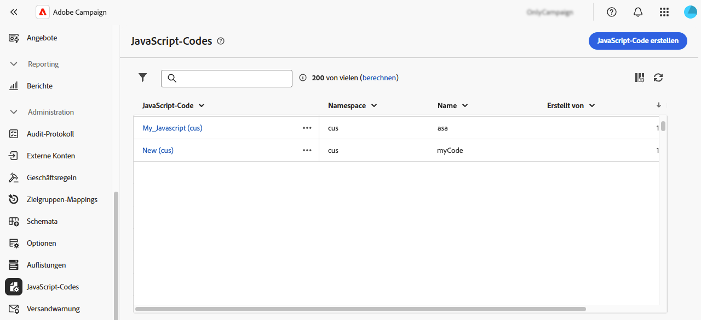
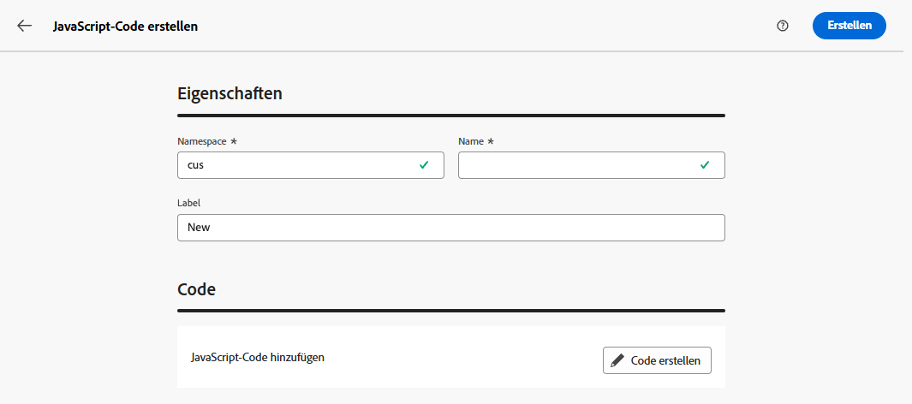
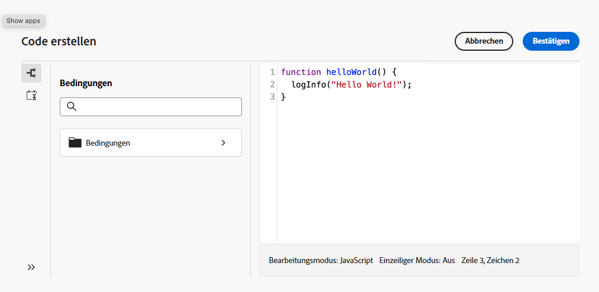
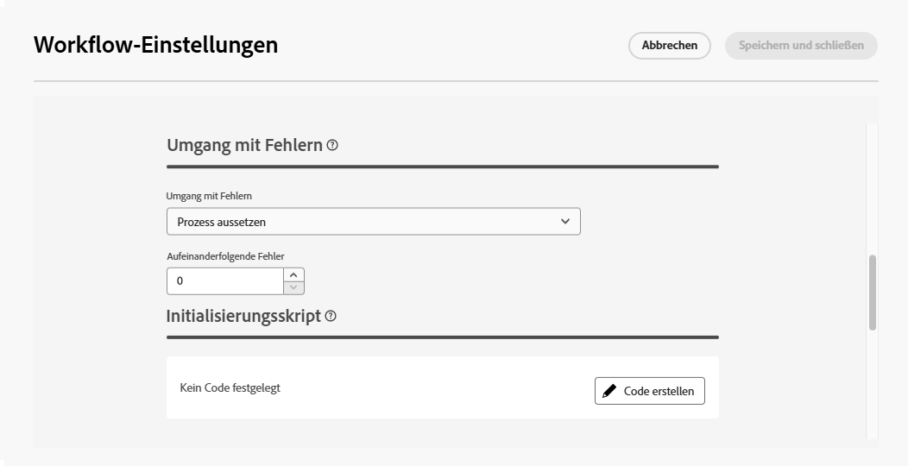
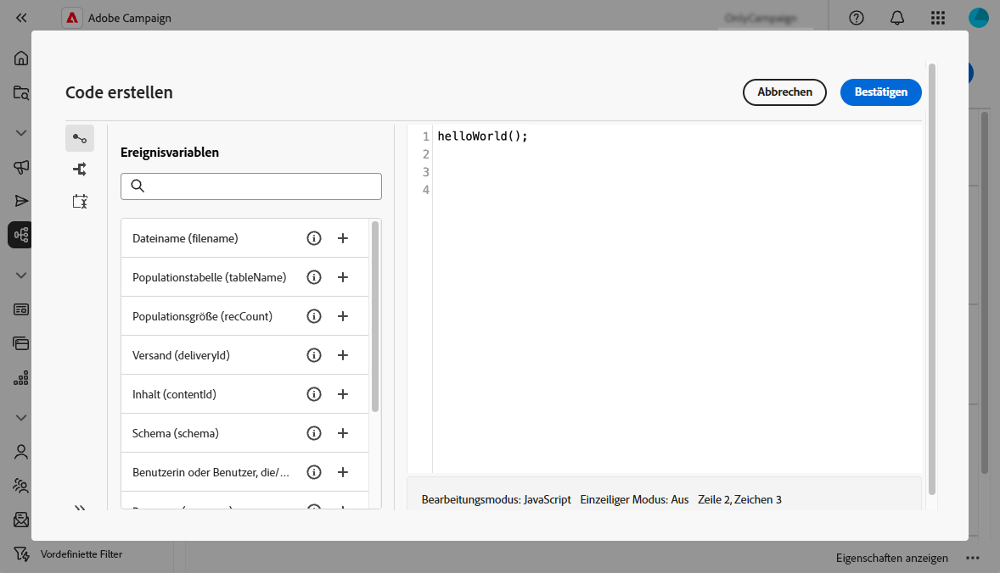

# Arbeiten mit JavaScript-Code {#javascript-codes}

>[!CONTEXTUALHELP]
>id="acw_javascript_codes_list"
>title="JavaScript-Codes"
>abstract="JavaScript-Codes"

>[!CONTEXTUALHELP]
>id="acw_javascript_codes_create"
>title="JavaScript-Code erstellen"
>abstract="JavaScript-Code erstellen"

## Über JavaScript-Codes {#about}

Mit JavaScript-Codes können Sie wiederverwendbare Funktionen erstellen, die ähnlich wie eine Bibliothek in Workflows verwendet werden können. Diese Funktionen werden im Menü **[!UICONTROL Administration]** > **[!UICONTROL JavaScript]** im linken Navigationsbereich gespeichert.



Aus der Liste der JavaScript-Codes können Sie Folgendes tun:

* **Code duplizieren oder löschen**: Klicken Sie auf die Schaltfläche mit den Auslassungspunkten und wählen Sie die gewünschte Aktion aus.
* **Code ändern**: Klicken Sie auf den Namen eines Codes, um seine Eigenschaften zu öffnen. Nehmen Sie Ihre Änderungen vor und speichern Sie.
* **Neuen JavaScript-Code erstellen**: Klicken Sie auf die Schaltfläche **[!UICONTROL JavaScript-Code erstellen]**.

>[!NOTE]
>
>Obwohl sich die Menüposition der JavaScript-Codes zwischen der Adobe Campaign-Konsole und der Web-Benutzeroberfläche unterscheidet, ist die Liste identisch und funktioniert wie eine Spiegelung.

## Erstellen eines JavaScript-Codes {#create}

Gehen Sie wie folgt vor, um einen JavaScript-Code zu erstellen:

1. Navigieren Sie zum Menü **[!UICONTROL JavaScript-Codes]** und klicken Sie auf die Schaltfläche **[!UICONTROL JavaScript-Code erstellen]**.

1. Definieren Sie die Eigenschaften des Codes:

   * **[!UICONTROL Namespace]**: Geben Sie den Namespace an, der für Ihre benutzerdefinierten Ressourcen relevant ist. Standardmäßig lautet der Namespace „cus“, er kann jedoch je nach Implementierung variieren.
   * **[!UICONTROL Name]**: Die eindeutige Kennung, die zur Referenz auf den Code verwendet werden soll.
   * **[!UICONTROL label]**: Der beschreibende Titel, der in der JavaScript-Code-Liste angezeigt werden soll.

   

   >[!NOTE]
   >
   >Nach der Erstellung können **[!UICONTROL Felder]** Namespace **[!UICONTROL und]** Name“ nicht mehr geändert werden. Um Änderungen vorzunehmen, duplizieren Sie den Code und aktualisieren Sie ihn nach Bedarf.
   >
   >In der Campaign-Konsole wird der JavaScript-Codename als Verkettung dieser beiden Felder angezeigt.

1. Klicken Sie auf die **[!UICONTROL Code erstellen]**, um den JavaScript-Code zu definieren. Der linke Bereich bietet zwei Menüs, mit denen Sie vordefinierte Funktionen im Zusammenhang mit Bedingungen und Datumsformatierung verwenden können.

   

1. Klicken Sie **[!UICONTROL Bestätigen]**, um Ihren Code zu speichern.

1. Wenn Ihr JavaScript-Code fertig ist, klicken Sie auf **[!UICONTROL Erstellen]**.  Der JavaScript-Code ist jetzt für die Verwendung in allen Workflows verfügbar.

## Verwenden eines JavaScript-Codes aus einem Workflow {#workflow}

### JavaScript-Code-Bibliotheken laden {#library}

Sie können in Workflows auf JavaScript-Codes verweisen, um das Umschreiben von Code für sich wiederholende Aufgaben zu vermeiden. Um diese Codes zu verwenden, müssen Sie zunächst die entsprechende Bibliothek in das Initialisierungsskript des Workflows laden. Auf diese Weise können Sie alle Bibliotheken laden, die die Funktionen enthalten, die Sie in Ihrem Workflow verwenden möchten.

Gehen Sie wie folgt vor, um eine Bibliothek zu laden:

1. Öffnen Sie einen Workflow und klicken Sie auf **[!UICONTROL Einstellungen]**.
1. Navigieren Sie zum Abschnitt **[!UICONTROL Initialisierungsskript]** und klicken Sie auf **[!UICONTROL Code erstellen]**.

   

1. Verwenden Sie die unten stehende Syntax im Code, um eine Bibliothek zu laden:

   ```
   loadLibrary("/<namespace>/<name>")
   ```

   * Ersetzen Sie `<namespace>` durch den Namespace, der bei der Erstellung des JavaScript-Codes angegeben wurde.
   * Ersetzen Sie `<name>` durch den Namen des JavaScript-Codes.

1. Klicken Sie **[!UICONTROL Bestätigen]** und speichern Sie die Einstellungen.

### Referenzfunktionen in Workflows {#reference}

Nachdem die JavaScript-Bibliothek geladen wurde, können Sie direkt im Workflow auf die im JavaScript-Code definierten Funktionen verweisen, normalerweise mithilfe einer **[!UICONTROL JavaScript-Code]**-Aktivität.


