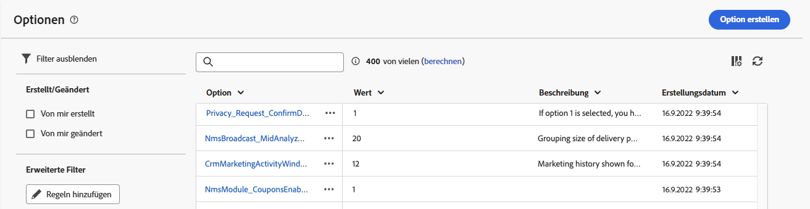
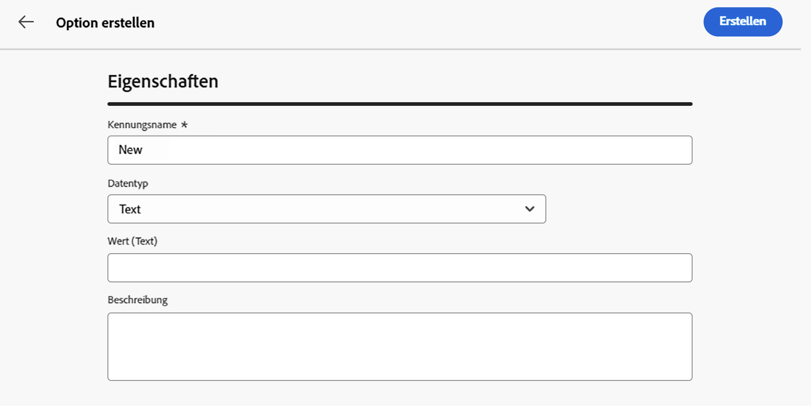
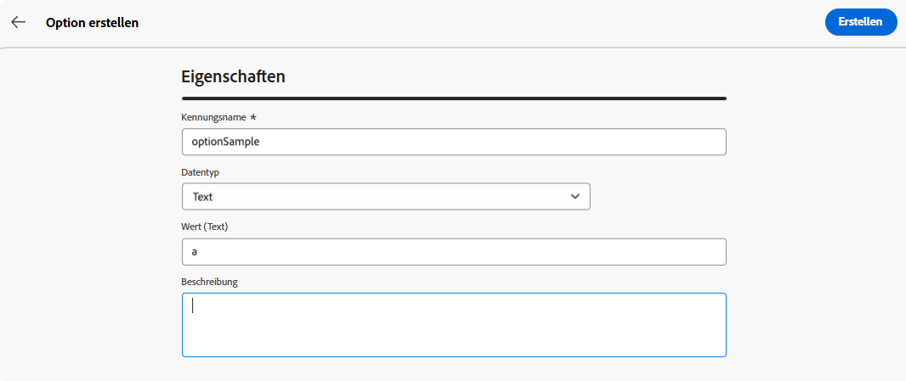
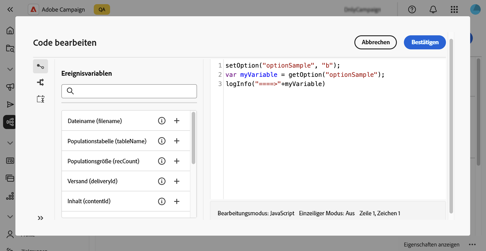
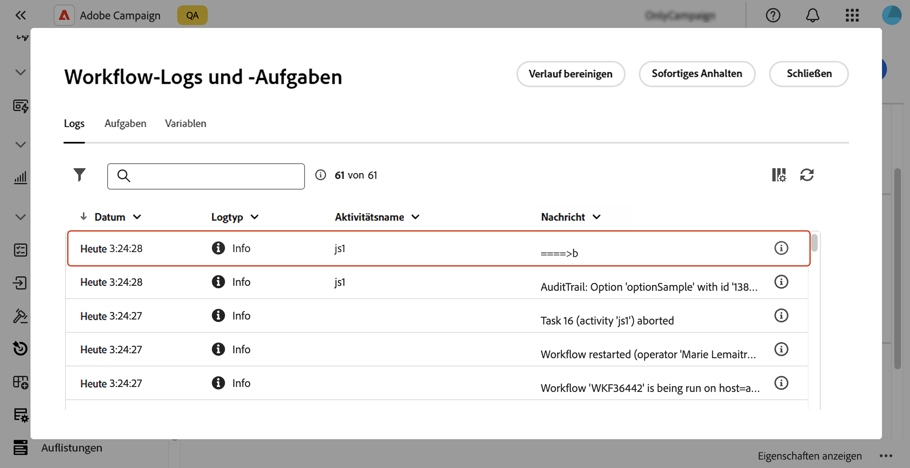
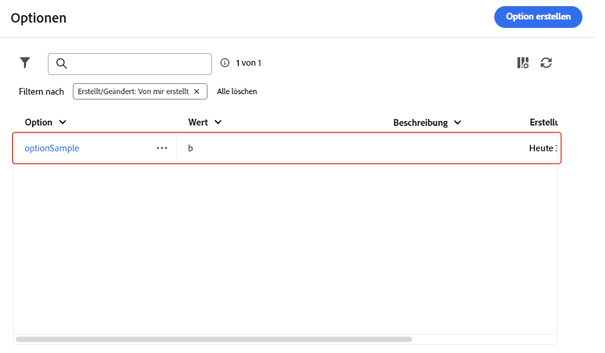

# [!DNL Campaign] konfigurieren {#options}

>[!CONTEXTUALHELP]
>id="acw_homepage_welcome_rn4"
>title="Erstellen benutzerdefinierter Optionen"
>abstract="Sie können jetzt eigene technische benutzerdefinierte Optionen erstellen, die Ihren Anforderungen entsprechen. Dies ist besonders bei der Arbeit mit Workflow-Aktivitäten vom Typ **JavaScript** Code&#39; nützlich, um Zwischendaten zu speichern."
>additional-url="https://experienceleague.adobe.com/docs/campaign-web/v8/release-notes/release-notes.html?lang=de" text="Siehe Versionshinweise"

>[!CONTEXTUALHELP]
>id="acw_options_list"
>title="Optionen"
>abstract="Optionen"

>[!CONTEXTUALHELP]
>id="acw_options_create"
>title="Option „Erstellen“"
>abstract="Option „Erstellen“"

Adobe Campaign Web verfügt über technische Optionen, mit denen Sie die Anwendung spezifischer konfigurieren können. Einige dieser Optionen sind integriert, während andere bei Bedarf manuell hinzugefügt werden können.

>[!IMPORTANT]
>
>Integrierte Optionen sind vorkonfiguriert und sollten nur von erfahrenen Benutzern geändert werden. Wenn Sie Fragen oder Wünsche haben, wenden Sie sich an Ihren Adobe-Ansprechpartner.

## Zugriff auf Campaign-Optionen {#access}

Optionen sind im Menü **[!UICONTROL Administration]** / **[!UICONTROL Optionen]** verfügbar. Verwenden Sie den Filterbereich, um die Liste einzugrenzen und schnell die benötigte Option zu finden.

>[!NOTE]
>
>Obwohl sich die Position des Menüs „Optionen“ zwischen der Adobe Campaign-Konsole und der Web-Benutzeroberfläche unterscheidet, ist die Liste identisch und funktioniert wie eine Spiegelung. Weitere Informationen zu den verfügbaren Optionen finden Sie in der Optionsliste in der [ zu Campaign v7](https://experienceleague.adobe.com/de/docs/campaign-classic/using/installing-campaign-classic/appendices/configuring-campaign-options){target="_blank"}

In der Optionsliste haben Sie folgende Möglichkeiten:

* **Option duplizieren oder löschen**: Klicken Sie auf die Schaltfläche mit den Auslassungspunkten und wählen Sie die gewünschte Aktion aus.
* **Option ändern**: Klicken Sie auf den Namen der Option, um ihre Eigenschaften zu öffnen. Nehmen Sie Ihre Änderungen vor und speichern Sie.
* **Benutzerdefinierte Option erstellen**: Klicken Sie auf die Schaltfläche **[!UICONTROL Option erstellen]**.

## Erstellen einer Option {#create}

Die Web-Benutzeroberfläche von Adobe Campaign ermöglicht es Ihnen, Ihre eigenen benutzerdefinierten Optionen entsprechend Ihren Anforderungen zu erstellen. Dies ist besonders bei der Arbeit mit Workflow-Aktivitäten vom Typ **[!UICONTROL JavaScript]** Code&#39; nützlich, um Zwischendaten zu speichern.

So erstellen Sie eine Option:

1. Öffnen Sie die Optionsliste und klicken Sie auf **[!UICONTROL Option erstellen]**.
1. Geben Sie einen Namen für die Option ein, wählen Sie ihren Typ aus und legen Sie den gewünschten Wert fest.
1. Klicken Sie **[!UICONTROL Erstellen]**, um die Option zu erstellen.

   

Optionen können als temporärer Speicherplatz für Daten dienen und die folgenden Vorteile bieten:

* Eingegebene Werte: Optionen unterstützen bestimmte Datentypen, z. B. Datumsangaben, Ganzzahlen, Zeichenfolgen usw.
* Flexibel: Mit diesen Optionen können Benutzer Daten effizient speichern und abrufen, ohne den Verwaltungsaufwand für Datenbanktabellen zu verursachen.

Im folgenden Beispiel erstellen wir eine benutzerdefinierte Option namens `sampleOption` mit dem Anfangswert „a“. Eine Aktivität vom Typ **[!UICONTROL JavaScript]** Code&#39; in einem Workflow ändert den Wert dieser Option und speichert sie in einer Variablen. Der aktualisierte Wert wird in den Workflow-Protokollen angezeigt und im Menü **[!UICONTROL Optionen]** angezeigt.

1. Erstellen Sie die Option .

   

1. Konfigurieren Sie eine **[!UICONTROL JavaScript-Code]**-Aktivität und starten Sie den Workflow.

   

1. Führen Sie den Workflow aus, um den aktualisierten Wert in den Workflow-Protokollen anzuzeigen.

   

1. Der aktualisierte Wert ist jetzt im Menü **[!UICONTROL Optionen]** sichtbar.

   
