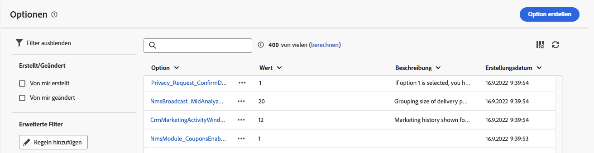
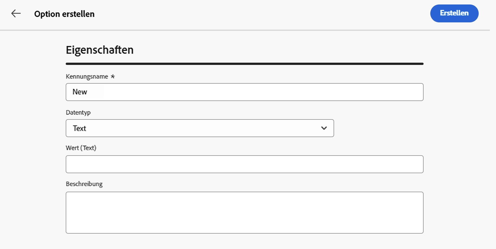
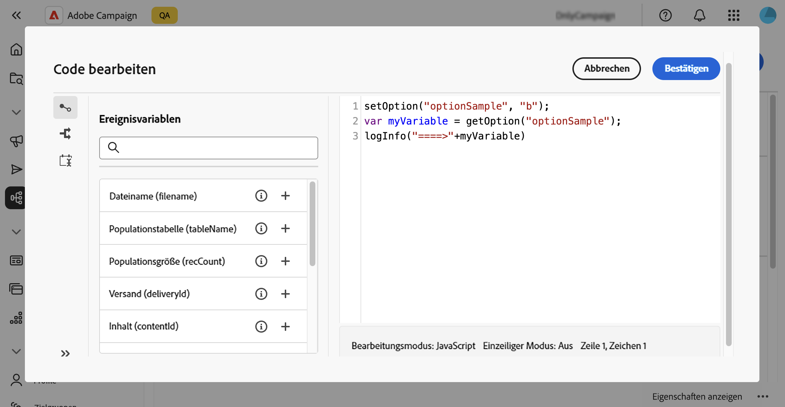
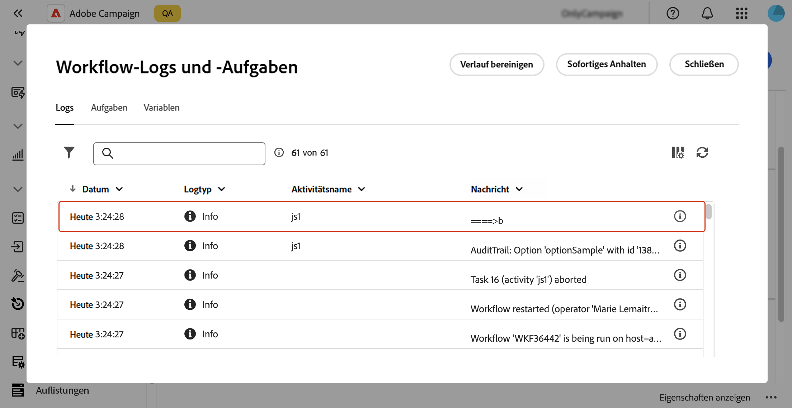
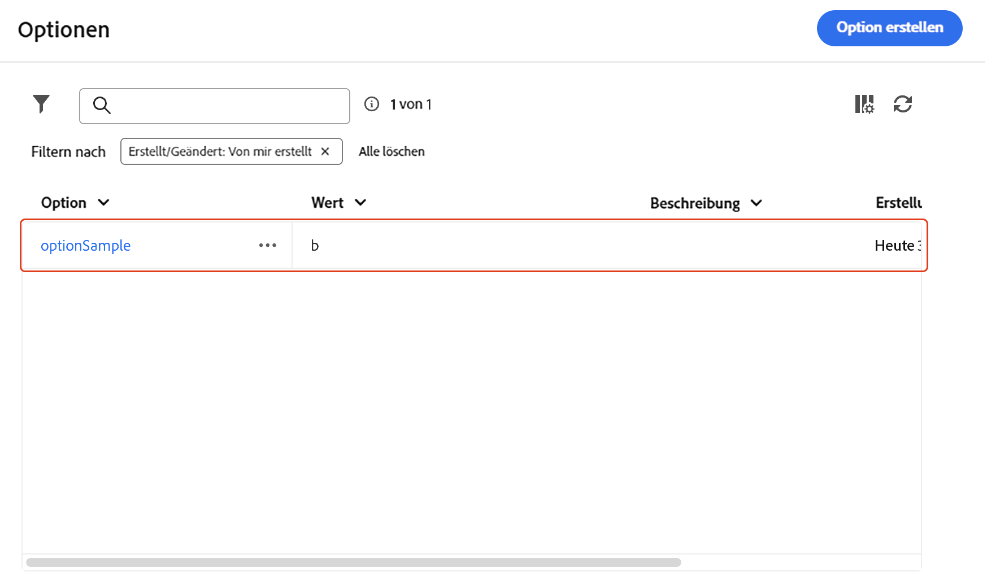
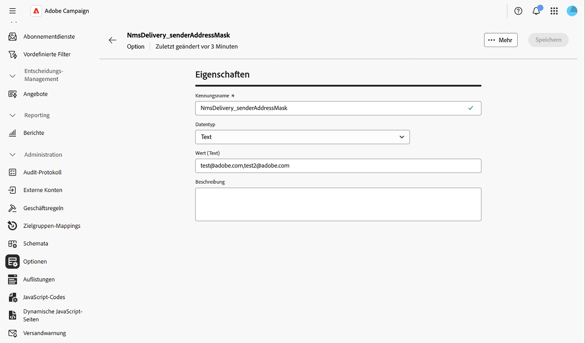
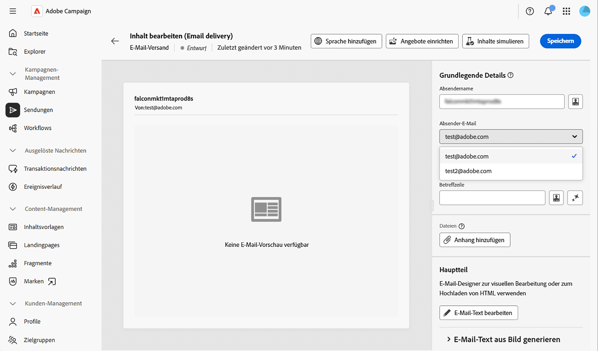

# Konfigurieren von Optionen in [!DNL Campaign] {#options}

>[!CONTEXTUALHELP]
>id="acw_options_list"
>title="Optionen"
>abstract="Optionen"

>[!CONTEXTUALHELP]
>id="acw_options_create"
>title="Option „Erstellen“"
>abstract="Option „Erstellen“"

Adobe Campaign Web verfügt über technische Optionen, mit denen Sie die Anwendung genauer konfigurieren können. Einige dieser Optionen sind schon integriert, während andere bei Bedarf manuell hinzugefügt werden können.

>[!IMPORTANT]
>Die integrierten Optionen sind vorkonfiguriert und sollten nur von erfahrenen Benutzenden geändert werden. Wenden Sie sich bei Fragen oder Wünschen an den Adobe-Support.

## Zugriff auf Campaign-Optionen {#access}

Optionen sind im Menü **[!UICONTROL Administration]** > **[!UICONTROL Optionen]** verfügbar. Verwenden Sie den Filterbereich, um die Liste einzugrenzen und schnell die benötigte Option zu finden.

\
[Optionsliste, die im Menü „Administration“ > „Optionen“ angezeigt wird]

>[!NOTE]
>Obwohl die Position des Menüs „Optionen“ in der Adobe Campaign-Konsole im Vergleich zur Web-Benutzeroberfläche abweicht, ist die Liste identisch und agiert wie ein Spiegel. Weitere Informationen zu den verfügbaren Optionen finden Sie in der Optionsliste in der [Dokumentation zu Campaign v7](https://experienceleague.adobe.com/de/docs/campaign-classic/using/installing-campaign-classic/appendices/configuring-campaign-options){target="_blank"}.

Über die Optionsliste haben Sie folgende Möglichkeiten:

* **Option duplizieren oder löschen**: Klicken Sie auf die Schaltfläche mit den Auslassungspunkten und wählen Sie die gewünschte Aktion aus.
* **Option ändern**: Klicken Sie auf den Namen der Option, um ihre Eigenschaften zu öffnen. Nehmen Sie Ihre Änderungen vor und speichern Sie sie.
* **Benutzerdefinierte Option erstellen**: Klicken Sie auf die Schaltfläche **[!UICONTROL Option erstellen]**.

## Erstellen einer Option {#create}

Die Adobe Campaign Web-Benutzeroberfläche ermöglicht es Ihnen, benutzerdefinierte Optionen für Ihre Anforderungen zu erstellen. Dies ist besonders nützlich, wenn Sie mit Workflow-Aktivitäten arbeiten, die **[!UICONTROL JavaScript-Code]** verwenden, um Zwischenergebnisse zu speichern.

So erstellen Sie eine Option:

1. Greifen Sie auf die Optionsliste zu und klicken Sie auf **[!UICONTROL Option erstellen]**.
1. Geben Sie einen Namen für die Option ein, wählen Sie ihren Typ aus und legen Sie den gewünschten Wert fest.
1. Klicken Sie auf **[!UICONTROL Erstellen]**, um die Option zu erstellen.

Optionen können als temporärer Speicherplatz für Daten dienen und bieten die folgenden Vorteile:

* Eingegebene Werte: Optionen unterstützen bestimmte Datentypen, z. B. Datumsangaben, Ganzzahlen, Strings usw.
* Flexibilität: Mit Optionen können die Benutzenden Daten effizient speichern und abrufen, ohne Datenbanktabellen aufwändig verwalten zu müssen.

Im folgenden Beispiel wird eine benutzerdefinierte Option namens `sampleOption` mit dem Anfangswert „a“ erstellt. Die Aktivität **[!UICONTROL JavaScript-Code]** in einem Workflow ändert den Wert dieser Option und speichert ihn in einer Variablen. Der aktualisierte Wert wird in den Workflow-Protokollen angezeigt und im Menü **[!UICONTROL Optionen]** angezeigt.

1. Erstellen Sie die Option.

   

1. Konfigurieren Sie eine Aktivität **[!UICONTROL JavaScript-Code]** und starten Sie den Workflow.

   

1. Führen Sie den Workflow aus, um den aktualisierten Wert in den Workflow-Protokollen anzuzeigen.

   

1. Der aktualisierte Wert ist jetzt im Menü **[!UICONTROL Optionen]** sichtbar.

   

## Einschränken der E-Mail-Adresse der Absenderin bzw. des Absenders für Sendungen {#restrict-sender-address}

Marketing-Fachleute können standardmäßig eine beliebige Adresse in das Feld **[!UICONTROL Absender-E-Mail]** eines E-Mail-Versands eingeben. Um dieses Feld auf eine vordefinierte Liste von Adressen zu beschränken, erstellen oder bearbeiten Sie die integrierte Option `NmsDelivery_senderAddressMask` und legen Sie ihren Wert auf eine kommagetrennte Liste der zulässigen Absenderadressen fest, z. B. `abc@adobe.com,bcd@adobe.com`.

Sobald diese Option einen Wert hat, wird das Feld **[!UICONTROL Absender-E-Mail]** zu einer Dropdown-Liste anstelle eines Freitextfelds, die nur diese Adressen enthält. Wenn die Option nicht vorhanden ist oder ihr Wert leer ist, bleibt das Feld wie zuvor ein Freitextfeld.

Dies ist eine globale Einschränkung. Sie gilt für jede Marke und jede Versandvorlage. Es werden keine Personalisierungsfelder unterstützt, sondern nur statische Adressen.

Weitere Informationen zum Feld **[!UICONTROL Absender-E-Mail]** finden Sie unter [Konfigurieren des E-Mail-Inhalts](../email/edit-content.md#edit-content).
