# Pläne und Programme {#plan-and-programs}

Adobe Campaign ermöglicht Ihnen das Konfigurieren Ihrer Ordnerhierarchie für Marketing-Pläne und -Programme.

Um diese Komponenten besser zu organisieren, empfiehlt Adobe die folgende Hierarchie: Plan `>` Programme `>` Kampagnen.

* Ein **Plan** kann mehrere Programme enthalten. Er definiert strategische Ziele für einen bestimmten Zeitraum.
* Ein **Programm** kann sowohl weitere Programme als auch Kampagnen, Workflows und Landingpages enthalten.
* Eine **Kampagne** kann Sendungen, Workflows und Landingpages enthalten.

## Erstellen und Konfigurieren eines Plans {#create-plan}

Um einen Plan zu erstellen, erstellen Sie einen Ordner mit dem Ordnertyp **[!UICONTROL Plan]**. [Weitere Informationen zum Erstellen eines Ordners](../get-started/work-with-folders.md)

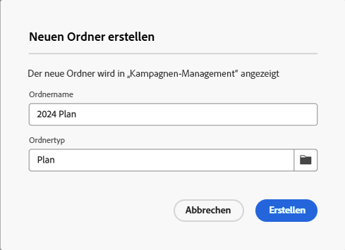{zoomable="yes"}

Navigieren Sie zu den **[!UICONTROL Ordnereinstellungen]** Ihres Plans, um ihn zu verwalten.

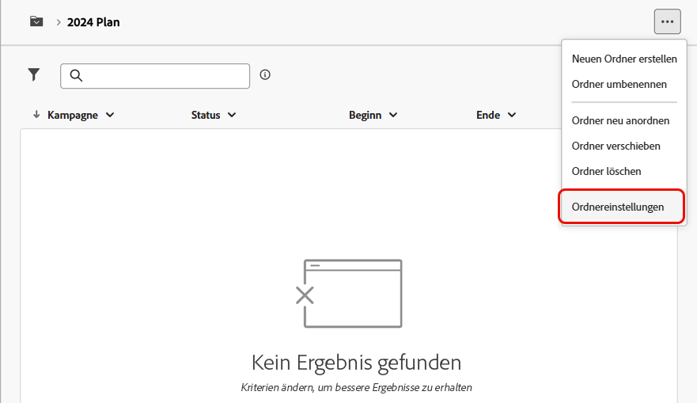{zoomable="yes"}

Sie können **[!UICONTROL benutzerdefinierte Optionen]** definieren und das Planungsdatum für Ihren Plan festlegen.

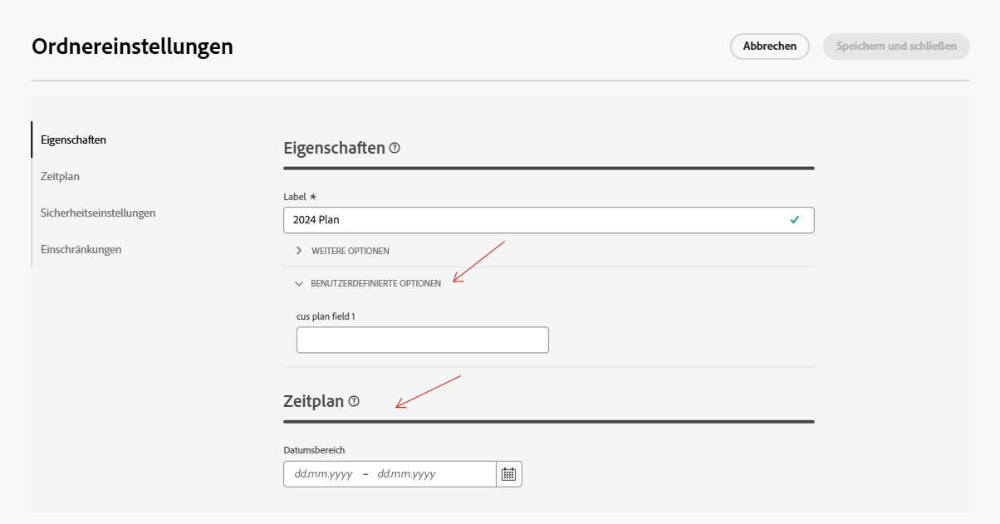{zoomable="yes"}

So verwalten Sie die **[!UICONTROL benutzerdefinierten Optionen]**:

1. Navigieren Sie zu den **[!UICONTROL Schemata]**.
1. Wählen Sie mit den Filtern die **[!UICONTROL bearbeitbaren]** Schemata aus.
1. Klicken Sie auf das Schema.

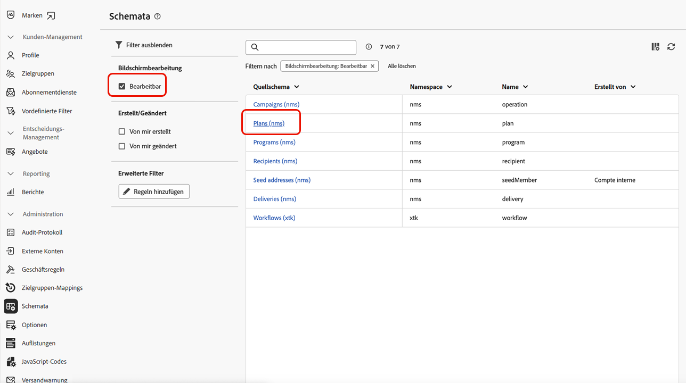{zoomable="yes"}

1. Klicken Sie auf die Schaltfläche **[!UICONTROL Bildschirmbearbeitung]**.

   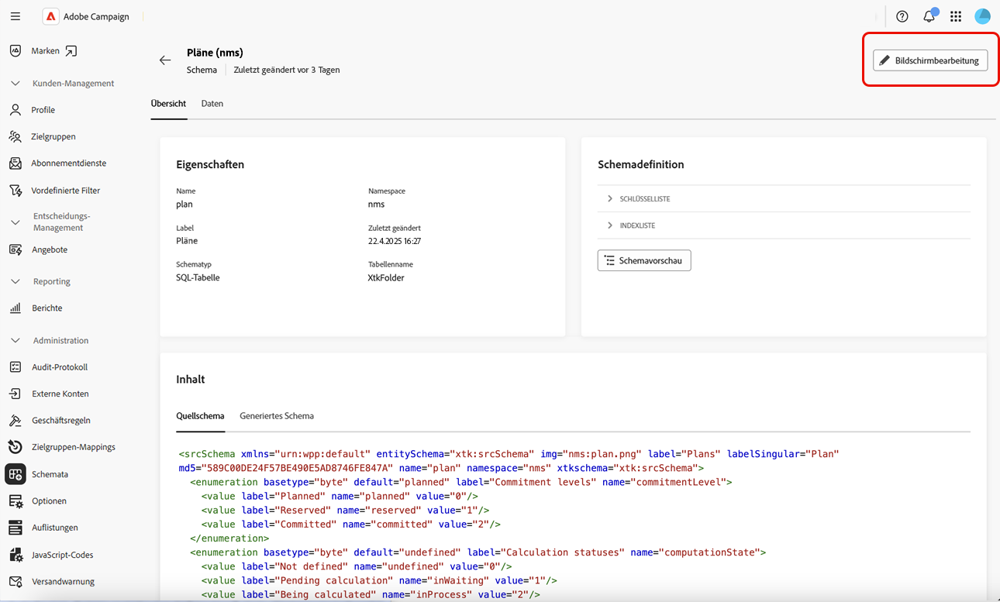{zoomable="yes"}

Konfigurieren Sie die benutzerdefinierten Optionen:

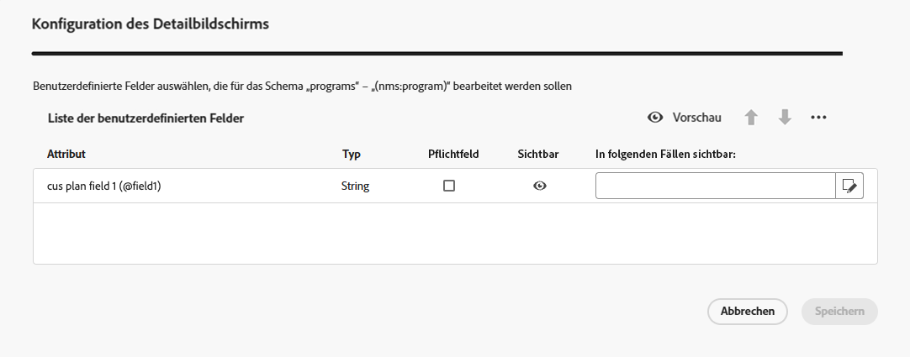{zoomable="yes"}

## Erstellen und Konfigurieren eines Programms {#create-program}

Programme sind im linken Navigationsmenü verfügbar, ähnlich wie die Listenansichten für Kampagnen, Sendungen und Workflows. Mit **[!UICONTROL Eintrag]** Programme“ können Sie ein Programm innerhalb eines vorhandenen Programms und nicht unter einem Plan erstellen.

Um Ihr erstes Programm auf oberster Ebene in einem Plan zu erstellen, navigieren Sie im Explorer zu Ihrem Plan (siehe [Abschnitt](#create-plan)) und erstellen Sie einen Ordner mit dem Ordnertyp **[!UICONTROL Programm]**. [Erfahren Sie mehr zum Erstellen eines Ordners](../get-started/work-with-folders.md).

Gehen Sie wie folgt vor, um ein Programm innerhalb eines vorhandenen Programms zu erstellen:

1. Navigieren Sie im linken Navigationsmenü zum **[!UICONTROL Programme]**-Eintrag. In dieser Ansicht werden alle Ihre Programme aufgelistet und Sie können sie suchen und filtern. Wenn Sie auf ein Programm klicken, wird es in der Explorer-Ansicht geöffnet.

   {zoomable="yes"}

1. Klicken Sie **[!UICONTROL Programm erstellen]** und konfigurieren Sie die folgenden Optionen:

   {zoomable="yes"}

   * Geben Sie einen **[!UICONTROL Titel]** ein.
   * Wählen Sie das vorhandene Programm aus, das als **[!UICONTROL übergeordneten Ordner“ verwendet]** soll.
   * Optional können Sie einen **[!UICONTROL Datumsbereich]** im Abschnitt **[!UICONTROL Zeitplan]** festlegen.

   >[!TIP]
   >
   >Wenn Sie ein Programm über die Explorer -Ansicht erstellen, wird der übergeordnete Ordner automatisch auf das aktuelle Programm festgelegt.

1. Klicken Sie **[!UICONTROL erneut auf]** Programm erstellen“, um die Änderungen zu speichern und das Programm zu erstellen. Das Programm wird dann in der Explorer-Ansicht angezeigt. Sie können ihn wie jeden anderen Ordner umbenennen, löschen und auf seine Einstellungen zugreifen. Sie können in diesem Programm auch Unterprogramme erstellen.

   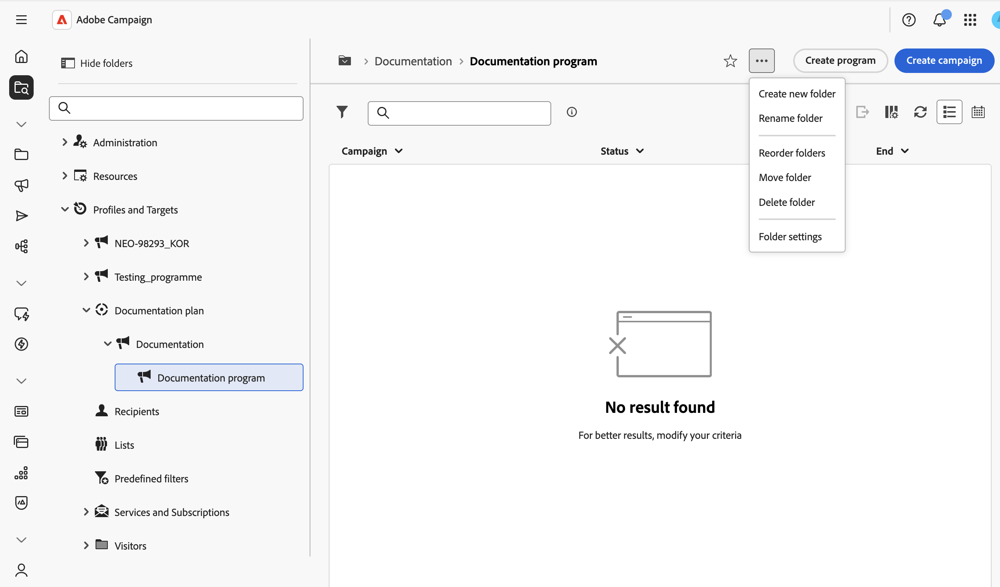{zoomable="yes"}

Benutzerdefinierte Optionen für ein Programm werden auf die gleiche Weise konfiguriert wie für einen Plan. Siehe [Erstellen und Konfigurieren eines Plans](#create-plan).

## Verknüpfen einer Kampagne mit einem Programm

Sie haben zwei Möglichkeiten, eine Kampagne mit einem Programm zu verknüpfen:

### Möglichkeit 1: Sie verfügen bereits über ein Programm und möchten eine damit verknüpfte Kampagne erstellen.

Um eine neue Kampagne mit Ihrem Programm zu verknüpfen, erstellen Sie die Kampagne direkt im Programm:

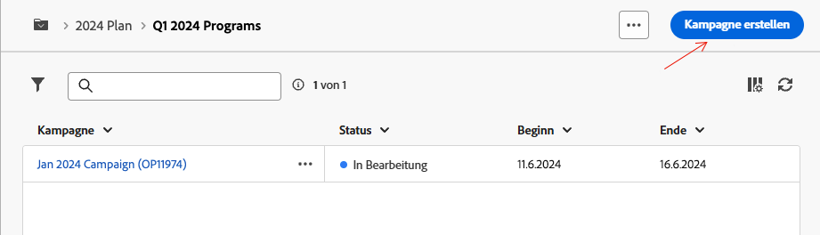{zoomable="yes"}

Die **[!UICONTROL Ordnereinstellungen]** werden automatisch mit dem Pfad zu Ihrem Programm aufgefüllt.

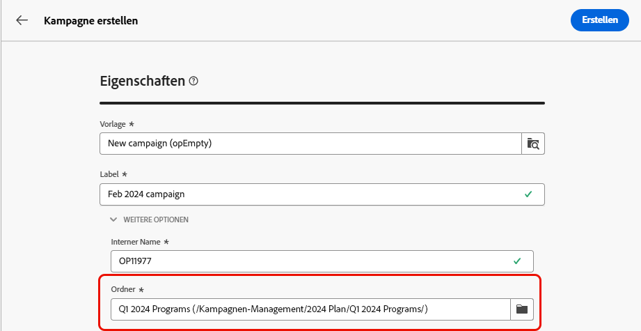{zoomable="yes"}

### Möglichkeit 2: Sie verfügen bereits über eine bestehende Kampagne und möchten sie mit einem vorhandenen Programm verknüpfen.

Navigieren Sie zur Schaltfläche **[!UICONTROL Einstellungen]** der Kampagne, die Sie mit Ihrem Programm verknüpfen möchten:

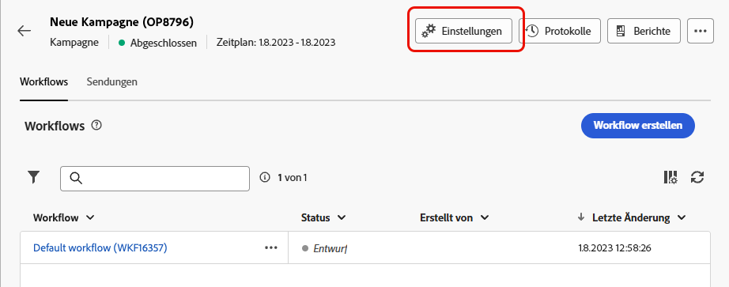{zoomable="yes"}

Klicken Sie in ihren **[!UICONTROL Eigenschaften]** auf das Symbol **[!UICONTROL Ordner]** unter den **[!UICONTROL Ordnereinstellungen]**, um Ihren **[!UICONTROL Programmordner]** zu wählen.

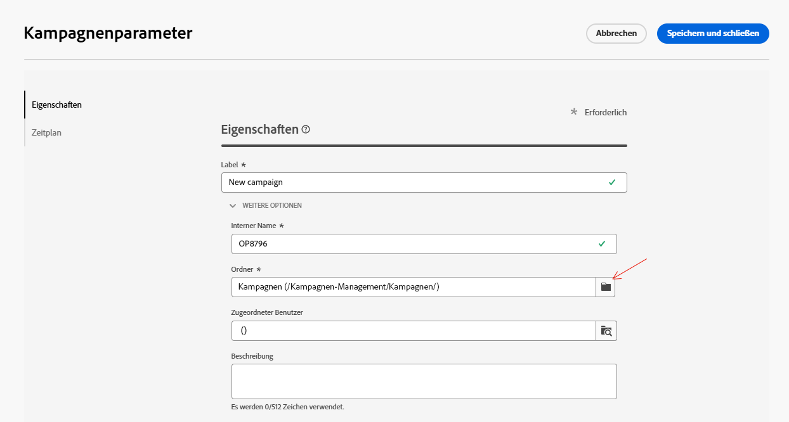{zoomable="yes"}

Wählen Sie Ihren **[!UICONTROL Programmordner]** aus, klicken Sie auf die Schaltfläche **[!UICONTROL Bestätigen]** und dann auf die Schaltfläche **[!UICONTROL Speichern und schließen]**.

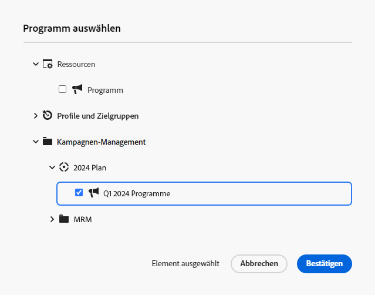{zoomable="yes"}

Ihre Kampagne wird jetzt in Ihrem Programm aufgeführt.

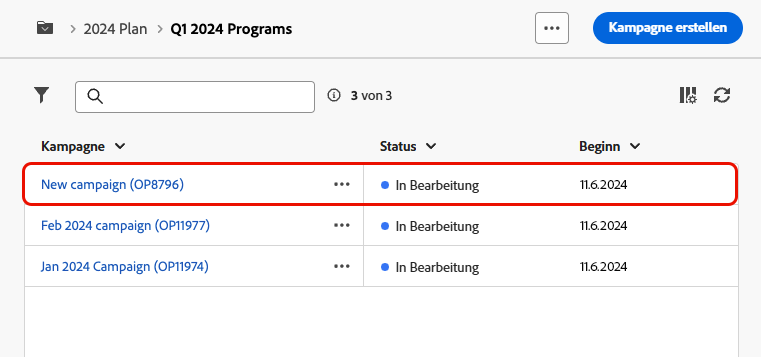{zoomable="yes"}