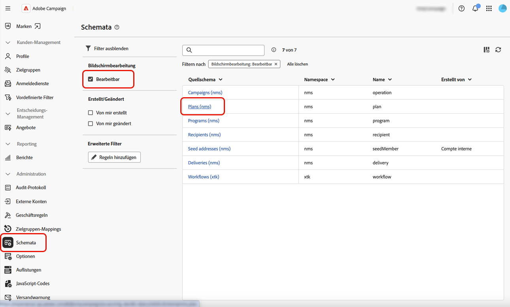
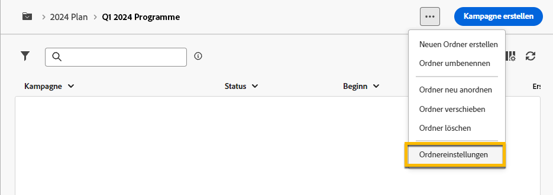
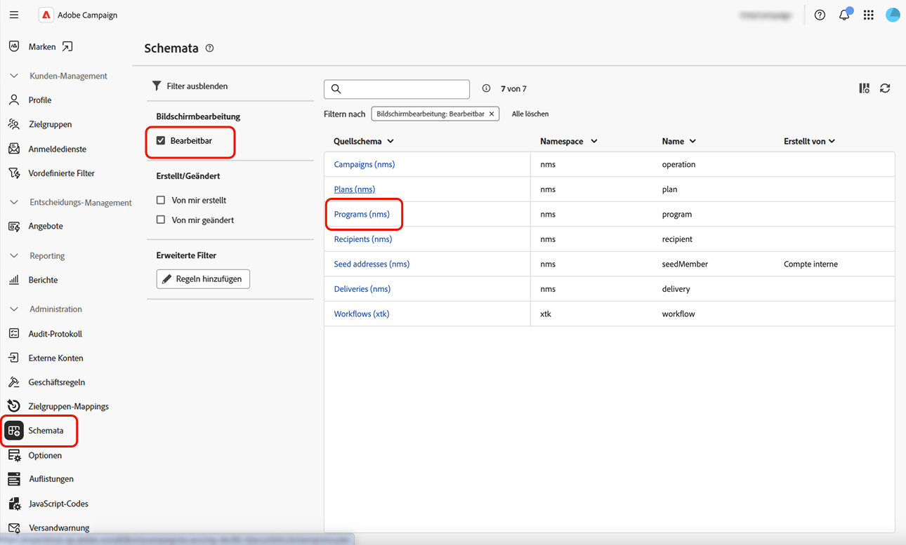
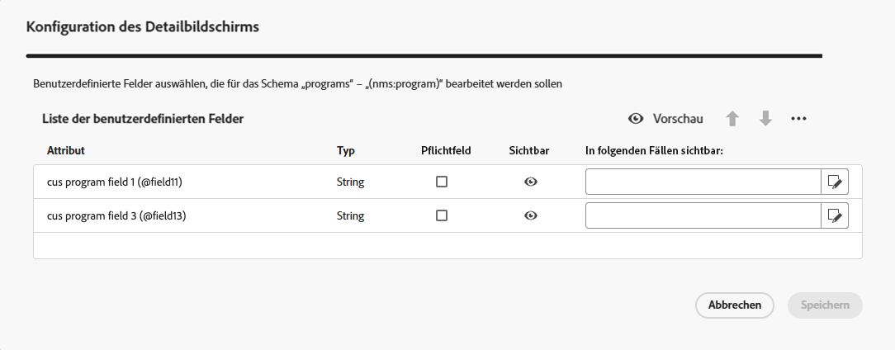
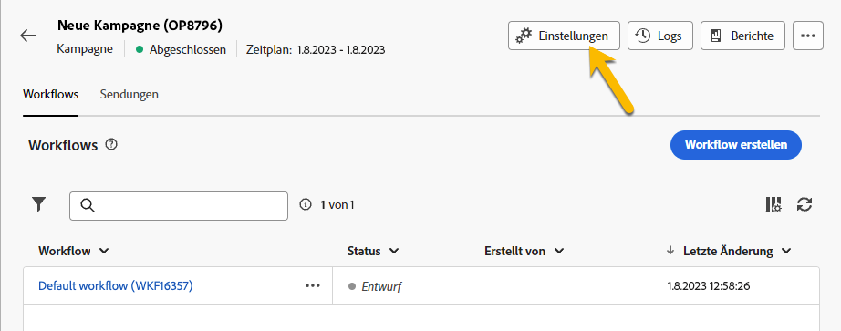

# Pläne und Programme {#plan-and-programs}

Adobe Campaign ermöglicht Ihnen das Konfigurieren Ihrer Ordnerhierarchie für Marketing-Pläne und -Programme.

Um diese Komponenten besser zu organisieren, empfiehlt Adobe die folgende Hierarchie: `>` planen `>` Kampagnen.

* Ein **Plan** kann mehrere Programme enthalten. Sie definiert strategische Ziele für einen bestimmten Zeitraum.
* Ein **Programm** kann andere Programme sowie Kampagnen, Workflows und Landingpages enthalten.
* Eine **Kampagne** kann Sendungen, Workflows und Landingpages enthalten.

## Erstellen und Konfigurieren eines Plans {#create-plan}

Um einen Plan zu erstellen, erstellen Sie einen Ordner mit dem Ordnertyp **[!UICONTROL Plan]**. [Weitere Informationen zum Erstellen eines Ordners](../get-started/work-with-folders.md)

{zoomable="yes"}

Navigieren Sie zu den **[!UICONTROL Ordnereinstellungen]** Ihres Plans, um ihn zu verwalten.

{zoomable="yes"}

Definieren Sie **[!UICONTROL Benutzerdefinierte Optionen]** und legen Sie das Planungsdatum Ihres Plans fest.

{zoomable="yes"}

So verwalten Sie die **[!UICONTROL benutzerdefinierten Optionen]**:

1. Navigieren Sie zu **[!UICONTROL Schemata]**.
1. Wählen Sie die **[!UICONTROL bearbeitbaren]** Schemata in den Filtern aus.
1. Klicken Sie auf **[!UICONTROL Symbol Benutzerdefinierte]** bearbeiten .

{zoomable="yes"}

Konfigurieren Sie die benutzerdefinierten Optionen:

{zoomable="yes"}

## Erstellen und Konfigurieren eines Programms

Um ein Programm in Ihrem Plan zu erstellen ([Weitere Informationen zum Erstellen eines Plans](#create-plan), navigieren Sie zu Ihrem Plan und erstellen Sie einen Ordner mit dem Ordnertyp **[!UICONTROL Programm]**. [Weitere Informationen zum Erstellen eines Ordners](../get-started/work-with-folders.md).

{zoomable="yes"}

Navigieren Sie zu den **[!UICONTROL Ordnereinstellungen]** Ihres Programms, um es zu verwalten.

{zoomable="yes"}

Definieren Sie **[!UICONTROL Benutzerdefinierte Optionen]** und legen Sie das Planungsdatum Ihres Programms fest.

{zoomable="yes"}

So verwalten Sie die **[!UICONTROL benutzerdefinierten Optionen]**:

1. Navigieren Sie zu **[!UICONTROL Schemata]**.
1. Wählen Sie die **[!UICONTROL bearbeitbaren]** Schemata in den Filtern aus.
1. Klicken Sie auf **[!UICONTROL Symbol Benutzerdefinierte]** bearbeiten .

{zoomable="yes"}

Konfigurieren Sie die benutzerdefinierten Optionen:

{zoomable="yes"}

## Verknüpfen einer Kampagne mit einem Programm

Sie haben zwei Möglichkeiten, eine Kampagne mit einem Programm zu verknüpfen:

### Möglichkeit 1: Sie verfügen bereits über ein Programm und möchten eine damit verknüpfte Kampagne erstellen.

Um eine neue Kampagne mit Ihrem Programm zu verknüpfen, erstellen Sie die Kampagne direkt im Programm.

{zoomable="yes"}

Die **[!UICONTROL Ordner]**-Einstellungen werden automatisch mit dem Pfad zu Ihrem Programm aufgefüllt.

{zoomable="yes"}

### Möglichkeit 2: Sie verfügen bereits über eine bestehende Kampagne und möchten sie mit einem vorhandenen Programm verknüpfen.

Klicken Sie auf die **[!UICONTROL Einstellungen]** der Kampagne, die Sie mit Ihrem Programm verknüpfen möchten.

{zoomable="yes"}

Klicken Sie in **[!UICONTROL Eigenschaften]** auf das Symbol **[!UICONTROL Ordner]** in den **[!UICONTROL Ordner]**-Einstellungen, um Ihren Ordner **[!UICONTROL Programm]** auszuwählen.

{zoomable="yes"}

Wählen Sie **[!UICONTROL Ordner]** Programm“ aus, klicken Sie auf die Schaltfläche **[!UICONTROL Bestätigen]** und klicken Sie anschließend auf die Schaltfläche **[!UICONTROL Speichern und schließen]**.

{zoomable="yes"}

Ihre Kampagne ist jetzt in Ihrem Programm aufgeführt.

{zoomable="yes"}