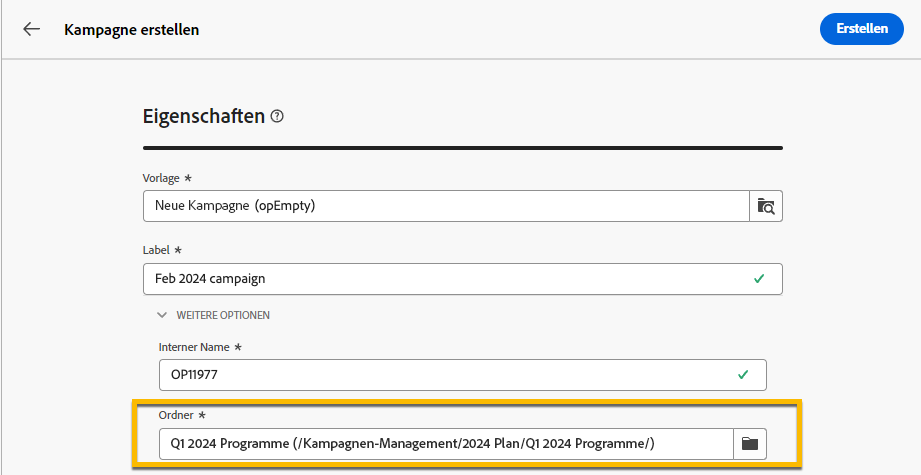

# Pläne und Programme

Mit Adobe Campaign können Sie Ihre Ordnerhierarchie für Marketingpläne und -programme konfigurieren.

Um sie besser zu organisieren, empfiehlt Adobe die folgende Hierarchie: Planen `>` Programme `>` Kampagnen

* A **plan** kann mehrere Programme enthalten. Sie definiert strategische Ziele für einen bestimmten Zeitraum.
* A **program** kann andere Programme sowie Kampagnen, Workflows und Landingpages enthalten.
* A **Kampagne** kann Sendungen, Workflows und Landingpages enthalten.

## Erstellen und Konfigurieren eines Plans {#create-plan}

Um einen Plan zu erstellen, müssen Sie einen Ordner mit dem Ordnertyp erstellen **[!UICONTROL Plan]** [Erfahren Sie mehr über das Erstellen eines Ordners](create-manage-folder.md).

{zoomable="yes"}

Navigieren Sie zu **[!UICONTROL Ordnereinstellungen]** von Ihrem Plan, sie zu verwalten.

{zoomable="yes"}

Sie können **[!UICONTROL Benutzerdefinierte Optionen]**, um das Planungsdatum Ihres Plans festzulegen.

{zoomable="yes"}

So verwalten Sie  **[!UICONTROL Benutzerdefinierte Optionen]**:

1. Navigieren Sie zum **[!UICONTROL Schemas]**
1. Wählen Sie die **[!UICONTROL Bearbeitbar]** Schemata in den Filtern
1. Klicken Sie auf das Symbol von **[!UICONTROL Bearbeiten benutzerdefinierter Details]**

{zoomable="yes"}

Sie können sie konfigurieren:

{zoomable="yes"}

## Programm erstellen und konfigurieren

So erstellen Sie ein Programm in Ihrem Plan ([Erfahren Sie mehr über die Erstellung eines Plans](#create-plan)), müssen Sie sich in Ihrem Plan befinden und einen Ordner mit dem Ordnertyp erstellen **[!UICONTROL Programm]** [Erfahren Sie mehr über das Erstellen eines Ordners](create-manage-folder.md).

{zoomable="yes"}

Navigieren Sie zu **[!UICONTROL Ordnereinstellungen]** von Ihrem Programm, um es zu verwalten.

{zoomable="yes"}

Sie können **[!UICONTROL Benutzerdefinierte Optionen]**, um das Planungsdatum Ihres Programms festzulegen.

{zoomable="yes"}

So verwalten Sie  **[!UICONTROL Benutzerdefinierte Optionen]**:

1. Navigieren Sie zum **[!UICONTROL Schemas]**
1. Wählen Sie die **[!UICONTROL Bearbeitbar]** Schemata in den Filtern
1. Klicken Sie auf das Symbol von **[!UICONTROL Bearbeiten benutzerdefinierter Details]**

{zoomable="yes"}

Sie können sie konfigurieren:

{zoomable="yes"}

## Verknüpfen einer Kampagne mit einem Programm

Sie haben zwei Möglichkeiten, eine Kampagne mit einem Programm zu verknüpfen:

### 1. Weg : Sie haben bereits ein Programm und möchten eine damit verknüpfte Kampagne erstellen

Um eine neue Kampagne mit Ihrem Programm zu verknüpfen, erstellen Sie direkt eine Kampagne im Programm :

{zoomable="yes"}

Die **[!UICONTROL Ordner]** -Einstellungen werden automatisch mit dem Pfad zu Ihrem Programm abgelegt.

{zoomable="yes"}

### 2. Weg : Sie haben bereits eine bestehende Kampagne, die mit einem vorhandenen Programm verknüpft werden soll

Navigieren Sie zu **[!UICONTROL Einstellungen]** Schaltfläche der Kampagne, die Sie mit Ihrem Programm verknüpfen möchten:

{zoomable="yes"}

In **[!UICONTROL Eigenschaften]**, klicken Sie auf die **[!UICONTROL Ordner]** im **[!UICONTROL Ordner]** -Einstellungen, um Ihre **[!UICONTROL Programm]** Ordner.

{zoomable="yes"}

Wählen Sie **[!UICONTROL Programm]** Ordner und klicken Sie auf **[!UICONTROL Bestätigen]** Schaltfläche und dann auf **[!UICONTROL Speichern und schließen]** Schaltfläche.

{zoomable="yes"}

Ihre Kampagne ist jetzt in Ihrem Programm aufgeführt:

{zoomable="yes"}