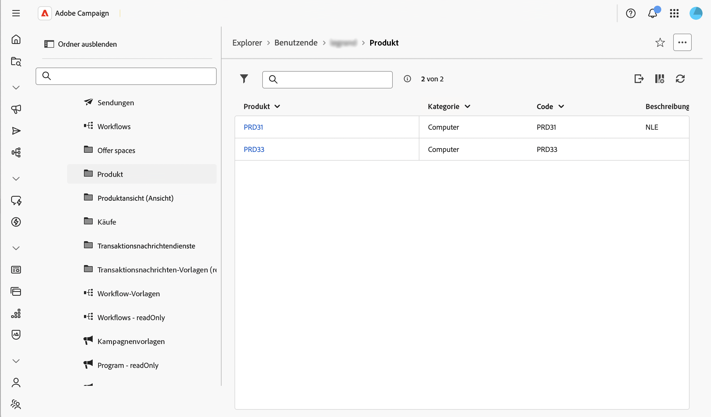
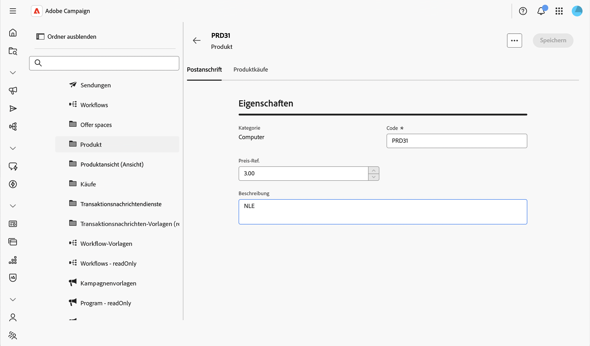

# Steuerungsaktionen auf Daten {#action-data}

>[!CONTEXTUALHELP]
>id="acw_schema_action_data"
>title="Aktionsdaten"
>abstract="Konfigurieren Sie die Aktionen, die für die Detaillisten- und Listenbildschirme des Schemas verfügbar sind. Aktivieren Sie **[!UICONTROL Schreibgeschützt]**, um den Detailbildschirm als schreibgeschützt festzulegen und Aktionen aus der Liste zu entfernen. Aktivieren Sie **[!UICONTROL Löschen nicht zulassen]** um die Löschaktion aus den Detaillisten- und Listenbildschirmen zu entfernen."

Im **[!UICONTROL Aktionsdaten]** können Sie die Aktionen einschränken, die für die Datensätze eines benutzerdefinierten Schemas verfügbar sind, unabhängig von den [Sicherheitsregeln](../get-started/work-with-folders.md) die für einzelne Ordner konfiguriert wurden. Diese Einschränkung gilt auf Schemaebene, in jedem Ordner, für jeden Benutzer, einschließlich Administratoren.

>[!NOTE]
>
>Dieser Abschnitt ist nur für benutzerdefinierte Schemata verfügbar.

Weitere Informationen zum Bildschirm „Bildschirmdefinition“ und zum Zugriff darauf finden Sie im Abschnitt [Zugreifen auf die Bildschirmdefinition](schemas-browse-access.md#screen-def).

Gehen Sie wie folgt vor, um Aktionsdaten zu konfigurieren:

1. Navigieren Sie zum Menü **[!UICONTROL Schemata]** und suchen Sie mithilfe der Filter nach bearbeitbaren Schemata.

1. Wählen Sie den Schemanamen in der Liste aus, um das Schema zu öffnen, und klicken Sie in der Ansicht der Schemadetails auf die Schaltfläche **[!UICONTROL Bildschirmbearbeitung]**, um die Bildschirmdefinition aufzurufen.

1. Scrollen Sie nach unten **[!UICONTROL Abschnitt]** Aktionsdaten“ unten in der Bildschirmdefinition.

   

1. Eine oder beide der verfügbaren Optionen auswählen:

   * **[!UICONTROL Schreibgeschützt]**: Der Detailbildschirm wird für alle Benutzer schreibgeschützt. In der Liste ist keine Aktion zum Erstellen, Duplizieren, Aktualisieren oder Löschen verfügbar und die Aktionen zum Löschen und Duplizieren werden im Detailbildschirm ausgeblendet. Die Auswahl dieser Option ähnelt der Konfiguration einer Ansicht: Benutzende können weiterhin Datensätze öffnen und wiederverwenden, z. B. wenn es um einen Versand geht, können sie jedoch nicht ändern.

   * **[!UICONTROL Löschen nicht zulassen]**: Die Löschaktion wird in jedem Ordner aus dem Detailbildschirm und aus der Liste entfernt. Andere Aktionen wie Erstellen, Duplizieren und Aktualisieren bleiben verfügbar.

     >[!NOTE]
     >
     >Bei Aktivierung **[!UICONTROL Schreibgeschützt]** wird das Löschen auch automatisch abgedeckt, sodass die Option **[!UICONTROL Löschen nicht zulassen]** deaktiviert ist, während **[!UICONTROL Schreibgeschützt]** ausgewählt ist.

1. Klicken Sie auf **[!UICONTROL Speichern]**.

1. Navigieren Sie zur Liste der Datensätze für dieses Schema, um das Ergebnis zu überprüfen.

   In diesem Beispiel ist **[!UICONTROL Schreibgeschützt]** aktiviert: Die Liste zeigt die Duplikat- und Löschaktionen nicht mehr an.

   

1. Öffnen Sie einen Datensatz, um den Detailbildschirm zu überprüfen. Die zugehörigen Felder werden angezeigt, ohne dass eine Bearbeitung zulässig ist.

   
