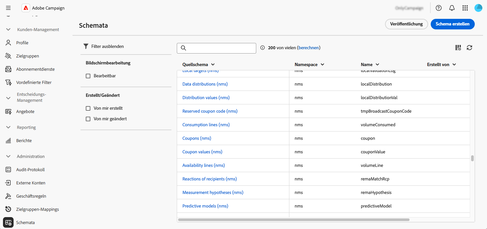
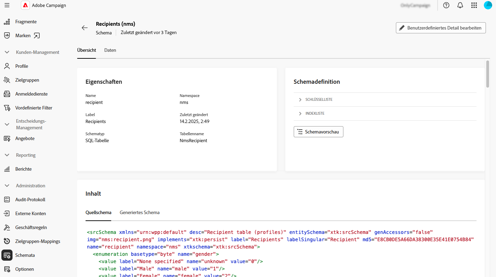
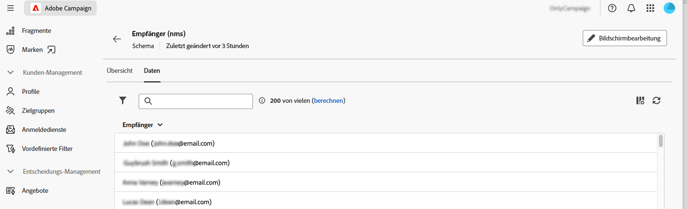
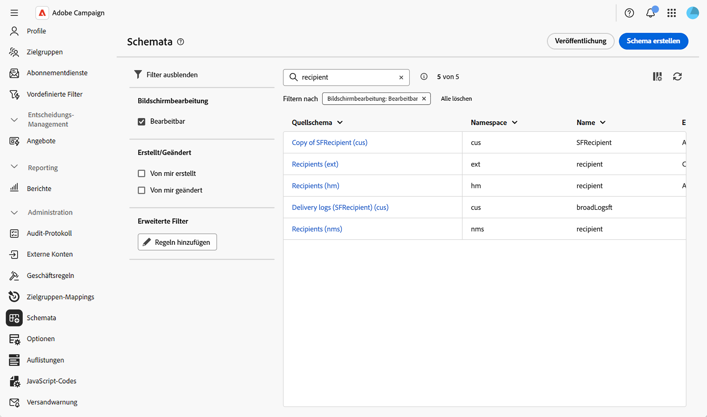
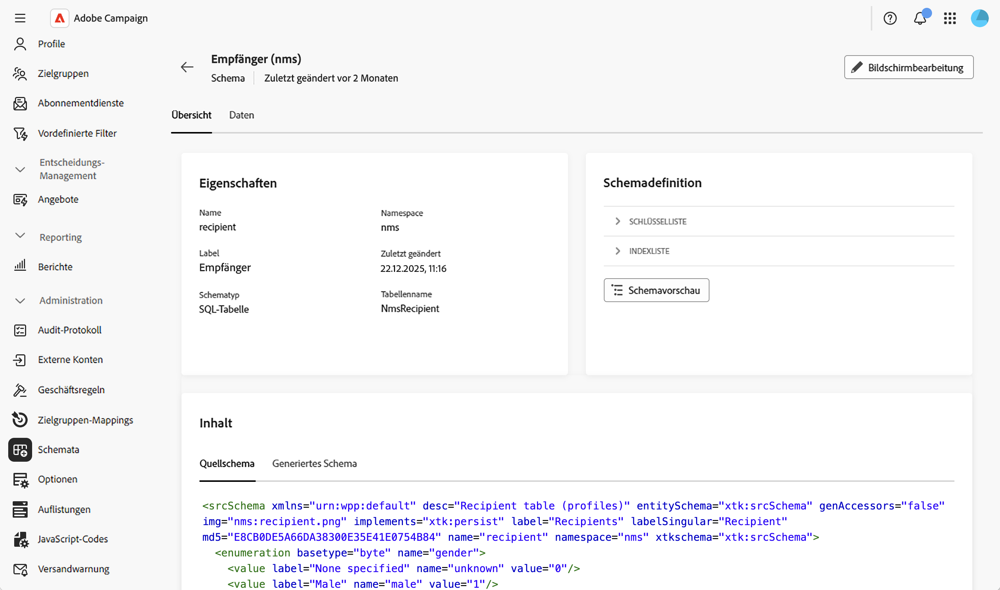
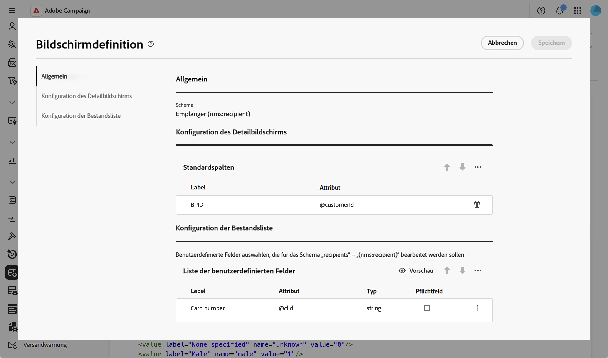

# Zugreifen auf und Konfigurieren von Schemata {#access}

Auf Schemata kann über das Menü **[!UICONTROL Administration]** > **[!UICONTROL Schemata]** zugegriffen werden.

Auf diesem Bildschirm können Sie alle vorhandenen Schemata anzeigen. Es stehen Filter zur Verfügung, mit denen Sie die Liste einschränken können, um beispielsweise nur bearbeitbare Schemata anzuzeigen.

Um ein Schema zu öffnen, wählen Sie seinen Namen aus. Eine detaillierte Schemaansicht wird angezeigt.

## Übersicht über das Schema {#overview}

Auf der Registerkarte **[!UICONTROL Übersicht]** finden Sie eine allgemeine Ansicht des Schemas:

* Im Abschnitt **[!UICONTROL Eigenschaften]** werden wichtige Informationen angezeigt, z. B. der Schemaname, der Namespace und der zugehörige Tabellenname.

* Der Abschnitt **[!UICONTROL Schemadefinition]** zeigt Details zur Schemadefinition an, z. B. den für die Datenabstimmung verwendeten Primärschlüssel und seine Verknüpfungen mit anderen Tabellen.

  Klicken Sie auf die Schaltfläche **[!UICONTROL Schemavorschau]**, um die verschiedenen Felder und Links anzuzeigen, aus denen das Schema besteht. Auf diese Weise können Sie die vollständige Struktur eines Schemas überprüfen. Wenn das Schema mit benutzerdefinierten Feldern erweitert wurde, können Sie alle Erweiterungen visualisieren.

* Im Abschnitt **[!UICONTROL Inhalt]** wird der XML-Inhalt des Schemas angezeigt, sodass Sie zwischen der Quelle und der generierten Syntax wechseln können.

## Schemadaten {#data}

Die Registerkarte **[!UICONTROL Daten]** enthält Informationen zu den Schemadaten.

## Bildschirmanzeige anpassen {#screen-def}

Mit der Bildschirmdefinition können Sie konfigurieren, wie Schemafelder in der Benutzeroberfläche angezeigt und bearbeitet werden. Sie können Standardspalten für Listenansichten konfigurieren, festlegen, welche benutzerdefinierten Felder in Detailbildschirmen angezeigt werden, Sammlungslisten hinzufügen, um zugehörige Daten anzuzeigen, und Felder in Abschnitte mit Trennzeichen und Sichtbarkeitskriterien organisieren.

So greifen Sie auf die Bildschirmdefinition zu:

1. Navigieren Sie zum Menü **[!UICONTROL Schemata]** und suchen Sie mithilfe der Filter nach bearbeitbaren Schemata.

   

1. Wählen Sie den Schemanamen in der Liste aus, um ihn zu öffnen, und klicken Sie in der Ansicht mit den Schemadetails auf **** Bildschirmbearbeitung“, um auf die Bildschirmdefinition zuzugreifen.

   

   Die verschiedenen Listen ermöglichen es Ihnen, Elemente mithilfe der Pfeilsymbole nach oben und unten neu anzuordnen oder sie per Drag-and-Drop abzulegen. Um Elemente zu entfernen, klicken Sie auf das Papierkorbsymbol in einer bestimmten Zeile oder wählen Sie **[!UICONTROL Alle löschen]** aus dem Symbol mit den Auslassungspunkten aus.

   

Über die Bildschirmdefinition können Sie folgende Aktionen durchführen:

* [Standardlistenspalten konfigurieren](schemas-list-columns.md) - Konfigurieren, welche Spalten in Listenansichten standardmäßig angezeigt werden.
* [Benutzerdefinierte Felder bearbeiten](schemas-custom-fields.md) - Konfigurieren Sie, welche benutzerdefinierten Felder auf Detailbildschirmen angezeigt werden, und organisieren Sie sie in Abschnitte.
* [Sammlungslisten hinzufügen](schemas-collection-lists.md) - Sammlungslisten hinzufügen, um verwandte Daten in Profilbildern anzuzeigen.
