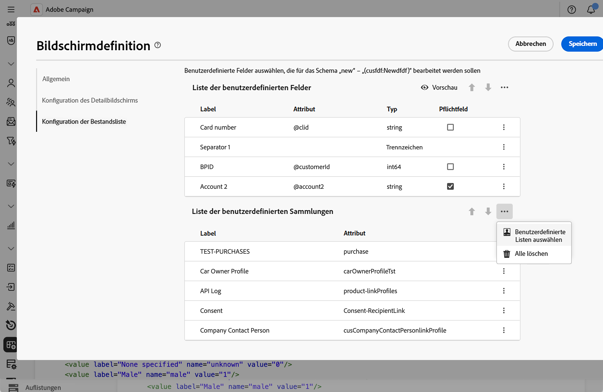
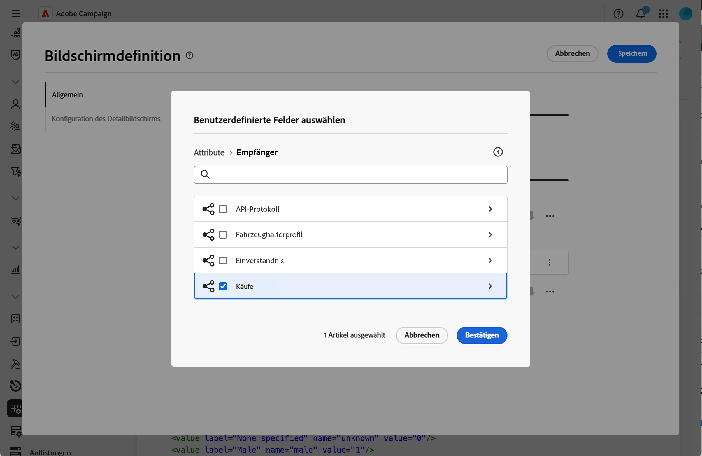
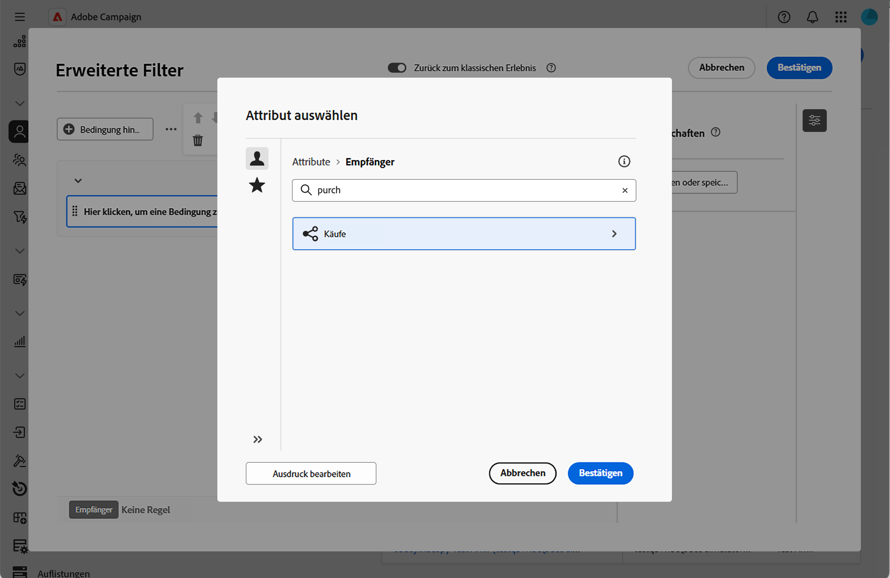
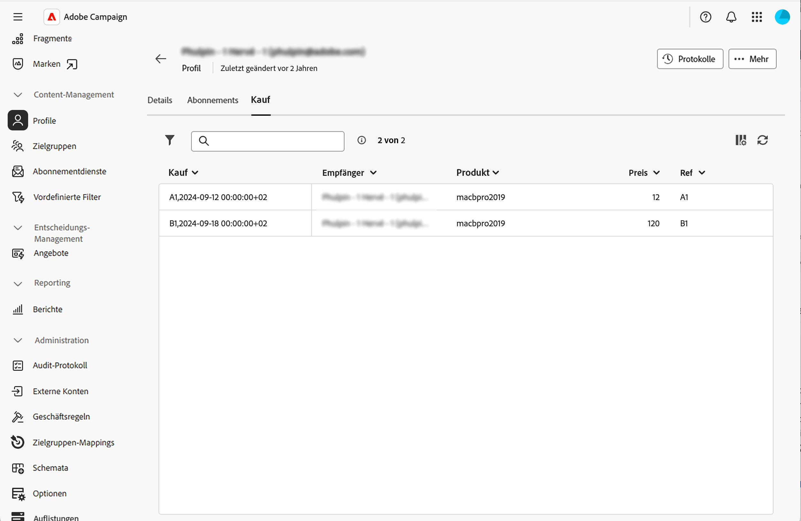

# Hinzufügen von Sammlungslisten {#collection-lists}

Im **Liste benutzerdefinierter Listen** können Sie Sammlungslinks definieren, z. B. Käufe. Die zugehörigen Daten werden dann über eine dedizierte Registerkarte auf Profilbildschirmen angezeigt.

Weitere Informationen zum Bildschirm-Definitionsbildschirm und zum Zugriff darauf finden Sie im Abschnitt [Zugriff auf die Bildschirmdefinition](schemas-browse-access.md#screen-def).

>[!NOTE]
>
>Diese Funktion ist derzeit nur für das Empfängerschema verfügbar.

Hinzufügen von Sammlungslisten:

1. Navigieren Sie zum Menü **[!UICONTROL Schemata]** und suchen Sie mithilfe der Filter nach bearbeitbaren Schemata.

1. Wählen Sie den Schemanamen in der Liste aus, um ihn zu öffnen, und klicken Sie in der Ansicht mit den Schemadetails auf **** Bildschirmbearbeitung“, um auf die Bildschirmdefinition zuzugreifen.

1. Klicken Sie auf das Symbol mit den Auslassungspunkten und wählen Sie **[!UICONTROL Benutzerdefinierte Listen auswählen]**.

   

1. Wählen Sie eine der verfügbaren benutzerdefinierten Listen aus, z. B. Käufe, und klicken Sie dann auf **[!UICONTROL Bestätigen]**.

   

1. Navigieren Sie zum Menü **Profile** und filtern Sie Profile, die Käufe getätigt haben.

   

1. Klicken Sie auf ein Profil. Sie werden feststellen, dass die neue Registerkarte angezeigt wird. Sie können bei Bedarf weitere Spalten hinzufügen.

   
