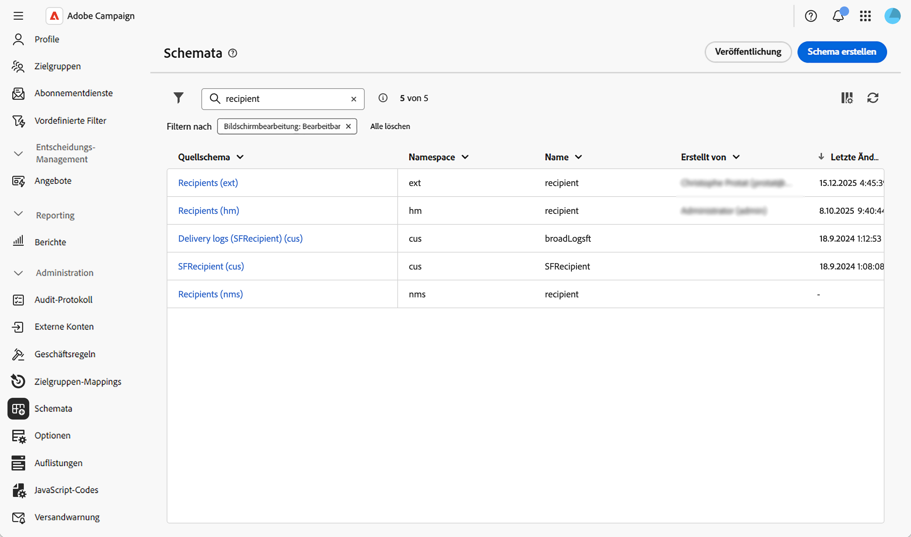
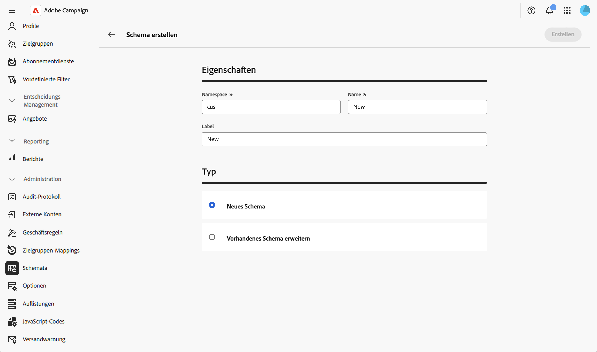
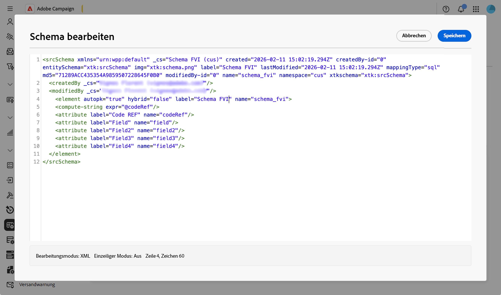
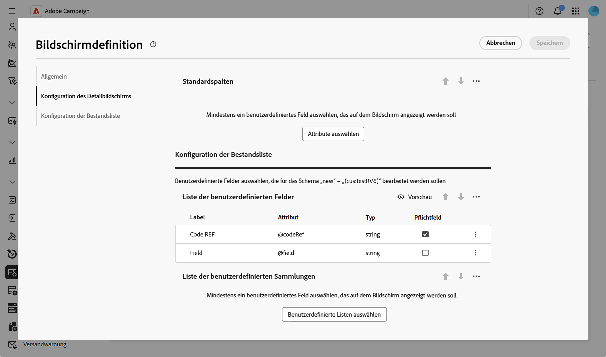
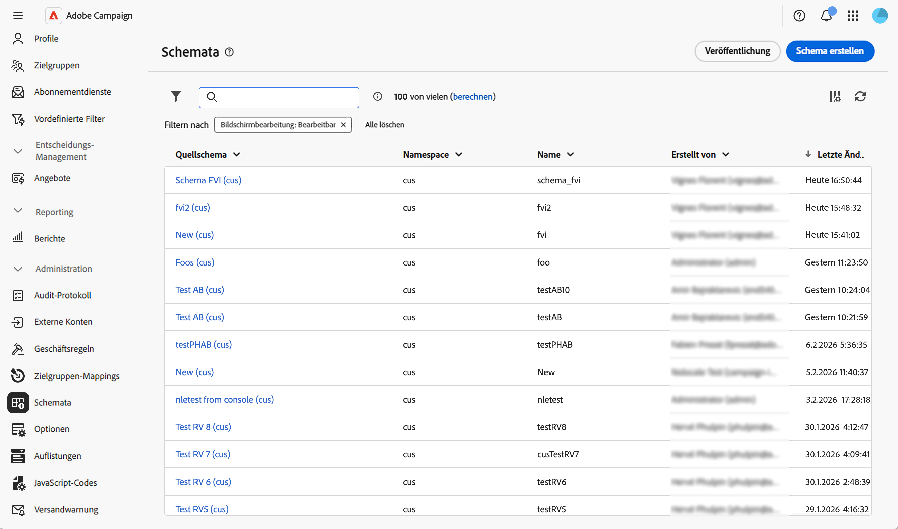
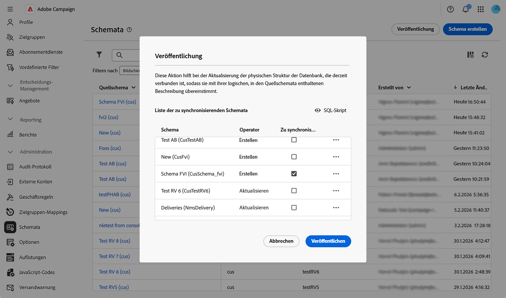
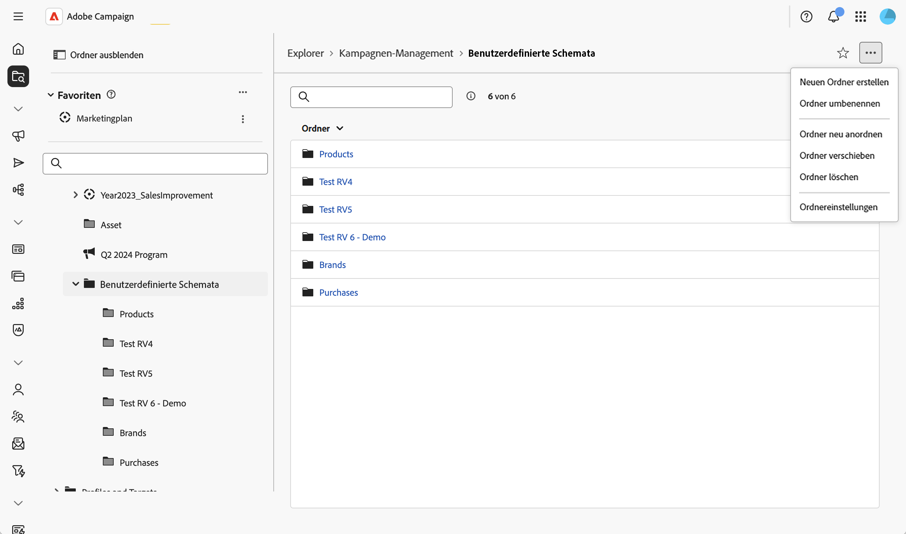
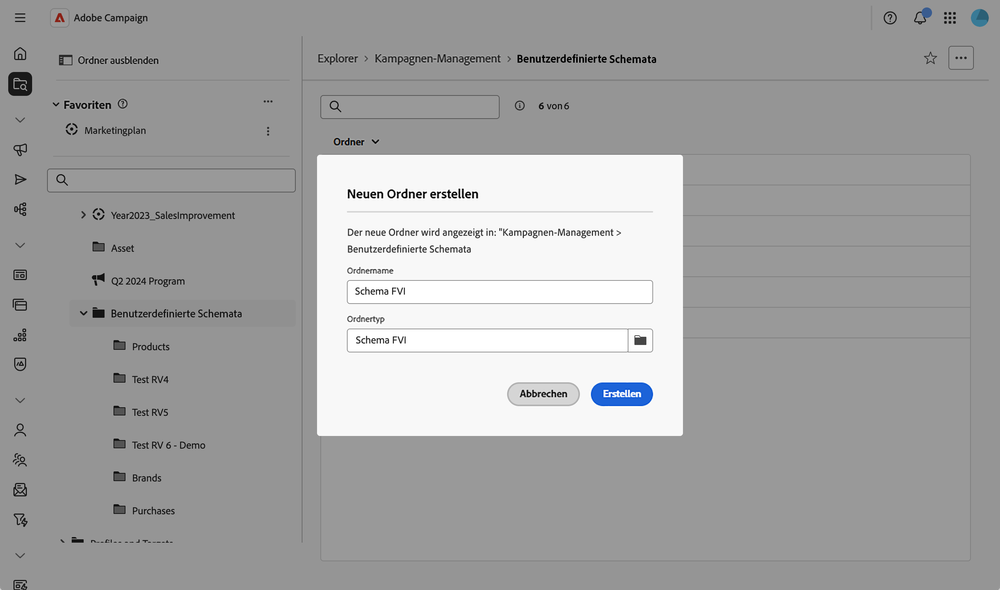

# Erstellen und Veröffentlichen von Schemata {#create-publish}

## Erstellen und Verwalten von Schemata {#create-schemas}

Sie können neue Schemata erstellen, vorhandene Schemata erweitern und auf externe Datenbanken zugreifen.

>[!NOTE]
>
>Diese Funktion ist nur für eine Reihe von Organisationen verfügbar (eingeschränkte Verfügbarkeit) und wird in einer zukünftigen Version global eingeführt.

### Erstellen oder Erweitern eines Schemas {#create-new}

So erstellen oder erweitern Sie ein Schema:

1. Navigieren Sie **[!UICONTROL Administration]** > **[!UICONTROL Schemata]**.
1. Klicken Sie **[!UICONTROL Schema erstellen]**.

   

1. Geben Sie einen Namespace für Ihr Schema ein (z. B. `cus` für benutzerdefinierte Schemata).
1. Geben Sie einen eindeutigen Namen und eine eindeutige Beschriftung ein und wählen Sie aus, ob Sie ein neues Schema erstellen oder ein vorhandenes erweitern möchten.

1. Wählen Sie **[!UICONTROL Erstellen]** aus.
   

Das Schema wird erstellt und die generierte Schemastruktur wird angezeigt.

Standardmäßig ist das Schema leer. Jetzt müssen Sie die Felder, die Sie in Ihr Schema einbeziehen möchten, mit dem Schema-Editor hinzufügen:

1. Klicken Sie auf das Stiftsymbol im **[!UICONTROL Inhalt]** des Bildschirms mit den Schemadetails.
2. Fügen Sie die erforderlichen Elemente hinzu und speichern Sie sie. Im Folgenden finden Sie ein Beispiel für eine benutzerdefinierte Schemastruktur:

   

Das System validiert automatisch die XML-Struktur und generiert das Schema.

### Definieren der Bildschirmbearbeitung {#define-attributes}

Nachdem Sie das Schema erstellt haben, müssen Sie die Bildschirmbearbeitung definieren.

Weitere Informationen zum Bildschirm-Definitionsbildschirm und zum Zugriff darauf finden Sie im Abschnitt [Zugriff auf die Bildschirmdefinition](schemas-browse-access.md#screen-def).

In unserem Beispiel fügen wir einfach zwei benutzerdefinierte Felder hinzu:

1. Klicken Sie in der **[!UICONTROL -Detailansicht auf]** Schaltfläche „Bildschirmbearbeitung“, um auf die Bildschirmdefinition zuzugreifen.

1. Klicken Sie auf das Symbol mit den Auslassungspunkten über der Tabelle **[!UICONTROL Liste benutzerdefinierter Felder]** und wählen Sie **[!UICONTROL Attribute auswählen]** aus.
1. Wählen Sie die benutzerdefinierten Felder aus, die Sie hinzufügen möchten, und bestätigen Sie diese.

   

## Veröffentlichen und Synchronisieren von Schemata {#publish}

Nachdem Sie ein Schema erstellt oder geändert haben, müssen Sie es veröffentlichen, um das logische Schema mit der physischen Datenbankstruktur zu synchronisieren.

### Schemaänderungen veröffentlichen {#publish-changes}

>[!CAUTION]
>
>Durch das Veröffentlichen von Schemaänderungen wird die Datenbankstruktur geändert. Vergewissern Sie sich, dass Sie die Auswirkungen dieser Änderungen verstehen, bevor Sie die Veröffentlichung bestätigen.

So veröffentlichen Sie Ihre Schemaänderungen:

1. Navigieren Sie zu **[!UICONTROL Administration]** > **[!UICONTROL Schemata]**, um auf die Schemeliste zuzugreifen.
1. Klicken Sie auf **[!UICONTROL Veröffentlichen]** und bestätigen Sie.

   

1. Wählen Sie in der Liste das Schema aus, das Sie synchronisieren möchten.

   

1. Überprüfen Sie das auszuführende SQL-Script, um die Datenbankstruktur zu aktualisieren.
1. Klicken Sie **[!UICONTROL Veröffentlichen]** und bestätigen Sie, um mit der Veröffentlichung fortzufahren.

>[!NOTE]
>
>Der Vorgang kann je nach Größe der Datenbank und Komplexität der Änderungen einige Zeit in Anspruch nehmen.

### Erstellen eines Navigationseintrags {#navigation}

Nach dem Veröffentlichen eines benutzerdefinierten Schemas können Sie im Explorer einen Navigationseintrag erstellen, um auf Ihre benutzerdefinierten Daten zuzugreifen:

1. Navigieren Sie zum **[!UICONTROL Explorer]**-Menü und wählen Sie einen Ordner aus, in dem Sie Ihr benutzerdefiniertes Schema platzieren möchten.
1. Klicken Sie auf das Symbol mit den Auslassungspunkten und dann auf **[!UICONTROL Neuen Ordner erstellen]**.
   
1. Fügen Sie eine Bezeichnung hinzu und wählen Sie Ihr Schema im Feld **[!UICONTROL Ordnertyp]** aus.
   
1. Auf das benutzerdefinierte Schema kann jetzt über die Ansicht **[!UICONTROL Explorer]** zugegriffen werden.

Im neuen Ordner haben Sie folgende Möglichkeiten:

* Anzeigen der Liste der Datensätze in Ihrem benutzerdefinierten Schema.
* Neue Einträge erstellen.
* Bearbeiten und Löschen vorhandener Datensätze.
* Passen Sie an, welche Spalten standardmäßig in der Listenansicht angezeigt werden.
