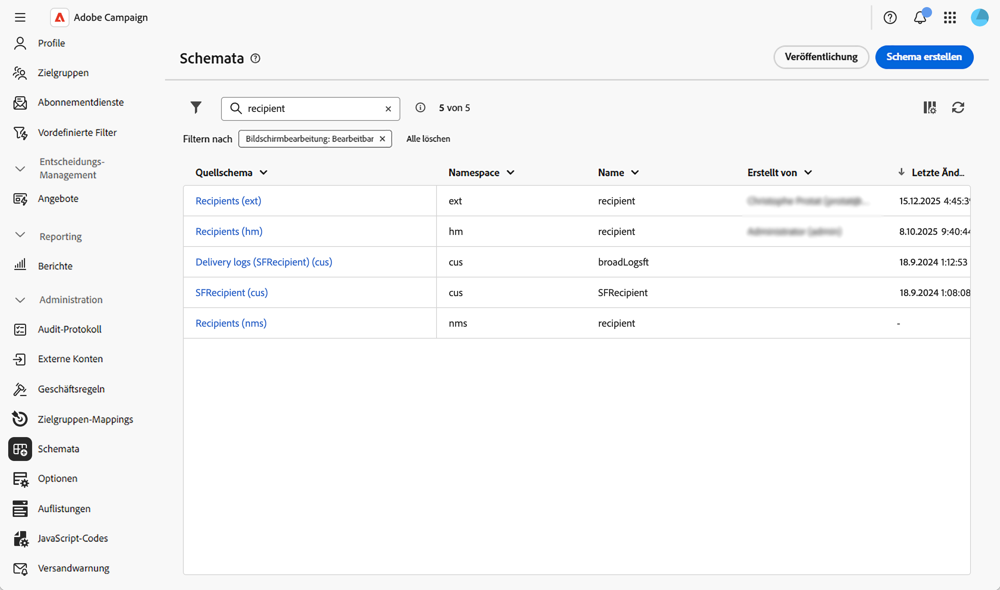
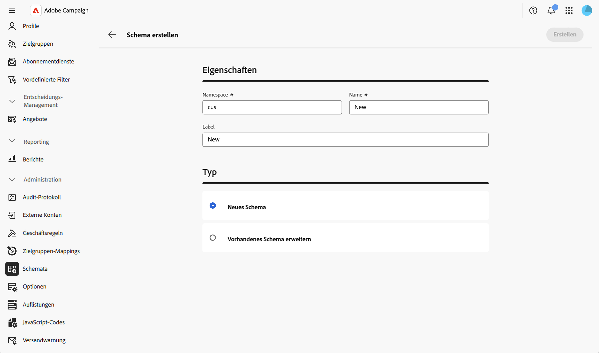
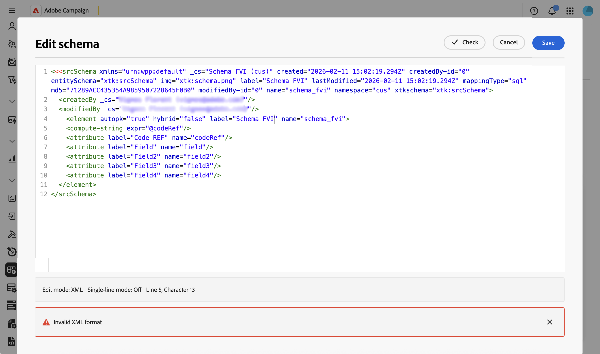
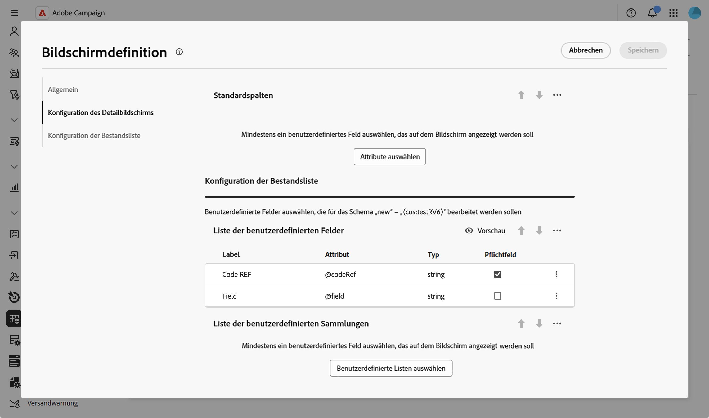
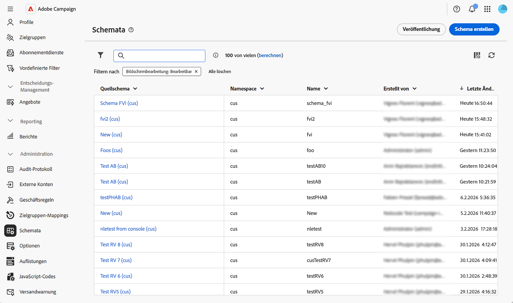
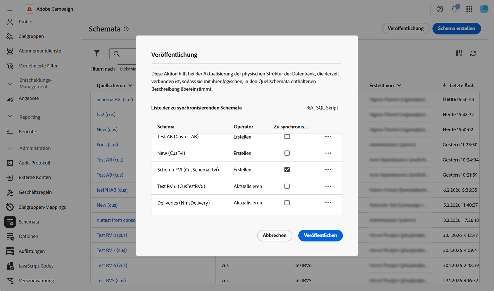
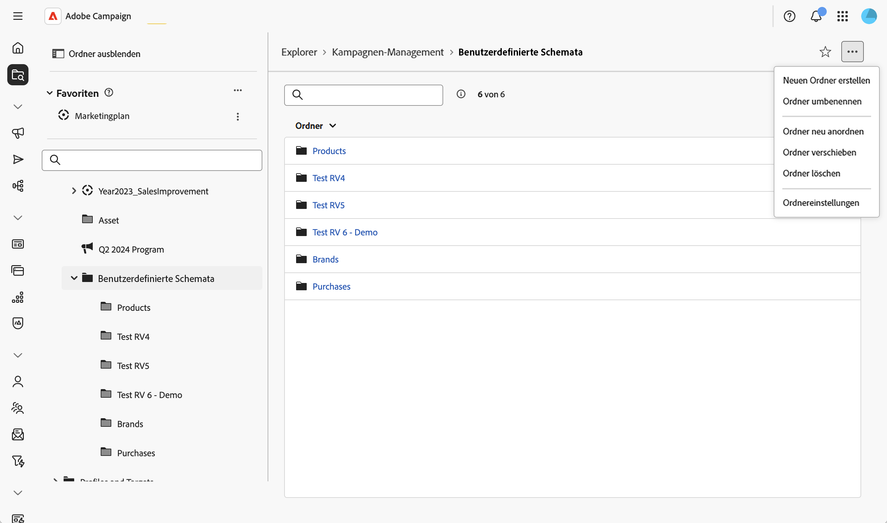
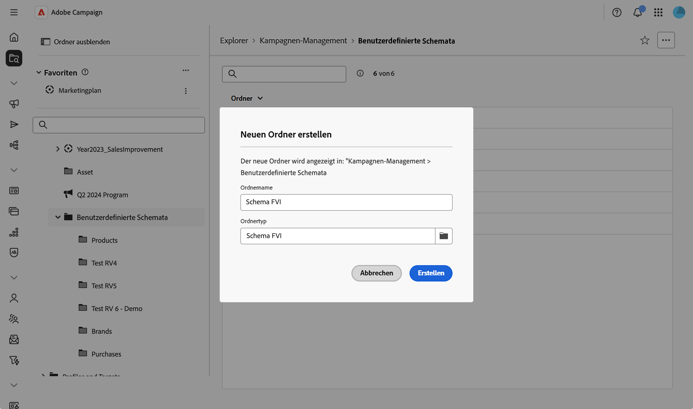

<?xml version="1.0" encoding="UTF-8"?>
<xliff xmlns="urn:oasis:names:tc:xliff:document:1.2" xmlns:okp="okapi-framework:xliff-extensions" xmlns:its="http://www.w3.org/2005/11/its" xmlns:itsxlf="http://www.w3.org/ns/its-xliff/" version="1.2" its:version="2.0">
<file original="help/v8/administration/schemas-create-publish.md.mdsc" source-language="en-US" target-language="en-XX" datatype="x-text/markdown">
<body>
<trans-unit id="tu1" restype="x-YAML_METADATA_HEADER_VALUE" xml:space="preserve">
<source xml:lang="en-US">Create and publish schemas</source>
<target xml:lang="en-XX">Erstellen und Veröffentlichen von Schemata</target>
</trans-unit>
<trans-unit id="tu2" restype="x-YAML_METADATA_HEADER_VALUE" xml:space="preserve">
<source xml:lang="en-US">Learn how to create, extend, and publish schemas.</source>
<target xml:lang="en-XX">Erfahren Sie, wie Sie Schemata erstellen, erweitern und veröffentlichen.</target>
</trans-unit>
<trans-unit id="tu3" xml:space="preserve">
<source xml:lang="en-US">Create and publish schemas</source>
<target xml:lang="en-XX">Erstellen und Veröffentlichen von Schemata</target>
</trans-unit>
<trans-unit id="tu4" xml:space="preserve">
<source xml:lang="en-US">Create and manage schemas</source>
<target xml:lang="en-XX">Erstellen und Verwalten von Schemata</target>
</trans-unit>
<trans-unit id="tu5" xml:space="preserve">
<source xml:lang="en-US">You can create new schemas, extend existing schemas, and access external databases.</source>
<target xml:lang="en-XX">Sie können neue Schemata erstellen, vorhandene Schemata erweitern und auf externe Datenbanken zugreifen.</target>
</trans-unit>
<trans-unit id="tu6" xml:space="preserve">
<source xml:lang="en-US">Create or extend a schema</source>
<target xml:lang="en-XX">Erstellen oder Erweitern eines Schemas</target>
</trans-unit>
<trans-unit id="tu7" xml:space="preserve">
<source xml:lang="en-US">To create or extend a schema:</source>
<target xml:lang="en-XX">So erstellen oder erweitern Sie ein Schema:</target>
</trans-unit>
<trans-unit id="tu8" xml:space="preserve">
<source xml:lang="en-US">Navigate to <ph id="1" ctype="x-STRONG_EMPHASIS">**[!UICONTROL </ph>Administration<ph id="3" ctype="x-LINK_REF">]**</ph> > <ph id="5" ctype="x-STRONG_EMPHASIS">**[!UICONTROL </ph>Schemas<ph id="7" ctype="x-LINK_REF">]**</ph>.</source>
<target xml:lang="en-XX">Navigieren Sie zu <ph id="1" ctype="x-STRONG_EMPHASIS">**[!UICONTROL </ph>Administration<ph id="3" ctype="x-LINK_REF">]**</ph> > <ph id="5" ctype="x-STRONG_EMPHASIS">**[!UICONTROL </ph>Schemata<ph id="7" ctype="x-LINK_REF">]**</ph>.</target>
</trans-unit>
<trans-unit id="tu9" xml:space="preserve">
<source xml:lang="en-US">Click <ph id="1" ctype="x-STRONG_EMPHASIS">**[!UICONTROL </ph>Create schema<ph id="3" ctype="x-LINK_REF">]**</ph>.</source>
<target xml:lang="en-XX">Klicken Sie auf <ph id="1" ctype="x-STRONG_EMPHASIS">**[!UICONTROL </ph>Schema erstellen<ph id="3" ctype="x-LINK_REF">]**</ph>.</target>
</trans-unit>
<trans-unit id="tu10" xml:space="preserve">
<source xml:lang="en-US"><ph id="1" ctype="x-IMAGE"></ph></source>
<target xml:lang="en-XX"><ph id="1" ctype="x-IMAGE"></ph></target>
</trans-unit>
<trans-unit id="tu11" xml:space="preserve">
<source xml:lang="en-US">Enter a namespace for your schema (for example, <ph id="1" ctype="x-CODE">`cus`</ph> for custom schemas).</source>
<target xml:lang="en-XX">Geben Sie einen Namespace für Ihr Schema ein (z. B. <ph id="1" ctype="x-CODE">`cus`</ph> für benutzerdefinierte Schemata).</target>
</trans-unit>
<trans-unit id="tu12" xml:space="preserve">
<source xml:lang="en-US">Enter a unique name and label, and choose if you want to create a new schema or extend an existing one.</source>
<target xml:lang="en-XX">Geben Sie einen eindeutigen Namen und ein eindeutiges Label ein und wählen Sie aus, ob Sie ein neues Schema erstellen oder ein vorhandenes erweitern möchten.</target>
</trans-unit>
<trans-unit id="tu13" xml:space="preserve">
<source xml:lang="en-US">Click <ph id="1" ctype="x-STRONG_EMPHASIS">**[!UICONTROL </ph>Create<ph id="3" ctype="x-LINK_REF">]**</ph>.
</source>
<target xml:lang="en-XX">Wählen Sie <ph id="1" ctype="x-STRONG_EMPHASIS">**[!UICONTROL </ph>Erstellen<ph id="3" ctype="x-LINK_REF">]**</ph> aus.
</target>
</trans-unit>
<trans-unit id="tu14" xml:space="preserve">
<source xml:lang="en-US"><ph id="1" ctype="x-IMAGE"></ph></source>
<target xml:lang="en-XX"><ph id="1" ctype="x-IMAGE"></ph></target>
</trans-unit>
<trans-unit id="tu15" xml:space="preserve">
<source xml:lang="en-US">The schema is created and the generated schema structure is displayed.</source>
<target xml:lang="en-XX">Das Schema wird erstellt und die generierte Schemastruktur wird angezeigt.</target>
</trans-unit>
<trans-unit id="tu16" xml:space="preserve">
<source xml:lang="en-US">By default, the schema is empty. You now need to add the fields you want to include in your schema using the schema editor:</source>
<target xml:lang="en-XX">Standardmäßig ist das Schema leer. Jetzt müssen Sie die Felder, die Sie in Ihr Schema einbeziehen möchten, mit dem Schema-Editor hinzufügen:</target>
</trans-unit>
<trans-unit id="tu17" xml:space="preserve">
<source xml:lang="en-US">Click the pencil icon in the <ph id="1" ctype="x-STRONG_EMPHASIS">**[!UICONTROL </ph>Content<ph id="3" ctype="x-LINK_REF">]**</ph> section of the schema details screen.</source>
<target xml:lang="en-XX">Klicken Sie auf das Stiftsymbol im Abschnitt <ph id="1" ctype="x-STRONG_EMPHASIS">**[!UICONTROL </ph>Inhalt<ph id="3" ctype="x-LINK_REF">]**</ph> des Bildschirms mit den Schemadetails.</target>
</trans-unit>
<trans-unit id="tu18" xml:space="preserve">
<source xml:lang="en-US">Add the needed elements. Here is an example of a custom schema structure:</source>
<target xml:lang="en-XX">Fügen Sie die erforderlichen Elemente hinzu. Im Folgenden finden Sie ein Beispiel für eine benutzerdefinierte Schemastruktur:</target>
</trans-unit>
<trans-unit id="tu19" xml:space="preserve">
<source xml:lang="en-US"><ph id="1" ctype="x-IMAGE"></ph></source>
<target xml:lang="en-XX"><ph id="1" ctype="x-IMAGE"></ph></target>
</trans-unit>
<trans-unit id="tu20" xml:space="preserve">
<source xml:lang="en-US">Click the <ph id="1" ctype="x-STRONG_EMPHASIS">**[!UICONTROL </ph>Check<ph id="3" ctype="x-LINK_REF">]**</ph> button to verify the XML structure of your schema before saving. Identified errors are displayed at the bottom of the screen, for example "Invalid XML format".</source>
<target xml:lang="en-XX">Klicken Sie auf die Schaltfläche <ph id="1" ctype="x-STRONG_EMPHASIS">**[!UICONTROL </ph>Überprüfen<ph id="3" ctype="x-LINK_REF">]**</ph>, um die XML-Struktur Ihres Schemas vor dem Speichern zu prüfen. Identifizierte Fehler werden am unteren Bildschirmrand angezeigt, z. B. „Ungültiges XML-Format“.</target>
</trans-unit>
<trans-unit id="tu21" xml:space="preserve">
<source xml:lang="en-US"><ph id="1" ctype="x-IMAGE"></ph></source>
<target xml:lang="en-XX"><ph id="1" ctype="x-IMAGE"></ph></target>
</trans-unit>
<trans-unit id="tu22" xml:space="preserve">
<source xml:lang="en-US">Fix any errors, then save your changes to generate the schema.</source>
<target xml:lang="en-XX">Korrigieren Sie alle Fehler und speichern Sie dann Ihre Änderungen, um das Schema zu generieren.</target>
</trans-unit>
<trans-unit id="tu23" xml:space="preserve">
<source xml:lang="en-US">Define the screen edition</source>
<target xml:lang="en-XX">Definieren der Bildschirmbearbeitung</target>
</trans-unit>
<trans-unit id="tu24" xml:space="preserve">
<source xml:lang="en-US">After creating the schema, you need to define the screen edition.</source>
<target xml:lang="en-XX">Nachdem Sie das Schema erstellt haben, müssen Sie die Bildschirmbearbeitung definieren.</target>
</trans-unit>
<trans-unit id="tu25" xml:space="preserve">
<source xml:lang="en-US">For more information on the screen definition screen and how to access it, refer to the <ph id="1" ctype="x-LINK">[</ph>Access the screen definition<ph id="2" ctype="x-LINK">](schemas-browse-access.md#screen-def)</ph> section.</source>
<target xml:lang="en-XX">Weitere Informationen zum Bildschirm „Bildschirmdefinition“ und zum Zugriff darauf finden Sie im Abschnitt <ph id="1" ctype="x-LINK">[</ph>Zugreifen auf die Bildschirmdefinition<ph id="2" ctype="x-LINK">](schemas-browse-access.md#screen-def)</ph>.</target>
</trans-unit>
<trans-unit id="tu26" xml:space="preserve">
<source xml:lang="en-US">In our example, we simply add two custom fields:</source>
<target xml:lang="en-XX">In unserem Beispiel fügen wir einfach zwei benutzerdefinierte Felder hinzu:</target>
</trans-unit>
<trans-unit id="tu27" xml:space="preserve">
<source xml:lang="en-US">Click the <ph id="1" ctype="x-STRONG_EMPHASIS">**[!UICONTROL </ph>Screen edition<ph id="3" ctype="x-LINK_REF">]**</ph> button in the schema details view to access the screen definition.</source>
<target xml:lang="en-XX">Klicken Sie in der Detailansicht des Schemas auf die Schaltfläche <ph id="1" ctype="x-STRONG_EMPHASIS">**[!UICONTROL </ph>Bildschirmbearbeitung<ph id="3" ctype="x-LINK_REF">]**</ph>, um auf die Bildschirmdefinition zuzugreifen.</target>
</trans-unit>
<trans-unit id="tu28" xml:space="preserve">
<source xml:lang="en-US">Click the ellipsis icon above the <ph id="1" ctype="x-STRONG_EMPHASIS">**[!UICONTROL </ph>List of custom fields<ph id="3" ctype="x-LINK_REF">]**</ph> table and choose <ph id="5" ctype="x-STRONG_EMPHASIS">**[!UICONTROL </ph>Select attributes<ph id="7" ctype="x-LINK_REF">]**</ph>.</source>
<target xml:lang="en-XX">Klicken Sie oberhalb der Tabelle <ph id="1" ctype="x-STRONG_EMPHASIS">**[!UICONTROL </ph>Liste der benutzerdefinierten Felder<ph id="3" ctype="x-LINK_REF">]**</ph> auf das Symbol mit den Auslassungspunkten und wählen Sie <ph id="5" ctype="x-STRONG_EMPHASIS">**[!UICONTROL </ph>Attribute auswählen<ph id="7" ctype="x-LINK_REF">]**</ph>.</target>
</trans-unit>
<trans-unit id="tu29" xml:space="preserve">
<source xml:lang="en-US">Select the custom fields you want to add and confirm.</source>
<target xml:lang="en-XX">Wählen Sie die benutzerdefinierten Felder aus, die Sie hinzufügen möchten, und bestätigen Sie die Auswahl.</target>
</trans-unit>
<trans-unit id="tu30" xml:space="preserve">
<source xml:lang="en-US"><ph id="1" ctype="x-IMAGE"></ph></source>
<target xml:lang="en-XX"><ph id="1" ctype="x-IMAGE"></ph></target>
</trans-unit>
<trans-unit id="tu31" xml:space="preserve">
<source xml:lang="en-US">Publish and synchronize schemas</source>
<target xml:lang="en-XX">Veröffentlichen und Synchronisieren von Schemata</target>
</trans-unit>
<trans-unit id="tu32" xml:space="preserve">
<source xml:lang="en-US">After creating or modifying a schema, you need to publish it to synchronize the logical schema with the physical database structure.</source>
<target xml:lang="en-XX">Nachdem Sie ein Schema erstellt oder geändert haben, müssen Sie es veröffentlichen, um das logische Schema mit der physischen Datenbankstruktur zu synchronisieren.</target>
</trans-unit>
<trans-unit id="tu33" xml:space="preserve">
<source xml:lang="en-US">Publish schema changes</source>
<target xml:lang="en-XX">Veröffentlichen von Schemaänderungen</target>
</trans-unit>
<trans-unit id="tu34" xml:space="preserve">
<source xml:lang="en-US"><ph id="1" ctype="x-regxph" equiv-text="[!CAUTION">[!CAUTION]</ph></source>
<target xml:lang="en-XX"><ph id="1" ctype="x-regxph" equiv-text="[!CAUTION">[!CAUTION]</ph></target>
</trans-unit>
<trans-unit id="tu35" xml:space="preserve">
<source xml:lang="en-US">Publishing schema changes modifies the database structure. Make sure you understand the impact of these changes before confirming the publication.</source>
<target xml:lang="en-XX">Durch das Veröffentlichen von Schemaänderungen wird die Datenbankstruktur geändert. Seien Sie sich der Auswirkungen dieser Änderungen bewusst, bevor Sie die Veröffentlichung bestätigen.</target>
</trans-unit>
<trans-unit id="tu36" xml:space="preserve">
<source xml:lang="en-US">To publish your schema changes:</source>
<target xml:lang="en-XX">So veröffentlichen Sie Ihre Schemaänderungen:</target>
</trans-unit>
<trans-unit id="tu37" xml:space="preserve">
<source xml:lang="en-US">Navigate to <ph id="1" ctype="x-STRONG_EMPHASIS">**[!UICONTROL </ph>Administration<ph id="3" ctype="x-LINK_REF">]**</ph> > <ph id="5" ctype="x-STRONG_EMPHASIS">**[!UICONTROL </ph>Schemas<ph id="7" ctype="x-LINK_REF">]**</ph> to access the schema list.</source>
<target xml:lang="en-XX">Navigieren Sie zu <ph id="1" ctype="x-STRONG_EMPHASIS">**[!UICONTROL </ph>Administration<ph id="3" ctype="x-LINK_REF">]**</ph> > <ph id="5" ctype="x-STRONG_EMPHASIS">**[!UICONTROL </ph>Schemata<ph id="7" ctype="x-LINK_REF">]**</ph>, um auf die Schemaliste zuzugreifen.</target>
</trans-unit>
<trans-unit id="tu38" xml:space="preserve">
<source xml:lang="en-US">Click <ph id="1" ctype="x-STRONG_EMPHASIS">**[!UICONTROL </ph>Publishing<ph id="3" ctype="x-LINK_REF">]**</ph> and confirm.</source>
<target xml:lang="en-XX">Klicken Sie auf <ph id="1" ctype="x-STRONG_EMPHASIS">**[!UICONTROL </ph>Veröffentlichung<ph id="3" ctype="x-LINK_REF">]**</ph> und bestätigen Sie den Vorgang.</target>
</trans-unit>
<trans-unit id="tu39" xml:space="preserve">
<source xml:lang="en-US"><ph id="1" ctype="x-IMAGE"></ph></source>
<target xml:lang="en-XX"><ph id="1" ctype="x-IMAGE"></ph></target>
</trans-unit>
<trans-unit id="tu40" xml:space="preserve">
<source xml:lang="en-US">Select, in the list, the schema you want to synchronize.</source>
<target xml:lang="en-XX">Wählen Sie in der Liste das Schema aus, das Sie synchronisieren möchten.</target>
</trans-unit>
<trans-unit id="tu41" xml:space="preserve">
<source xml:lang="en-US"><ph id="1" ctype="x-IMAGE"></ph></source>
<target xml:lang="en-XX"><ph id="1" ctype="x-IMAGE"></ph></target>
</trans-unit>
<trans-unit id="tu42" xml:space="preserve">
<source xml:lang="en-US">Review the SQL script that will be executed to update the database structure.</source>
<target xml:lang="en-XX">Prüfen Sie das SQL-Skript, das zur Aktualisierung der Datenbankstruktur ausgeführt wird.</target>
</trans-unit>
<trans-unit id="tu43" xml:space="preserve">
<source xml:lang="en-US">Click <ph id="1" ctype="x-STRONG_EMPHASIS">**[!UICONTROL </ph>Publish<ph id="3" ctype="x-LINK_REF">]**</ph> and confirm to proceed with the publication.</source>
<target xml:lang="en-XX">Klicken Sie auf die Schaltfläche <ph id="1" ctype="x-STRONG_EMPHASIS">**[!UICONTROL </ph>Veröffentlichen<ph id="3" ctype="x-LINK_REF">]**</ph>, um mit der Veröffentlichung fortzufahren.</target>
</trans-unit>
<trans-unit id="tu44" xml:space="preserve">
<source xml:lang="en-US"><ph id="1" ctype="x-regxph" equiv-text="[!NOTE">[!NOTE]</ph></source>
<target xml:lang="en-XX"><ph id="1" ctype="x-regxph" equiv-text="[!NOTE">[!NOTE]</ph></target>
</trans-unit>
<trans-unit id="tu45" xml:space="preserve">
<source xml:lang="en-US">The process may take some time depending on the size of your database and the complexity of the changes.</source>
<target xml:lang="en-XX">Der Vorgang kann je nach Größe der Datenbank und Komplexität der Änderungen einige Zeit in Anspruch nehmen.</target>
</trans-unit>
<trans-unit id="tu46" xml:space="preserve">
<source xml:lang="en-US">Create a navigation entry</source>
<target xml:lang="en-XX">Erstellen eines Navigationseintrags</target>
</trans-unit>
<trans-unit id="tu47" xml:space="preserve">
<source xml:lang="en-US">After publishing a custom schema, you can create a navigation entry in the Explorer to access your custom data:</source>
<target xml:lang="en-XX">Nach dem Veröffentlichen eines benutzerdefinierten Schemas können Sie im Explorer einen Navigationseintrag erstellen, um auf Ihre benutzerdefinierten Daten zuzugreifen:</target>
</trans-unit>
<trans-unit id="tu48" xml:space="preserve">
<source xml:lang="en-US">Navigate to the <ph id="1" ctype="x-STRONG_EMPHASIS">**[!UICONTROL </ph>Explorer<ph id="3" ctype="x-LINK_REF">]**</ph> menu and select a folder where you want to place your custom schema.</source>
<target xml:lang="en-XX">Navigieren Sie zum <ph id="1" ctype="x-STRONG_EMPHASIS">**[!UICONTROL </ph>Explorer<ph id="3" ctype="x-LINK_REF">]**</ph>-Menü und wählen Sie einen Ordner aus, in dem Sie Ihr benutzerdefiniertes Schema platzieren möchten.</target>
</trans-unit>
<trans-unit id="tu49" xml:space="preserve">
<source xml:lang="en-US">Click the ellipsis icon, and click <ph id="1" ctype="x-STRONG_EMPHASIS">**[!UICONTROL </ph>Create new folder<ph id="3" ctype="x-LINK_REF">]**</ph>.
</source>
<target xml:lang="en-XX">Klicken Sie auf das Symbol mit den Auslassungspunkten und dann auf <ph id="1" ctype="x-STRONG_EMPHASIS">**[!UICONTROL </ph>Neuen Ordner erstellen<ph id="3" ctype="x-LINK_REF">]**</ph>.
</target>
</trans-unit>
<trans-unit id="tu50" xml:space="preserve">
<source xml:lang="en-US"><ph id="1" ctype="x-IMAGE"></ph></source>
<target xml:lang="en-XX"><ph id="1" ctype="x-IMAGE"></ph></target>
</trans-unit>
<trans-unit id="tu51" xml:space="preserve">
<source xml:lang="en-US">Add a label and choose your schema in the <ph id="1" ctype="x-STRONG_EMPHASIS">**[!UICONTROL </ph>Folder type<ph id="3" ctype="x-LINK_REF">]**</ph> field.
</source>
<target xml:lang="en-XX">Fügen Sie ein Label hinzu und wählen Sie Ihr Schema im Feld <ph id="1" ctype="x-STRONG_EMPHASIS">**[!UICONTROL </ph>Ordnertyp<ph id="3" ctype="x-LINK_REF">]**</ph> aus.
</target>
</trans-unit>
<trans-unit id="tu52" xml:space="preserve">
<source xml:lang="en-US"><ph id="1" ctype="x-IMAGE"></ph></source>
<target xml:lang="en-XX"><ph id="1" ctype="x-IMAGE"></ph></target>
</trans-unit>
<trans-unit id="tu53" xml:space="preserve">
<source xml:lang="en-US">The custom schema will now be accessible from the <ph id="1" ctype="x-STRONG_EMPHASIS">**[!UICONTROL </ph>Explorer<ph id="3" ctype="x-LINK_REF">]**</ph> view.</source>
<target xml:lang="en-XX">Auf das benutzerdefinierte Schema kann jetzt über die Ansicht <ph id="1" ctype="x-STRONG_EMPHASIS">**[!UICONTROL </ph>Explorer<ph id="3" ctype="x-LINK_REF">]**</ph> zugegriffen werden.</target>
</trans-unit>
<trans-unit id="tu54" xml:space="preserve">
<source xml:lang="en-US">From the new folder, you can:</source>
<target xml:lang="en-XX">Im neuen Ordner haben Sie folgende Möglichkeiten:</target>
</trans-unit>
<trans-unit id="tu55" xml:space="preserve">
<source xml:lang="en-US">View the list of records in your custom schema.</source>
<target xml:lang="en-XX">Anzeigen der Liste der Einträge in Ihrem benutzerdefinierten Schema.</target>
</trans-unit>
<trans-unit id="tu56" xml:space="preserve">
<source xml:lang="en-US">Create new records.</source>
<target xml:lang="en-XX">Erstellen neuer Einträge.</target>
</trans-unit>
<trans-unit id="tu57" xml:space="preserve">
<source xml:lang="en-US">Edit and delete existing records.</source>
<target xml:lang="en-XX">Bearbeiten und Löschen vorhandener Einträge.</target>
</trans-unit>
<trans-unit id="tu58" xml:space="preserve">
<source xml:lang="en-US">Customize which columns are displayed by default in the list view.</source>
<target xml:lang="en-XX">Anpassen, welche Spalten standardmäßig in der Listenansicht angezeigt werden.</target>
</trans-unit>
</body>
</file>
</xliff>