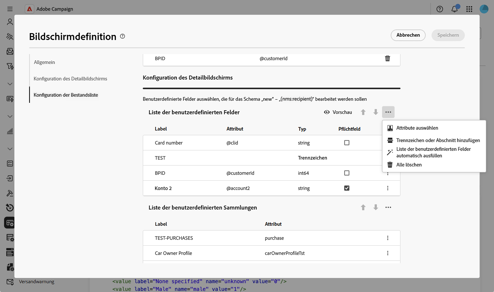
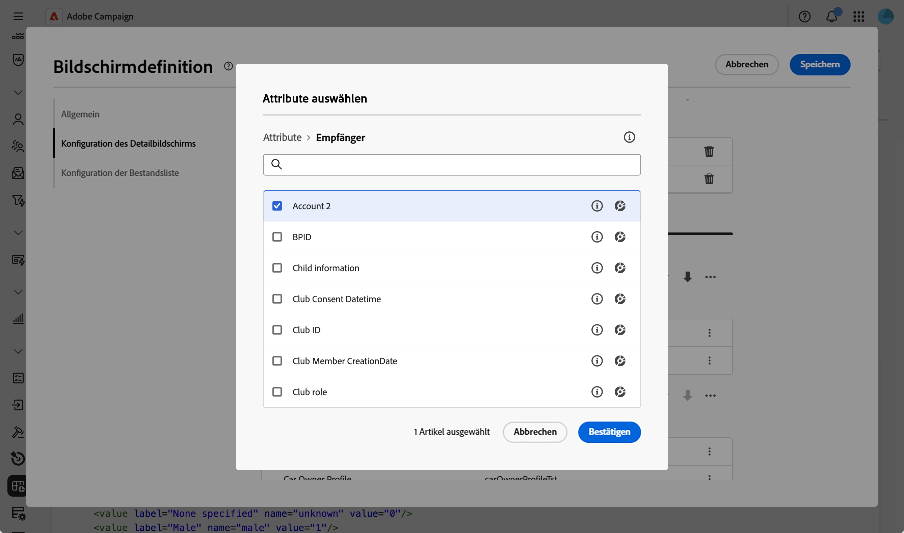
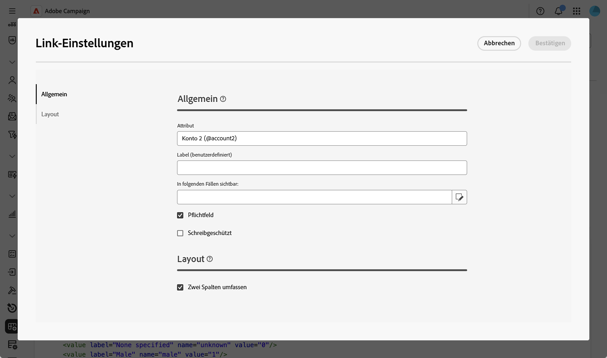
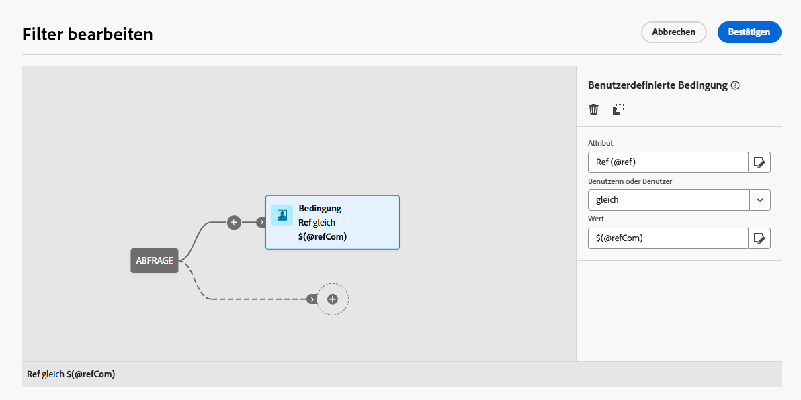
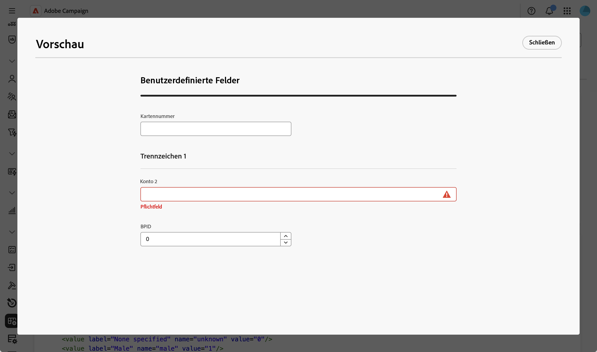
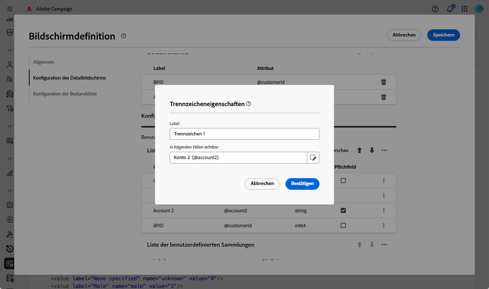
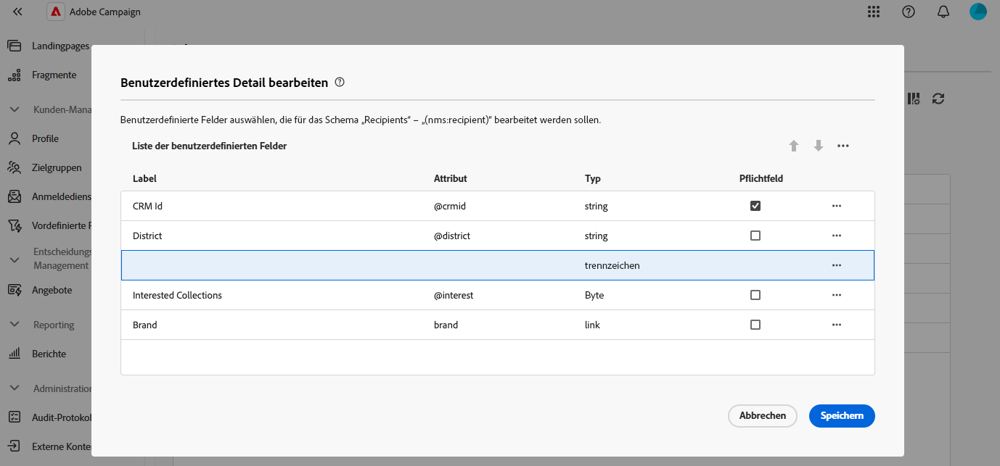
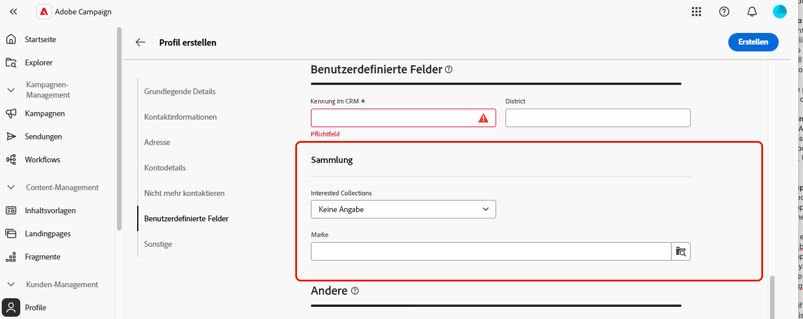

# Bearbeiten benutzerdefinierter Felder {#fields}

Benutzerdefinierte Felder sind zusätzliche Attribute, die über die Adobe Campaign-Konsole zu vorkonfigurierten Schemata hinzugefügt werden. Sie ermöglichen es Ihnen, Schemata anzupassen, indem neue Attribute entsprechend den Anforderungen Ihrer Organisation eingefügt werden. 

Benutzerdefinierte Felder können auf verschiedenen Bildschirmen angezeigt werden, z. B. Profildetails in der Benutzeroberfläche. Sie können steuern, welche Felder sichtbar sind und wie sie in der Benutzeroberfläche angezeigt werden.

Weitere Informationen zum Bildschirm-Definitionsbildschirm und zum Zugriff darauf finden Sie im Abschnitt [Zugriff auf die Bildschirmdefinition](schemas-browse-access.md#screen-def).

So fügen Sie der Liste benutzerdefinierte Felder hinzu:

1. Navigieren Sie zum Menü **[!UICONTROL Schemata]** und suchen Sie mithilfe der Filter nach bearbeitbaren Schemata.

1. Wählen Sie den Schemanamen in der Liste aus, um ihn zu öffnen, und klicken Sie in der Ansicht mit den Schemadetails auf **** Bildschirmbearbeitung“, um auf die Bildschirmdefinition zuzugreifen.

1. Klicken Sie auf das Symbol mit den Auslassungspunkten über der Tabelle **[!UICONTROL Liste benutzerdefinierter Felder]** und wählen Sie **[!UICONTROL Attribute auswählen]** aus, um ein oder mehrere benutzerdefinierte Felder auszuwählen, die in der Benutzeroberfläche angezeigt werden sollen.
   
1. Wählen Sie die benutzerdefinierten Felder aus, die Sie hinzufügen möchten, und bestätigen Sie diese.

   

   >[!NOTE]
   >
   > Sie können auch **[!UICONTROL Liste benutzerdefinierter Felder automatisch ausfüllen) auswählen]** um alle für das Schema definierten benutzerdefinierten Felder zur Benutzeroberfläche hinzuzufügen.

Nachdem benutzerdefinierte Felder hinzugefügt wurden, können Sie sie in der Vorschau anzeigen, neu anordnen, als obligatorisch festlegen, ihre Einstellungen bearbeiten oder in Unterabschnitten organisieren.

## Konfigurieren von Feldeinstellungen {#field-settings}

Um spezifische Einstellungen für jedes benutzerdefinierte Feld zu konfigurieren, klicken Sie auf das Auslassungssymbol in einer Feldzeile in der Liste und wählen Sie **[!UICONTROL Bearbeiten]** aus.

Folgende Einstellungen sind verfügbar:

* **[!UICONTROL Attribut]**: Der Name des benutzerdefinierten Felds (schreibgeschützt).
* **[!UICONTROL Titel (benutzerdefiniert)]**: Der Titel, der in der Benutzeroberfläche angezeigt werden soll. Wenn kein Titel angegeben wird, wird der im Schema definierte Titel angezeigt.
* **[!UICONTROL In folgenden Fällen sichtbar]**: Definieren Sie eine Bedingung mithilfe eines xtk-Ausdrucks, der steuert, wann das Feld angezeigt wird. Blenden Sie beispielsweise dieses Feld aus, wenn ein anderes Feld leer ist.
* **[!UICONTROL Pflichtfeld]**: Legt das Feld in der Benutzeroberfläche als Pflichtfeld fest.
* **[!UICONTROL Schreibgeschützt]**: Legt das Feld in der Benutzeroberfläche als schreibgeschützt fest. Benutzende können den Wert des Felds nicht bearbeiten.
* **[!UICONTROL Filtereinstellungen]** (für Felder vom Typ „Link“): Verwenden Sie den Abfrage-Modeler, um Regeln für die Anzeige eines benutzerdefinierten Felds vom Typ „Link“ anzugeben. Beschränken Sie beispielsweise Listenwerte auf Grundlage der Eingabe eines anderen Felds.

  +++Beispiel anzeigen

  Sie können mit der Syntax `$(<field-name>)` auch den Wert referenzieren, der in andere Felder in Ihren Bedingungen eingegeben wurde. Auf diese Weise können Sie auf den aktuellen Wert eines Felds verweisen, wie er im Formular eingegeben wurde, auch wenn dieser noch nicht in der Datenbank gespeichert wurde.

  Im folgenden Beispiel prüft die Bedingung, ob der Wert des Felds @ref mit dem im Feld @refCom eingegebenen Wert übereinstimmt. Wenn Sie dagegen `@refCom` anstelle von `$(@refCom)` verwenden, wird auf den Wert des Felds @ref verwiesen, so wie in der Datenbank vorhanden.

  

  +++

* **[!UICONTROL Zwei Spalten umfassen]**: Standardmäßig werden benutzerdefinierte Felder in der Benutzeroberfläche in zwei Spalten angezeigt. Schalten Sie diese Option ein, um das benutzerdefinierte Feld über die gesamte Breite des Bildschirms und nicht in zwei Spalten anzuzeigen.

## Vorschau für benutzerdefinierte Felder anzeigen {#preview}

Klicken Sie **[!UICONTROL Vorschau]**, um die benutzerdefinierten Felder in einem Beispielbildschirm anzuzeigen. Auf diese Weise können Sie sehen, wie die Felder in der Benutzeroberfläche angezeigt werden, einschließlich der Felder, die als Pflichtfelder markiert sind.

## Organisieren von Feldern in Unterabschnitten {#separator}

Sie können Trennzeichen hinzufügen, um benutzerdefinierte Felder in der Benutzeroberfläche zu gruppieren und so die Lesbarkeit zu verbessern. Gehen Sie dazu wie folgt vor:

1. Klicken Sie auf das Symbol mit den Auslassungspunkten über der Tabelle **[!UICONTROL Liste benutzerdefinierter Felder]** und wählen Sie **[!UICONTROL Trennzeichen hinzufügen]** aus.

1. Der Liste wird eine neue Zeile für das Trennzeichen hinzugefügt. Klicken Sie auf das Symbol mit den Auslassungspunkten in der Trennzeile und wählen Sie **[!UICONTROL Bearbeiten]**.

1. Geben Sie einen **[!UICONTROL Titel]** für das Trennzeichen ein und legen Sie (optional) eine **[!UICONTROL Visible if]**-Bedingung fest, um zu steuern, wann das Trennzeichen angezeigt wird.

   

1. Verschieben Sie das Trennzeichen mithilfe der Pfeile nach oben und unten an die gewünschte Position. Die unter dem Trennzeichen aufgelisteten Felder werden darunter gruppiert.

   In diesem Beispiel werden die Felder „Interessante Sammlungen“ und „Marke“ im Unterabschnitt „Sammlung“ gruppiert.

   | Konfiguration benutzerdefinierter Felder | Rendern in der Benutzeroberfläche |
   |  ---  |  ---  |
   | {zoomable="yes"} | {zoomable="yes"} |
