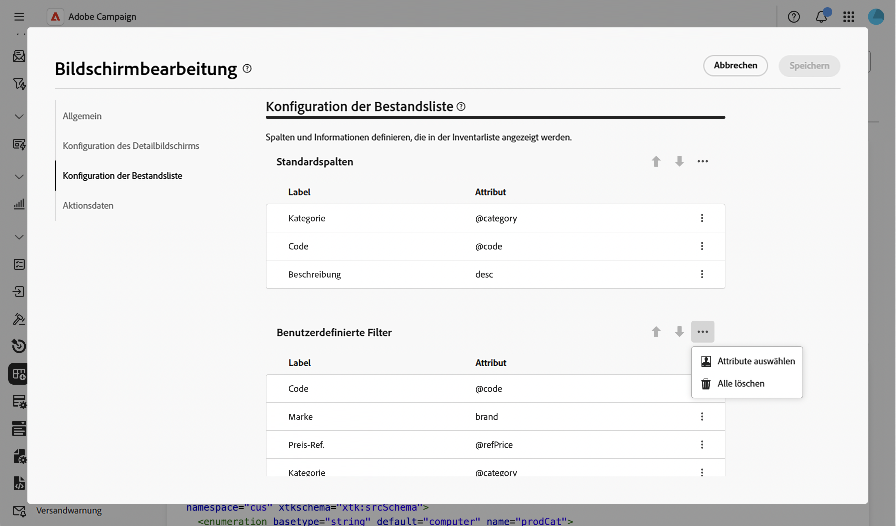
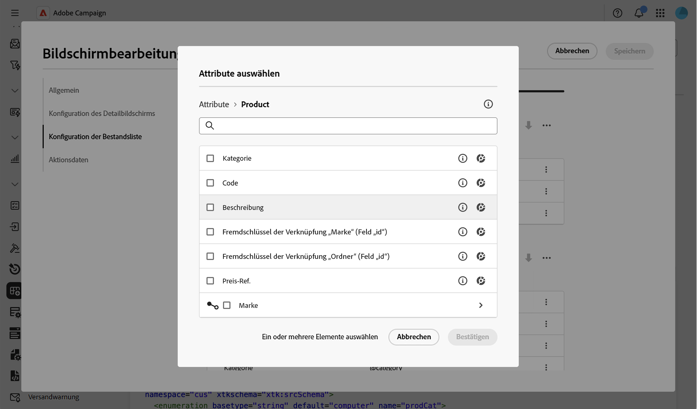
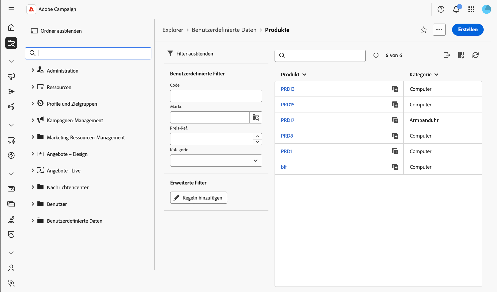

# Hinzufügen benutzerdefinierter Filter {#custom-filters}

Im Abschnitt **[!UICONTROL Konfiguration der Bestandsliste]** > **[!UICONTROL Benutzerdefinierte Filter]** können Sie auswählen, welche Attribute als Schnellzugriffsfelder im [Filterbereich](../query/filter.md) der Listenansicht eines Schemas über dem Regel-Builder **[!UICONTROL Erweiterte Filter]** angezeigt werden.

Weitere Informationen zum Bildschirm „Bildschirmdefinition“ und zum Zugriff darauf finden Sie im Abschnitt [Zugreifen auf die Bildschirmdefinition](schemas-browse-access.md#screen-def).

## Hinzufügen benutzerdefinierter Filter {#add}

1. Navigieren Sie zum Menü **[!UICONTROL Schemata]** und suchen Sie mithilfe der Filter nach bearbeitbaren Schemata.

1. Wählen Sie den Schemanamen in der Liste aus, um das Schema zu öffnen, und klicken Sie in der Ansicht der Schemadetails auf die Schaltfläche **[!UICONTROL Bildschirmbearbeitung]**, um die Bildschirmdefinition aufzurufen.

1. Gehen Sie zum Abschnitt **[!UICONTROL Konfiguration der Bestandsliste]** und klicken Sie auf das Symbol mit den Auslassungspunkten über der Tabelle **[!UICONTROL Benutzerdefinierte Filter]** und wählen Sie dann **[!UICONTROL Attribute auswählen]** aus.

   

1. Wählen Sie ein oder mehrere Attribute aus und bestätigen Sie.

   Sie können Folgendes auswählen:

   * Ein direktes Attribut des Schemas, z. B. ein Code oder eine Kategorie.
   * Ein Link-Attribut, z. B. eine Marke, die mit einem Produkt verknüpft ist. In diesem Fall verwendet der Filter eine Suchauswahl, die auf das verknüpfte Schema beschränkt ist.
   * Ein Unterattribut eines Links, z. B. der vollständige Name eines verknüpften Ordners oder die E-Mail-Adresse einer verknüpften Empfängerin bzw. eines verknüpften Empfängers.

   

1. Klicken Sie auf **[!UICONTROL Speichern]**. Sie können benutzerdefinierte Filter mithilfe der Aufwärts- und Abwärtspfeile neu anordnen oder sie per Drag-and-Drop verschieben. Um einen Filter zu entfernen, klicken Sie auf das Papierkorbsymbol in der entsprechenden Zeile.

1. Navigieren Sie zur Liste der Einträge für dieses Schema und öffnen Sie den Filterbereich. Die ausgewählten Attribute werden als **[!UICONTROL benutzerdefinierte Filter]** über dem Regel-Builder **[!UICONTROL Erweiterte Filter]** angezeigt.

   

   >[!NOTE]
   >
   >Ein benutzerdefinierter Filter, der auf einem Datums- oder Datums- und Uhrzeitattribut basiert, wird als Datumsbereichsauswahl angezeigt.

1. Geben Sie einen Wert in einem der benutzerdefinierten Filter ein oder wählen Sie einen Wert aus, um die Liste zu verfeinern.

<!--
## Configure a custom filter's settings {#settings}

To configure specific settings for a custom filter, click the ellipsis icon on its row and select **[!UICONTROL Edit]**.

Available settings are:

* **[!UICONTROL Label (custom)]**: The label to display for this filter. If no label is provided, the attribute's label defined in the schema is used.
* **[!UICONTROL Filter settings]** (for link-type custom filters only): Use the query modeler to specify a condition that restricts the values available in the picker. For example, restrict a delivery filter to deliveries using the email channel.
-->