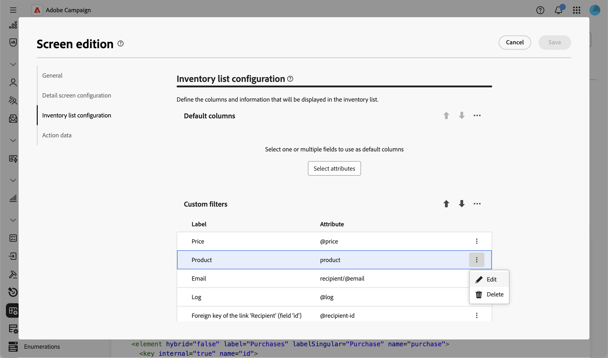

# Hinzufügen benutzerdefinierter Filter {#custom-filters}

Im Abschnitt **[!UICONTROL Konfiguration der Bestandsliste]** > **[!UICONTROL Benutzerdefinierte Filter]** können Sie auswählen, welche Attribute als Schnellzugriffsfelder im [Filterbereich](../query/filter.md) der Listenansicht eines Schemas über dem Regel-Builder **[!UICONTROL Erweiterte Filter]** angezeigt werden.

Weitere Informationen zum Bildschirm „Bildschirmdefinition“ und zum Zugriff darauf finden Sie im Abschnitt [Zugreifen auf die Bildschirmdefinition](schemas-browse-access.md#screen-def).

## Hinzufügen benutzerdefinierter Filter {#add}

1. Navigieren Sie zum Menü **[!UICONTROL Schemata]** und suchen Sie mithilfe der Filter nach bearbeitbaren Schemata.

1. Wählen Sie den Schemanamen in der Liste aus, um das Schema zu öffnen, und klicken Sie in der Ansicht der Schemadetails auf die Schaltfläche **[!UICONTROL Bildschirmbearbeitung]**, um die Bildschirmdefinition aufzurufen.

1. Gehen Sie zum Abschnitt **[!UICONTROL Konfiguration der Bestandsliste]** und klicken Sie auf das Symbol mit den Auslassungspunkten über der Tabelle **[!UICONTROL Benutzerdefinierte Filter]** und wählen Sie dann **[!UICONTROL Attribute auswählen]** aus.

   

1. Wählen Sie ein oder mehrere Attribute aus und bestätigen Sie.

   Sie können Folgendes auswählen:

   * Ein direktes Attribut des Schemas, z. B. ein Code oder eine Kategorie.
   * Ein Link-Attribut, z. B. eine Marke, die mit einem Produkt verknüpft ist. In diesem Fall verwendet der Filter eine Suchauswahl, die auf das verknüpfte Schema beschränkt ist.
   * Ein Unterattribut eines Links, z. B. der vollständige Name eines verknüpften Ordners oder die E-Mail-Adresse einer verknüpften Empfängerin bzw. eines verknüpften Empfängers.

   

1. Klicken Sie auf **[!UICONTROL Speichern]**. Sie können benutzerdefinierte Filter mithilfe der Pfeile nach oben und unten oder durch Ziehen neu anordnen. Um einen Filter zu entfernen, klicken Sie auf das Symbol mit den Auslassungspunkten in der Zeile und wählen Sie **[!UICONTROL Löschen]** aus.

1. Navigieren Sie zur Liste der Einträge für dieses Schema und öffnen Sie den Filterbereich. Die ausgewählten Attribute werden als **[!UICONTROL benutzerdefinierte Filter]** über dem Regel-Builder **[!UICONTROL Erweiterte Filter]** angezeigt.

   

   >[!NOTE]
   >
   >Ein benutzerdefinierter Filter, der auf einem Datums- oder Datums- und Uhrzeitattribut basiert, wird als Datumsbereichsauswahl angezeigt.

1. Geben Sie einen Wert in einem der benutzerdefinierten Filter ein oder wählen Sie einen Wert aus, um die Liste zu verfeinern.

## Einschränken von Werten für einen benutzerdefinierten Filter vom Typ „Link“ {#settings}

Bei einem benutzerdefinierten Filter, der auf einem Link-Attribut basiert, können Sie einschränken, welche Werte in der Auswahl verfügbar sind.

>[!NOTE]
>
>Die **[!UICONTROL Bearbeiten]** unten beschriebene Option ist nur für benutzerdefinierte Filter verfügbar, die auf einem Link-Attribut basieren. Benutzerdefinierte Filter, die auf anderen Attributtypen basieren, können nur neu angeordnet oder entfernt werden.

1. Klicken Sie in der Zeile eines benutzerdefinierten Filters vom Typ Link auf das Symbol mit den Auslassungspunkten und wählen Sie **[!UICONTROL Bearbeiten]** aus.

   

1. Klicken Sie auf **[!UICONTROL Registerkarte]** Filtereinstellungen) auf **[!UICONTROL Filter bearbeiten]** und verwenden Sie den Abfrage-Modellierer, um eine Bedingung zu definieren, die die in der Auswahl verfügbaren Werte einschränkt. Sie können beispielsweise einen Versandfilter auf Sendungen beschränken, die den E-Mail-Kanal verwenden.

   

1. Bestätigen Sie Ihre Änderungen.
