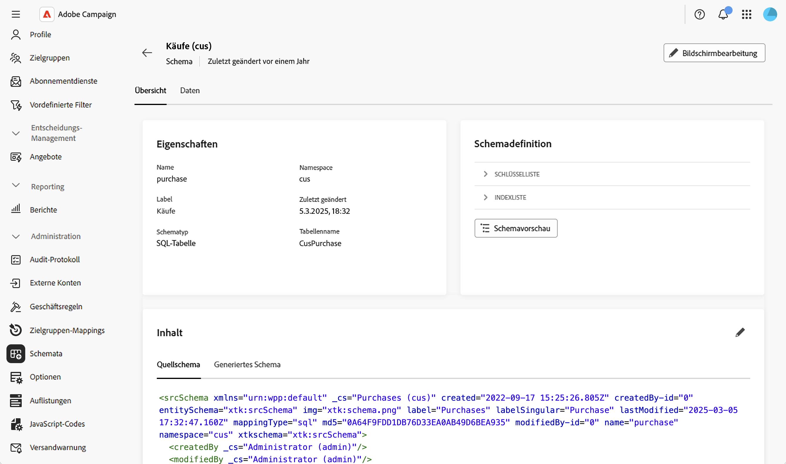
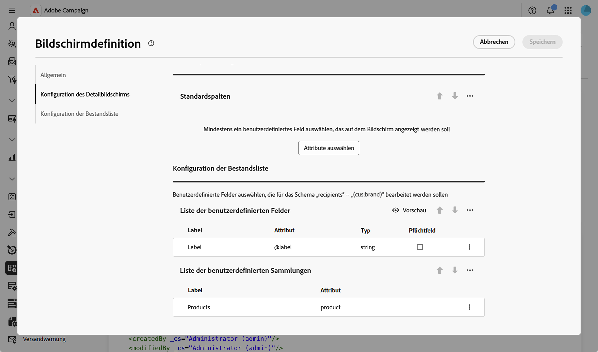
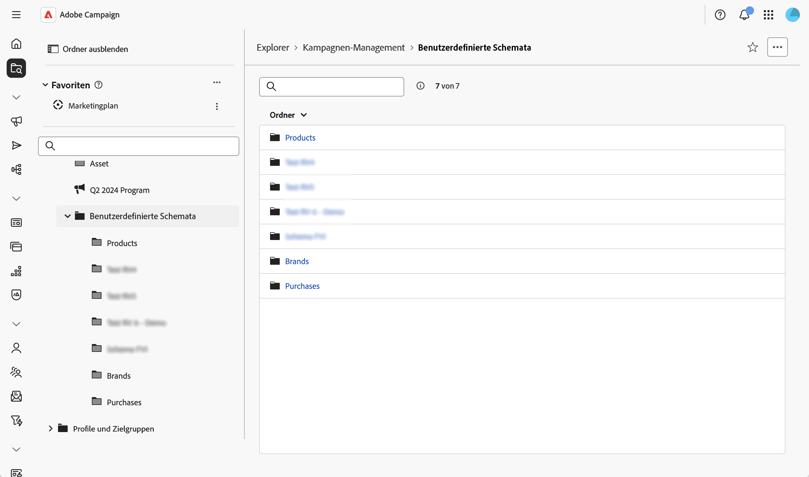
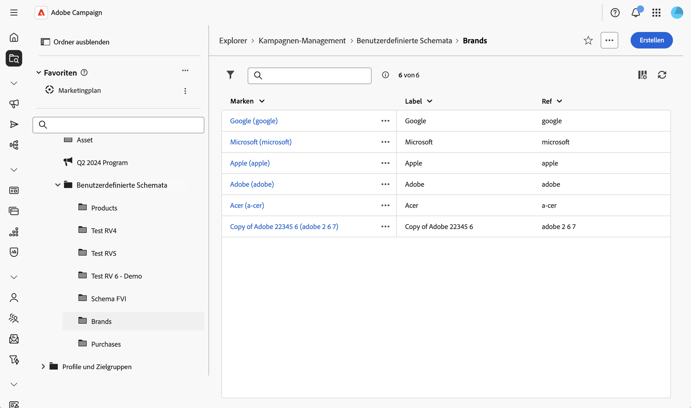

# Arbeiten mit benutzerdefinierten Formularen {#custom-forms}

Benutzerdefinierte Formulare sind Dateneingabeschnittstellen, mit denen Sie Datensätze in benutzerdefinierten Schemata direkt über die Web-Benutzeroberfläche verwalten können. Jedes benutzerdefinierte Formular entspricht einem bestimmten benutzerdefinierten Schema und bietet eine Listenansicht zum Durchsuchen von Datensätzen und eine Detailansicht zum Erstellen, Bearbeiten und Löschen von Datensätzen.

Benutzerdefinierte Formulare basieren auf der Formulardefinition (Bildschirmdefinition) des Schemas, die konfiguriert, welche Felder angezeigt werden und wie sie organisiert sind.

>[!NOTE]
>
>Benutzerdefinierte Formulare sind nur für Schemata verfügbar, für die eine Formulardefinition konfiguriert ist.

## Erstellen und Veröffentlichen der benutzerdefinierten Schemata {#form-schema}

Zunächst müssen Sie Ihre benutzerdefinierten Schemata erstellen und veröffentlichen. Detaillierte Anweisungen finden Sie in diesem [Abschnitt](schemas-create-publish.md).

Im Folgenden finden Sie das für dieses Beispiel verwendete Datenmodell:

* Ein Empfänger tätigt mehrere Käufe
* Ein Kauf ist mit einem Produkt verknüpft
* Ein Produkt ist mit einer Marke verknüpft

Für diesen Anwendungsfall werden drei Schemata erstellt: die Schemata „Einkäufe“, „Produkte“ und „Marke“. Hier ein Beispiel:

## Konfigurieren der Bildschirmdefinition {#form-screen-schema}

Legen Sie fest, welche Felder angezeigt und wie sie organisiert werden. Detaillierte Anweisungen finden Sie in diesem [Abschnitt](schemas-browse-access.md#screen-def).

Im Folgenden finden Sie ein Beispiel für das Markenschema, bei dem die benutzerdefinierte Liste Produkte hinzugefügt wird. Das Formular zeigt dann die Liste der mit der Marke verknüpften Produkte an.

Für das Schema Produkte fügen wir die benutzerdefinierte Liste Bestellungen hinzu. Und für das Kaufschema die Felder Produkt und Empfänger .

## Erstellen von Navigationseinträgen {#form-screen-entries}

Erstellen Sie Ordner im Explorer, um auf Ihr benutzerdefiniertes Formular zuzugreifen. Detaillierte Anweisungen finden Sie in diesem [Abschnitt](schemas-create-publish.md#navigation).

Die Listenansicht zeigt alle Datensätze für dieses Schema an. Wenn für das Schema eine Formulardefinition konfiguriert ist, kann die Liste bearbeitet werden und Sie können Datensätze erstellen, bearbeiten und löschen.

Anschließend können Sie:

* **Datensätze anzeigen und bearbeiten**: Klicken Sie in der Listenansicht auf einen Datensatz, um ihn in der Detailansicht zu öffnen und Felder direkt zu bearbeiten.
* **Neue Datensätze erstellen**: Klicken Sie auf die Schaltfläche **[!UICONTROL Erstellen]** und füllen Sie die erforderlichen Felder aus. Verwenden Sie für verknüpfte Felder das Suchsymbol, um aus verfügbaren verknüpften Datensätzen auszuwählen.
* **Datensätze löschen**: Wählen Sie einen Datensatz aus und verwenden Sie die Löschaktion, die in der Datensatzdetails- oder Listenansicht verfügbar ist.
* **Anzeigen verwandter Daten in Registerkarten**: Greifen Sie über spezielle Registerkarten in der Detailansicht auf verwandte Datensätze zu (z. B. zeigen Sie alle mit einer Marke verknüpften Produkte oder alle mit einem Produkt verknüpften Käufe an).
* **Filter anwenden**: Verwenden Sie das Bedienfeld „Filter“, um die Listenansicht zu verfeinern und spezifische Datensätze basierend auf einem beliebigen Feld in Ihrem Schema zu finden.
* **Listenspalten anpassen**: Mit dieser Option können Sie über die Bildschirmdefinition konfigurieren, welche Spalten in Listenansichten standardmäßig angezeigt werden.
