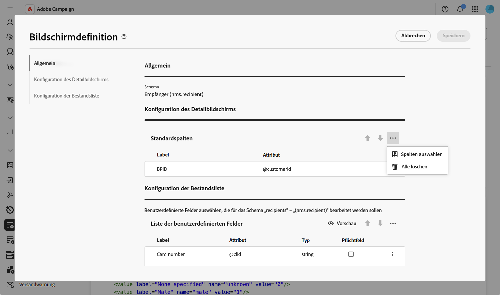
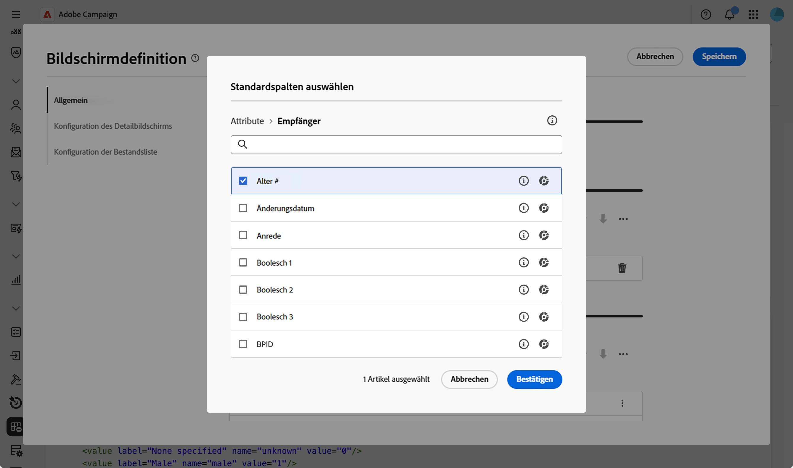
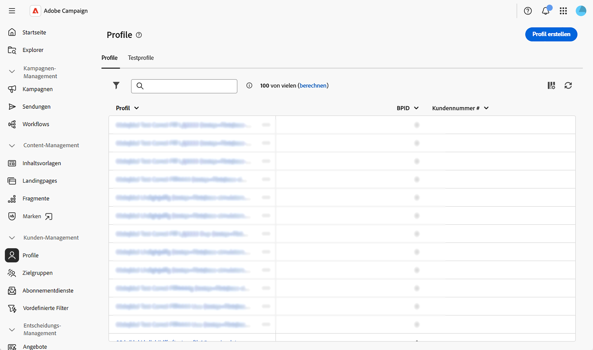

# Konfigurieren von Listenspalten {#list-columns}

Im **[!UICONTROL Konfiguration der Inventarliste]** können Sie konfigurieren, welche Spalten standardmäßig in Listenansichten angezeigt werden. Jede Spalte zeigt ihre Bezeichnung und das entsprechende Attribut an.

Weitere Informationen zum Bildschirm-Definitionsbildschirm und zum Zugriff darauf finden Sie im Abschnitt [Zugriff auf die Bildschirmdefinition](schemas-browse-access.md#screen-def).

So fügen Sie der Standardliste neue Spalten hinzu:

1. Navigieren Sie zum Menü **[!UICONTROL Schemata]** und suchen Sie mithilfe der Filter nach bearbeitbaren Schemata.

1. Wählen Sie den Schemanamen in der Liste aus, um ihn zu öffnen, und klicken Sie in der Ansicht mit den Schemadetails auf **** Bildschirmbearbeitung“, um auf die Bildschirmdefinition zuzugreifen.

1. Klicken Sie auf das Symbol mit den Auslassungspunkten (drei Punkte).
1. Wählen Sie **[!UICONTROL Spalten auswählen]**.
   

1. Wählen Sie die Attribute aus, die in Listenansichten angezeigt werden sollen, und bestätigen Sie sie.

   

1. Navigieren Sie zum Menü **Profile**, um auf die Profillistenansicht zuzugreifen. Die neuen Registerkarten werden angezeigt. Sie können bei Bedarf weitere Spalten hinzufügen.

   
