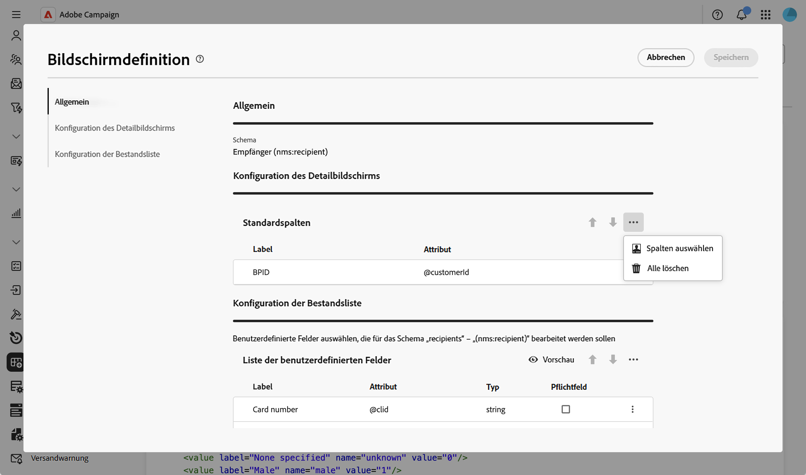
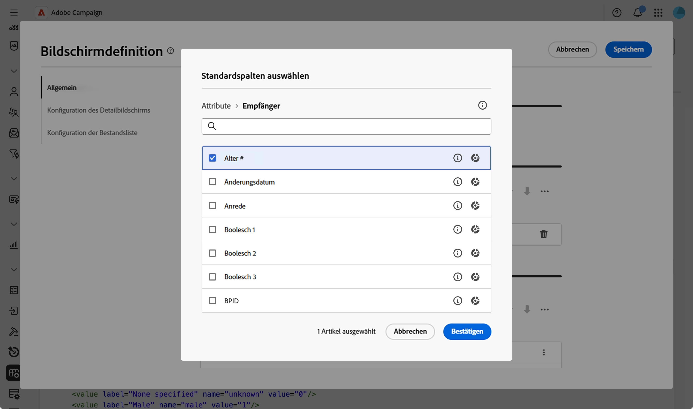
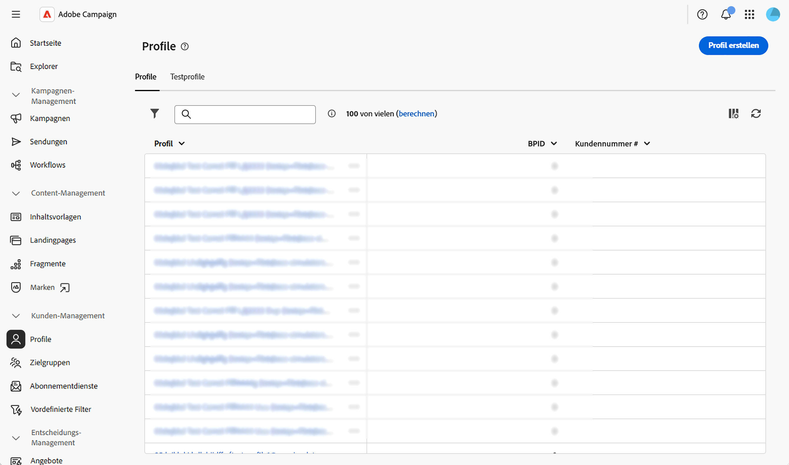

# Konfigurieren von Listenspalten {#list-columns}

>[!CONTEXTUALHELP]
>id="acw_schema_inventory_list_configuration"
>title="Konfiguration der Inventarliste"
>abstract="Konfigurieren Sie, welche Spalten in Listenansichten standardmäßig angezeigt werden. Jede Spalte zeigt das Label und das entsprechende Attribut an. Fügen Sie benutzerdefinierte Filter hinzu, um Schnellzugriff-Filterfelder im Filterbereich der Listenansicht anzuzeigen."
>additional-url="https://experienceleague.adobe.com/docs/campaign-web/v8/conf/schemas/schemas-custom-filters.html" text="Hinzufügen benutzerdefinierter Filter"

Im Abschnitt **[!UICONTROL Konfiguration der Bestandsliste]** können Sie konfigurieren, welche Spalten standardmäßig in Listenansichten angezeigt werden. Jede Spalte zeigt das Label und das entsprechende Attribut an.

Weitere Informationen zum Bildschirm „Bildschirmdefinition“ und zum Zugriff darauf finden Sie im Abschnitt [Zugreifen auf die Bildschirmdefinition](schemas-browse-access.md#screen-def).

So fügen Sie der Standardliste neue Spalten hinzu:

1. Navigieren Sie zum Menü **[!UICONTROL Schemata]** und suchen Sie mithilfe der Filter nach bearbeitbaren Schemata.

1. Wählen Sie den Schemanamen in der Liste aus, um das Schema zu öffnen, und klicken Sie in der Ansicht der Schemadetails auf die Schaltfläche **[!UICONTROL Bildschirmbearbeitung]**, um die Bildschirmdefinition aufzurufen.

1. Klicken Sie auf das Symbol mit den Auslassungspunkten (drei Punkte).
1. Wählen Sie **[!UICONTROL Spalten auswählen]**.
   

1. Wählen Sie die Attribute aus, die in Listenansichten angezeigt werden sollen, und bestätigen Sie sie.

   

1. Navigieren Sie zum Menü **Profile**, um auf die Profillistenansicht zuzugreifen. Sie werden feststellen, dass die neuen Registerkarten angezeigt werden. Sie können bei Bedarf weitere Spalten hinzufügen.

   

>[!NOTE]
>
>Sie können im Bereich Filter der Listenansicht auch Felder für Schnellfilter hinzufügen. Weitere Informationen finden Sie unter [Hinzufügen benutzerdefinierter Filter](schemas-custom-filters.md).
