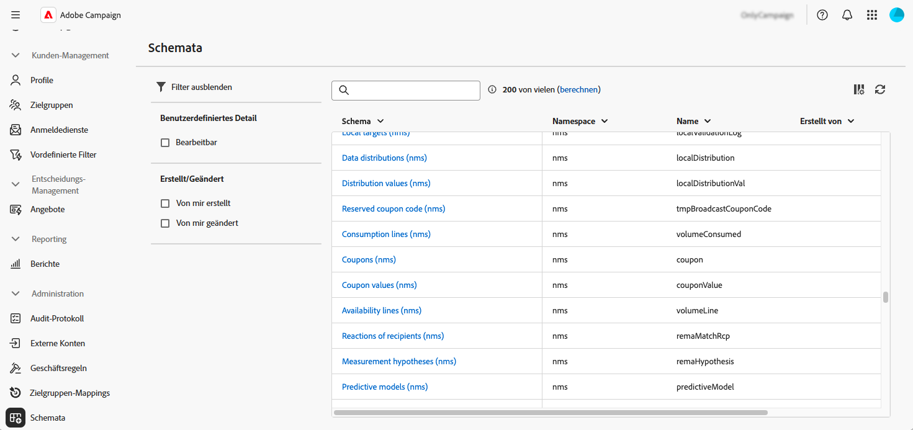
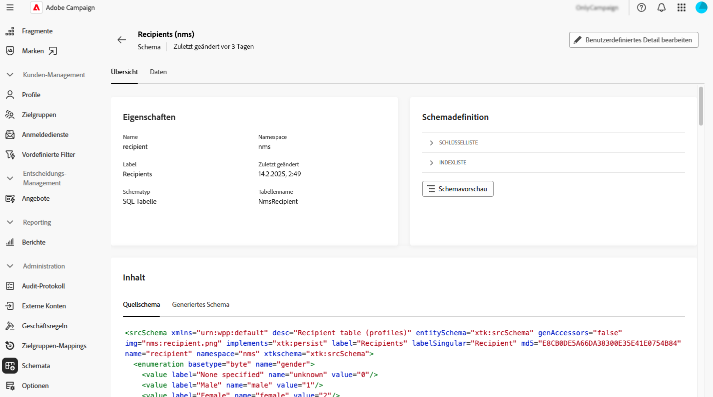
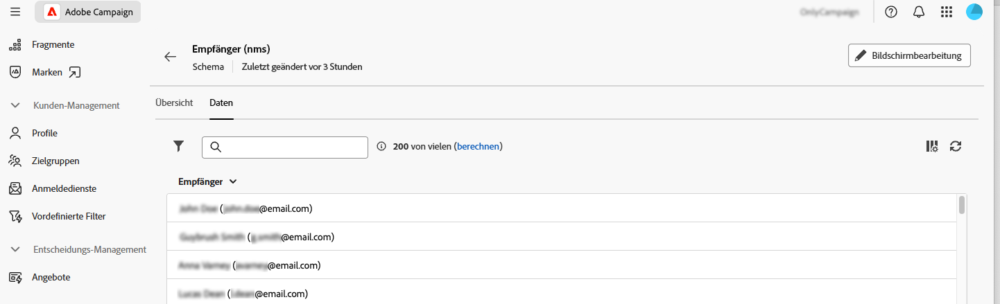
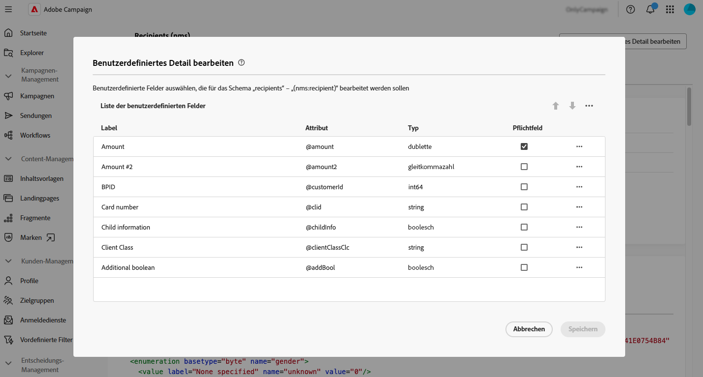

# Arbeiten mit Schemata {#schemas}

>[!CONTEXTUALHELP]
>id="acw_schema"
>title="Schemata"
>abstract="**[!DNL Adobe Campaign]** verwendet XML-basierte Schemata, um die physische und logische Struktur von Daten innerhalb der Anwendung zu definieren. Auf diesem Bildschirm können Sie alle vorhandenen Schemata anzeigen und auf die Details eines Schemas zugreifen, indem Sie dessen Namen in der Liste auswählen. Es stehen Filter zur Verfügung, mit denen Sie die Liste einschränken können, z. B. nur bearbeitbare Schemata anzeigen."

## Über Schemata {#about}

**[!DNL Adobe Campaign]** verwendet XML-basierte Schemata, um die physische und logische Struktur von Daten innerhalb der Anwendung zu definieren. Ein Schema ist ein mit einer Datenbanktabelle verknüpftes XML-Dokument, mit dem folgende Aspekte definiert werden: 

* Die SQL-Tabellenstruktur, einschließlich Tabellenname, Felder und Beziehungen.
* Die XML-Datenstruktur, einschließlich Elementen, Attributen, Hierarchien, Typen, Standardwerten und Beschriftungen.

Schemata spielen eine wichtige Rolle bei folgenden Aktivitäten:

* Zuordnen von Anwendungsdaten zu Datenbanktabellen.
* Definieren von Beziehungen zwischen Datenobjekten.
* Angeben der Struktur und der Eigenschaften jedes Felds.

Jede Entität in Adobe Campaign verfügt über ein dediziertes Schema, was die Datenkonsistenz und -organisation gewährleistet.

Ausführliche Informationen zu Schemata finden Sie in der Dokumentation zur [-Konsole ](https://experienceleague.adobe.com/de/docs/campaign/campaign-v8/developer/shemas-forms/schemas){target="_blank"}.

## Zugreifen auf Schemata über die Web-Benutzeroberfläche {#access}

Auf Schemata kann über das Menü **[!UICONTROL Administration]** > **[!UICONTROL Schemata]** zugegriffen werden.

Auf diesem Bildschirm können Sie alle vorhandenen Schemata anzeigen. Es stehen Filter zur Verfügung, mit denen Sie die Liste einschränken können, z. B. nur bearbeitbare Schemata anzeigen.

Um ein Schema zu öffnen, wählen Sie seinen Namen aus. Eine detaillierte Schemaansicht wird angezeigt.

### Übersicht über das Schema {#overview}

Auf der Registerkarte **[!UICONTROL Übersicht]** finden Sie eine allgemeine Ansicht des Schemas:

* Im Abschnitt **[!UICONTROL Eigenschaften]** werden wichtige Informationen angezeigt, z. B. der Schemaname, der Namespace und der zugehörige Tabellenname.

* Der Abschnitt **[!UICONTROL Schemadefinition]** zeigt Details zur Schemadefinition an, einschließlich des für die Datenabstimmung verwendeten Primärschlüssels und seiner Verknüpfungen mit anderen Tabellen.

  Klicken Sie auf **[!UICONTROL Schemavorschau]**, um die verschiedenen Felder und Links anzuzeigen, aus denen das Schema besteht. Auf diese Weise können Sie die vollständige Struktur eines Schemas überprüfen. Wenn das Schema mit benutzerdefinierten Feldern erweitert wurde, können Sie alle Erweiterungen visualisieren.

* Im Abschnitt **[!UICONTROL Inhalt]** wird der XML-Inhalt des Schemas angezeigt, sodass Sie zwischen der Quelle und der generierten Syntax wechseln können.

### Schemadaten {#data}

Die Registerkarte **[!UICONTROL Daten]** enthält Informationen zu den Schemadaten.

## Bearbeiten benutzerdefinierter Felder {#fields}

Benutzerdefinierte Felder sind zusätzliche Attribute, die über die Adobe Campaign-Konsole zu vorkonfigurierten Schemata hinzugefügt werden. Sie ermöglichen es Ihnen, Schemata anzupassen, indem neue Attribute entsprechend den Anforderungen Ihrer Organisation eingefügt werden. 

Benutzerdefinierte Felder können auf verschiedenen Bildschirmen angezeigt werden, z. B. in Profildetails in der Web-Benutzeroberfläche von Campaign. Sie können steuern, welche Felder sichtbar sind und wie sie in der Oberfläche angezeigt werden. Klicken Sie dazu auf die Schaltfläche **[!UICONTROL Bildschirmbearbeitung]** im Menü **[!UICONTROL Schemata]**.

Klicken Sie **[!UICONTROL Vorschau]**, um die benutzerdefinierten Felder in einem Beispielbildschirm anzuzeigen.

Detaillierte Informationen zum Bearbeiten von benutzerdefinierten Feldern in einem Schema finden Sie in diesem Abschnitt: [Konfigurieren von benutzerdefinierten Feldern](../administration/custom-fields.md).