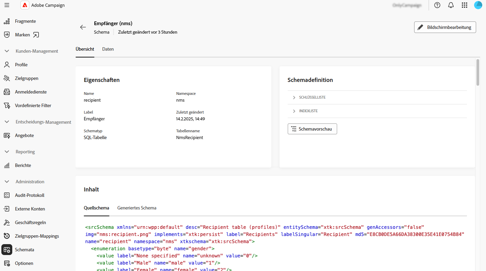

# Arbeiten mit Schemata {#schemas}

>[!CONTEXTUALHELP]
>id="acw_homepage_welcome_rn3"
>title="Arbeiten mit Schemata"
>abstract="Sie können jetzt auf die Details eines Schemas zugreifen, indem Sie dessen Namen in der Liste auswählen. Die Bearbeitung benutzerdefinierter Felder ist auch über die Schaltfläche **Benutzerdefiniertes Detail bearbeiten** zugänglich."
>additional-url="https://experienceleague.adobe.com/docs/campaign-web/v8/release-notes/release-notes.html?lang=de" text="Siehe Versionshinweise"

>[!CONTEXTUALHELP]
>id="acw_schema"
>title="Schemata"
>abstract="**[!DNL Adobe Campaign]** verwendet XML-basierte Schemata, um die physische und logische Struktur von Daten innerhalb der Anwendung zu definieren. Auf diesem Bildschirm können Sie alle vorhandenen Schemata anzeigen und auf die Details eines Schemas zugreifen, indem Sie dessen Namen in der Liste auswählen. Es stehen Filter zur Verfügung, mit denen Sie die Liste einschränken können, z. B. nur bearbeitbare Schemata anzeigen."

## Über Schemata {#about}

**[!DNL Adobe Campaign]** verwendet XML-basierte Schemata, um die physische und logische Struktur von Daten innerhalb der Anwendung zu definieren. Ein Schema ist ein XML-Dokument, das mit einer Datenbanktabelle verknüpft ist, die Folgendes definiert:

* Die SQL-Tabellenstruktur (Tabellenname, Felder, Beziehungen).
* Die XML-Datenstruktur (Elemente, Attribute, Hierarchie, Typen, Standardwerte, Beschriftungen).

Schemas spielen eine wichtige Rolle bei:

* Zuordnen von Anwendungsdaten zu Datenbanktabellen.
* Definieren von Beziehungen zwischen Datenobjekten.
* Angeben der Struktur und der Eigenschaften jedes Felds.

Jede Entität in Adobe Campaign verfügt über ein dediziertes Schema, das die Datenkonsistenz und -organisation gewährleistet.

Ausführliche Informationen zu Schemata finden Sie in der Dokumentation [Campaign-Konsole](https://experienceleague.adobe.com/de/docs/campaign/campaign-v8/developer/shemas-forms/schemas){target="_blank"}

## Zugreifen auf Schemata über die Web-Benutzeroberfläche {#access}

Auf Schemata kann über das Menü **[!UICONTROL Administration]** > **[!UICONTROL Schemata]** zugegriffen werden.

Auf diesem Bildschirm können Sie alle vorhandenen Schemata anzeigen. Es stehen Filter zur Verfügung, mit denen Sie die Liste einschränken können, z. B. nur bearbeitbare Schemata anzeigen.

Um ein Schema zu öffnen, wählen Sie seinen Namen aus. Eine detaillierte Schemaansicht wird angezeigt.

### Übersicht über das Schema {#overview}

Die **[!UICONTROL Übersicht]** bietet eine allgemeine Ansicht des Schemas:

* Der Abschnitt **[!UICONTROL Eigenschaften]** zeigt wichtige Informationen an, z. B. den Schemanamen, den Namespace und den zugehörigen Tabellennamen.

* Der Abschnitt **[!UICONTROL Schemadefinition]** zeigt Details zur Schemadefinition an, z. B. den für die Datenabstimmung verwendeten Primärschlüssel und seine Verknüpfungen mit anderen Tabellen.

  Klicken Sie auf **[!UICONTROL Schemavorschau]**, um die verschiedenen Felder und Links anzuzeigen, aus denen das Schema besteht. Auf diese Weise können Sie die vollständige Struktur eines Schemas überprüfen. Wenn das Schema mit benutzerdefinierten Feldern erweitert wurde, können Sie alle Erweiterungen visualisieren.

* Im **[!UICONTROL content]** wird der XML-Inhalt des Schemas angezeigt, sodass Sie zwischen der Quelle und der generierten Syntax wechseln können.

### Schemadaten {#data}

Die **[!UICONTROL Daten]** enthält Informationen zu den Schemadaten.

## Benutzerdefinierte Felder bearbeiten {#fields}

Benutzerdefinierte Felder sind zusätzliche Attribute, die über die Adobe Campaign-Konsole zu vorkonfigurierten Schemata hinzugefügt werden. Sie ermöglichen es Ihnen, Schemata anzupassen, indem neue Attribute entsprechend den Anforderungen Ihres Unternehmens eingefügt werden.

Benutzerdefinierte Felder können auf verschiedenen Bildschirmen angezeigt werden, z. B. in den Profildetails in der Campaign Web-Benutzeroberfläche. Sie können steuern, welche Felder sichtbar sind und wie sie in der Benutzeroberfläche angezeigt werden. Klicken Sie dazu auf **[!UICONTROL Schaltfläche Benutzerdefinierte Details bearbeiten]** Menü **[!UICONTROL Schemata]**.

Detaillierte Informationen zum Bearbeiten von benutzerdefinierten Feldern in einem Schema finden Sie in diesem Abschnitt: [Konfigurieren von benutzerdefinierten Feldern](../administration/custom-fields.md).
