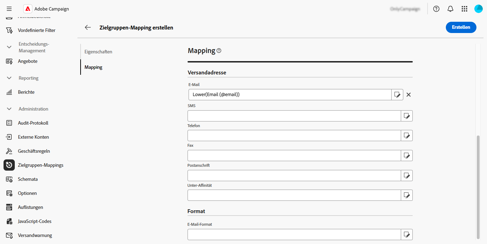

# Verwalten von Zielgruppen-Mappings {#target-mappings}

>[!CONTEXTUALHELP]
>id="acw_homepage_welcome_rn4"
>title="Zielgruppen-Mappings"
>abstract="Sie können jetzt Zielgruppen-Mappings in der Campaign Web-Benutzeroberfläche erstellen. Zielgruppen-Mappings definieren, wie verschiedene Versandkanäle (E-Mail, SMS, Push-Benachrichtigungen) mit den Datenfeldern eines Schemas verknüpft werden."
>additional-url="https://experienceleague.adobe.com/docs/campaign-web/v8/release-notes/release-notes.html?lang=de" text="Siehe Versionshinweise"

>[!CONTEXTUALHELP]
>id="acw_targetmapping_list"
>title="Zielgruppen-Mappings "
>abstract="Zielgruppen-Mappings"

## Über Zielgruppen-Mappings {#about}

Jeder Kommunikationskanal verwendet ein standardmäßiges Zielgruppen-Mapping, um die Empfängerinnen und Empfänger anzusprechen. Beispielsweise haben die E-Mail- und SMS-Versandvorlagen standardmäßig **[!UICONTROL Empfängerinnen und Empfänger]** als Zielgruppe. Das Zielgruppen-Mapping verwendet also die Felder der Tabelle **nms:recipient**. Für Push-Benachrichtigungen ist das standardmäßige Zielgruppen-Mapping **Abonnierte Anwendungen (nms:appSubscriptionRcp)**, das mit der Empfängertabelle verknüpft ist.

Zielgruppen-Mappings sind über das Menü **[!UICONTROL Administration]** > **[!UICONTROL Zielgruppen-Mappings]** zugänglich. Auf diesem Bildschirm können Sie auf Details zu jedem Zielgruppen-Mapping zugreifen oder neue Zielgruppen-Mappings erstellen, die Ihren Anforderungen entsprechen.

Weitere Informationen zu den in Adobe Campaign bereitgestellten integrierten Zielgruppen-Mappings finden Sie in der [Dokumentation zur Client-Konsole von Campaign v8](https://experienceleague.adobe.com/docs/campaign/campaign-v8/audience/add-profiles/target-mappings.html?lang=de){target="_blank"}.

## Erstellen eines Zielgruppen-Mappings {#create-mapping}

>[!CONTEXTUALHELP]
>id="acw_targetmapping_properties"
>title="Zielgruppen-Mapping – Eigenschaften"
>abstract="Im Abschnitt **[!UICONTROL Eigenschaften]** können Sie allgemeine Einstellungen für das Zielgruppen-Mapping und die Zielpopulation definieren."

>[!CONTEXTUALHELP]
>id="acw_targetmapping_mapping"
>title="Zielgruppen-Mapping – Mapping"
>abstract="Im Abschnitt **[!UICONTROL Mapping]** können Sie festlegen, welche Attribute aus dem Schema des Zielgruppen-Mappings für die verschiedenen Versandadressfelder verwendet werden sollen."

>[!CONTEXTUALHELP]
>id="acw_targetmapping_denylist"
>title="Zielgruppen-Mapping – Blockierungsliste"
>abstract="Zielgruppen-Mapping – Blockierungsliste"

>[!CONTEXTUALHELP]
>id="acw_targetmapping_storage"
>title="Zielgruppen-Mapping – Speicherung"
>abstract="Im Abschnitt **[!UICONTROL Speicherung]** können Sie sich darüber informieren, wo Protokolle gespeichert werden müssen."

Um ein neues Zielgruppen-Mapping zu erstellen, rufen Sie das Menü **[!UICONTROL Administration]** > **[!UICONTROL Zielgruppen-Mappings]** auf. Klicken Sie auf die Schaltfläche **[!UICONTROL Mapping erstellen]** und führen Sie dann die in den folgenden Abschnitten beschriebenen Schritte aus.

1. Geben Sie im Abschnitt **[!UICONTROL Eigenschaften]** einen **[!UICONTROL Titel]** für das Zielgruppen-Mapping ein.

1. Erweitern Sie den Abschnitt **[!UICONTROL Weitere Optionen]**, um erweiterte Einstellungen wie den internen Namen, den Speicherordner und die Beschreibung des Zielgruppen-Mappings zu definieren.

1. Wählen Sie die Zielpopulation aus. Sie haben folgende Möglichkeiten:

   * **[!UICONTROL Zielgruppendimension direkt verwenden]**: Wählen Sie die Zielgruppendimension direkt aus der Liste der verfügbaren Dimensionen aus.
   * **[!UICONTROL Verknüpfte Daten verwenden]**: Beginnen Sie mit einer Zielgruppendimension (z. B. Abonnements) und wechseln Sie dann zu der Zielgruppendimension, die Sie ansprechen möchten (z. B. Empfängerinnen und Empfänger).

   

1. Wenn die ausgewählte Dimension noch nicht von einem vorhandenen Zielgruppen-Mapping verwendet wird, müssen die Schemata zum Speichern der Protokolle erstellt werden. Zusätzliche Optionen stehen im Abschnitt **[!UICONTROL Speicher]** zur Verfügung. Erweitern Sie den folgenden Abschnitt, um weitere Informationen zu erhalten.

   +++Speicheroptionen für neue Zielgruppendimensionen

   1. **[!UICONTROL Namespace]**: Identifizieren Sie den Namespace, der zum Erstellen der Protokolle verwendet wird.
   1. **[!UICONTROL Suffix des Erweiterungsschemas]**: Geben Sie ein Suffix für das neue Schema an.

      Im folgenden Beispiel lautet der Broadlog-Name „cusBroadlogSupplier“.

      

   1. **[!UICONTROL Versandlogs]**: Aktivieren Sie die Optionen in diesem Abschnitt, um die Versand-Logs mit einem Segment-Code-Feld oder einem Feld mit der Versand-IP-Adresse anzureichern. Speichern Sie beispielsweise einen während des Workflows berechneten Segment-Code in den Versand-Logs, um die Zielgruppe später zu verfeinern. Dies ermöglicht die Zielgruppenbestimmung von Profilen mit diesem spezifischen Segment-Code.

   1. **[!UICONTROL Ausschlüsse]**: Geben Sie an, wie die Ausschluss-Logs gespeichert werden sollen.

   1. **[!UICONTROL Trackinglogs]**: Aktivieren Sie die Option **[!UICONTROL Tracking-Speicherschema erstellen]**, um ein Speicherschema für Trackinglogs zu generieren

   +++

1. Im Abschnitt **[!UICONTROL Mapping]** können Sie festlegen, welche Attribute aus dem Schema des Zielgruppen-Mappings für die verschiedenen Versandadressfelder verwendet werden sollen. Wählen Sie für jedes Feld das gewünschte Attribut aus, das zugeordnet werden soll. Sie können auch einen Ausdruck erstellen, um das Feld zu identifizieren. Sie können beispielsweise eine niedrigere Funktion auf das Adressattribut anwenden.

   

1. Wenn Ihr Zielgruppen-Mapping fertig ist, klicken Sie auf **[!UICONTROL Erstellen]**. Das System erstellt automatisch das Zielgruppen-Mapping und alle zugehörigen Schemata für die Protokolle.

Nach der Erstellung Ihres Zielgruppen-Mappings werden auf dem Bildschirm zwei zusätzliche Abschnitte angezeigt:

* **[!UICONTROL Blockierungsauflistung]**: In diesem Abschnitt können Sie die Attribute aus dem Schema des Zielgruppen-Mappings identifizieren, die für Blockierungslisten verwendet werden sollen.

  

* **[!UICONTROL Speicher]**: In diesem Abschnitt können Sie die Tabellen angeben, die zum Speichern von Protokollen verwendet werden sollen.

  

   * **[!UICONTROL Nachrichtenschema]**: Gibt das Schema an, das zum Speichern der Versandprotokolle verwendet werden soll.
   * **[!UICONTROL Ausgeschlossene Nachrichten]**: Legt fest, wie der Speicher für Versand- und Ausschlussprotokolle verwaltet wird.

      * **[!UICONTROL Ausschlüsse und Nachrichten in derselben Tabelle speichern]**
      * **[!UICONTROL Nur Nachrichten speichern]**: Ausschlüsse werden nicht gespeichert.
      * **[!UICONTROL Ausschlüsse und Nachrichten in separaten Tabellen speichern]**: Wählen Sie das Schema aus, das zum Speichern der Ausschlussprotokolle im Feld **[!UICONTROL Zurückweisungsschema]** verwendet werden soll.

   * **[!UICONTROL Trackinglogs]**: Wählen Sie aus, wo Trackinglogs und die Standard-Traffic-Quelle gespeichert werden sollen.
   * **[!UICONTROL Zusätzliche Felder]**: Geben Sie eine Liste mit zusätzlichen Feldern an, die in den Versandlogs gespeichert werden sollen. Diese Felder können dauerhaft Informationen über einzelne Mitglieder der Zielgruppe speichern (z. B. `recipient/@firstName`) oder zusätzliche Daten, die während des Workflows berechnet werden (z. B. `[targetData/@offeCode]`).

     Wählen Sie dazu **[!UICONTROL Feld hinzufügen]**. Geben Sie die zu speichernden Informationen im Feld **[!UICONTROL Quelle]** und das Attribut, das in den Versandlogs zum Speichern dieser Informationen verwendet werden soll, im Feld **[!UICONTROL Ziel]** ein.

     {width="50%" zoomable="yes"}