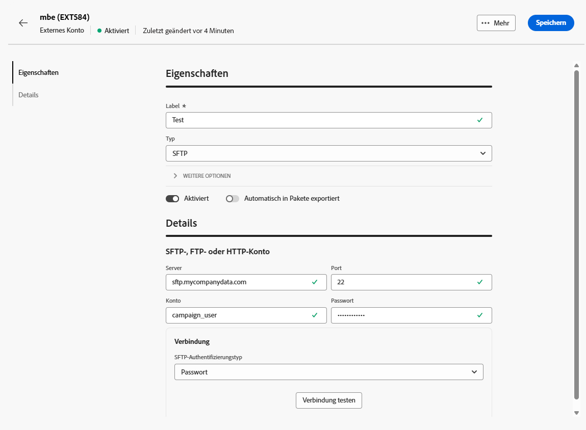
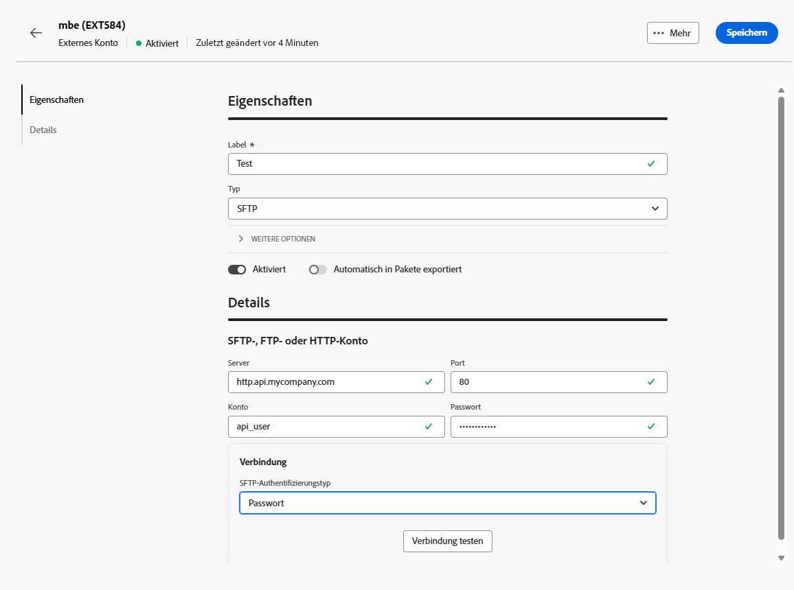
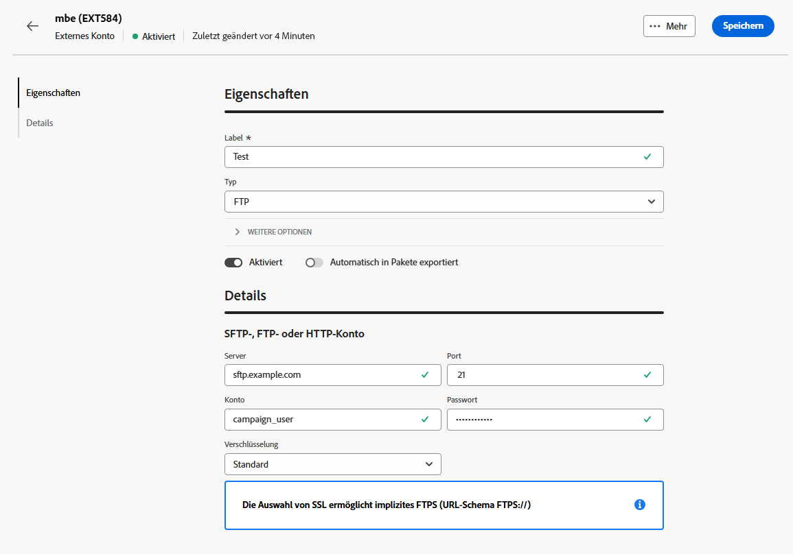

# Übertragen von Daten mit externen Konten {#transfer-external-account}

## Amazon Simple Storage Service (S3) {#amazon-simple-storage-service--s3--external-account}

Der Amazon Simple Storage Service (S3) Connector kann zum Import oder Export von Daten in Adobe Campaign verwendet werden. Er kann in einer Workflow-Aktivität eingerichtet werden. Weitere Informationen hierzu finden Sie auf [dieser Seite](https://experienceleague.adobe.com/de/docs/campaign-web/v8/wf/design-workflows/transfer-file){target=_blank}.

Zum Einrichten dieses neuen externen Kontos benötigen Sie die folgenden Informationen:

* **[!UICONTROL AWS-S3-Konto-Server]**

  Die URL Ihres Servers sollte folgendermaßen ausgefüllt werden:

  `  <S3bucket name>.s3.amazonaws.com/<s3object path>`

* **[!UICONTROL Kennung des AWS-Zugangsschlüssels]**

  Informationen darüber, wo Sie Ihre Kennung des AWS-Zugangsschlüssels finden, erhalten Sie auf dieser [Seite](https://docs.aws.amazon.com/general/latest/gr/aws-sec-cred-types.html#access-keys-and-secret-access-keys).

* **[!UICONTROL Geheimer AWS-Zugangsschlüssel]**

  Informationen darüber, wo Sie Ihren geheimen AWS-Zugangsschlüssel finden, erfahren Sie auf dieser [Seite](https://aws.amazon.com/fr/blogs/security/wheres-my-secret-access-key/).

* **[!UICONTROL AWS-Region]**

  Weiterführende Informationen zur AWS-Region finden Sie auf dieser [Seite](https://aws.amazon.com/about-aws/global-infrastructure/regions_az/).

* Die Checkbox **[!UICONTROL Serverseitige Verschlüsselung verwenden]** ermöglicht es Ihnen, Ihre Datei in S3 im verschlüsselten Modus zu speichern.

Informationen darüber, wo Sie die Kennung des Zugriffsschlüssels und den geheimen Zugriffsschlüssel finden, erhalten Sie in der [Dokumentation](https://docs.aws.amazon.com/general/latest/gr/aws-sec-cred-types.html#access-keys-and-secret-access-keys) zu Amazon Web Services.

## Azur Blob Storage {#azure-blob-external-account}

Das externe **[!UICONTROL Azure Blog Storage]**-Konto kann mithilfe einer Workflow-Aktivität vom Typ **[!UICONTROL Datei übertragen]** zum Importieren oder Exportieren von Daten in Adobe Campaign verwendet werden. Weiterführende Informationen hierzu finden Sie in [diesem Abschnitt](https://experienceleague.adobe.com/de/docs/campaign-web/v8/wf/design-workflows/transfer-file){target=_blank}.

Um das **[!UICONTROL externe Azure-Konto]** für die gemeinsame Verwendung mit Adobe Campaign zu konfigurieren, müssen Sie die folgenden Informationen eingeben:

* **[!UICONTROL Server]**

  URL Ihres Azure Blob Storage-Servers.

* **[!UICONTROL Verschlüsselung]**

  Typ der gewählten Verschlüsselung: **[!UICONTROL Keine]** oder **[!UICONTROL SSL]**.

* **[!UICONTROL Zugriffsschlüssel]**

  Informationen darüber, wo Sie Ihren **[!UICONTROL Zugangsschlüssel]** finden, erhalten Sie auf dieser [Seite](https://docs.microsoft.com/de-de/azure/storage/common/storage-account-keys-manage?tabs=azure-portal).

## SFTP

Mit dem externen SFTP -Konto können Sie den Zugriff auf einen Server außerhalb von Adobe Campaign konfigurieren und testen.

Um das externe **[!UICONTROL SFTP]**-Konto zu konfigurieren, füllen Sie die folgenden Felder aus:

* **[!UICONTROL Server]**

  Geben Sie den Namen oder die Adresse des SFTP-Servers ein.

* **[!UICONTROL Port]**

  Geben Sie die Port-Nummer der SFTP-Verbindung an. Der Standard-Port ist 22.

* **[!UICONTROL Konto]**

  Geben Sie den Benutzernamen ein, mit dem eine Verbindung zum SFTP-Server hergestellt wird.

* **[!UICONTROL Passwort]**

  Geben Sie das Passwort für das SFTP-Konto ein.

* **[!UICONTROL SFTP-Authentifizierungstyp]**

  Methode zur Authentifizierung beim SFTP-Server auswählen. Zu den Optionen gehören:

   * **[!UICONTROL Kennwort]**: Authentifizierung mit dem Kennwort des Kontos.

   * **[!UICONTROL Öffentlicher Schlüssel]**: Authentifizierung mithilfe eines SSH-Schlüsselpaars (privater und öffentlicher Schlüssel).

Wenn **[!UICONTROL Öffentlicher Schlüssel]**-Authentifizierung ausgewählt ist, müssen die folgenden Felder ausgefüllt werden:

* **[!UICONTROL Datei mit privatem Schlüssel]**

  Geben Sie die private SSH-Schlüsseldatei an, die für die Authentifizierung verwendet wird.

* **[!UICONTROL Datei mit öffentlichem Schlüssel]**

  Geben Sie den entsprechenden öffentlichen SSH-Schlüssel an, der auf dem SFTP-Server registriert ist.

* **[!UICONTROL SSH-Schlüssel-Passphrase]**

  Geben Sie die Passphrase zum Entschlüsseln des privaten Schlüssels ein, wenn er geschützt ist.

## HTTP

Mit dem externen HTTP-Konto können Sie den Zugriff auf einen Server außerhalb von Adobe Campaign konfigurieren und testen.

Um das externe **[!UICONTROL HTTP]**-Konto zu konfigurieren, füllen Sie die folgenden Felder aus:

* **[!UICONTROL Server]**

  Geben Sie den Namen oder die Adresse des HTTP-Servers ein.

* **[!UICONTROL Port]**

  Geben Sie die Port-Nummer der HTTP-Verbindung an. Der Standard-Port ist 80.

* **[!UICONTROL Konto]**

  Geben Sie den Benutzernamen für die Authentifizierung ein.

* **[!UICONTROL Passwort]**

  Geben Sie das Passwort für das Benutzerkonto ein.

* **[!UICONTROL SFTP-Authentifizierungstyp]**

  Wählen Sie den Authentifizierungstyp für die Verbindung. Zu den Optionen gehören:

   * Passwort
   * Öffentlicher Schlüssel

Wenn Sie die Authentifizierung **[!UICONTROL Öffentlicher Schlüssel]** verwenden, geben Sie im Menü **[!UICONTROL PublicKey-]**) die erforderlichen Werte für Folgendes ein:

* **[!UICONTROL Password]**: Die Passphrase zum Schutz des privaten Schlüssels, falls zutreffend.

* **[!UICONTROL Privater Schlüssel]**: Der zur Authentifizierung des Snowflake-Kontos verwendete private Schlüssel.

## FTP

Mit dem externen FTP -Konto können Sie den Zugriff auf einen Server außerhalb von Adobe Campaign konfigurieren und testen.

Um das externe **[!UICONTROL FTP]**-Konto zu konfigurieren, füllen Sie die folgenden Felder aus:

* **[!UICONTROL Server]**

  Geben Sie den Namen oder die Adresse des FTP-Servers ein.

* **[!UICONTROL Port]**

  Geben Sie die Port-Nummer der FTP-Verbindung an. Der Standard-Port ist 21.

* **[!UICONTROL Konto]**

  Geben Sie den Benutzernamen für die Authentifizierung ein.

* **[!UICONTROL Passwort]**

  Geben Sie das Passwort für das Benutzerkonto ein.

* **[!UICONTROL Verschlüsselung]**

  Wählen Sie den Verschlüsselungstyp für die Verbindung aus. Zu den Optionen gehören:

   * Standard
   * POP3 + STARTTLS
   * POP3 nicht gesichert
   * POP3 gesichert