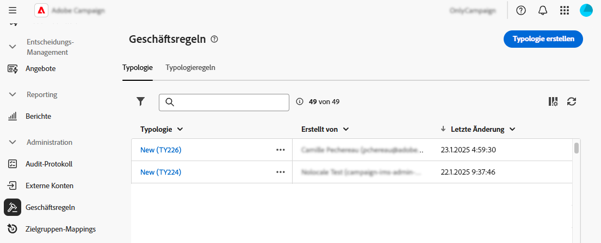
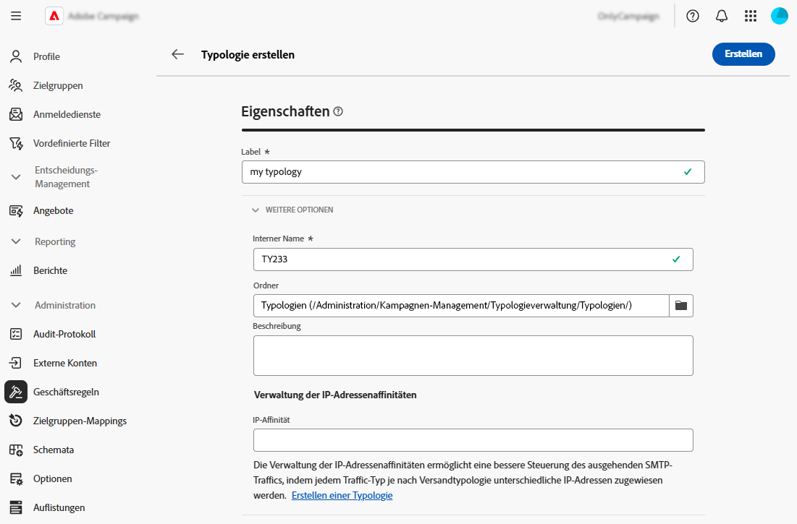
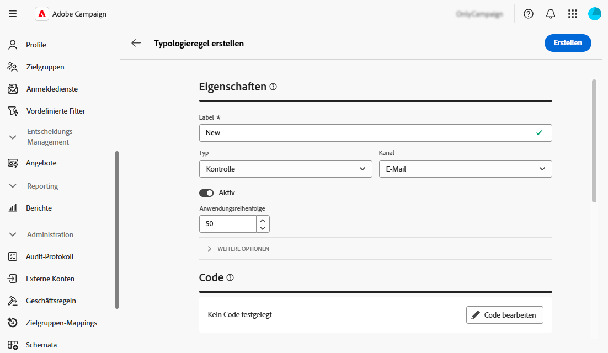
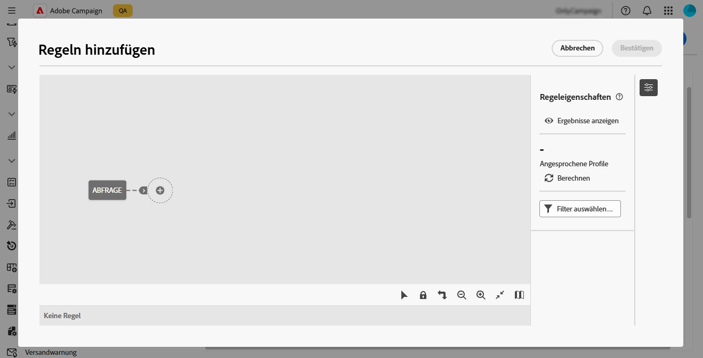
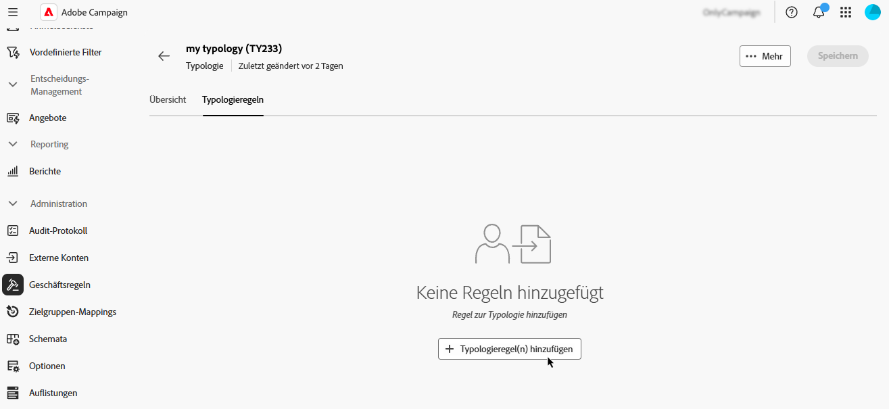
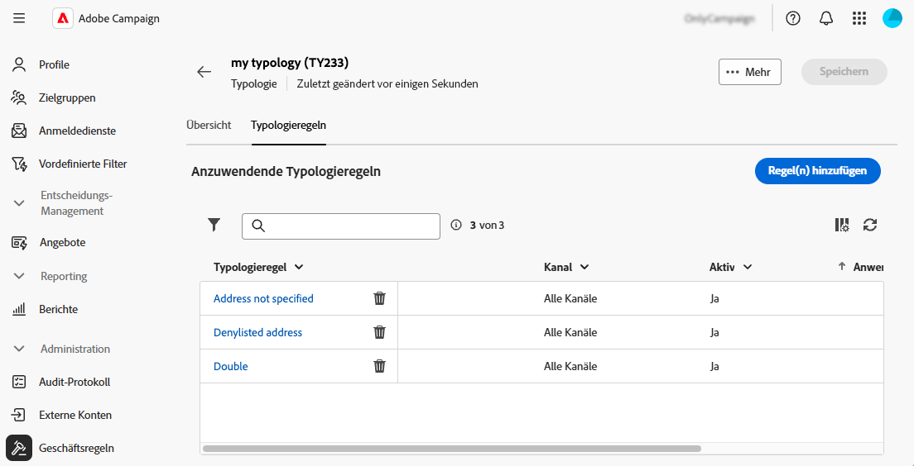
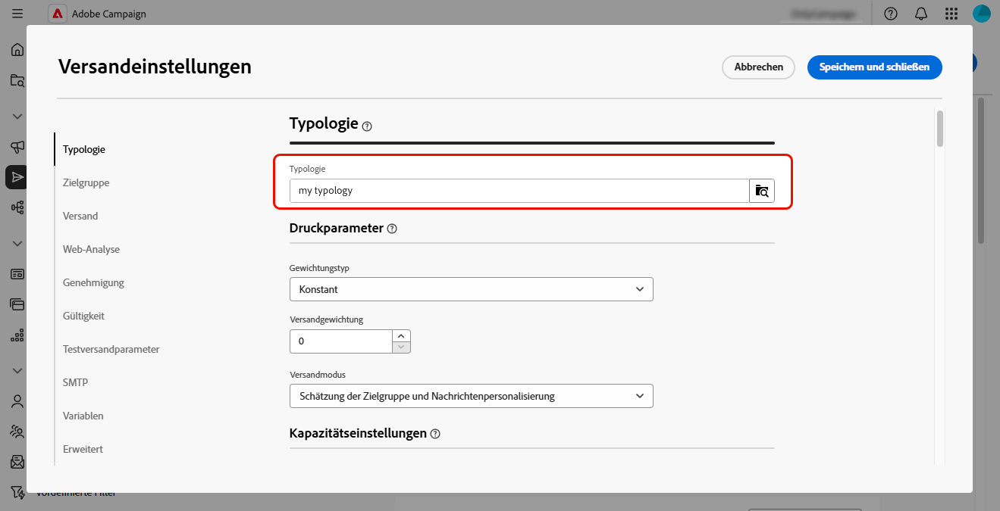

# Arbeiten mit Geschäftsregeln (Typologien) {#typologies}

>[!CONTEXTUALHELP]
>id="acw_business_rules"
>title="Typologien und Typologieregeln"
>abstract="Mit Typologien lassen sich Geschäftspraktiken über alle Sendungen hinweg standardisieren. Eine Typologie ist eine Sammlung von Typologieregeln, mit denen der Versand von Sendungen gesteuert, gefiltert und priorisiert werden kann. Profile, die den Kriterien einer Typologieregel entsprechen, werden in der Vorbereitungsphase von den Versandzielgruppen ausgeschlossen."

## Über Typologien

Mit Typologien lassen sich Geschäftspraktiken über alle Sendungen hinweg standardisieren. Eine **Typologie** ist eine Sammlung von **Typologieregeln** mit denen Sie den Versand von Sendungen steuern, filtern und priorisieren können. Profile, die den Kriterien einer Typologieregel entsprechen, werden in der Vorbereitungsphase von den Versandzielgruppen ausgeschlossen.

Typologien stellen sicher, dass Ihre Sendungen immer bestimmte Elemente enthalten (z. B. einen Abmelde-Link oder eine Betreffzeile) oder Filterregeln anwenden, um Gruppen aus Ihrer Zielgruppe auszuschließen (z. B. Abonnenten, Konkurrenten oder Kunden, die nicht Mitglied im Treueprogramm sind).

Auf Typologien kann über das Menü **[!UICONTROL Administration]** > **[!UICONTROL Geschäftsregeln]** zugegriffen werden. Auf diesem Bildschirm können Sie auf alle vorhandenen Typologien und Typologieregeln zugreifen oder je nach Bedarf neue erstellen.

>[!NOTE]
>
>Die Liste **[!UICONTROL Typologieregeln]** zeigt alle vorhandenen Regeln an, die bisher in der Web-Benutzeroberfläche oder der Client-Konsole erstellt wurden. Es können jedoch nur **Kontrolle** und **Filterung**-Regeln in der Web-Benutzeroberfläche erstellt werden. Verwenden Sie die Client-Konsole von Campaign v8, um andere Typen von Typologieregeln wie Druck- oder Kapazitätsregeln zu erstellen. [Erfahren Sie, wie Sie Typologieregeln in der Client-Konsole erstellen](https://experienceleague.adobe.com/de/docs/campaign/automation/campaign-optimization/campaign-typologies){target="_blank"}

Die wichtigsten Schritte zum Anwenden von Typologien auf Ihre Nachrichten sind:

1. [Erstellen Sie eine Typologie](#typology).
1. [Erstellen von Typologieregeln](#typology-rules).
1. [Referenztypologieregeln in der Typologie](#add-rules).
1. [Wenden Sie die Typologie auf eine Nachricht an](#message).

## Erstellen einer Typologie {#typology}

>[!CONTEXTUALHELP]
>id="acw_business_rules_typology_properties"
>title="Typologieeigenschaften"
>abstract="Definieren Sie die Eigenschaften der Typologie und erweitern Sie den Abschnitt **[!UICONTROL Weitere Optionen]**, um auf erweiterte Einstellungen zuzugreifen. Verwenden Sie das Feld **[!UICONTROL IP-Affinität]**, um IP-Affinitäten mit Typologien zu verknüpfen. Hierdurch können Sie den ausgehenden SMTP-Traffic besser steuern. Legen Sie dazu fest, welche IP-Adressen jeweils für die einzelnen Affinitäten verwendet werden können."

>[!CONTEXTUALHELP]
>id="acw_business_rules_typology_ip_affinity"
>title="IP-Affinität"
>abstract="Die Verwaltung der IP-Adressenaffinitäten ermöglicht eine bessere Steuerung des ausgehenden SMTP-Traffics, indem jedem Traffic-Typ je nach Versandtypologie unterschiedliche IP-Adressen zugewiesen werden."

Gehen Sie wie folgt vor, um eine Typologie zu erstellen:

1. Navigieren Sie zum Menü **[!UICONTROL Geschäftsregeln]** und wählen Sie dann die Registerkarte **[!UICONTROL Typologie]** aus.

1. Klicken Sie auf **[!UICONTROL Typologie erstellen]** und geben Sie einen **[!UICONTROL Titel]** für die Typologie ein.

1. Erweitern Sie den Abschnitt **[!UICONTROL Zusätzliche Optionen]**, um erweiterte Einstellungen wie den internen Namen der Typologie, den Speicherordner und die Beschreibung zu definieren.

   

   >[!NOTE]
   >
   >Mit **[!UICONTROL Feld]** IP-Affinität“ können Sie IP-Affinitäten mit Typologien verknüpfen. Auf diese Weise können Sie den ausgehenden SMTP-Traffic besser kontrollieren, indem Sie festlegen, welche spezifischen IP-Adressen für jede Affinität verwendet werden können.  So können Sie beispielsweise eine Affinität pro Land oder Sub-Domain verwenden. Dann können Sie für jedes Land eine Typologie erstellen und jede Affinität mit der entsprechenden Typologie verbinden.

1. Klicken Sie **[!UICONTROL Erstellen]**, um die Erstellung der Typologie zu bestätigen.

Die Typologie öffnet Details. Auf diesem Bildschirm können Sie direkt auf vorhandene Typologieregeln verweisen. Sie können auch neue Typologieregeln erstellen und diese später in der Typologie referenzieren:
* [Erfahren Sie, wie Sie eine Typologieregel erstellen](#add-rules)
* [Informationen zum Referenzieren von Regeln in einer Typologie](#add-rules)

## Erstellen einer Typologieregel {#typology-rule}

>[!CONTEXTUALHELP]
>id="acw_business_rules_typology_rules_properties"
>title="Typologieregeleigenschaften"
>abstract="Definieren Sie die Eigenschaften der Typologieregel. Über **Steuerungsregeln** wird vor dem Versand die Qualität sowie die Gültigkeit von Nachrichten überprüft. **Filterregeln** dienen hingegen dazu, Segmente der Zielgruppe anhand bestimmter Kriterien auszuschließen.  Sie können auch die Ausführungsreihenfolge der Regel ändern, um die Ausführungsabfolge von Typologieregeln zu steuern, wenn mehrere Regeln desselben Typs während derselben Nachrichtenverarbeitungsphase ausgeführt werden."

Um eine Typologieregel zu erstellen, navigieren Sie zum Menü **[!UICONTROL Geschäftsregeln]** und wählen Sie dann die Registerkarte **[!UICONTROL Typologieregeln]** aus.

Klicken Sie auf **[!UICONTROL Typologieregel erstellen]** und führen Sie dann die folgenden Schritte aus.

### Definieren der Eigenschaften der Typologieregel {#properties}

Definieren Sie die Eigenschaften der Typologieregel:

1. Geben Sie einen **[!UICONTROL Titel]** für die Regel ein.

   

1. Wählen Sie den Typ **[!UICONTROL Typologieregel]**:

   * **Kontrolle**: Stellt die Qualität und Gültigkeit der Nachrichten vor dem Senden sicher (z. B. Zeichenanzeige, SMS-Länge, Adressformat, URL-Verkürzung). Sie werden mithilfe einer Skriptoberfläche erstellt, um komplexe Logik für Inhaltsprüfungen und -änderungen zu definieren.

   * **Filterregeln** schließen Segmente der Zielgruppe anhand bestimmter Kriterien aus (z. B. Alter, Standort, Land, Telefonnummern). Diese Regeln sind mit einer Zielgruppendimension verknüpft.

   >[!NOTE]
   >
   >Vorerst können nur **Kontrolle** und **Filterung** Typologieregeln über die Web-Benutzeroberfläche erstellt werden. Verwenden Sie zum Erstellen anderer Regeltypen die Client-Konsole. [Erfahren Sie, wie Sie Typologieregeln in der Client-Konsole erstellen](https://experienceleague.adobe.com/de/docs/campaign/automation/campaign-optimization/campaign-typologies){target="_blank"}

1. Wählen Sie einen **[!UICONTROL Kanal]** aus, um ihn mit der Regel zu verknüpfen.

1. Schalten Sie die Option **[!UICONTROL Aktiv]** aus, wenn die Regel nicht direkt nach ihrer Erstellung aktiv sein soll.

1. Definieren Sie die Regel **[!UICONTROL Ausführungsreihenfolge]**.

   Standardmäßig ist die Reihenfolge der Typologieregeln auf 50 festgelegt. Sie können diesen Wert anpassen, um die Reihenfolge zu verwalten, in der Typologieregeln ausgeführt werden, wenn mehrere Regeln desselben Typs während derselben Nachrichtenverarbeitungsphase ausgeführt werden. Beispielsweise wird eine Filterregel mit einer Ausführungsreihenfolge von 20 vor einer Filterregel mit einer Ausführungsreihenfolge von 30 ausgeführt.

1. Erweitern Sie den Abschnitt **[!UICONTROL Zusätzliche Optionen]**, um auf erweiterte Einstellungen wie den internen Namen der Regel, den Ordnerspeicher und die Beschreibung zuzugreifen.

1. Für Kontrollregeln stehen in den zusätzlichen Optionen zwei zusätzliche Regeln zur Verfügung. Damit können Sie festlegen, wann die Regel angewendet werden soll, und die Warnstufe festlegen:

   * **[!UICONTROL Phase]**: In diesem Feld können Sie angeben, zu welchem Zeitpunkt des Versandlebenszyklus die Regel angewendet wird. Wählen Sie den anzuwendenden Wert in der Dropdown **[!UICONTROL Liste „Phase]** aus. Erweitern Sie den folgenden Abschnitt, um weitere Details zu den möglichen Werten zu erhalten.

   +++Phasen der Kontrollregeln:

   **[!UICONTROL Zu Beginn der Zielgruppenbestimmung]**: Um zu verhindern, dass der Personalisierungsschritt im Fehlerfall ausgeführt wird, können Sie hier die Kontrollregel anwenden.

   **[!UICONTROL Nach der Zielgruppenbestimmung]**: Wählen Sie diese Phase aus, wenn Sie das Volumen der Zielgruppe kennen müssen, um die Kontrollregel anwenden zu können. Beispielsweise gilt die Regel Testversandgröße überprüfen nach jedem Zielgruppenbestimmungsschritt: Diese Regel verhindert die Personalisierung von Nachrichten, wenn zu viele Testversand-Empfänger vorhanden sind.

   **[!UICONTROL Zu Beginn der Personalisierung]**: Diese Phase muss ausgewählt werden, wenn das Steuerelement die Validierung der Nachrichtenpersonalisierung betrifft. Die Nachrichtenpersonalisierung erfolgt während der Analysephase.

   **[!UICONTROL Am Ende der Analyse]**: Wenn eine Prüfung den Abschluss der Nachrichtenpersonalisierung erfordert, wählen Sie diese Phase aus.

+++

   * **[!UICONTROL Level]**: Mit dieser Option können Sie die Warnstufe für die Regel angeben. Erweitern Sie den folgenden Abschnitt, um weitere Informationen zu erhalten.

   +++Kontrollregelebenen:

   **[!UICONTROL Fehler]**: Die Nachrichtenvorbereitung wird angehalten.

   **[!UICONTROL Warnung]**: Eine Warnung in den Vorbereitungsprotokollen anzeigen.

   **[!UICONTROL Info]**: Zeigt Informationen in den Vorbereitungsprotokollen an.

   <!--**[!UICONTROL Status]**:-->

   **[!UICONTROL Verbose]**: Zeigt Informationen in den Serverprotokollen an.

+++

### Erstellen des Regelinhalts {#build}

>[!CONTEXTUALHELP]
>id="acw_business_rules_typology_rules_filtering"
>title="Filter"
>abstract="**Filterregeln** schließen Segmente der Zielgruppe anhand bestimmter Kriterien aus (z. B. Alter, Standort, Land, Telefonnummern). Wählen Sie die Zielgruppendimension der Typologieregel aus und klicken Sie auf die Schaltfläche **[!UICONTROL Regeln hinzufügen]**, um auf den Abfrage-Modeler zuzugreifen und die Regel zu erstellen."

>[!CONTEXTUALHELP]
>id="acw_business_rules_typology_rules_code"
>title="Code"
>abstract="**Steuerungsregeln** überprüfen vor dem Versand die Qualität und Gültigkeit von Nachrichten (z. B. Zeichenanzeige, SMS-Länge, Adressformat, URL-Verkürzung). Sie werden mit JavaScript-Code erstellt."

Nachdem die Eigenschaften der Typologieregel definiert wurden, können Sie den Inhalt der Regel erstellen.

* Klicken **unter &quot;**&quot; auf die Schaltfläche **Code bearbeiten** und geben Sie die Logik für die Regel mithilfe von JavaScript ein. Im folgenden Beispiel erstellen wir eine Regel, um eine Warnung in den Protokollen anzuzeigen, wenn das Ziel leer ist.

  

* Wählen **für „Filterregeln** die Zielgruppendimension aus und klicken Sie auf die Schaltfläche **[!UICONTROL Regeln hinzufügen]**, um Filterkriterien mithilfe des [Abfragemodellierers“ ](../query/query-modeler-overview.md) definieren.

  

Wenn Ihre Regel fertig ist, klicken Sie auf die Schaltfläche **[!UICONTROL Erstellen]**, um die Typologieregel zu erstellen. Sie können die Regel jetzt in einer Typologie referenzieren, um sie auf Nachrichten anzuwenden.

## Verweisen auf Typologieregeln in einer Typologie {#add-rules}

Gehen Sie wie folgt vor, um eine oder mehrere Regeln in einer Typologie zu referenzieren:

1. Navigieren Sie zur Registerkarte **[!UICONTROL Typologie]** und öffnen Sie die Typologie, auf die Sie die Regel(n) verweisen möchten.

1. Wählen Sie die **[!UICONTROL Typologieregeln]** und klicken Sie auf die Schaltfläche **[!UICONTROL Typologieregel hinzufügen]**.

   

1. Eine oder mehrere Typologieregeln auswählen, die mit der Typologie verknüpft werden sollen, und bestätigen.

   

1. Klicken Sie auf **[!UICONTROL Speichern]**.

Jetzt können Sie die Typologie auf Nachrichten anwenden. Anschließend werden alle ausgewählten Typologieregeln ausgeführt, um die definierten Prüfungen durchzuführen.

## Anwenden von Typologien auf Nachrichten {#message}

Um eine Typologie auf eine Nachricht oder Nachrichtenvorlage anzuwenden, müssen Sie die Typologie in den Nachrichteneinstellungen auswählen. [Erfahren Sie, wie Sie Versandeinstellungen konfigurieren](../advanced-settings/delivery-settings.md#typology)

Anschließend werden die in der Typologie enthaltenen Typologieregeln ausgeführt, um die Versandgültigkeit während der Nachrichtenvorbereitung zu überprüfen. Profile, die den Kriterien einer Typologieregel entsprechen, werden dann von den Versandzielgruppen ausgeschlossen.
