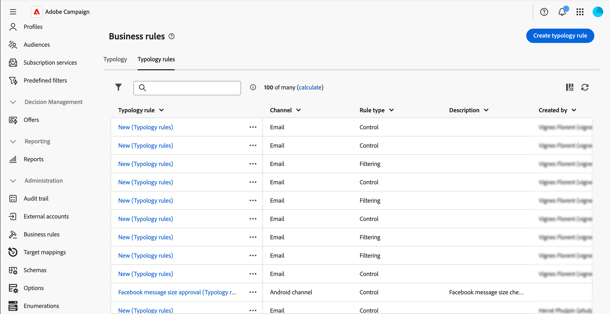
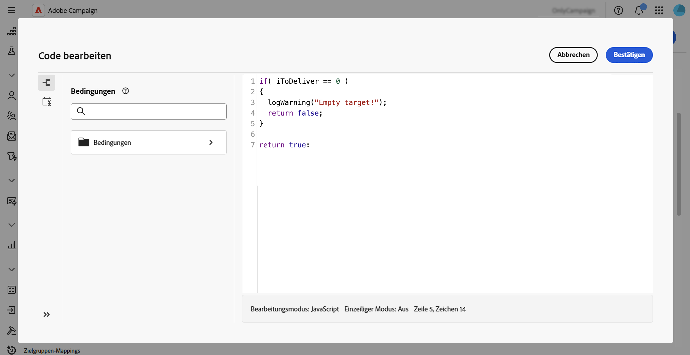

# Arbeiten mit Geschäftsregeln (Typologien) {#typologies}

>[!CONTEXTUALHELP]
>id="acw_homepage_welcome_rn3"
>title="Geschäftsregeln"
>abstract="Sie können jetzt Typologien und Typologieregeln in der Adobe Campaign Web-Benutzeroberfläche erstellen. Mit Typologien können Sie die Durchführung von Sendungen steuern, filtern und priorisieren."
>additional-url="https://experienceleague.adobe.com/docs/campaign-web/v8/release-notes/release-notes.html?lang=de" text="Siehe Versionshinweise"

>[!CONTEXTUALHELP]
>id="acw_business_rules"
>title="Typologien und Typologieregeln"
>abstract="Mit Typologien lassen sich Geschäftspraktiken über alle Sendungen hinweg standardisieren. Eine Typologie ist eine Sammlung von Typologieregeln, mit denen die Durchführung von Sendungen gesteuert, gefiltert und priorisiert werden kann. Profile, die den Kriterien einer Typologieregel entsprechen, werden in der Vorbereitungsphase von den Versandzielgruppen ausgeschlossen."

>[!CONTEXTUALHELP]
>id="acw_business_rules_typology_rules_type"
>title="Filterung"
>abstract=" Es stehen zwei Arten von Typologieregeln zur Verfügung:   **Steuerungsregeln**, die vor dem Versand die Qualität und Gültigkeit der Nachrichten sicherstellen, z. B. Zeichenanzeige, SMS-Länge, Adressformat oder URL-Verkürzung. Und   **Filterregeln**, die Segmente der Zielgruppe anhand bestimmter Kriterien wie Alter, Standort, Land oder Telefonnummern ausschließen. "

## Über Typologien

Mit Typologien lassen sich Geschäftspraktiken über alle Sendungen hinweg standardisieren. Eine **Typologie** ist eine Sammlung von **Typologieregeln**, mit denen die Durchführung von Sendungen gesteuert, gefiltert und priorisiert werden kann. Profile, die den Kriterien einer Typologieregel entsprechen, werden in der Vorbereitungsphase von den Versandzielgruppen ausgeschlossen.

Typologien stellen sicher, dass Ihre Sendungen immer bestimmte Elemente enthalten, z. B. einen Abmelde-Link oder eine Betreffzeile, oder Filterregeln, um bestimmte Zielgruppen auszuschließen. Dazu zählen etwa abgemeldete Abonnierende, Mitbewerbende oder Kundschaft, die nicht am Treueprogramm teilnimmt.

Auf Typologien können Sie über das Menü **[!UICONTROL Administration]** > **[!UICONTROL Geschäftsregeln]** zugreifen. Auf diesem Bildschirm greifen Sie auf alle vorhandenen Typologien und Typologieregeln zu oder erstellen je nach Bedarf neue.

>[!NOTE]
>
>Die Liste **[!UICONTROL Typologieregeln]** zeigt alle vorhandenen Regeln an, die bisher in der Web-Benutzeroberfläche oder der Client-Konsole erstellt wurden. Es können jedoch nur **Steuerungs**- und **Filterregeln** in der Web-Benutzeroberfläche erstellt werden. Verwenden Sie die Client-Konsole von Campaign v8, um andere Typen von Typologieregeln wie Druck- oder Kapazitätsregeln zu erstellen. [Weitere Informationen zum Erstellen von Typologieregeln in der Client-Konsole](https://experienceleague.adobe.com/de/docs/campaign/automation/campaign-optimization/campaign-typologies){target="_blank"}

Die wichtigsten Schritte zum Anwenden von Typologien auf Ihre Nachrichten sind:

1. [Erstellen einer Typologie](#typology)
1. [Erstellen von Typologieregeln](#typology-rule)
1. [Referenzieren von Typologieregeln in der Typologie](#add-rules)
1. [Anwenden der Typologie auf Nachrichten](#message)

## Erstellen einer Typologie {#typology}

>[!CONTEXTUALHELP]
>id="acw_business_rules_typology_properties"
>title="Typologieeigenschaften"
>abstract="Definieren Sie die Eigenschaften der Typologie und erweitern Sie den Abschnitt **[!UICONTROL Weitere Optionen]**, um auf erweiterte Einstellungen zuzugreifen. Verwenden Sie das Feld **[!UICONTROL IP-Affinität]**, um IP-Affinitäten mit Typologien zu verknüpfen. Hierdurch können Sie den ausgehenden SMTP-Traffic besser steuern. Legen Sie dazu fest, welche IP-Adressen jeweils für die einzelnen Affinitäten verwendet werden können."

>[!CONTEXTUALHELP]
>id="acw_business_rules_typology_ip_affinity"
>title="IP-Affinität"
>abstract="Die Verwaltung der IP-Adressenaffinitäten ermöglicht eine bessere Steuerung des ausgehenden SMTP-Traffics, indem jedem Traffic-Typ je nach Versandtypologie unterschiedliche IP-Adressen zugewiesen werden."

Gehen Sie wie folgt vor, um eine Typologie zu erstellen:

1. Navigieren Sie zum Menü **[!UICONTROL Geschäftsregeln]** und wählen Sie dann die Registerkarte **[!UICONTROL Typologie]** aus.

1. Klicken Sie auf die Schaltfläche **[!UICONTROL Typologie erstellen]** und geben Sie ein **[!UICONTROL Label]** für die Typologie ein.

1. Erweitern Sie den Abschnitt **[!UICONTROL Weitere Optionen]**, um erweiterte Einstellungen wie den internen Namen, den Speicherordner und die Beschreibung der Typologie zu definieren.

   

   >[!NOTE]
   >
   >Mit dem Feld **[!UICONTROL IP-Affinität]** können Sie IP-Affinitäten mit Typologien verknüpfen. Hierdurch können Sie den ausgehenden SMTP-Traffic besser steuern. Legen Sie dazu fest, welche IP-Adressen jeweils für die einzelnen Affinitäten verwendet werden können. So können Sie beispielsweise eine Affinität pro Land oder Subdomain verwenden. Dann können Sie für jedes Land eine Typologie erstellen und jede Affinität mit der entsprechenden Typologie verbinden.

1. Klicken Sie auf **[!UICONTROL Erstellen]**, um die Erstellung der Typologie zu bestätigen.

Der Bildschirm mit den Typologiedetails wird geöffnet. Verweisen Sie über diesen Bildschirm direkt auf vorhandene Typologieregeln oder erstellen Sie neue Typologieregeln, auf die Sie später verweisen können:
* [Erfahren Sie, wie Sie eine Typologieregel erstellen.](#add-rules)
* [Erfahren Sie, wie Sie Regeln in einer Typologie referenzieren.](#add-rules)

## Erstellen einer Typologieregel {#typology-rule}

>[!CONTEXTUALHELP]
>id="acw_business_rules_typology_rules_properties"
>title="Eigenschaften einer Typologieregel"
>abstract="Definieren Sie die Eigenschaften der Typologieregel. Mit **Steuerungsregeln** werden vor dem Versand die Qualität und Gültigkeit der Nachrichten überprüft. **Filterregeln** dienen hingegen dazu, Segmente der Zielgruppe anhand bestimmter Kriterien auszuschließen.  Sie können auch die Anwendungsreihenfolge der Regel ändern, um die Anwendungsreihenfolge von Typologieregeln zu steuern, wenn mehrere Regeln desselben Typs während derselben Nachrichtenverarbeitungsphase ausgeführt werden."

Zwei Arten von Typologieregeln stehen zur Verfügung:

* **Kontrolle**: Stellt die Qualität und Gültigkeit der Nachrichten vor dem Senden sicher, z. B. die Zeichenanzeige, die SMS-Länge, das Adressformat oder die URL-Verkürzung. Diese Regeln werden mithilfe einer Skripting-Oberfläche erstellt, um komplexe Logik für Inhaltsprüfungen und -änderungen zu definieren.

* **Filter**: Schließt Segmente der Zielgruppe basierend auf bestimmten Kriterien wie Alter, Standort, Land oder Telefonnummern aus. Diese Regeln sind mit einer Zielgruppendimension verknüpft.

>[!NOTE]
>
>Aktuell können über die Web-Benutzeroberfläche nur Typologieregeln vom Typ **Kontrolle** und **Filter** erstellt werden. Verwenden Sie zum Erstellen anderer Regeltypen die Client-Konsole. [Weitere Informationen zum Erstellen von Typologieregeln in der Client-Konsole](https://experienceleague.adobe.com/de/docs/campaign/automation/campaign-optimization/campaign-typologies){target="_blank"}

Gehen Sie wie folgt vor, um eine Typologieregel zu erstellen:

1. Navigieren Sie zum Menü **[!UICONTROL Geschäftsregeln]** und wählen Sie dann die Registerkarte **[!UICONTROL Typologieregeln]** aus.

1. Klicken Sie auf die Schaltfläche **[!UICONTROL Typologieregel erstellen]** und führen Sie dann die nachfolgend beschriebenen Schritte aus.

   

### Definieren der wichtigsten Eigenschaften der Regel {#properties}

>[!CONTEXTUALHELP]
>id="acw_business_rules_typology_rules_filtering"
>title="Filterung"
>abstract="**Filterregeln** schließen Segmente der Zielgruppe basierend auf bestimmten Kriterien wie Alter, Standort, Land oder Telefonnummern aus. Wählen Sie die Zielgruppendimension der Typologieregel aus und klicken Sie auf die Schaltfläche **[!UICONTROL Regeln hinzufügen]**, um auf den Abfrage-Modeler zuzugreifen und die Regel zu erstellen."

>[!CONTEXTUALHELP]
>id="acw_business_rules_typology_rules_code"
>title="Code"
>abstract="**Steuerungsregeln** überprüfen vor dem Versand die Qualität und Gültigkeit der Nachrichten, z. B. Zeichenanzeige, SMS-Länge, Adressformat oder URL-Verkürzung. Diese Regeln werden mit JavaScript-Code erstellt."

Dies sind die wichtigsten Eigenschaften, die beim Erstellen einer neuen Typologieregel definiert werden müssen:

>[!BEGINTABS]

>[!TAB Kontrollregeln]

1. Geben Sie einen **[!UICONTROL Titel]** für die Regel ein. 

   

1. Im Abschnitt **[!UICONTROL Weitere Optionen]** können Sie auf erweiterte Einstellungen zugreifen, wie z. B. den internen Namen der Regel, den Speicherordner und die Beschreibung. Sie können außerdem festlegen, wann die Regel angewendet werden soll und welche Warnstufe sie hat. Erweitern Sie die folgenden Abschnitte, um weitere Informationen zu erhalten.

   +++Phasen

   Geben Sie an, zu welchem Zeitpunkt im Versandzyklus die Regel angewendet werden soll. Wählen Sie den Wert in der Dropdown-Liste **[!UICONTROL Phase]** aus:

   * **[!UICONTROL Zu Beginn der Zielgruppenbestimmung]**: Verhindern Sie, dass der Personalisierungsschritt bei Fehlern ausgeführt wird.

   * **[!UICONTROL Nach der Zielgruppenbestimmung]**: Wählen Sie diese Phase aus, wenn Sie die Größe der Zielgruppe kennen müssen, um die Kontrollregel anzuwenden. Die Kontrollregel **[!UICONTROL Prüfung der Testversandgröße]** beispielsweise wird zwingend nach der Zielgruppenbestimmungsphase angewendet. Diese Regel verhindert eine Nachrichtenpersonalisierung, wenn die Zielgruppe des Testversands zu groß ist.

   * **[!UICONTROL Zu Beginn der Personalisierung]**: Wählen Sie diese Phase aus, wenn die Kontrolle die Validierung der Nachrichtenpersonalisierung betrifft. Die Nachrichtenpersonalisierung erfolgt während der Analysephase.

   * **[!UICONTROL Am Ende der Analyse]**: Wenden Sie Prüfungen an, für die eine vollständige Nachrichtenpersonalisierung erforderlich ist.

   +++

   +++Ebene

   Geben Sie die Warnstufe für die Regel an:

   * **[!UICONTROL Fehler]**: Die Nachrichtenvorbereitung wird gestoppt

   * **[!UICONTROL Warnung]**: In den Vorbereitungsprotokollen wird eine Warnung angezeigt

   * **[!UICONTROL Info]**: In den Vorbereitungsprotokollen werden Informationen angezeigt

   * **[!UICONTROL Verbose]**: In den Server-Protokollen werden Informationen angezeigt

   +++

1. Um den Inhalt der Regel zu erstellen, klicken Sie auf die Schaltfläche **Code bearbeiten** und geben Sie die Logik für die Regel mithilfe von JavaScript ein. Im folgenden Beispiel wird eine Regel erstellt, um eine Warnung in den Logs anzuzeigen, wenn das Ziel leer ist.

   

1. Klicken Sie auf **Erstellen**.

>[!TAB Filterregeln]

1. Geben Sie einen **[!UICONTROL Titel]** für die Regel ein. 

   

1. Erweitern Sie den Abschnitt **[!UICONTROL Weitere Optionen]**, um auf erweiterte Einstellungen wie den internen Namen, den Speicherordner und die Beschreibung der Regel zuzugreifen.

1. Um den Inhalt der Regel zu erstellen, wählen Sie die Zielgruppendimension aus und klicken Sie auf die Schaltfläche **[!UICONTROL Regeln hinzufügen]**, um Filterkriterien mithilfe des [Regel-Builders](../query/query-modeler-overview.md) zu definieren.

   

1. Klicken Sie auf **Erstellen**

>[!ENDTABS]

### Definieren der zusätzlichen Eigenschaften der Regel {#add-properties}

Definieren wir nun die zusätzlichen Parameter. In diesem Bildschirm können Sie die zuvor definierten wichtigsten Eigenschaften noch ändern.

1. Schalten Sie die Option **[!UICONTROL Aktiv]** aus, wenn die Regel nicht direkt nach ihrer Erstellung aktiv sein soll.

1. Definieren Sie die **[!UICONTROL Anwendungsreihenfolge]** für die Regel.

   Standardmäßig ist diese Priorität einer Typologieregel auf 50 festgelegt. Passen Sie diesen Wert an, um die Anwendungsreihenfolge von Typologieregeln zu steuern, wenn mehrere Regeln desselben Typs während derselben Nachrichtenverarbeitungsphase ausgeführt werden. Beispielsweise wird eine Filterregel mit einem Wert der Anwendungsreihenfolge von 20 vor einer Filterregel mit einem Wert von 30 ausgeführt.

1. Wählen Sie einen **[!UICONTROL Kanal]** aus, um ihn mit der Regel zu verknüpfen.

Ihre Regel kann nun in einer Typologie referenziert werden, um sie auf Nachrichten anzuwenden.

## Referenzieren von Typologieregeln in einer Typologie {#add-rules}

Gehen Sie wie folgt vor, um eine oder mehrere Regeln in einer Typologie zu referenzieren:

1. Navigieren Sie zur Registerkarte **[!UICONTROL Typologie]** und öffnen Sie die Typologie, in der Sie die Regel(n) referenzieren möchten.

1. Wählen Sie die Registerkarte **[!UICONTROL Typologieregeln]** aus und klicken Sie auf die Schaltfläche **[!UICONTROL Regeln hinzufügen]**.

   

1. Wählen Sie eine oder mehrere Typologieregeln aus, die mit der Typologie verknüpft werden sollen, und bestätigen Sie sie.

   

1. Klicken Sie auf **[!UICONTROL Speichern]**.

Sie können die Typologie jetzt auf Nachrichten anwenden. Daraufhin werden alle ausgewählten Typologieregeln ausgeführt, um die definierten Prüfungen durchzuführen.

## Anwenden von Typologien auf Nachrichten {#message}

Um eine Typologie auf eine Nachricht oder Nachrichtenvorlage anzuwenden, wählen Sie die Typologie in den Nachrichteneinstellungen aus. [Erfahren Sie, wie Sie Versandeinstellungen konfigurieren](../advanced-settings/delivery-settings.md#typology)

Nach der Anwendung werden die in der Typologie enthaltenen Typologieregeln ausgeführt, um die Versandgültigkeit während der Nachrichtenvorbereitung zu überprüfen. Profile, die den Kriterien einer Typologieregel entsprechen, werden dann von den Versandzielgruppen ausgeschlossen.