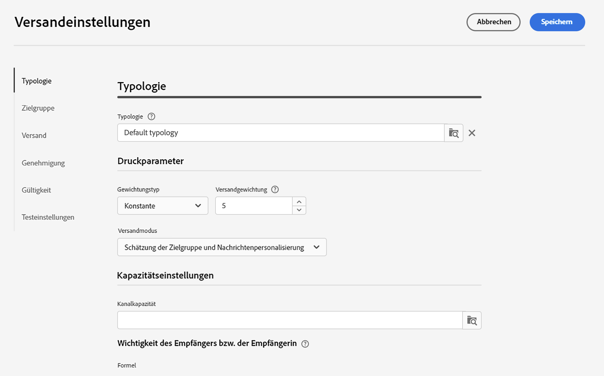

# Versandeinstellungen {#email-del-settings}

E-Mail-Versandeinstellungen **technische Versandparameter** die in der E-Mail-Vorlage definiert sind. Sie können bei jedem Versand überschrieben werden.

Diese Einstellungen sind im Abschnitt **Konfigurieren der Versandeinstellungen** bei der Bearbeitung eines E-Mail-Versands oder einer E-Mail-Versandvorlage verfügbar ist.

## E-Mail-Versandeinstellungen {#email-delivery-settings}

>[!CAUTION]
>
>Diese Einstellungen werden hier nur zur Information beschrieben. Einige sind von Ihrer Konfiguration und Ihren Berechtigungen abhängig. Sie dürfen in dieser Version des Produkts nicht geändert werden.

## Typologieregeln {#typology}

>[!CONTEXTUALHELP]
>id="acw_email_settings_typology"
>title="Typologie"
>abstract="Typologie -Regeln ermöglichen es Marketing-Experten, Geschäftspraktiken für alle Sendungen zu standardisieren. Eine Typologie ist eine Sammlung von Typologieregeln, mit denen Sie den Versand von Nachrichten steuern, filtern und priorisieren können. Profile, die den Kriterien einer Typologieregel entsprechen, werden in der Vorbereitungsphase von den Versandzielgruppen ausgeschlossen."

>[!CONTEXTUALHELP]
>id="acw_delivery_template_settings_typology"
>title="Typologieeinstellungen für den Versand"
>abstract="Typologieregeln ermöglichen es Marketing-Experten, Geschäftspraktiken für alle Sendungen zu standardisieren. Eine Typologie ist eine Sammlung von Typologieregeln, mit denen Sie den Versand von Nachrichten steuern, filtern und priorisieren können. Profile, die den Kriterien einer Typologieregel entsprechen, werden in der Vorbereitungsphase von den Versandzielgruppen ausgeschlossen."

Typologien sind Gruppen von **Typologieregeln**, die während der Vorbereitungsphase ausgeführt werden. Typologieregeln ermöglichen es Marketing-Experten, Geschäftspraktiken für alle Sendungen zu standardisieren. Eine Typologie ist eine Sammlung von Typologieregeln, mit denen Sie den Versand von Nachrichten steuern, filtern und priorisieren können. Profile, die den Kriterien einer Typologieregel entsprechen, werden in der Versandvorbereitungsphase von den Versandzielgruppen ausgeschlossen.  Damit können Sie sicherstellen, dass Ihre E-Mails immer bestimmte Elemente enthalten (z. B. einen Abmelde-Link oder eine Betreffzeile) oder Filterregeln anwenden, um Gruppen aus Ihrer Zielgruppe auszuschließen (z. B. abgemeldete Abonnenten, Konkurrenten oder Kunden, die nicht Mitglied im Treueprogramm sind).

Typologieregeln werden in einer Typologie gruppiert, um auf einfache Weise mehrere Filterregeln auf einen Versand gleichzeitig anzuwenden.

Wenn Sie eine Typologie mit einer Nachricht oder Nachrichtenvorlage verknüpfen, werden die in der Typologie enthaltenen Typologieregeln ausgeführt, um die Gültigkeit der Nachricht während der Nachrichtenvorbereitung zu überprüfen.

### Druckparameter {#pressure-parameters}

>[!CONTEXTUALHELP]
>id="acw_email_settings_pressure_parameters"
>title="Druckparameter für den Versand"
>abstract="Die Versandgewichtung ermöglicht die Identifizierung von Sendungen mit der höchsten Priorität im Rahmen der Ermüdungsverwaltung. Nachrichten mit der höchsten Gewichtung haben Priorität."

>[!CONTEXTUALHELP]
>id="acw_delivery_template_settings_delivery_weight"
>title="Versandgewichtung"
>abstract="Die Versandgewichtung ermöglicht es Ihnen, im Rahmen der Druckverwaltung diejenigen Sendungen festzulegen, die vorrangig durchgeführt werden sollen. Die Nachrichten mit der höchsten Gewichtung haben Vorrang."

In diesem Abschnitt können Sie mithilfe von Druckparametern eine **Schwellenwert** , um Ermüdungsverwaltungsregeln einzurichten. Dies ist die maximale Anzahl von Nachrichten, die an ein Profil in einem bestimmten Zeitraum gesendet werden können. Sobald diese Schwelle erreicht ist, können keine Sendungen mehr durchgeführt werden, bis der Zeitraum abgelaufen ist. Durch dieses Verfahren kann ein Profil aus einem Versand automatisch ausgeschlossen werden, wenn eine Nachricht die festgelegte Schwelle übersteigt. Dadurch wird verhindert, dass ein Profil zu oft angesprochen wird.

Schwellenwerte können konstant oder variabel sein. Das bedeutet, dass unterschiedliche Profile in einem bestimmten Zeitraum unterschiedliche Schwellen aufweisen können oder Schwellen sogar innerhalb desselben Profils variieren können.

Im Feld **Gewichtungstyp** stehen drei Optionen zur Verfügung:

* **Konstante**
* **Empfängerabhängig**
* **Wird in jeder Regel definiert**

Verwenden Sie das Feld **Versandgewichtung**, um die Versandpriorität zu definieren. Jeder Versand verfügt über eine Gewichtung, die die jeweilige Priorität darstellt. Standardmäßig ist die Versandgewichtung auf den Wert 5 festgelegt. Mit Druckregeln können Sie die Gewichtung der Sendungen festlegen, auf die sie angewendet werden. Die Gewichtung kann konstant sein oder mithilfe einer Formel empfängerabhängig berechnet werden. Beispielsweise kann die Gewichtung eines Versands den Interessen eines Empfängers bzw. einer Empfängerin entsprechend bestimmt werden.

Verwenden Sie das Feld **Versandmodus**, um den Zielgruppenauswertungsmodus auszuwählen. Drei Modi sind verfügbar:

* **Zielgruppenschätzung und Nachrichtenpersonalisierung**
* **Schätzung und Validierung der geplanten Zielgruppe**
* **Zielgruppenauswertung**

Die Ermüdungsverwaltung wird mit dem Add-on **Kampagnenoptimierung** bereitgestellt. Weitere Informationen über Druckregeln und die Konfiguration der Ermüdungsverwaltung finden Sie in der [Dokumentation zu Campaign v8 (Client-Konsole)](https://experienceleague.adobe.com/docs/campaign/automation/campaign-optimization/pressure-rules.html?lang=de){target="_blank"}.

### Kapazitätseinstellungen {#capacity-settings}

>[!CONTEXTUALHELP]
>id="acw_email_settings_capacity_settings"
>title="Kapazitätseinstellungen für den Versand"
>abstract="Verwenden Sie vor dem Versand von Nachrichten Kapazitätsregeln, um sicherzustellen, dass Ihr Unternehmen den Versand verarbeiten kann, und festzulegen, welche eingehenden Nachrichten der Versand erzeugen kann und wie viele Aufrufe beispielsweise an Abonnierende getätigt werden. Kapazitätsregeln werden in der Adobe Campaign v8-Konsole definiert. Wählen Sie in diesem Bildschirm eine Regel aus, die dem E-Mail-Kanal zugeordnet ist."

>[!CONTEXTUALHELP]
>id="acw_delivery_template_settings_recipient_importance"
>title="Wichtigkeit des Empfängers bzw. der Empfängerin"
>abstract="Mit der Wichtigkeit des Empfängers bzw. der Empfängerin wird festgelegt, welche Empfangenden im Falle einer Kapazitätsüberlastung der Typologieregeln beibehalten werden."

In diesem Bereich können Sie eine Kapazitätsregel auswählen, die in der Adobe Campaign v8-Konsole definiert ist. Diese Regel ist mit dem E-Mail-Kanal verknüpft.

Mit dem Feld **Wichtigkeit des Empfängers** wird festgelegt, welche Empfangenden im Falle einer Kapazitätsüberlastung der Typologieregeln beibehalten werden.

Weitere Informationen über Konsistenz- und Kapazitätsregeln und deren Konfiguration finden Sie in der [Dokumentation zu Campaign v8 (Client-Konsole)](https://experienceleague.adobe.com/docs/campaign/automation/campaign-optimization/consistency-rules.html?lang=de){target="_blank"}.

## Zielgruppeneinstellungen {#audience}

>[!CONTEXTUALHELP]
>id="acw_email_settings_audience"
>title="Zielgruppeneinstellungen für den Versand"
>abstract="Wählen Sie eine **Zielgruppen-Mapping** unter denen, die verfügbar sind. Zielgruppen-Mappings sind in der Adobe Campaign v8-Konsole definiert. Sie können auch die Ausschlussparameter für den Versand festlegen. "

In diesem Abschnitt können Sie ein verfügbares **Zielgruppen-Mapping** auswählen. Zielgruppen-Mappings sind in der Adobe Campaign v8-Konsole definiert. Die Zielgruppendimension oder das Zielgruppen-Mapping ist der Datentyp, den ein Vorgang verarbeitet. Sie ermöglicht die Bestimmung der Zielpopulation: Empfänger, Vertragsempfänger, Benutzer, Abonnenten etc.

Weitere Informationen zu Zielgruppen-Mappings finden Sie unter [diesem Abschnitt](../audience/about-recipients.md#targeting-dimensions).

## Versand {#delivery}

>[!CONTEXTUALHELP]
>id="acw_email_settings_delivery"
>title="Versandeinstellungen für den Versand"
>abstract="Versandparameter sind technische Einstellungen, die für Ihren Versand gelten. Sie können für den Versand BCC aktivieren und die Versand- sowie die Routinemodi ändern. Diese Optionen sind erfahrenen Benutzerinnen und Benutzern vorbehalten."

Versandparameter sind technische Einstellungen, die für Ihren Versand gelten.

* **Routing**: Das integrierte externe E-Mail-Routing-Konto wird standardmäßig bereitgestellt. Es enthält die technischen Parameter, die es der Anwendung erlauben, E-Mails zu senden.

* **SMTP-Versand testen**: Diese Option wird verwendet, um den Versand über SMTP zu testen. Der Versand wird bis zur Verbindung mit dem SMTP-Server verarbeitet, aber nicht gesendet: Für jeden Empfänger bzw. jede Empfängerin des Versands stellt Campaign eine Verbindung mit dem Server des SMTP-Anbieters her, führt den SMTP-Befehl RCPT TO aus und trennt die Verbindung vor dem SMTP-Befehl DATA.

* **E-Mail-BCC**: Diese Option wird verwendet, um mit der BCC-Funktion E-Mails in einem externen System zu speichern, indem einfach eine E-Mail-Adresse als BCC zu Ihrer Nachrichtzielgruppe hinzugefügt wird. Weitere Informationen zu E-Mail-BCC finden Sie in der [Dokumentation zu Campaign v8 (Client-Konsole)](https://experienceleague.adobe.com/docs/campaign/campaign-v8/config/configuration/email-settings.html?lang=de){target="_blank"}.

### Web Analytics {#web-analytics}

>[!CONTEXTUALHELP]
>id="acw_email_settings_webanalytics"
>title="Webanalyseeinstellungen für den Versand"
>abstract="Wählen Sie ein Webanalysekonto aus. Dieses Konto wird in der Campaign-Clientkonsole konfiguriert. Sie können auch die Tags definieren, die für das von Ihnen verwendete Analytics-Tool freigegeben wurden."

In diesem Abschnitt können Sie ein Web-Analytics-Konto auswählen. Dieses Konto wird in der Campaign-Clientkonsole konfiguriert.

Sie können auch die Tags definieren, die für das von Ihnen verwendete Analytics-Tool freigegeben wurden.

Weitere Informationen zu Web Analytics und Campaign finden Sie unter [Dokumentation zu Campaign v8 (Clientkonsole)](https://experienceleague.adobe.com/docs/campaign/campaign-v8/config/configuration/email-settings.html?lang=de){target="_blank"}.

### Weitere Zustellversuche {#retries}

>[!CONTEXTUALHELP]
>id="acw_delivery_template_settings_retries"
>title="Maximale Anzahl der weiteren Zustellversuche"
>abstract="Wenn ein Nachrichtenversand aufgrund eines temporären Fehlers fehlschlägt, werden weitere Zustellversuche bis zum Ende der Versandlaufzeit durchgeführt."

Sendungen von vorübergehend nicht zugestellten Nachrichten aufgrund eines Softbounce oder des Ignoriert-Fehlers werden automatisch wiederholt. Standardmäßig sind innerhalb der ersten 24 Stunden des Versands fünf erneute Versuche im Abstand von mindestens einer Stunde vorgesehen.

Weitere Informationen zur Verwaltung von weiteren Zustellversuchen finden Sie in der [Dokumentation zu Campaign v8 (Client-Konsole)](https://experienceleague.adobe.com/docs/campaign/campaign-v8/config/configuration/email-settings.html?lang=de){target="_blank"}.

## Validierung {#approval}

>[!CONTEXTUALHELP]
>id="acw_email_settings_approval"
>title="Validierungsmodus für den Versand"
>abstract="Wählen Sie den Validierungsmodus aus. Wenn bei der Versandvorbereitung Warnungen erzeugt werden, können Sie den Versand so konfigurieren, dass definiert wird, ob er trotzdem ausgeführt werden soll."

>[!CONTEXTUALHELP]
>id="acw_delivery_template_settings_approval"
>title="Validierungsmodus für Sendungen"
>abstract="Wählen Sie den Validierungsmodus für Sendungen aus, die auf dieser Vorlage basieren. Wenn bei der Versandvorbereitung Warnungen erzeugt werden, können Sie den Versand so konfigurieren, dass definiert wird, ob er trotzdem ausgeführt werden soll."

Wenn bei der Versandvorbereitung Warnungen erzeugt werden, können Sie den Versand so konfigurieren, dass definiert wird, ob er trotzdem ausgeführt werden soll. Standardmäßig müssen Benutzende den Nachrichtenversand am Ende der Analysephase bestätigen: Hierbei handelt es sich um eine **manuelle** Validierung.

Sie können im entsprechenden Feld einen anderen Validierungsmodus auswählen. Folgende Modi sind verfügbar: 

* **Manuell**: Am Ende der Analysephase muss der Benutzer bzw. die Benutzerin den Versand bestätigen, um die Nachrichten abzuschicken.

* **Halbautomatisch**: Die Nachrichten werden automatisch gesendet, wenn die Analysephase ohne Warnhinweise abgeschlossen wird.

* **Automatisch**: Die Nachrichten werden unabhängig vom Ergebnis der Analysephase automatisch gesendet.

## Gültigkeit {#validity}

>[!CONTEXTUALHELP]
>id="acw_email_settings_validity"
>title="Gültigkeit der Einstellungen"
>abstract="Im Feld „Versandlaufzeit“ können Sie die Zeitspanne angeben, in der erneute globale Zustellversuche unternommen werden. Das bedeutet, dass Adobe Campaign die Nachrichten ab dem Startdatum versendet und dann bei Nachrichten, die nur einen Fehler zurückgeben, bis zum Ende der Gültigkeit regelmäßig konfigurierbare erneute Versuche durchgeführt. Das Feld „Gültigkeit“ wird für hochgeladene Ressourcen wie die Mirrorseite oder Bilder verwendet. Diese Ressourcen sind für eine begrenzte Zeit gültig: Nach Erreichen des Grenzwerts sind keine Ressourcen mehr verfügbar."

>[!CONTEXTUALHELP]
>id="acw_delivery_template_settings_resources_validity"
>title="Gültigkeit von Ressourcen"
>abstract="Das Feld „Gültigkeitsdauer“ wird für hochgeladene Ressourcen verwendet, wie etwa die Mirrorseite oder Bilder. Diese Ressourcen sind für eine begrenzte Zeit gültig: Nach Erreichen des Grenzwerts sind keine Ressourcen mehr verfügbar."

>[!CONTEXTUALHELP]
>id="acw_delivery_template_settings_delivery_duration"
>title="Versandlaufzeit"
>abstract="Im Feld „Versandlaufzeit“ können Sie die Zeitspanne angeben, in der erneute Zustellversuche unternommen werden sollen. Dies bedeutet konkret, dass Adobe Campaign die Nachrichten ab dem Startdatum versendet und bis nach Ablauf der angegebenen Spanne nicht zustellbare Nachrichten in regelmäßigen Abständen erneut sendet."
<!--
>[!CONTEXTUALHELP]
>id="acw_email_settings_resources_validity"
>title="Resources validity limit"
>abstract="The Validity limit field is used for uploaded resources, such as the mirror page or images. These resources are valid for a limited time: once the limit is reached, resources are no longer available."
-->

Im Feld **Versandlaufzeit** können Sie die Zeitspanne angeben, in der erneute Zustellversuche unternommen werden. Dies bedeutet konkret, dass Adobe Campaign die Nachrichten ab dem Startdatum versendet und bis nach Ablauf der angegebenen Spanne nicht zustellbare Nachrichten in regelmäßigen Abständen erneut sendet.

Sie können auch ein Datum angeben. Wählen Sie dazu **Gültigkeitsdaten explizit festlegen**. In diesem Fall können Sie bei den Versand- und Gültigkeitsfristen auch die Uhrzeit angeben. Standardmäßig wird die aktuelle Uhrzeit verwendet, aber Sie können diese direkt im Eingabefeld ändern.

Das Feld **Ressourcengültigkeit** wird für hochgeladene Ressourcen verwendet, insbesondere für Mirror-Seiten und Bilder. Die Gültigkeitsdauer von Ressourcen auf dieser Seite ist begrenzt, um Speicherkapazität zu sparen. Nach diesem Limit sind diese Ressourcen nicht mehr verfügbar.

Weitere Informationen zur Gültigkeitsdauer von Sendungen finden Sie in der [Dokumentation zu Campaign v8 (Client-Konsole)](https://experienceleague.adobe.com/docs/campaign/campaign-v8/campaigns/send/failures/delivery-failures.html?lang=de#validity-period){target="_blank"}.

### Verwaltung der Mirror-Seite {#mirror}

Eine Mirror-Seite ist eine HTML-Seite, die über einen Webbrowser online abgerufen werden kann und deren Inhalt mit dem der E-Mail identisch ist. Standardmäßig wird die Mirror-Seite automatisch generiert, wenn der entsprechende Link in den Inhalt der E-Mail eingefügt wurde.

Zusätzlich zum Standardmodus stehen die folgenden Optionen zur Verfügung:

* **[!UICONTROL Mirrorseitenerzeugung forcieren]**: Verwenden Sie diesen Modus, um die Mirrorseite zu erstellen, selbst wenn im Versand kein Link zur Mirrorseite eingefügt wurde.
* **[!UICONTROL Keine Mirrorseite erzeugen]**: Verwenden Sie diesen Modus, um die Erstellung einer Mirrorseite zu vermeiden, selbst wenn der Link im Versand vorhanden ist.
* **[!UICONTROL Von der Nachrichtenkennung aus zugängliche Mirrorseite erzeugen]**: Wenn der Mirrorseiten-Link nicht im E-Mail-Inhalt vorhanden ist, verwenden Sie diese Option, um über die Client-Konsole den Zugriff auf den Inhalt der Mirrorseite im Versandlog-Fenster zu aktivieren.

### Tracking {#tracking}

<!--
>[!CONTEXTUALHELP]
>id="acw_email_settings_tracking_validity"
>title="Validity period"
>abstract="This option defines the duration for which the tracking is activated on the URLs."
-->

>[!CONTEXTUALHELP]
>id="acw_delivery_template_settings_tracking_validity"
>title="Gültigkeitszeitraum"
>abstract="Der Gültigkeitszeitraum legt die Dauer fest, für die das Tracking in den Nachrichten-URLs aktiviert wird."

Tracking-Parameter werden im entsprechenden Abschnitt definiert. Mögliche Optionen sind:

**Tracking-Gültigkeit**: Verwenden Sie diese Option, um die Dauer zu ändern, für die das Tracking für die URLs aktiviert ist.

**Ersatz-URL für abgelaufene URLs**: Verwenden Sie diese Option, um eine Fallback-URL für eine Web-Seite einzugeben: Sie wird angezeigt, wenn das Tracking abgelaufen ist.

## Testeinstellungen {#test-setttings}

>[!CONTEXTUALHELP]
>id="acw_email_settings_testsettings"
>title="Versandtest-Einstellungen"
>abstract="Wählen Sie die Ausschlussparameter aus und passen Sie den Titel der Test-E-Mails an."

Sie können die Ausschlussparameter in diesem Abschnitt festlegen. Folgende Optionen sind verfügbar: 

* **Dubletten beibehalten**: Ermöglicht es, mehrere Sendungen an Empfängerinnen und Empfänger zu genehmigen, die mehrere Zielgruppenbestimmungskriterien erfüllen.

* **Adressen auf der Blockierungsliste behalten**: Ermöglicht es, Zielgruppenprofile, die nicht mehr in den Versand eingeschlossen sind, beizubehalten, z. B. nach einer Abmeldung (Opt-out).

* **Quarantäneadressen beibehalten**: Ermöglicht es, Zielgruppenprofile mit einer Adresse beizubehalten, über die keine Reaktion erfolgt.

Sie können auch den Namen der Test-E-Mails anpassen.

Verwenden Sie die Option **Versandcode für den Testversand beibehalten**, um der Test-E-Mail denselben Versand-Code zuzuordnen, der für den jeweiligen Versand definiert wurde.

Standardmäßig wird dem Betreff der Test-E-Mail „TESTVERSAND #“ vorangestellt, wobei # die Nummer der Test-E-Mail ist. Sie können dieses Präfix im Feld **Titelpräfix** ändern.