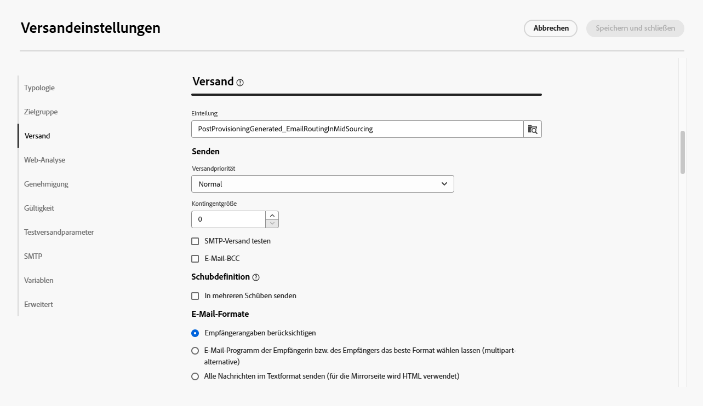

# Versandeinstellungen konfigurieren {#del-settings}

Versandeinstellungen **technische Versandparameter** die in der Versandvorlage definiert sind. Sie können bei jedem Versand überschrieben werden. Diese Einstellungen sind im Abschnitt **Einstellungen** bei der Bearbeitung eines Versands oder einer Versandvorlage verfügbar ist.

>[!CAUTION]
>
>Diese Einstellungen werden hier nur zur Information beschrieben. Einige sind von Ihrer Konfiguration und Ihren Berechtigungen abhängig. Sie dürfen in dieser Version des Produkts nicht geändert werden.

## Typologieeinstellungen {#typology}

>[!CONTEXTUALHELP]
>id="acw_email_settings_typology"
>title="Typologie"
>abstract="Typologieregeln ermöglichen es Marketing-Fachleuten, Geschäftspraktiken für alle Sendungen zu standardisieren. Eine Typologie ist eine Sammlung von Typologieregeln, mit denen der Versand von Sendungen gesteuert, gefiltert und priorisiert werden kann. Profile, die den Kriterien einer Typologieregel entsprechen, werden in der Vorbereitungsphase von den Versandzielgruppen ausgeschlossen. Typologien und Typologieregeln werden in der Campaign-Client-Konsole erstellt."

>[!CONTEXTUALHELP]
>id="acw_delivery_template_settings_typology"
>title="Typologieeinstellungen für den Versand"
>abstract="Typologieregeln ermöglichen es Marketing-Fachleuten, Geschäftspraktiken für alle Sendungen zu standardisieren. Eine Typologie ist eine Sammlung von Typologieregeln, mit denen der Versand von Sendungen gesteuert, gefiltert und priorisiert werden kann. Profile, die den Kriterien einer Typologieregel entsprechen, werden in der Vorbereitungsphase von den Versandzielgruppen ausgeschlossen. Typologien und Typologieregeln werden in der Campaign-Client-Konsole erstellt."

Typologien sind Gruppen von **Typologieregeln**, die während der Vorbereitungsphase ausgeführt werden, um auf einfache Weise mehrere Filterregeln gleichzeitig auf einen Versand anwenden zu können. Sie ermöglichen es Marketing-Fachleuten, Geschäftsvorgänge für alle Sendungen zu standardisieren, da sie damit den Versand von Nachrichten kontrollieren, filtern und priorisieren können.

Wenn Sie eine Typologie mit einer Nachricht oder Nachrichtenvorlage verknüpfen, werden die in der Typologie enthaltenen Typologieregeln ausgeführt, um die Gültigkeit des Versands während der Nachrichtenvorbereitung zu überprüfen. Profile, die den Kriterien einer Typologieregel entsprechen, werden dann von den Versandzielgruppen ausgeschlossen.

Mit Typologien können Sie sicherstellen, dass Ihre Sendungen immer bestimmte Elemente (z. B. einen Abmelde-Link oder eine Betreffzeile) oder Filterregeln enthalten, um Gruppen von Ihrer beabsichtigten Zielgruppe auszuschließen (z. B. Abonnenten, Konkurrenten oder Kunden ohne Treueprogramm).

{zoomable=&quot;yes&quot;}

>[!NOTE]
>
>Typologien und Typologieregeln werden in der Campaign-Client-Konsole erstellt. Weitere Informationen über Druckregeln und die Konfiguration der Ermüdungsverwaltung finden Sie in der [Dokumentation zu Campaign v8 (Client-Konsole)](https://experienceleague.adobe.com/docs/campaign/automation/campaign-optimization/campaign-typologies.html?lang=de){target="_blank"}.

### Druckparameter {#pressure-parameters}

>[!CONTEXTUALHELP]
>id="acw_email_settings_pressure_parameters"
>title="Druckparameter für den Versand"
>abstract="Die Versandgewichtung ermöglicht die Identifizierung von Sendungen mit der höchsten Priorität im Rahmen der Ermüdungsverwaltung. Nachrichten mit der höchsten Gewichtung haben Priorität."

>[!CONTEXTUALHELP]
>id="acw_delivery_template_settings_delivery_weight"
>title="Versandgewichtung"
>abstract="Die Versandgewichtung ermöglicht es Ihnen, im Rahmen der Druckverwaltung diejenigen Sendungen festzulegen, die vorrangig durchgeführt werden sollen. Die Nachrichten mit der höchsten Gewichtung haben Vorrang."

In diesem Abschnitt können Sie mithilfe von Druckparametern einen **Schwellenwert** definieren, um Regeln für die Ermüdungsverwaltung einzurichten, d. h. die maximale Anzahl von Nachrichten, die in einem bestimmten Zeitraum an ein Profil gesendet werden können.

Sobald diese Schwelle erreicht ist, können keine Sendungen mehr durchgeführt werden, bis der Zeitraum abgelaufen ist. Durch dieses Verfahren kann ein Profil aus einem Versand automatisch ausgeschlossen werden, wenn eine Nachricht die festgelegte Schwelle übersteigt. Dadurch wird verhindert, dass ein Profil zu oft angesprochen wird.

Schwellenwerte können konstant oder variabel sein. Das bedeutet, dass unterschiedliche Profile in einem bestimmten Zeitraum unterschiedliche Schwellen aufweisen können oder Schwellen sogar innerhalb desselben Profils variieren können.

Im Feld **[!UICONTROL Gewichtungstyp]** stehen drei Optionen zur Verfügung:

* **[!UICONTROL Konstante]**
* **[!UICONTROL Empfängerabhängig]**
* **[!UICONTROL Wird in jeder Regel definiert]**

Verwenden Sie das Feld **[!UICONTROL Versandgewichtung]**, um die Versandpriorität zu definieren. Jeder Versand verfügt über eine Gewichtung, die die jeweilige Priorität darstellt. Standardmäßig ist die Versandgewichtung auf den Wert 5 festgelegt. Mit Druckregeln können Sie die Gewichtung der Sendungen festlegen, auf die sie angewendet werden. Die Gewichtung kann konstant sein oder mithilfe einer Formel empfängerabhängig berechnet werden. Beispielsweise kann die Gewichtung eines Versands den Interessen eines Empfängers bzw. einer Empfängerin entsprechend bestimmt werden.

Verwenden Sie die **[!UICONTROL Versandmodus]** -Feld, um den Zielauswertungsmodus auszuwählen.

Drei Modi sind verfügbar:

* **[!UICONTROL Zielgruppenschätzung und Nachrichtenpersonalisierung]**
* **[!UICONTROL Schätzung und Validierung der geplanten Zielgruppe]**
* **[!UICONTROL Zielgruppenauswertung]**

>[!NOTE]
>
>Ermüdungs- und Druckregeln werden in der Campaign-Clientkonsole konfiguriert. Weitere Informationen finden Sie in der [Dokumentation zu Campaign v8 (Client-Konsole)](https://experienceleague.adobe.com/docs/campaign/automation/campaign-optimization/pressure-rules.html?lang=de){target="_blank"}.

### Kapazitätseinstellungen {#capacity-settings}

>[!CONTEXTUALHELP]
>id="acw_email_settings_capacity_settings"
>title="Kapazitätseinstellungen für den Versand"
>abstract="Stellen Sie vor dem Versand von Nachrichten mithilfe von Kapazitätsregeln sicher, dass Ihr Unternehmen den Versand, die durch den Versand möglicherweise erzeugten eingehenden Nachrichten und die Anzahl der Anrufe, die beispielsweise an die Abonnentinnen und Abonnenten zu richten sind, verarbeiten kann. Die Kapazitätsregeln sind in der Adobe Campaign v8-Konsole definiert. Wählen Sie in diesem Bildschirm eine mit dem Kanal verknüpfte Regel aus."

>[!CONTEXTUALHELP]
>id="acw_delivery_template_settings_recipient_importance"
>title="Wichtigkeit des Empfängers bzw. der Empfängerin"
>abstract="Die Wichtigkeit des Empfängers ist eine Formel, mit der bestimmt wird, welche Profile bei Überschreitung der Typologieregeln beibehalten werden."

In diesem Abschnitt können Sie eine Kapazitätsregel auswählen, die in der Adobe Campaign v8-Konsole definiert ist. Diese Regel ist mit dem Kanal verknüpft.

Die **[!UICONTROL Bedeutung des Empfängers]** -Feld ist eine Formel, mit der bestimmt wird, welche Profile bei Überschreitung der Typologieregeln für die Kapazität beibehalten werden.

>[!NOTE]
>
>Typologieregeln werden in der Campaign-Client-Konsole konfiguriert. Weitere Informationen finden Sie in der [Dokumentation zu Campaign v8 (Client-Konsole)](https://experienceleague.adobe.com/docs/campaign/automation/campaign-optimization/consistency-rules.html?lang=de){target="_blank"}.

## Zielgruppeneinstellungen {#audience}

>[!CONTEXTUALHELP]
>id="acw_email_settings_audience"
>title="Zielgruppeneinstellungen für den Versand"
>abstract="Ein **Zielgruppen-Mapping** unter den verfügbaren Optionen auswählen. Zielgruppen-Mappings werden in der Adobe Campaign v8-Konsole definiert. Außerdem können die Ausschlussparameter für den Versand festgelegt werden."

In diesem Abschnitt können Sie ein verfügbares **Zielgruppen-Mapping** auswählen. Zielgruppen-Mappings werden in der Adobe Campaign v8-Konsole definiert. Zielgruppen-Mapping ist der Datentyp, den ein Vorgang verarbeitet. Sie ermöglicht die Bestimmung der Zielpopulation: Empfänger, Vertragsempfänger, Benutzer, Abonnenten etc. [Weitere Informationen zu Zielgruppen-Mappings](../audience/targeting-dimensions.md).

Im **[!UICONTROL Ausschluss]** können Sie Profile ausschließen, die nicht mehr kontaktiert werden möchten oder in Quarantäne sind. [Weitere Informationen](https://experienceleague.adobe.com/docs/campaign/campaign-v8/send/failures/quarantines.html?lang=de){target="_blank"}

## Versand {#delivery}

>[!CONTEXTUALHELP]
>id="acw_email_settings_delivery"
>title="Versandeinstellungen für den Versand"
>abstract="Versandparameter sind technische Einstellungen, die für Ihren Versand gelten. Sie können den Versand und die Routinemodi ändern, E-Mail-BCC aktivieren, in Schüben senden und auch das Format der gesendeten E-Mail-Nachrichten auswählen. Diese Optionen sind erfahrenen Benutzerinnen und Benutzern vorbehalten."

**[!UICONTROL Versandparameter]** sind technische Einstellungen, die für Ihren Versand gelten.

{zoomable=&quot;yes&quot;}

Die integrierte **[!UICONTROL Routing]** externes Konto wird standardmäßig bereitgestellt. Es enthält die technischen Parameter, die es der Anwendung ermöglichen, Sendungen durchzuführen.

Sie können folgende **[!UICONTROL Versandeinstellungen]** definieren:

* **[!UICONTROL Versandpriorität]**: Diese Option ermöglicht es Ihnen, die Versandreihenfolge für Ihre Sendungen durch Angabe der Prioritätsstufe (normal, hoch oder niedrig) zu ändern.

* **[!UICONTROL Kontingentgröße]**: Mithilfe dieser Option können Sie die Anzahl der in einem XML-Versand-Package enthaltenen Nachrichten festlegen. Wenn der Parameter auf „0“ gesetzt ist, werden die Nachrichten automatisch gruppiert. Die Package-Größe wird durch die `<delivery size>/1024`-Berechnung definiert, mit mindestens 8 und maximal 256 Nachrichten pro Package.

  >[!IMPORTANT]
  >
  >Wenn der Versand durch Duplizieren eines existierenden Versands erstellt wird, wird dieser Parameter zurückgesetzt.

* **[!UICONTROL SMTP-Versand testen]** (E-Mail-Kanal): Diese Option wird zum Testen des Versands über SMTP verwendet. Die E-Mail wird bis zur Verbindung mit dem SMTP-Server verarbeitet, aber nicht gesendet: Für jeden Empfänger der E-Mail stellt Campaign eine Verbindung zum SMTP-Provider-Server her, führt den SMTP-RCPT-TO-Befehl aus und schließt die Verbindung vor dem SMTP-DATA-Befehl.

* **[!UICONTROL Email BCC]** (E-Mail-Kanal): Mit dieser Option können Sie E-Mails über BCC in einem externen System speichern, indem Sie einfach eine BCC-E-Mail-Adresse zu Ihrer Versandzielgruppe hinzufügen. Weitere Informationen finden Sie in der [Dokumentation zu Campaign v8 (Client-Konsole)](https://experienceleague.adobe.com/docs/campaign/campaign-v8/send/emails/email-bcc.html?lang=de){target="_blank"}.

Wählen Sie im Abschnitt **[!UICONTROL Wellendefinition]** die Option **[!UICONTROL In mehreren Schüben versenden]**, um das gesendete Volumen progressiv in Schüben zu erhöhen. Dadurch wird verhindert, dass Ihre Nachrichten als Spam gekennzeichnet werden, oder Sie können die Anzahl der pro Tag versendeten Nachrichten beschränken. Mit Schüben können Sie Sendungen in mehrere Teilsendungen unterteilen, anstatt große Mengen von Nachrichten gleichzeitig zu senden. [Weitere Informationen](send-using-waves.md)

Bei E-Mails können Sie auch die **[!UICONTROL Mail-Formate]** der wie unten beschrieben gesendeten Nachrichten.

* **[!UICONTROL Empfängereinstellungen verwenden]** (Standardmodus): Das E-Mail-Format wird entsprechend den im Empfängerprofil gespeicherten Daten definiert. Wenn ein Empfänger E-Mails in einem bestimmten Format erhalten möchte, ist dies das Format, das gesendet wird. Wenn das Feld nicht ausgefüllt ist, wird eine mehrteilige alternative E-Mail gesendet (siehe unten).

* **[!UICONTROL E-Mail-Client des Empfängers das beste Format wählen lassen]**: Die E-Mail enthält beide Formate: Text und HTML. Das beim Empfang angezeigte Format hängt von der Konfiguration der E-Mail-Software des Empfängers ab (Multipart-Alternative).

  >[!IMPORTANT]
  >
  >Diese Option umfasst beide Versionen der Nachricht. Dies wirkt sich auf die Versandrate aus, da die E-Mail-Größe größer ist.

* **[!UICONTROL Alle Nachrichten im Textformat senden]**: Die E-Mail wird im Textformat gesendet. Das HTML-Format wird nicht gesendet, sondern nur für die Mirrorseite verwendet, wenn der Empfänger auf die E-Mail klickt.

## Web-Analyse {#web-analytics}

>[!CONTEXTUALHELP]
>id="acw_email_settings_webanalytics"
>title="Web-Analyse-Einstellungen für den Versand"
>abstract="Ein Web-Analyse-Konto auswählen. Dieses Konto wird in der Campaign-Client-Konsole konfiguriert. Außerdem können die Tags definiert werden, die für das verwendete Analyse-Tool freigegeben wurden."

In diesem Abschnitt können Sie ein Web-Analyse-Konto auswählen. Dieses Konto wird in der Campaign-Client-Konsole konfiguriert.

Außerdem können die Tags definiert werden, die für das verwendete Analyse-Tool freigegeben wurden.

>[!NOTE]
>
>Web-Analyse-Funktionen werden in der Campaign-Client-Konsole konfiguriert. Weitere Informationen finden Sie in der [Dokumentation zu Campaign v8 (Client-Konsole)](https://experienceleague.adobe.com/docs/campaign/campaign-v8/connect/ac-aa.html?lang=de#external-account-ac){target="_blank"}.

## Weitere Zustellversuche {#retries}

>[!CONTEXTUALHELP]
>id="acw_delivery_template_settings_retries"
>title="Maximale Anzahl der weiteren Zustellversuche"
>abstract="Wenn ein Nachrichtenversand aufgrund eines temporären Fehlers fehlschlägt, werden weitere Zustellversuche bis zum Ende der Versandlaufzeit durchgeführt."

<!--Currently not visible in UI > ??-->

Sendungen von vorübergehend nicht zugestellten Nachrichten aufgrund eines Softbounce oder eines Ignoriert-Fehlers werden automatisch wiederholt. Standardmäßig sind innerhalb der ersten 24 Stunden des Versands fünf erneute Zustellversuche im Abstand von mindestens einer Stunde vorgesehen.

## Genehmigung (E-Mail-Kanal) {#approval}

>[!CONTEXTUALHELP]
>id="acw_email_settings_approval"
>title="Genehmigungsmodus für den Versand"
>abstract="Den Genehmigungsmodus auswählen. Wenn bei der Versandvorbereitung Warnungen erzeugt werden, kann der Versand so konfiguriert werden, dass definiert wird, ob er trotzdem ausgeführt werden soll."

>[!CONTEXTUALHELP]
>id="acw_delivery_template_settings_approval"
>title="Genehmigungsmodus für Sendungen"
>abstract="Wählen Sie den Genehmigungsmodus für Sendungen aus, die auf dieser Vorlage basieren. Wenn bei der Versandvorbereitung Warnungen erzeugt werden, kann der Versand so konfiguriert werden, dass definiert wird, ob er trotzdem ausgeführt werden soll."

Wenn bei der Vorbereitung eines E-Mail-Versands Warnungen erzeugt werden, können Sie den Versand so konfigurieren, dass festgelegt wird, ob er weiterhin ausgeführt werden soll oder nicht. Standardmäßig muss der Benutzer den Versand von E-Mails nach Abschluss der Analysephase bestätigen: **Handbuch** Validierung.

Sie können im entsprechenden Feld einen anderen Validierungsmodus auswählen. Folgende Modi sind verfügbar: 

* **[!UICONTROL Manuell]**: Am Ende der Analysephase muss der Benutzer bzw. die Benutzerin den Versand bestätigen, um die Nachrichten abzuschicken.
* **[!UICONTROL Halbautomatisch]**: Die Nachrichten werden automatisch gesendet, wenn die Analysephase ohne Warnhinweise abgeschlossen wird.
* **[!UICONTROL Automatisch]**: Die Nachrichten werden unabhängig vom Ergebnis der Analysephase automatisch gesendet.

## Gültigkeit {#validity}

>[!CONTEXTUALHELP]
>id="acw_email_settings_validity"
>title="Gültigkeit der Einstellungen"
>abstract="Im Feld **Versandlaufzeit** können Sie die Zeitspanne angeben, während der erneute Zustellversuche unternommen werden. Dies bedeutet konkret, dass Adobe Campaign die Nachrichten ab dem Startdatum versendet und bis zum Ablauf der angegebenen Spanne nicht zustellbare Nachrichten in regelmäßigen Abständen erneut sendet. Das Feld **Gültigkeit von Ressourcen** wird für hochgeladene Ressourcen verwendet, wie etwa die Mirrorseite oder Bilder. Nach Erreichen des Grenzwerts sind keine Ressourcen mehr verfügbar."

>[!CONTEXTUALHELP]
>id="acw_delivery_template_settings_resources_validity"
>title="Gültigkeit von Ressourcen"
>abstract="Das Feld **Gültigkeit von Ressourcen** wird für Ressourcen verwendet, die online verfügbar sind, insbesondere für die Mirrorseite und Bilder. Diese Ressourcen sind für eine begrenzte Zeit gültig: Nach Erreichen des Grenzwerts sind keine Ressourcen mehr verfügbar."

>[!CONTEXTUALHELP]
>id="acw_delivery_template_settings_delivery_duration"
>title="Versandlaufzeit"
>abstract="Im Feld **Versandlaufzeit** können Sie die Zeitspanne angeben, während der erneute Zustellversuche unternommen werden. Dies bedeutet konkret, dass Adobe Campaign die Nachrichten ab dem Startdatum versendet und bis zum Ablauf der angegebenen Spanne nicht zustellbare Nachrichten in regelmäßigen Abständen erneut sendet."

<!--
>[!CONTEXTUALHELP]
>id="acw_email_settings_resources_validity"
>title="Resources validity limit"
>abstract="The Validity limit field is used for uploaded resources, such as the mirror page or images. These resources are valid for a limited time: once the limit is reached, resources are no longer available."
-->

### Gültigkeitszeitraum {#validity-period}

Im Feld **[!UICONTROL Versandlaufzeit]** kann die Zeitspanne angegeben werden, in der erneute globale Zustellversuche unternommen werden. Dies bedeutet konkret, dass Adobe Campaign die Nachrichten ab dem Startdatum versendet und bis zum Ablauf der angegebenen Spanne nicht zustellbare Nachrichten in regelmäßigen Abständen erneut sendet.

Sie können alternativ auch ein genaues Datum angeben. Markieren Sie dazu die Option **[!UICONTROL Gültigkeit explizit festlegen]**. In diesem Fall kann mit den Versand- und Gültigkeitsdaten auch eine bestimmte Uhrzeit konfiguriert werden. Standardmäßig wird die aktuelle Uhrzeit eingesetzt, sie kann jedoch direkt im Eingabefeld angepasst werden.

Das Feld **[!UICONTROL Gültigkeit von Ressourcen]** wird für hochgeladene Ressourcen verwendet, insbesondere für die Mirrorseite und Bilder. Die Gültigkeitsdauer von Ressourcen auf dieser Seite ist begrenzt, um Speicherkapazität zu sparen. Nach diesem Limit sind diese Ressourcen nicht mehr verfügbar.

{zoomable=&quot;yes&quot;}

<!--Change screenshot to be consistent with prod > not sure which version is correct-->

Weitere Informationen zur Gültigkeitsdauer des Versands finden Sie in der [Dokumentation zu Campaign v8 (Client-Konsole)](https://experienceleague.adobe.com/docs/campaign/campaign-v8/campaigns/send/failures/delivery-failures.html?lang=de#validity-period){target="_blank"}.

### Verwaltung der Mirrorseite (E-Mail-Kanal) {#mirror}

Eine Mirrorseite ist eine HTML-Seite, die über einen Webbrowser online abgerufen werden kann und deren Inhalt mit dem der E-Mail identisch ist. Standardmäßig wird die Mirrorseite erzeugt, wenn der Link in den Inhalt der E-Mail eingefügt wird.

Zusätzlich zum Standardmodus stehen die folgenden Optionen zur Verfügung:

* **[!UICONTROL Mirrorseitenerstellung erzwingen]**: Verwenden Sie diesen Modus, um die Mirrorseite zu erstellen, selbst wenn in die E-Mail kein Link zur Mirrorseite eingefügt wurde.
* **[!UICONTROL Mirrorseite nicht generieren]**: Verwenden Sie diesen Modus, um das Generieren einer Mirrorseite zu vermeiden, selbst wenn der Link in der E-Mail vorhanden ist.
* **[!UICONTROL Von der Nachrichtenkennung aus zugängliche Mirrorseite erzeugen]**: Wenn der Mirrorseite-Link nicht im E-Mail-Inhalt vorhanden ist, verwenden Sie diese Option, um den Zugriff auf den Inhalt der Mirrorseite im Versandlog-Fenster über die Client-Konsole zu aktivieren.

### Tracking {#tracking}

<!--
>[!CONTEXTUALHELP]
>id="acw_email_settings_tracking_validity"
>title="Validity period"
>abstract="This option defines the duration for which the tracking is activated on the URLs."
-->

>[!CONTEXTUALHELP]
>id="acw_delivery_template_settings_tracking_validity"
>title="Gültigkeitszeitraum"
>abstract="Der Gültigkeitszeitraum legt die Dauer fest, für die das Tracking in den Nachrichten-URLs aktiviert ist."

**[!UICONTROL Trackingparameter]** werden im entsprechenden Abschnitt definiert. Mögliche Optionen sind:

* **[!UICONTROL Tracking-Gültigkeit]**: Verwenden Sie diese Option, um die Dauer zu ändern, für die das Tracking für die URLs aktiviert ist.
* **[!UICONTROL Ersatz-URL für abgelaufene URLs]**: Verwenden Sie diese Option, um eine Fallback-URL für eine Web-Seite einzugeben: Sie wird angezeigt, wenn das Tracking abgelaufen ist.

## Testversandeinstellungen {#test-setttings}

>[!CONTEXTUALHELP]
>id="acw_email_settings_testsettings"
>title="Definieren der Testversandparameter für den Versand"
>abstract="Wählen Sie die Ausschlussparameter aus und passen Sie den Titel der Testsendungen an."

<!--Test to be replaced with Proof everywhere - currently not consistent within UI > changed to Proof to reflect UI here but not consistent in documentation either-->

Sie können die Ausschlussparameter in diesem Abschnitt festlegen. Folgende Optionen sind verfügbar: 

* **[!UICONTROL Beibehalten von Dubletten]** ermöglicht Ihnen, mehrere Sendungen an Profile zu erlauben, die verschiedenen Zielgruppenkriterien entsprechen.
* **[!UICONTROL Adressen auf der Blockierungsliste behalten]**: Ermöglicht es, Zielgruppenprofile, die nicht mehr in den Versand eingeschlossen sind, beizubehalten, z. B. nach einer Abmeldung (Opt-out).
* **[!UICONTROL Quarantäneadressen beibehalten]**: Ermöglicht es, Zielgruppenprofile mit einer Adresse beizubehalten, über die keine Reaktion erfolgt.

Sie können auch den Namen der Testsendungen anpassen:

* Verwenden Sie die Option **[!UICONTROL Versandcode für den Testversand beibehalten]**, um den Testversand mit demselben Versand-Code zu verknüpfen, der für den Versand, auf den er sich bezieht, definiert ist.
* Standardmäßig wird dem Betreff des Testversands „TESTVERSAND #“ vorangestellt, wobei # die Nummer des Testversands ist. Sie können dieses Präfix im Feld **[!UICONTROL Titelpräfix]** ändern.
