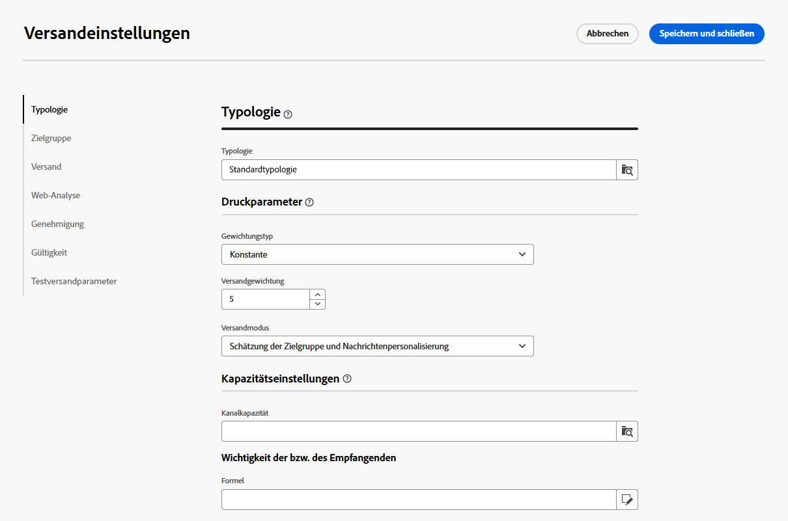
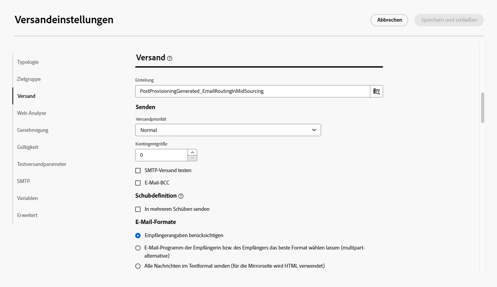
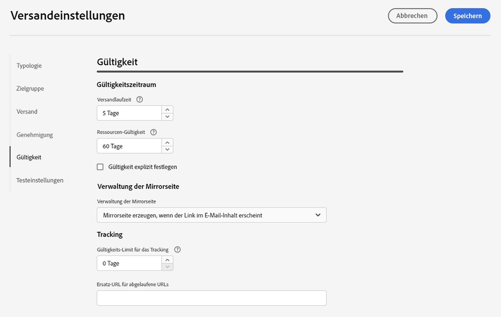
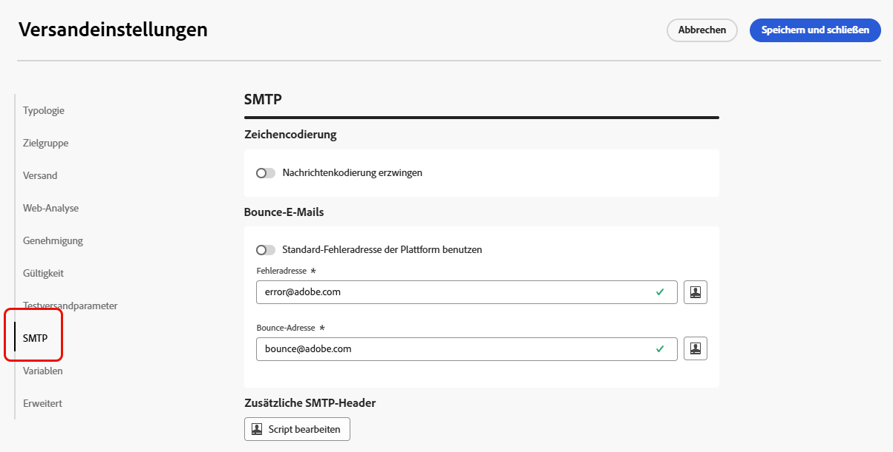
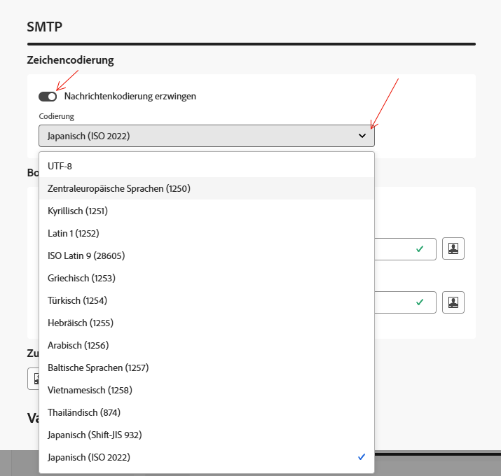
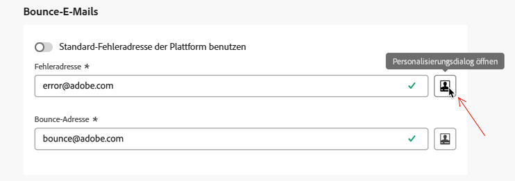
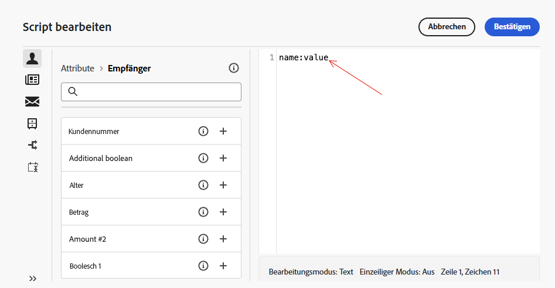
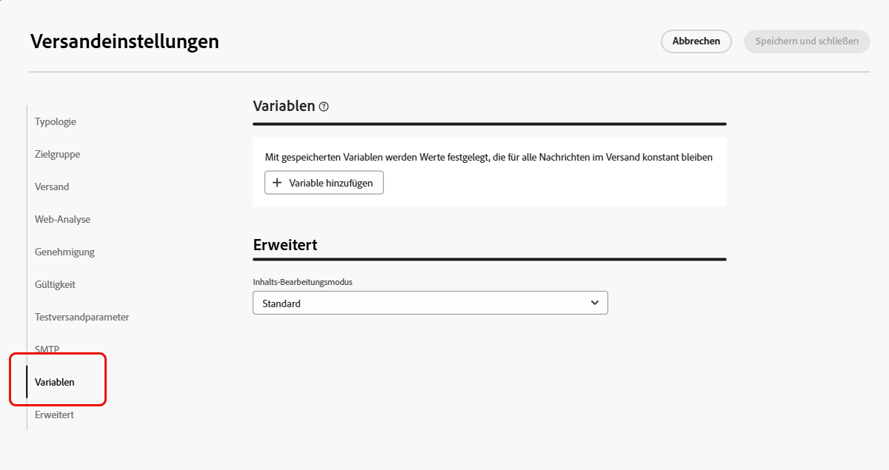
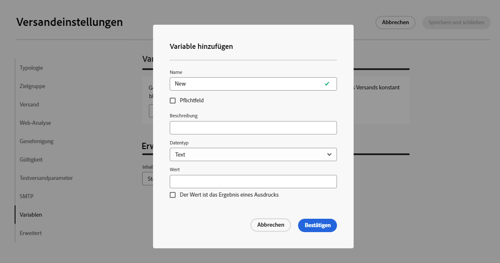

<?xml version="1.0" encoding="UTF-8"?>
<xliff xmlns="urn:oasis:names:tc:xliff:document:1.2" xmlns:okp="okapi-framework:xliff-extensions" xmlns:its="http://www.w3.org/2005/11/its" xmlns:itsxlf="http://www.w3.org/ns/its-xliff/" version="1.2" its:version="2.0">
<file original="help/v8/advanced-settings/delivery-settings.md.mdsc" source-language="en-US" target-language="en-XX" datatype="x-text/markdown">
<body>
<trans-unit id="tu34" xml:space="preserve">
<source xml:lang="en-US">https://experienceleague.adobe.com/docs/campaign/automation/campaign-optimization/pressure-rules.html</source>
<target xml:lang="en-XX">https://experienceleague.adobe.com/docs/campaign/automation/campaign-optimization/pressure-rules.html?lang=de</target>
</trans-unit>
<trans-unit id="tu44" xml:space="preserve">
<source xml:lang="en-US">https://experienceleague.adobe.com/docs/campaign/automation/campaign-optimization/consistency-rules.html</source>
<target xml:lang="en-XX">https://experienceleague.adobe.com/docs/campaign/automation/campaign-optimization/consistency-rules.html?lang=de</target>
</trans-unit>
<trans-unit id="tu50" xml:space="preserve">
<source xml:lang="en-US">https://experienceleague.adobe.com/docs/campaign/campaign-v8/send/failures/quarantines.html</source>
<target xml:lang="en-XX">https://experienceleague.adobe.com/docs/campaign/campaign-v8/send/failures/quarantines.html?lang=de</target>
</trans-unit>
<trans-unit id="tu64" xml:space="preserve">
<source xml:lang="en-US">https://experienceleague.adobe.com/docs/campaign/campaign-v8/send/emails/email-bcc.html</source>
<target xml:lang="en-XX">https://experienceleague.adobe.com/docs/campaign/campaign-v8/send/emails/email-bcc.html?lang=de</target>
</trans-unit>
<trans-unit id="tu87" xml:space="preserve">
<source xml:lang="en-US">https://experienceleague.adobe.com/docs/campaign/campaign-v8/connect/ac-aa.html#external-account-ac</source>
<target xml:lang="en-XX">https://experienceleague.adobe.com/docs/campaign/campaign-v8/connect/ac-aa.html?lang=de#external-account-ac</target>
</trans-unit>
<trans-unit id="tu115" xml:space="preserve">
<source xml:lang="en-US">https://experienceleague.adobe.com/docs/campaign/campaign-v8/campaigns/send/failures/delivery-failures.html#validity-period</source>
<target xml:lang="en-XX">https://experienceleague.adobe.com/docs/campaign/campaign-v8/campaigns/send/failures/delivery-failures.html?lang=de#validity-period</target>
</trans-unit>
<trans-unit id="tu1" restype="x-YAML_METADATA_HEADER_VALUE" xml:space="preserve">
<source xml:lang="en-US">Configure delivery Settings</source>
<target xml:lang="en-XX">Konfigurieren von Versandeinstellungen</target>
</trans-unit>
<trans-unit id="tu2" restype="x-YAML_METADATA_HEADER_VALUE" xml:space="preserve">
<source xml:lang="en-US">Learn how to configure delivery settings in Campaign Web</source>
<target xml:lang="en-XX">Erfahren Sie, wie Sie Versandeinstellungen in Campaign Web konfigurieren</target>
</trans-unit>
<trans-unit id="tu3" xml:space="preserve">
<source xml:lang="en-US">Configure delivery settings</source>
<target xml:lang="en-XX">Versandeinstellungen konfigurieren</target>
</trans-unit>
<trans-unit id="tu4" xml:space="preserve">
<source xml:lang="en-US">Delivery settings are <ph id="1" ctype="x-STRONG_EMPHASIS">**</ph>technical delivery parameters<ph id="2" ctype="x-STRONG_EMPHASIS">**</ph> that are defined in the delivery template. They can be overloaded for each delivery. These settings are available from the <ph id="3" ctype="x-STRONG_EMPHASIS">**</ph>Settings<ph id="4" ctype="x-STRONG_EMPHASIS">**</ph> button available when editing a delivery or a delivery template.</source>
<target xml:lang="en-XX">Bei den Versandeinstellungen handelt es sich um <ph id="1" ctype="x-STRONG_EMPHASIS">**</ph>technische Versandparameter<ph id="2" ctype="x-STRONG_EMPHASIS">**</ph>, die in der Versandvorlage definiert sind. Sie können bei jedem Versand überschrieben werden. Diese Einstellungen sind über die Schaltfläche <ph id="3" ctype="x-STRONG_EMPHASIS">**</ph>Einstellungen<ph id="4" ctype="x-STRONG_EMPHASIS">**</ph> verfügbar, wenn ein Versand oder eine Versandvorlage bearbeitet wird.</target>
</trans-unit>
<trans-unit id="tu5" xml:space="preserve">
<source xml:lang="en-US"><ph id="1" ctype="x-regxph" equiv-text="&lbrack;!CAUTION">[!CAUTION]</ph></source>
<target xml:lang="en-XX"><ph id="1" ctype="x-regxph" equiv-text="&lbrack;!CAUTION">[!CAUTION]</ph></target>
</trans-unit>
<trans-unit id="tu6" xml:space="preserve">
<source xml:lang="en-US">These settings are described for your information only. Some of them depend on your configuration and permissions. They must not be modified in this version of the product.</source>
<target xml:lang="en-XX">Diese Einstellungen werden hier nur zur Information beschrieben. Einige sind von Ihrer Konfiguration und Ihren Berechtigungen abhängig. Sie dürfen in dieser Version des Produkts nicht geändert werden.</target>
</trans-unit>
<trans-unit id="tu7" xml:space="preserve">
<source xml:lang="en-US">Typology settings</source>
<target xml:lang="en-XX">Typologieeinstellungen</target>
</trans-unit>
<trans-unit id="tu8" xml:space="preserve">
<source xml:lang="en-US">Typology</source>
<target xml:lang="en-XX">Typology</target>
</trans-unit>
<trans-unit id="tu9" xml:space="preserve">
<source xml:lang="en-US">Typologies allow you to standardize business practices, across all deliveries. A typology is a collection of typology rules which lets you control, filter, and prioritize the sending of deliveries. Profiles which match criteria within a typology rule are excluded from the delivery audiences at the preparation phase.</source>
<target xml:lang="en-XX">Typologien ermöglichen es Ihnen, Geschäftspraktiken über alle Sendungen hinweg zu standardisieren. Eine Typologie ist eine Sammlung von Typologieregeln, mit denen der Versand von Sendungen gesteuert, gefiltert und priorisiert werden kann. Profile, die den Kriterien einer Typologieregel entsprechen, werden in der Vorbereitungsphase von den Versandzielgruppen ausgeschlossen.</target>
</trans-unit>
<trans-unit id="tu10" xml:space="preserve">
<source xml:lang="en-US">Typology settings for the delivery</source>
<target xml:lang="en-XX">Typologieeinstellungen für den Versand</target>
</trans-unit>
<trans-unit id="tu11" xml:space="preserve">
<source xml:lang="en-US">Typology rules allow you to standardize business practices, across all deliveries. A typology is a collection of typology rules which lets you control, filter, and prioritize the sending of deliveries. Profiles which match criteria within a typology rule are excluded from the delivery audiences at the preparation phase.</source>
<target xml:lang="en-XX">Typologieregeln ermöglichen es Ihnen, Geschäftspraktiken über alle Sendungen hinweg zu standardisieren. Eine Typologie ist eine Sammlung von Typologieregeln, mit denen der Versand von Sendungen gesteuert, gefiltert und priorisiert werden kann. Profile, die den Kriterien einer Typologieregel entsprechen, werden in der Vorbereitungsphase von den Versandzielgruppen ausgeschlossen.</target>
</trans-unit>
<trans-unit id="tu12" xml:space="preserve">
<source xml:lang="en-US">Typologies are sets of <ph id="1" ctype="x-STRONG_EMPHASIS">**</ph>typology rules<ph id="2" ctype="x-STRONG_EMPHASIS">**</ph> that are executed during the preparation phase in order to easily apply multiple filtering rules to a delivery at once. They allow marketers to standardize business practices across all deliveries as they let them control, filter, and prioritize the sending of deliveries. <ph id="3" ctype="x-LINK">[</ph>Learn how to create typologies and typology rules<ph id="4" ctype="x-LINK">](../administration/typologies.md)</ph></source>
<target xml:lang="en-XX">Typologien sind Gruppen von <ph id="1" ctype="x-STRONG_EMPHASIS">**</ph>Typologieregeln<ph id="2" ctype="x-STRONG_EMPHASIS">**</ph>, die während der Vorbereitungsphase ausgeführt werden, um auf einfache Weise mehrere Filterregeln gleichzeitig auf einen Versand anwenden zu können. Sie ermöglichen es Marketing-Fachleuten, ihre Geschäftspraktiken über alle Sendungen hinweg zu standardisieren, da sie die Durchführung von Sendungen kontrollieren, filtern und priorisieren können. <ph id="3" ctype="x-LINK">[</ph>Erfahren Sie, wie Sie Typologien und Typologieregeln erstellen<ph id="4" ctype="x-LINK">](../administration/typologies.md)</ph>.</target>
</trans-unit>
<trans-unit id="tu13" xml:space="preserve">
<source xml:lang="en-US"><ph id="1" ctype="x-IMAGE">{zoomable="yes"}</ph></source>
<target xml:lang="en-XX"><ph id="1" ctype="x-IMAGE">{zoomable="yes"}</ph></target>
</trans-unit>
<trans-unit id="tu14" xml:space="preserve">
<source xml:lang="en-US">Pressure parameters</source>
<target xml:lang="en-XX">Druckparameter</target>
</trans-unit>
<trans-unit id="tu15" xml:space="preserve">
<source xml:lang="en-US">Pressure parameters for the delivery</source>
<target xml:lang="en-XX">Druckparameter für den Versand</target>
</trans-unit>
<trans-unit id="tu16" xml:space="preserve">
<source xml:lang="en-US">Delivery weights let you identify top-priority deliveries within the framework of fatigue management. Messages with the highest weight have priority.</source>
<target xml:lang="en-XX">Die Versandgewichtung ermöglicht die Identifizierung von Sendungen mit der höchsten Priorität im Rahmen der Ermüdungsverwaltung. Nachrichten mit der höchsten Gewichtung haben Priorität.</target>
</trans-unit>
<trans-unit id="tu17" xml:space="preserve">
<source xml:lang="en-US">Delivery weight</source>
<target xml:lang="en-XX">Versandgewichtung</target>
</trans-unit>
<trans-unit id="tu18" xml:space="preserve">
<source xml:lang="en-US">Delivery weights let you identify top-priority deliveries within the framework of pressure management. Messages with the highest weight have priority.</source>
<target xml:lang="en-XX">Die Versandgewichtung ermöglicht die Identifizierung von Sendungen mit der höchsten Priorität im Rahmen der Druckverwaltung. Nachrichten mit der höchsten Gewichtung haben Priorität.</target>
</trans-unit>
<trans-unit id="tu19" xml:space="preserve">
<source xml:lang="en-US">In this section, pressure parameters let you define a <ph id="1" ctype="x-STRONG_EMPHASIS">**</ph>threshold<ph id="2" ctype="x-STRONG_EMPHASIS">**</ph> to set up fatigue management rules, which is the maximum number of messages that can be sent to one profile over a given period.</source>
<target xml:lang="en-XX">In diesem Abschnitt können Sie mithilfe von Druckparametern einen <ph id="1" ctype="x-STRONG_EMPHASIS">**</ph>Schwellenwert<ph id="2" ctype="x-STRONG_EMPHASIS">**</ph> definieren, um Regeln für die Ermüdungsverwaltung einzurichten, d. h. die maximale Anzahl von Nachrichten, die in einem bestimmten Zeitraum an ein Profil gesendet werden können.</target>
</trans-unit>
<trans-unit id="tu20" xml:space="preserve">
<source xml:lang="en-US">Once this threshold has been reached, no more deliveries can take place until the end of the period considered. This process lets you automatically exclude a profile from a delivery if a message exceeds the set threshold, thus avoiding over-solicitation.</source>
<target xml:lang="en-XX">Sobald diese Schwelle erreicht ist, können keine Sendungen mehr durchgeführt werden, bis der Zeitraum abgelaufen ist. Durch dieses Verfahren kann ein Profil aus einem Versand automatisch ausgeschlossen werden, wenn eine Nachricht die festgelegte Schwelle übersteigt. Dadurch wird verhindert, dass ein Profil zu oft angesprochen wird.</target>
</trans-unit>
<trans-unit id="tu21" xml:space="preserve">
<source xml:lang="en-US">Threshold values can be either constant or variable. This means that for a given period, thresholds can vary from one profile to another, or even for the same profile.</source>
<target xml:lang="en-XX">Schwellenwerte können konstant oder variabel sein. Das bedeutet, dass unterschiedliche Profile in einem bestimmten Zeitraum unterschiedliche Schwellen aufweisen können oder Schwellen sogar innerhalb desselben Profils variieren können.</target>
</trans-unit>
<trans-unit id="tu22" xml:space="preserve">
<source xml:lang="en-US">In the <ph id="1" ctype="x-STRONG_EMPHASIS">**[!UICONTROL </ph>Weight type<ph id="3" ctype="x-LINK_REF">]**</ph> field, three options are available:</source>
<target xml:lang="en-XX">Im Feld <ph id="1" ctype="x-STRONG_EMPHASIS">**[!UICONTROL </ph>Gewichtungstyp<ph id="3" ctype="x-LINK_REF">]**</ph> stehen drei Optionen zur Verfügung:</target>
</trans-unit>
<trans-unit id="tu23" xml:space="preserve">
<source xml:lang="en-US"><ph id="1" ctype="x-STRONG_EMPHASIS">**[!UICONTROL </ph>Constant<ph id="3" ctype="x-LINK_REF">]**</ph></source>
<target xml:lang="en-XX"><ph id="1" ctype="x-STRONG_EMPHASIS">**[!UICONTROL </ph>Konstante<ph id="3" ctype="x-LINK_REF">]**</ph></target>
</trans-unit>
<trans-unit id="tu24" xml:space="preserve">
<source xml:lang="en-US"><ph id="1" ctype="x-STRONG_EMPHASIS">**[!UICONTROL </ph>Depends on the recipient<ph id="3" ctype="x-LINK_REF">]**</ph></source>
<target xml:lang="en-XX"><ph id="1" ctype="x-STRONG_EMPHASIS">**[!UICONTROL </ph>Empfängerabhängig<ph id="3" ctype="x-LINK_REF">]**</ph></target>
</trans-unit>
<trans-unit id="tu25" xml:space="preserve">
<source xml:lang="en-US"><ph id="1" ctype="x-STRONG_EMPHASIS">**[!UICONTROL </ph>Defined in each rule<ph id="3" ctype="x-LINK_REF">]**</ph></source>
<target xml:lang="en-XX"><ph id="1" ctype="x-STRONG_EMPHASIS">**[!UICONTROL </ph>Wird in jeder Regel definiert<ph id="3" ctype="x-LINK_REF">]**</ph></target>
</trans-unit>
<trans-unit id="tu26" xml:space="preserve">
<source xml:lang="en-US">Use the <ph id="1" ctype="x-STRONG_EMPHASIS">**[!UICONTROL </ph>Delivery weight<ph id="3" ctype="x-LINK_REF">]**</ph> field to define the delivery priority. Each delivery has a weight which represents its level of priority. By default, the weight of a delivery is set to 5. Pressure rules let you define the weight of the deliveries which they are applied to. Weights can be either set or calculated via a formula to suit recipients. For example, you can define the weight of a delivery based on recipient interests.</source>
<target xml:lang="en-XX">Verwenden Sie das Feld <ph id="1" ctype="x-STRONG_EMPHASIS">**[!UICONTROL </ph>Versandgewichtung<ph id="3" ctype="x-LINK_REF">]**</ph>, um die Versandpriorität zu definieren. Jeder Versand verfügt über eine Gewichtung, die die jeweilige Priorität darstellt. Standardmäßig ist die Versandgewichtung auf den Wert 5 festgelegt. Mit Druckregeln können Sie die Gewichtung der Sendungen festlegen, auf die sie angewendet werden. Die Gewichtung kann konstant sein oder mithilfe einer Formel empfängerabhängig berechnet werden. Beispielsweise kann die Gewichtung eines Versands den Interessen einer Empfängerin bzw. eines Empfängers entsprechend bestimmt werden.</target>
</trans-unit>
<trans-unit id="tu27" xml:space="preserve">
<source xml:lang="en-US">Use the <ph id="1" ctype="x-STRONG_EMPHASIS">**[!UICONTROL </ph>Delivery mode<ph id="3" ctype="x-LINK_REF">]**</ph> field to select the target evaluation mode.</source>
<target xml:lang="en-XX">Verwenden Sie das Feld <ph id="1" ctype="x-STRONG_EMPHASIS">**[!UICONTROL </ph>Versandmodus<ph id="3" ctype="x-LINK_REF">]**</ph>, um den Zielgruppenauswertungsmodus auszuwählen.</target>
</trans-unit>
<trans-unit id="tu28" xml:space="preserve">
<source xml:lang="en-US">Three modes are available:</source>
<target xml:lang="en-XX">Drei Modi sind verfügbar:</target>
</trans-unit>
<trans-unit id="tu29" xml:space="preserve">
<source xml:lang="en-US"><ph id="1" ctype="x-STRONG_EMPHASIS">**[!UICONTROL </ph>Target estimation and message personalization<ph id="3" ctype="x-LINK_REF">]**</ph></source>
<target xml:lang="en-XX"><ph id="1" ctype="x-STRONG_EMPHASIS">**[!UICONTROL </ph>Zielgruppenschätzung und Nachrichtenpersonalisierung<ph id="3" ctype="x-LINK_REF">]**</ph></target>
</trans-unit>
<trans-unit id="tu30" xml:space="preserve">
<source xml:lang="en-US"><ph id="1" ctype="x-STRONG_EMPHASIS">**[!UICONTROL </ph>Estimation and approval of the provisional target<ph id="3" ctype="x-LINK_REF">]**</ph></source>
<target xml:lang="en-XX"><ph id="1" ctype="x-STRONG_EMPHASIS">**[!UICONTROL </ph>Schätzung und Validierung der geplanten Zielgruppe<ph id="3" ctype="x-LINK_REF">]**</ph></target>
</trans-unit>
<trans-unit id="tu31" xml:space="preserve">
<source xml:lang="en-US"><ph id="1" ctype="x-STRONG_EMPHASIS">**[!UICONTROL </ph>Target evaluation<ph id="3" ctype="x-LINK_REF">]**</ph></source>
<target xml:lang="en-XX"><ph id="1" ctype="x-STRONG_EMPHASIS">**[!UICONTROL </ph>Zielgruppenauswertung<ph id="3" ctype="x-LINK_REF">]**</ph></target>
</trans-unit>
<trans-unit id="tu32" xml:space="preserve">
<source xml:lang="en-US"><ph id="1" ctype="x-regxph" equiv-text="&lbrack;!NOTE">[!NOTE]</ph></source>
<target xml:lang="en-XX"><ph id="1" ctype="x-regxph" equiv-text="&lbrack;!NOTE">[!NOTE]</ph></target>
</trans-unit>
<trans-unit id="tu33" xml:space="preserve">
<source xml:lang="en-US">Fatigue management and pressure rules are configured in the Campaign client console. Learn more in <ph id="1" ctype="x-LINK">&lbrack;</ph>Campaign v8 (client console) documentation<ph id="2" ctype="x-LINK">[#$tu34]{target="_blank"}</ph>.</source>
<target xml:lang="en-XX">Die Ermüdungsverwaltung und Druckregeln werden in der Campaign-Client-Konsole konfiguriert. Weitere Informationen finden Sie in der <ph id="1" ctype="x-LINK">&lbrack;</ph>Dokumentation zu Campaign v8 (Client-Konsole)<ph id="2" ctype="x-LINK">[#$tu34]{target="_blank"}</ph>.</target>
</trans-unit>
<trans-unit id="tu35" xml:space="preserve">
<source xml:lang="en-US">Capacity settings</source>
<target xml:lang="en-XX">Kapazitätseinstellungen</target>
</trans-unit>
<trans-unit id="tu36" xml:space="preserve">
<source xml:lang="en-US">Capacity settings for the delivery</source>
<target xml:lang="en-XX">Kapazitätseinstellungen für den Versand</target>
</trans-unit>
<trans-unit id="tu37" xml:space="preserve">
<source xml:lang="en-US">Before delivering messages, use capacity rules to make sure your organization can process the delivery, the inbound messages which the delivery may generate, and the number of calls to be made to contact subscribers for example. Capacity rules are defined in the Adobe Campaign v8 console. In this screen, select a rule associated to the channel.</source>
<target xml:lang="en-XX">Stellen Sie vor dem Versand von Nachrichten mithilfe von Kapazitätsregeln sicher, dass Ihr Unternehmen den Versand, die durch den Versand möglicherweise erzeugten eingehenden Nachrichten und die Anzahl der Anrufe, die beispielsweise an die Abonnentinnen und Abonnenten zu richten sind, verarbeiten kann. Die Kapazitätsregeln sind in der Adobe Campaign v8-Konsole definiert. Wählen Sie in diesem Bildschirm eine Regel aus, die dem Kanal zugeordnet ist.</target>
</trans-unit>
<trans-unit id="tu38" xml:space="preserve">
<source xml:lang="en-US">Importance of the recipient</source>
<target xml:lang="en-XX">Wichtigkeit der Empfängerin bzw. des Empfängers</target>
</trans-unit>
<trans-unit id="tu39" xml:space="preserve">
<source xml:lang="en-US">The importance of the recipient is a formula used to determine which profiles are kept when the capacity typology rules are exceeded.</source>
<target xml:lang="en-XX">Mit der Wichtigkeit der Empfängerin bzw. des Empfängers wird festgelegt, welche Profile im Falle einer Kapazitätsüberlastung der Typologieregeln beibehalten werden.</target>
</trans-unit>
<trans-unit id="tu40" xml:space="preserve">
<source xml:lang="en-US">In this section, you can select a capacity rule defined in the Adobe Campaign v8 console. This rule is associated to the channel.</source>
<target xml:lang="en-XX">In diesem Abschnitt können Sie eine Kapazitätsregel auswählen, die in der Adobe Campaign v8-Konsole definiert ist. Diese Regel ist mit dem Kanal verknüpft.</target>
</trans-unit>
<trans-unit id="tu41" xml:space="preserve">
<source xml:lang="en-US">The <ph id="1" ctype="x-STRONG_EMPHASIS">**[!UICONTROL </ph>Importance of the recipient<ph id="3" ctype="x-LINK_REF">]**</ph> field is a formula used to determine which profiles are kept when the capacity typology rules are exceeded.</source>
<target xml:lang="en-XX">Das Feld <ph id="1" ctype="x-STRONG_EMPHASIS">**[!UICONTROL </ph>Wichtigkeit der Empfängerin bzw. des Empfängers<ph id="3" ctype="x-LINK_REF">]**</ph> ist eine Formel, mit der definiert wird, welche Profile bei Überschreitung der Kapazitätstypologie-Regeln behalten werden.</target>
</trans-unit>
<trans-unit id="tu42" xml:space="preserve">
<source xml:lang="en-US"><ph id="1" ctype="x-regxph" equiv-text="&lbrack;!NOTE">[!NOTE]</ph></source>
<target xml:lang="en-XX"><ph id="1" ctype="x-regxph" equiv-text="&lbrack;!NOTE">[!NOTE]</ph></target>
</trans-unit>
<trans-unit id="tu43" xml:space="preserve">
<source xml:lang="en-US">Typology rules are configured in the Campaign Client console. Learn more in <ph id="1" ctype="x-LINK">&lbrack;</ph>Campaign v8 (client console) documentation<ph id="2" ctype="x-LINK">[#$tu44]{target="_blank"}</ph>.</source>
<target xml:lang="en-XX">Typologieregeln werden in der Campaign-Client-Konsole konfiguriert. Weitere Informationen finden Sie in der <ph id="1" ctype="x-LINK">&lbrack;</ph>Dokumentation zu Campaign v8 (Client-Konsole)<ph id="2" ctype="x-LINK">[#$tu44]{target="_blank"}</ph>.</target>
</trans-unit>
<trans-unit id="tu45" xml:space="preserve">
<source xml:lang="en-US">Audience settings</source>
<target xml:lang="en-XX">Zielgruppeneinstellungen</target>
</trans-unit>
<trans-unit id="tu46" xml:space="preserve">
<source xml:lang="en-US">Audience settings for the delivery</source>
<target xml:lang="en-XX">Zielgruppeneinstellungen für den Versand</target>
</trans-unit>
<trans-unit id="tu47" xml:space="preserve">
<source xml:lang="en-US">Select a <ph id="1" ctype="x-STRONG_EMPHASIS">**</ph>target mapping<ph id="2" ctype="x-STRONG_EMPHASIS">**</ph> among those available. Target mappings are defined in the Adobe Campaign v8 console. You can also set the exclusion parameters for the delivery.</source>
<target xml:lang="en-XX">Ein <ph id="1" ctype="x-STRONG_EMPHASIS">**</ph>Zielgruppen-Mapping<ph id="2" ctype="x-STRONG_EMPHASIS">**</ph> unter den verfügbaren Optionen auswählen. Zielgruppen-Mappings werden in der Adobe Campaign v8-Konsole definiert. Außerdem können die Ausschlussparameter für den Versand festgelegt werden.</target>
</trans-unit>
<trans-unit id="tu48" xml:space="preserve">
<source xml:lang="en-US">In this section, you can select a <ph id="1" ctype="x-STRONG_EMPHASIS">**</ph>target mapping<ph id="2" ctype="x-STRONG_EMPHASIS">**</ph> among those available. Target mappings are defined in the Adobe Campaign v8 console. The target mapping is the type of data that an operation is handling. It lets you define the targeted population: recipients, contract beneficiaries, operators, subscribers, etc. <ph id="3" ctype="x-LINK">[</ph>Learn more about target mappings<ph id="4" ctype="x-LINK">](../audience/targeting-dimensions.md)</ph>.</source>
<target xml:lang="en-XX">In diesem Abschnitt können Sie ein verfügbares <ph id="1" ctype="x-STRONG_EMPHASIS">**</ph>Zielgruppen-Mapping<ph id="2" ctype="x-STRONG_EMPHASIS">**</ph> auswählen. Zielgruppen-Mappings werden in der Adobe Campaign v8-Konsole definiert. Zielgruppen-Mapping ist der Datentyp, den ein Vorgang verarbeitet. Es ermöglicht die Bestimmung der Zielpopulation: Empfängerinnen und Empfänger, Vertragsbegünstigte, Benutzerinnen und Benutzer, Abonnentinnen und Abonnenten usw. <ph id="3" ctype="x-LINK">[</ph>Erfahren Sie mehr zum Zielgruppen-Mapping<ph id="4" ctype="x-LINK">](../audience/targeting-dimensions.md)</ph>.</target>
</trans-unit>
<trans-unit id="tu49" xml:space="preserve">
<source xml:lang="en-US">In the <ph id="1" ctype="x-STRONG_EMPHASIS">**[!UICONTROL </ph>Exclusion<ph id="3" ctype="x-LINK_REF">]**</ph> field, you can select to exclude profiles who no longer want to be contacted or who are quarantined. <ph id="5" ctype="x-LINK">&lbrack;</ph>Learn more<ph id="6" ctype="x-LINK">[#$tu50]{target="_blank"}</ph></source>
<target xml:lang="en-XX">Im Feld <ph id="1" ctype="x-STRONG_EMPHASIS">**[!UICONTROL </ph>Ausschluss<ph id="3" ctype="x-LINK_REF">]**</ph> können Sie Profile ausschließen, die nicht mehr kontaktiert werden möchten oder sich in Quarantäne befinden. <ph id="5" ctype="x-LINK">&lbrack;</ph>Weitere Informationen<ph id="6" ctype="x-LINK">[#$tu50]{target="_blank"}</ph></target>
</trans-unit>
<trans-unit id="tu51" xml:space="preserve">
<source xml:lang="en-US">Delivery</source>
<target xml:lang="en-XX">Versand</target>
</trans-unit>
<trans-unit id="tu52" xml:space="preserve">
<source xml:lang="en-US">Global settings for the delivery</source>
<target xml:lang="en-XX">Globale Einstellungen für den Versand</target>
</trans-unit>
<trans-unit id="tu53" xml:space="preserve">
<source xml:lang="en-US">Delivery parameters are technical settings which apply to your delivery. You can change the delivery and routine modes, activate Email BCC, send using waves, and also choose the format of the email messages sent. These options are restricted to expert users only.</source>
<target xml:lang="en-XX">Versandparameter sind technische Einstellungen, die für Ihren Versand gelten. Sie können den Versand und die Routinemodi ändern, E-Mail-BCC aktivieren, in Schüben senden und auch das Format der gesendeten E-Mail-Nachrichten auswählen. Diese Optionen sind erfahrenen Benutzenden vorbehalten.</target>
</trans-unit>
<trans-unit id="tu54" xml:space="preserve">
<source xml:lang="en-US"><ph id="1" ctype="x-STRONG_EMPHASIS">**[!UICONTROL </ph>Delivery<ph id="3" ctype="x-LINK_REF">]**</ph> parameters are technical settings which apply to your delivery.</source>
<target xml:lang="en-XX"><ph id="1" ctype="x-STRONG_EMPHASIS">**[!UICONTROL </ph>Versandparameter<ph id="3" ctype="x-LINK_REF">]**</ph> sind technische Einstellungen, die für Ihren Versand gelten.</target>
</trans-unit>
<trans-unit id="tu55" xml:space="preserve">
<source xml:lang="en-US"><ph id="1" ctype="x-IMAGE">{zoomable="yes"}</ph></source>
<target xml:lang="en-XX"><ph id="1" ctype="x-IMAGE">{zoomable="yes"}</ph></target>
</trans-unit>
<trans-unit id="tu56" xml:space="preserve">
<source xml:lang="en-US">The integrated <ph id="1" ctype="x-STRONG_EMPHASIS">**[!UICONTROL </ph>Routing<ph id="3" ctype="x-LINK_REF">]**</ph> external account is provided by default. It contains the technical parameters that allow the application to send deliveries.</source>
<target xml:lang="en-XX">Das externe Konto <ph id="1" ctype="x-STRONG_EMPHASIS">**[!UICONTROL </ph>Integriertes Routing<ph id="3" ctype="x-LINK_REF">]**</ph> wird standardmäßig bereitgestellt. Es enthält die technischen Parameter, die es der Anwendung erlauben, Sendungen zu senden.</target>
</trans-unit>
<trans-unit id="tu57" xml:space="preserve">
<source xml:lang="en-US">You can define the <ph id="1" ctype="x-STRONG_EMPHASIS">**[!UICONTROL </ph>Sending<ph id="3" ctype="x-LINK_REF">]**</ph> settings below.</source>
<target xml:lang="en-XX">Sie können folgende <ph id="1" ctype="x-STRONG_EMPHASIS">**[!UICONTROL </ph>Versandeinstellungen<ph id="3" ctype="x-LINK_REF">]**</ph> definieren:</target>
</trans-unit>
<trans-unit id="tu58" xml:space="preserve">
<source xml:lang="en-US"><ph id="1" ctype="x-STRONG_EMPHASIS">**[!UICONTROL </ph>Delivery priority<ph id="3" ctype="x-LINK_REF">]**</ph>: Use this option to change the sending order for your deliveries by setting their priority level: normal, high or low.</source>
<target xml:lang="en-XX"><ph id="1" ctype="x-STRONG_EMPHASIS">**[!UICONTROL </ph>Versandpriorität<ph id="3" ctype="x-LINK_REF">]**</ph>: Diese Option ermöglicht es Ihnen, die Versandreihenfolge für Ihre Sendungen durch Angabe der Prioritätsstufe (normal, hoch oder niedrig) zu ändern.</target>
</trans-unit>
<trans-unit id="tu59" xml:space="preserve">
<source xml:lang="en-US"><ph id="1" ctype="x-STRONG_EMPHASIS">**[!UICONTROL </ph>Message batch quantity<ph id="3" ctype="x-LINK_REF">]**</ph>: Use this option to define the number of messages grouped within the same XML delivery package. If the parameter is set to 0, the messages are automatically grouped. The package size is defined by the calculation <ph id="5" ctype="x-CODE">`&lt;delivery size>/1024`</ph>, with a minimum of 8 and a maximum of 256 messages by package.</source>
<target xml:lang="en-XX"><ph id="1" ctype="x-STRONG_EMPHASIS">**[!UICONTROL </ph>Kontingentgröße<ph id="3" ctype="x-LINK_REF">]**</ph>: Mithilfe dieser Option können Sie die Anzahl der in einem XML-Versand-Package enthaltenen Nachrichten festlegen. Wenn der Parameter auf „0“ gesetzt ist, werden die Nachrichten automatisch gruppiert. Die Package-Größe wird durch die <ph id="5" ctype="x-CODE">`&lt;delivery size>/1024`</ph>-Berechnung definiert, mit mindestens 8 und maximal 256 Nachrichten pro Package.</target>
</trans-unit>
<trans-unit id="tu60" xml:space="preserve">
<source xml:lang="en-US"><ph id="1" ctype="x-regxph" equiv-text="&lbrack;!IMPORTANT">[!IMPORTANT]</ph></source>
<target xml:lang="en-XX"><ph id="1" ctype="x-regxph" equiv-text="&lbrack;!IMPORTANT">[!IMPORTANT]</ph></target>
</trans-unit>
<trans-unit id="tu61" xml:space="preserve">
<source xml:lang="en-US">When the delivery is created by duplicating an existing one, this parameter is reset.</source>
<target xml:lang="en-XX">Wenn der Versand durch Duplizieren eines existierenden Versands erstellt wird, wird dieser Parameter zurückgesetzt.</target>
</trans-unit>
<trans-unit id="tu62" xml:space="preserve">
<source xml:lang="en-US"><ph id="1" ctype="x-STRONG_EMPHASIS">**[!UICONTROL </ph>Test SMTP delivery<ph id="3" ctype="x-LINK_REF">]**</ph> (email channel): This option is used to test sending via SMTP. The email is processed up to connection to the SMTP server, but is not sent: for every recipient of the email, Campaign connects to the SMTP provider server, executes the SMTP RCPT TO command, and closes the connection before the SMTP DATA command.</source>
<target xml:lang="en-XX"><ph id="1" ctype="x-STRONG_EMPHASIS">**[!UICONTROL </ph>SMTP-Versand testen<ph id="3" ctype="x-LINK_REF">]**</ph> (E-Mail-Kanal): Diese Option wird verwendet, um den Versand über SMTP zu testen. Die E-Mail wird bis zur Verbindung mit dem SMTP-Server verarbeitet, aber nicht gesendet: Für jede Empfängerin und jeden Empfänger der E-Mail stellt Campaign eine Verbindung mit dem Server des SMTP-Anbieters her, führt den SMTP-Befehl RCPT TO aus und trennt die Verbindung vor dem SMTP-Befehl DATA.</target>
</trans-unit>
<trans-unit id="tu63" xml:space="preserve">
<source xml:lang="en-US"><ph id="1" ctype="x-STRONG_EMPHASIS">**[!UICONTROL </ph>Email BCC<ph id="3" ctype="x-LINK_REF">]**</ph> (email channel): This option is used to store emails on an external system through BCC by simply adding a BCC email address to your message target. Learn more in <ph id="5" ctype="x-LINK">&lbrack;</ph>Campaign v8 (client console) documentation<ph id="6" ctype="x-LINK">[#$tu64]{target="_blank"}</ph>.</source>
<target xml:lang="en-XX"><ph id="1" ctype="x-STRONG_EMPHASIS">**[!UICONTROL </ph>E-Mail-BCC<ph id="3" ctype="x-LINK_REF">]**</ph> (E-Mail-Kanal): Diese Option wird verwendet, um mit der BCC-Funktion E-Mails in einem externen System zu speichern, indem einfach eine E-Mail-Adresse als BCC zu Ihrer Nachrichtenzielgruppe hinzugefügt wird. Weitere Informationen finden Sie in der <ph id="5" ctype="x-LINK">&lbrack;</ph>Dokumentation zu Campaign v8 (Client-Konsole)<ph id="6" ctype="x-LINK">[#$tu64]{target="_blank"}</ph>.</target>
</trans-unit>
<trans-unit id="tu65" xml:space="preserve">
<source xml:lang="en-US">In the <ph id="1" ctype="x-STRONG_EMPHASIS">**[!UICONTROL </ph>Wave definition<ph id="3" ctype="x-LINK_REF">]**</ph> section, select the <ph id="5" ctype="x-STRONG_EMPHASIS">**[!UICONTROL </ph>Send using multiple waves<ph id="7" ctype="x-LINK_REF">]**</ph> option to progressively increase the volume sent using waves. This will avoid your messages being marked as spam or when you want to restrict the number of messages per day. Using waves you can divide deliveries into several batches instead of sending high volumes of messages at the same time. <ph id="9" ctype="x-LINK">[</ph>Learn more<ph id="10" ctype="x-LINK">](send-using-waves.md)</ph></source>
<target xml:lang="en-XX">Wählen Sie im Abschnitt <ph id="1" ctype="x-STRONG_EMPHASIS">**[!UICONTROL </ph>Wellendefinition<ph id="3" ctype="x-LINK_REF">]**</ph> die Option <ph id="5" ctype="x-STRONG_EMPHASIS">**[!UICONTROL </ph>In mehreren Schüben versenden<ph id="7" ctype="x-LINK_REF">]**</ph>, um das gesendete Volumen progressiv in Schüben zu erhöhen. Dadurch wird verhindert, dass Ihre Nachrichten als Spam gekennzeichnet werden, oder Sie können die Anzahl der pro Tag versendeten Nachrichten beschränken. Mit Schüben können Sie Sendungen in mehrere Teilsendungen unterteilen, anstatt große Mengen von Nachrichten gleichzeitig zu senden. <ph id="9" ctype="x-LINK">[</ph>Weitere Informationen<ph id="10" ctype="x-LINK">](send-using-waves.md)</ph></target>
</trans-unit>
<trans-unit id="tu66" xml:space="preserve">
<source xml:lang="en-US">For emails, you can also change the <ph id="1" ctype="x-STRONG_EMPHASIS">**[!UICONTROL </ph>Mail formats<ph id="3" ctype="x-LINK_REF">]**</ph> of the messages sent as detailed below.</source>
<target xml:lang="en-XX">Bei E-Mails können Sie auch die <ph id="1" ctype="x-STRONG_EMPHASIS">**[!UICONTROL </ph>Mail-Formate<ph id="3" ctype="x-LINK_REF">]**</ph> der gesendeten Nachrichten wie unten beschrieben ändern.</target>
</trans-unit>
<trans-unit id="tu67" xml:space="preserve">
<source xml:lang="en-US"><ph id="1" ctype="x-STRONG_EMPHASIS">**[!UICONTROL </ph>Use recipient preferences<ph id="3" ctype="x-LINK_REF">]**</ph> (default mode): The email format is defined according to the data stored in the recipient profile. If a recipient wishes to receive emails in a certain format, this is the format sent. If the field is not filled in, a multipart-alternative email is sent (see below).</source>
<target xml:lang="en-XX"><ph id="1" ctype="x-STRONG_EMPHASIS">**[!UICONTROL </ph>Empfängereinstellungen verwenden<ph id="3" ctype="x-LINK_REF">]**</ph> (Standardmodus): Das E-Mail-Format wird entsprechend den im Empfängerprofil gespeicherten Daten definiert. Falls eine Empfängerin oder ein Empfänger Nachrichten in einem bestimmten Format erhalten möchte, werden sie in diesem Format gesendet. Ohne Angabe in diesem Feld wird eine E-Mail vom Typ „Multipart-Alternative“ gesendet, wie im Anschluss erläutert.</target>
</trans-unit>
<trans-unit id="tu68" xml:space="preserve">
<source xml:lang="en-US"><ph id="1" ctype="x-STRONG_EMPHASIS">**[!UICONTROL </ph>Let recipient mail client choose the most appropriate format<ph id="3" ctype="x-LINK_REF">]**</ph>: The email contains both formats: text and HTML. The format displayed on reception depends on the configuration of the recipient's mail software (multipart-alternative).</source>
<target xml:lang="en-XX"><ph id="1" ctype="x-STRONG_EMPHASIS">**[!UICONTROL </ph>E-Mail-Programm der Empfängerin bzw. des Empfängers das beste Format wählen lassen<ph id="3" ctype="x-LINK_REF">]**</ph>: Die E-Mail enthält sowohl das Text- als auch das HTML-Format. Welches Format beim Empfang angezeigt wird, hängt von der Konfiguration des E-Mail-Programms der Empfängerin bzw. des Empfängers ab (Multipart-Alternative).</target>
</trans-unit>
<trans-unit id="tu69" xml:space="preserve">
<source xml:lang="en-US"><ph id="1" ctype="x-regxph" equiv-text="&lbrack;!IMPORTANT">[!IMPORTANT]</ph></source>
<target xml:lang="en-XX"><ph id="1" ctype="x-regxph" equiv-text="&lbrack;!IMPORTANT">[!IMPORTANT]</ph></target>
</trans-unit>
<trans-unit id="tu70" xml:space="preserve">
<source xml:lang="en-US">This option includes both versions of the document. It therefore impacts the delivery rate, because the email size is greater.</source>
<target xml:lang="en-XX">Diese Option umfasst beide Versionen der Nachricht. Dies hat Auswirkungen auf die Versandrate, da die E-Mail dadurch größer wird.</target>
</trans-unit>
<trans-unit id="tu71" xml:space="preserve">
<source xml:lang="en-US"><ph id="1" ctype="x-STRONG_EMPHASIS">**[!UICONTROL </ph>Send all messages in text format<ph id="3" ctype="x-LINK_REF">]**</ph>: The email is sent in text format. HTML format will not be sent, but used for the mirror page only when the recipient clicks the email.</source>
<target xml:lang="en-XX"><ph id="1" ctype="x-STRONG_EMPHASIS">**[!UICONTROL </ph>Alle Nachrichten im Textformat senden<ph id="3" ctype="x-LINK_REF">]**</ph>: Die E-Mail wird im Textformat gesendet. Das HTML-Format wird nicht gesendet, sondern lediglich für die Mirrorseite verwendet, wenn die Empfängerin bzw. der Empfänger auf die Nachricht klickt.</target>
</trans-unit>
<trans-unit id="tu72" xml:space="preserve">
<source xml:lang="en-US">Tracking</source>
<target xml:lang="en-XX">Tracking</target>
</trans-unit>
<trans-unit id="tu73" xml:space="preserve">
<source xml:lang="en-US">Edit tracking</source>
<target xml:lang="en-XX">Bearbeiten des Trackings</target>
</trans-unit>
<trans-unit id="tu74" xml:space="preserve">
<source xml:lang="en-US">By default, tracking is enabled for the delivery, meaning all links included in the message content are tracked. You can disable this option from here.</source>
<target xml:lang="en-XX">Standardmäßig ist das Tracking für den Versand aktiviert, d. h. alle im Nachrichteninhalt enthaltenen Links werden verfolgt. Sie können diese Option hier deaktivieren.</target>
</trans-unit>
<trans-unit id="tu75" xml:space="preserve">
<source xml:lang="en-US">https://experienceleague.adobe.com/en/docs/campaign-web/v8/content/email-design/design-content/message-tracking</source>
<target xml:lang="en-XX">https://experienceleague.adobe.com/de/docs/campaign-web/v8/content/email-design/design-content/message-tracking</target>
</trans-unit>
<trans-unit id="tu76" xml:space="preserve">
<source xml:lang="en-US">Add links and track messages</source>
<target xml:lang="en-XX">Hinzufügen von Links und Nachverfolgen von Nachrichten</target>
</trans-unit>
<trans-unit id="tu77" xml:space="preserve">
<source xml:lang="en-US">This tab is available when a tracking log schema is configured for the delivery, and the delivery mode is not external.</source>
<target xml:lang="en-XX">Diese Registerkarte ist verfügbar, wenn ein Trackinglog-Schema für den Versand konfiguriert ist und der Versandmodus nicht extern ist.</target>
</trans-unit>
<trans-unit id="tu78" xml:space="preserve">
<source xml:lang="en-US"><ph id="1" ctype="x-STRONG_EMPHASIS">**[!UICONTROL </ph>Activate tracking<ph id="3" ctype="x-LINK_REF">]**</ph>: Enable or disable tracking for the delivery. When disabled, no click or open tracking data is collected.</source>
<target xml:lang="en-XX"><ph id="1" ctype="x-STRONG_EMPHASIS">**[!UICONTROL </ph>Tracking aktivieren<ph id="3" ctype="x-LINK_REF">]**</ph>: Aktiviert oder deaktiviert das Tracking für den Versand. Wenn diese Option deaktiviert ist, werden keine Klick- oder Öffnungs-Tracking-Daten erfasst.</target>
</trans-unit>
<trans-unit id="tu79" xml:space="preserve">
<source xml:lang="en-US"><ph id="1" ctype="x-STRONG_EMPHASIS">**[!UICONTROL </ph>Opens tracking<ph id="3" ctype="x-LINK_REF">]**</ph> (email channel): Enable or disable tracking of message opens using the tracking pixel. This option is only available when <ph id="5" ctype="x-STRONG_EMPHASIS">**[!UICONTROL </ph>Activate tracking<ph id="7" ctype="x-LINK_REF">]**</ph> is enabled. This helps you comply with data protection regulations, such as CNIL or GDPR.</source>
<target xml:lang="en-XX"><ph id="1" ctype="x-STRONG_EMPHASIS">**[!UICONTROL </ph>Öffnungstracking<ph id="3" ctype="x-LINK_REF">]**</ph> (E-Mail-Kanal): Aktiviert oder deaktiviert das Tracking der Nachrichtenöffnungen mithilfe des Tracking-Pixels. Diese Option ist nur verfügbar, wenn <ph id="5" ctype="x-STRONG_EMPHASIS">**[!UICONTROL </ph>Tracking aktivieren<ph id="7" ctype="x-LINK_REF">]**</ph> aktiviert ist. Dies hilft Ihnen bei der Einhaltung von Datenschutzbestimmungen wie CNIL oder DSGVO.</target>
</trans-unit>
<trans-unit id="tu80" xml:space="preserve">
<source xml:lang="en-US">Web Analytics</source>
<target xml:lang="en-XX">Web Analytics</target>
</trans-unit>
<trans-unit id="tu81" xml:space="preserve">
<source xml:lang="en-US">Web analytics settings for the delivery</source>
<target xml:lang="en-XX">Web-Analyse-Einstellungen für den Versand</target>
</trans-unit>
<trans-unit id="tu82" xml:space="preserve">
<source xml:lang="en-US">Select a web analytics account. This account is configured in the Campaign Client console. You can also define the tags shared with the analytics tool you are using.</source>
<target xml:lang="en-XX">Ein Web-Analyse-Konto auswählen. Dieses Konto wird in der Campaign-Client-Konsole konfiguriert. Außerdem können die Tags definiert werden, die für das verwendete Analyse-Tool freigegeben wurden.</target>
</trans-unit>
<trans-unit id="tu83" xml:space="preserve">
<source xml:lang="en-US">In this section, you can select a web analytics account. This account is configured in the Campaign client console.</source>
<target xml:lang="en-XX">In diesem Abschnitt können Sie ein Web-Analyse-Konto auswählen. Dieses Konto wird in der Campaign-Client-Konsole konfiguriert.</target>
</trans-unit>
<trans-unit id="tu84" xml:space="preserve">
<source xml:lang="en-US">You can also define the tags shared with the analytics tool you are using.</source>
<target xml:lang="en-XX">Außerdem können die Tags definiert werden, die für das verwendete Analyse-Tool freigegeben wurden.</target>
</trans-unit>
<trans-unit id="tu85" xml:space="preserve">
<source xml:lang="en-US"><ph id="1" ctype="x-regxph" equiv-text="&lbrack;!NOTE">[!NOTE]</ph></source>
<target xml:lang="en-XX"><ph id="1" ctype="x-regxph" equiv-text="&lbrack;!NOTE">[!NOTE]</ph></target>
</trans-unit>
<trans-unit id="tu86" xml:space="preserve">
<source xml:lang="en-US">Web Analytics capabilities are configured in the Campaign Client console. Learn more in <ph id="1" ctype="x-LINK">&lbrack;</ph>Campaign v8 (client console) documentation<ph id="2" ctype="x-LINK">[#$tu87]{target="_blank"}</ph>.</source>
<target xml:lang="en-XX">Web-Analyse-Funktionen werden in der Campaign-Client-Konsole konfiguriert. Weitere Informationen finden Sie in der <ph id="1" ctype="x-LINK">&lbrack;</ph>Dokumentation zu Campaign v8 (Client-Konsole)<ph id="2" ctype="x-LINK">[#$tu87]{target="_blank"}</ph>.</target>
</trans-unit>
<trans-unit id="tu88" xml:space="preserve">
<source xml:lang="en-US">Retries</source>
<target xml:lang="en-XX">Weitere Zustellversuche</target>
</trans-unit>
<trans-unit id="tu89" xml:space="preserve">
<source xml:lang="en-US">Maximum number of retries</source>
<target xml:lang="en-XX">Maximale Anzahl der weiteren Zustellversuche</target>
</trans-unit>
<trans-unit id="tu90" xml:space="preserve">
<source xml:lang="en-US">If a message fails due to a temporary error, retries are performed until the end of the delivery duration.</source>
<target xml:lang="en-XX">Wenn ein Nachrichtenversand aufgrund eines temporären Fehlers fehlschlägt, werden weitere Zustellversuche bis zum Ende der Versandlaufzeit durchgeführt.</target>
</trans-unit>
<trans-unit id="tu91" xml:space="preserve">
<source xml:lang="en-US">Temporarily undelivered messages due to a Soft or Ignored error are subject to an automatic retry. By default, five retries are scheduled for the first day of the delivery with a minimum interval of one hour spread out over the 24 hours of the day.</source>
<target xml:lang="en-XX">Sendungen von vorübergehend nicht zugestellten Nachrichten aufgrund eines Softbounce oder eines Ignoriert-Fehlers werden automatisch wiederholt. Standardmäßig sind innerhalb der ersten 24 Stunden des Versands fünf erneute Zustellversuche im Abstand von mindestens einer Stunde vorgesehen.</target>
</trans-unit>
<trans-unit id="tu92" xml:space="preserve">
<source xml:lang="en-US">Approval (email channel)</source>
<target xml:lang="en-XX">Genehmigung (E-Mail-Kanal)</target>
</trans-unit>
<trans-unit id="tu93" xml:space="preserve">
<source xml:lang="en-US">Approval mode for the delivery</source>
<target xml:lang="en-XX">Genehmigungsmodus für den Versand</target>
</trans-unit>
<trans-unit id="tu94" xml:space="preserve">
<source xml:lang="en-US">Select the approval mode. If warnings are generated during the delivery preparation, you can configure the delivery to define whether or not it should still be executed.</source>
<target xml:lang="en-XX">Den Genehmigungsmodus auswählen. Wenn bei der Versandvorbereitung Warnungen erzeugt werden, kann der Versand so konfiguriert werden, dass definiert wird, ob er trotzdem ausgeführt werden soll.</target>
</trans-unit>
<trans-unit id="tu95" xml:space="preserve">
<source xml:lang="en-US">Approval mode for the deliveries</source>
<target xml:lang="en-XX">Genehmigungsmodus für Sendungen</target>
</trans-unit>
<trans-unit id="tu96" xml:space="preserve">
<source xml:lang="en-US">Select the approval mode for deliveries based on this template. If warnings are generated during the delivery preparation, you can configure the delivery to define whether or not it should still be executed.</source>
<target xml:lang="en-XX">Wählen Sie den Genehmigungsmodus für Sendungen aus, die auf dieser Vorlage basieren. Wenn bei der Versandvorbereitung Warnungen erzeugt werden, kann der Versand so konfiguriert werden, dass definiert wird, ob er trotzdem ausgeführt werden soll.</target>
</trans-unit>
<trans-unit id="tu97" xml:space="preserve">
<source xml:lang="en-US">If warnings are generated during an email delivery preparation, you can configure the delivery to define whether or not it should still be executed. By default, the user must confirm the sending of emails at the end of the analysis phase: this is <ph id="1" ctype="x-STRONG_EMPHASIS">**</ph>manual<ph id="2" ctype="x-STRONG_EMPHASIS">**</ph> validation.</source>
<target xml:lang="en-XX">Wenn bei der Vorbereitung eines E-Mail-Versands Warnungen erzeugt werden, kann der Versand so konfiguriert werden, dass definiert wird, ob er trotzdem ausgeführt werden soll oder nicht. Standardmäßig müssen Benutzende den E-Mail-Versand am Ende der Analysephase bestätigen: Hierbei handelt es sich um eine <ph id="1" ctype="x-STRONG_EMPHASIS">**</ph>manuelle<ph id="2" ctype="x-STRONG_EMPHASIS">**</ph> Validierung.</target>
</trans-unit>
<trans-unit id="tu98" xml:space="preserve">
<source xml:lang="en-US">You can select another approval mode in the appropriate field. Available modes are:</source>
<target xml:lang="en-XX">Sie können im entsprechenden Feld einen anderen Validierungsmodus auswählen. Folgende Modi sind verfügbar:</target>
</trans-unit>
<trans-unit id="tu99" xml:space="preserve">
<source xml:lang="en-US"><ph id="1" ctype="x-STRONG_EMPHASIS">**[!UICONTROL </ph>Manual<ph id="3" ctype="x-LINK_REF">]**</ph>: At the end of the analysis phase, the user must confirm delivery to start sending.</source>
<target xml:lang="en-XX"><ph id="1" ctype="x-STRONG_EMPHASIS">**[!UICONTROL </ph>Manuell<ph id="3" ctype="x-LINK_REF">]**</ph>: Am Ende der Analysephase muss der Benutzer bzw. die Benutzerin den Versand bestätigen, um die Nachrichten abzuschicken.</target>
</trans-unit>
<trans-unit id="tu100" xml:space="preserve">
<source xml:lang="en-US"><ph id="1" ctype="x-STRONG_EMPHASIS">**[!UICONTROL </ph>Semi-Automatic<ph id="3" ctype="x-LINK_REF">]**</ph>: Sending begins automatically if the analysis phase generates no warning messages.</source>
<target xml:lang="en-XX"><ph id="1" ctype="x-STRONG_EMPHASIS">**[!UICONTROL </ph>Halbautomatisch<ph id="3" ctype="x-LINK_REF">]**</ph>: Die Nachrichten werden automatisch gesendet, wenn die Analysephase ohne Warnhinweise abgeschlossen wird.</target>
</trans-unit>
<trans-unit id="tu101" xml:space="preserve">
<source xml:lang="en-US"><ph id="1" ctype="x-STRONG_EMPHASIS">**[!UICONTROL </ph>Automatic<ph id="3" ctype="x-LINK_REF">]**</ph>: Sending begins automatically at the end of the analysis phase, irrespective of its result.</source>
<target xml:lang="en-XX"><ph id="1" ctype="x-STRONG_EMPHASIS">**[!UICONTROL </ph>Automatisch<ph id="3" ctype="x-LINK_REF">]**</ph>: Die Nachrichten werden unabhängig vom Ergebnis der Analysephase automatisch gesendet.</target>
</trans-unit>
<trans-unit id="tu102" xml:space="preserve">
<source xml:lang="en-US">Validity</source>
<target xml:lang="en-XX">Gültigkeit</target>
</trans-unit>
<trans-unit id="tu103" xml:space="preserve">
<source xml:lang="en-US">Settings validity</source>
<target xml:lang="en-XX">Gültigkeit der Einstellungen</target>
</trans-unit>
<trans-unit id="tu104" xml:space="preserve">
<source xml:lang="en-US">The <ph id="1" ctype="x-STRONG_EMPHASIS">**</ph>Delivery duration<ph id="2" ctype="x-STRONG_EMPHASIS">**</ph> field lets you enter the limit for global delivery retries. This means that Adobe Campaign sends the messages beginning on the start date, and then, for messages returning an error only, regular, configurable retries are performed until the validity limit is reached.<ph id="3" ctype="x-br">&lt;br></ph>The <ph id="4" ctype="x-STRONG_EMPHASIS">**</ph>Resources validity limit<ph id="5" ctype="x-STRONG_EMPHASIS">**</ph> field is used for uploaded resources, such as mirror page or images. Once the limit is reached, resources are no longer available.</source>
<target xml:lang="en-XX">Im Feld <ph id="1" ctype="x-STRONG_EMPHASIS">**</ph>Versandlaufzeit<ph id="2" ctype="x-STRONG_EMPHASIS">**</ph> kann die Zeitspanne angegeben werden, in der weitere globale Zustellversuche unternommen werden. Dies bedeutet, dass Adobe Campaign die Nachrichten ab dem Startdatum versendet und dann nur für Nachrichten, die einen Fehler zurückgeben, regelmäßige, konfigurierbare weitere Zustellversuche durchführt, bis die Gültigkeitsgrenze erreicht ist.<ph id="3" ctype="x-br">&lt;br></ph>Das Feld <ph id="4" ctype="x-STRONG_EMPHASIS">**</ph>Gültigkeit von Ressourcen<ph id="5" ctype="x-STRONG_EMPHASIS">**</ph> wird für hochgeladene Ressourcen verwendet, wie etwa die Mirrorseite oder Bilder. Nach Erreichen des Grenzwerts sind keine Ressourcen mehr verfügbar.</target>
</trans-unit>
<trans-unit id="tu105" xml:space="preserve">
<source xml:lang="en-US">Resources validity limit</source>
<target xml:lang="en-XX">Gültigkeit von Ressourcen</target>
</trans-unit>
<trans-unit id="tu106" xml:space="preserve">
<source xml:lang="en-US">The <ph id="1" ctype="x-STRONG_EMPHASIS">**</ph>Resources validity limit<ph id="2" ctype="x-STRONG_EMPHASIS">**</ph> field is used for uploaded resources, such as the mirror page or images. These resources are valid for a limited time: once the limit is reached, resources are no longer available.</source>
<target xml:lang="en-XX">Das Feld <ph id="1" ctype="x-STRONG_EMPHASIS">**</ph>Gültigkeit von Ressourcen<ph id="2" ctype="x-STRONG_EMPHASIS">**</ph> wird für Ressourcen verwendet, die online verfügbar sind, insbesondere für die Mirrorseite und Bilder. Diese Ressourcen sind für eine begrenzte Zeit gültig: Nach Erreichen des Grenzwerts sind keine Ressourcen mehr verfügbar.</target>
</trans-unit>
<trans-unit id="tu107" xml:space="preserve">
<source xml:lang="en-US">Delivery duration</source>
<target xml:lang="en-XX">Versandlaufzeit</target>
</trans-unit>
<trans-unit id="tu108" xml:space="preserve">
<source xml:lang="en-US">The <ph id="1" ctype="x-STRONG_EMPHASIS">**</ph>Delivery duration<ph id="2" ctype="x-STRONG_EMPHASIS">**</ph> field lets you enter the limit for global delivery retries. This means that Adobe Campaign sends the messages beginning on the start date, and then, for messages returning an error only, regular, configurable retries are performed until the validity limit is reached.</source>
<target xml:lang="en-XX">Im Feld <ph id="1" ctype="x-STRONG_EMPHASIS">**</ph>Versandlaufzeit<ph id="2" ctype="x-STRONG_EMPHASIS">**</ph> kann die Zeitspanne angegeben werden, in der weitere globale Zustellversuche unternommen werden. Dies bedeutet, dass Adobe Campaign die Nachrichten ab dem Startdatum versendet und dann nur für Nachrichten, die einen Fehler zurückgeben, regelmäßige, konfigurierbare weitere Zustellversuche durchführt, bis die Gültigkeitsgrenze erreicht ist.</target>
</trans-unit>
<trans-unit id="tu109" xml:space="preserve">
<source xml:lang="en-US">Validity period</source>
<target xml:lang="en-XX">Gültigkeitszeitraum</target>
</trans-unit>
<trans-unit id="tu110" xml:space="preserve">
<source xml:lang="en-US">The <ph id="1" ctype="x-STRONG_EMPHASIS">**[!UICONTROL </ph>Delivery duration<ph id="3" ctype="x-LINK_REF">]**</ph> field lets you enter the limit for global delivery retries. This means that Adobe Campaign sends the messages beginning on the start date, and then, for messages returning an error only, regular, configurable retries are performed until the validity limit is reached.</source>
<target xml:lang="en-XX">Im Feld <ph id="1" ctype="x-STRONG_EMPHASIS">**[!UICONTROL </ph>Versandlaufzeit<ph id="3" ctype="x-LINK_REF">]**</ph> kann die Zeitspanne angegeben werden, in der weitere globale Zustellversuche unternommen werden. Dies bedeutet, dass Adobe Campaign die Nachrichten ab dem Startdatum versendet und dann nur für Nachrichten, die einen Fehler zurückgeben, regelmäßige, konfigurierbare weitere Zustellversuche durchführt, bis die Gültigkeitsgrenze erreicht ist.</target>
</trans-unit>
<trans-unit id="tu111" xml:space="preserve">
<source xml:lang="en-US">You can also choose to specify dates. To do this, select <ph id="1" ctype="x-STRONG_EMPHASIS">**[!UICONTROL </ph>Explicitly set validity dates<ph id="3" ctype="x-LINK_REF">]**</ph>. In this case, the delivery and validity limit dates also let you specify the time. The current time is used by default, but you can modify this directly in the input field.</source>
<target xml:lang="en-XX">Sie können alternativ auch ein genaues Datum angeben. Markieren Sie dazu die Option <ph id="1" ctype="x-STRONG_EMPHASIS">**[!UICONTROL </ph>Gültigkeit explizit festlegen<ph id="3" ctype="x-LINK_REF">]**</ph>. In diesem Fall kann mit den Versand- und Gültigkeitsdaten auch eine bestimmte Uhrzeit konfiguriert werden. Standardmäßig wird die aktuelle Uhrzeit eingesetzt, sie kann jedoch direkt im Eingabefeld angepasst werden.</target>
</trans-unit>
<trans-unit id="tu112" xml:space="preserve">
<source xml:lang="en-US"><ph id="1" ctype="x-STRONG_EMPHASIS">**[!UICONTROL </ph>Resources validity limit<ph id="3" ctype="x-LINK_REF">]**</ph> is used for uploaded resources, mainly for the mirror page and images. The resources on this page are valid for a limited time (to save disk space). After this limit, these resources are no longer available.</source>
<target xml:lang="en-XX">Das Feld <ph id="1" ctype="x-STRONG_EMPHASIS">**[!UICONTROL </ph>Gültigkeit von Ressourcen<ph id="3" ctype="x-LINK_REF">]**</ph> wird für hochgeladene Ressourcen verwendet, insbesondere für die Mirrorseite und Bilder. Die Gültigkeitsdauer von Ressourcen auf dieser Seite ist begrenzt, um Speicherkapazität zu sparen. Nach diesem Limit sind diese Ressourcen nicht mehr verfügbar.</target>
</trans-unit>
<trans-unit id="tu113" xml:space="preserve">
<source xml:lang="en-US"><ph id="1" ctype="x-IMAGE">{zoomable="yes"}</ph></source>
<target xml:lang="en-XX"><ph id="1" ctype="x-IMAGE">{zoomable="yes"}</ph></target>
</trans-unit>
<trans-unit id="tu114" xml:space="preserve">
<source xml:lang="en-US">Learn more about delivery validity period in <ph id="1" ctype="x-LINK">&lbrack;</ph>Campaign v8 (client console) documentation<ph id="2" ctype="x-LINK">[#$tu115]{target="_blank"}</ph>.</source>
<target xml:lang="en-XX">Weitere Informationen zur Gültigkeitsdauer von Sendungen finden Sie in der <ph id="1" ctype="x-LINK">&lbrack;</ph>Dokumentation zu Campaign v8 (Client-Konsole)<ph id="2" ctype="x-LINK">[#$tu115]{target="_blank"}</ph>.</target>
</trans-unit>
<trans-unit id="tu116" xml:space="preserve">
<source xml:lang="en-US">Mirror page management (email channel)</source>
<target xml:lang="en-XX">Verwaltung der Mirrorseite (E-Mail-Kanal)</target>
</trans-unit>
<trans-unit id="tu117" xml:space="preserve">
<source xml:lang="en-US">The mirror page is an HTML page accessible online via a web browser. Its content is identical to the email. By default, the mirror page is generated if the link is inserted in the content of the email.</source>
<target xml:lang="en-XX">Bei der Mirrorseite handelt es sich um eine HTML-Seite, auf die online über einen Webbrowser zugegriffen werden kann. Sie hat den gleichen Inhalt wie die E-Mail. Standardmäßig wird die Mirrorseite automatisch generiert, wenn der entsprechende Link in den Inhalt der E-Mail eingefügt wurde.</target>
</trans-unit>
<trans-unit id="tu118" xml:space="preserve">
<source xml:lang="en-US">In addition to the default mode, the following options are also available:</source>
<target xml:lang="en-XX">Zusätzlich zum Standardmodus stehen die folgenden Optionen zur Verfügung:</target>
</trans-unit>
<trans-unit id="tu119" xml:space="preserve">
<source xml:lang="en-US"><ph id="1" ctype="x-STRONG_EMPHASIS">**[!UICONTROL </ph>Force the generation of the mirror page<ph id="3" ctype="x-LINK_REF">]**</ph>: Use this mode to generate the mirror page even if no link to the mirror page is inserted in the email.</source>
<target xml:lang="en-XX"><ph id="1" ctype="x-STRONG_EMPHASIS">**[!UICONTROL </ph>Mirrorseitenerzeugung forcieren<ph id="3" ctype="x-LINK_REF">]**</ph>: Verwenden Sie diesen Modus, um die Mirrorseite selbst dann zu erstellen, wenn in die E-Mail kein Link zur Mirrorseite eingefügt wird.</target>
</trans-unit>
<trans-unit id="tu120" xml:space="preserve">
<source xml:lang="en-US"><ph id="1" ctype="x-STRONG_EMPHASIS">**[!UICONTROL </ph>Do not generate the mirror page<ph id="3" ctype="x-LINK_REF">]**</ph>: Use this mode to avoid generating a mirror page, even if the link is present in the email.</source>
<target xml:lang="en-XX"><ph id="1" ctype="x-STRONG_EMPHASIS">**[!UICONTROL </ph>Keine Mirrorseite erzeugen<ph id="3" ctype="x-LINK_REF">]**</ph>: Verwenden Sie diesen Modus, um die Erstellung einer Mirrorseite zu vermeiden, selbst wenn der Link in der E-Mail vorhanden ist.</target>
</trans-unit>
<trans-unit id="tu121" xml:space="preserve">
<source xml:lang="en-US"><ph id="1" ctype="x-STRONG_EMPHASIS">**[!UICONTROL </ph>Generates a mirror page accessible using only the message identifier<ph id="3" ctype="x-LINK_REF">]**</ph>: When the mirror page link is not present in the email content, use this option to enable access the content of the mirror page, in the delivery log window, from the client console.</source>
<target xml:lang="en-XX"><ph id="1" ctype="x-STRONG_EMPHASIS">**[!UICONTROL </ph>Von der Nachrichtenkennung aus zugängliche Mirrorseite erzeugen<ph id="3" ctype="x-LINK_REF">]**</ph>: Wenn der Mirrorseite-Link nicht im E-Mail-Inhalt vorhanden ist, verwenden Sie diese Option, um den Zugriff auf den Inhalt der Mirrorseite im Versandlog-Fenster über die Client-Konsole zu aktivieren.</target>
</trans-unit>
<trans-unit id="tu122" xml:space="preserve">
<source xml:lang="en-US">Tracking</source>
<target xml:lang="en-XX">Tracking</target>
</trans-unit>
<trans-unit id="tu123" xml:space="preserve">
<source xml:lang="en-US">Validity period</source>
<target xml:lang="en-XX">Gültigkeitszeitraum</target>
</trans-unit>
<trans-unit id="tu124" xml:space="preserve">
<source xml:lang="en-US">The validity period sets the duration for which the tracking is activated on the message URLs.</source>
<target xml:lang="en-XX">Der Gültigkeitszeitraum legt die Dauer fest, für die das Tracking in den Nachrichten-URLs aktiviert ist.</target>
</trans-unit>
<trans-unit id="tu125" xml:space="preserve">
<source xml:lang="en-US"><ph id="1" ctype="x-STRONG_EMPHASIS">**[!UICONTROL </ph>Tracking<ph id="3" ctype="x-LINK_REF">]**</ph> parameters are defined in the related section. Possible options are:</source>
<target xml:lang="en-XX"><ph id="1" ctype="x-STRONG_EMPHASIS">**[!UICONTROL </ph>Trackingparameter<ph id="3" ctype="x-LINK_REF">]**</ph> werden im entsprechenden Abschnitt definiert. Mögliche Optionen sind:</target>
</trans-unit>
<trans-unit id="tu126" xml:space="preserve">
<source xml:lang="en-US"><ph id="1" ctype="x-STRONG_EMPHASIS">**[!UICONTROL </ph>Tracking validity limit<ph id="3" ctype="x-LINK_REF">]**</ph>: Use this option to change the duration for which the tracking is activated on the URLs.</source>
<target xml:lang="en-XX"><ph id="1" ctype="x-STRONG_EMPHASIS">**[!UICONTROL </ph>Tracking-Gültigkeit<ph id="3" ctype="x-LINK_REF">]**</ph>: Verwenden Sie diese Option, um die Dauer zu ändern, für die das Tracking für die URLs aktiviert ist.</target>
</trans-unit>
<trans-unit id="tu127" xml:space="preserve">
<source xml:lang="en-US"><ph id="1" ctype="x-STRONG_EMPHASIS">**[!UICONTROL </ph>Substitution URL for expired URLs<ph id="3" ctype="x-LINK_REF">]**</ph>: Use this option to enter a URL to a fallback web page: it is displayed once the tracking has expired.</source>
<target xml:lang="en-XX"><ph id="1" ctype="x-STRONG_EMPHASIS">**[!UICONTROL </ph>Ersatz-URL für abgelaufene URLs<ph id="3" ctype="x-LINK_REF">]**</ph>: Verwenden Sie diese Option, um eine Fallback-URL für eine Web-Seite einzugeben: Sie wird angezeigt, wenn das Tracking abgelaufen ist.</target>
</trans-unit>
<trans-unit id="tu128" xml:space="preserve">
<source xml:lang="en-US">Proof settings</source>
<target xml:lang="en-XX">Testversandeinstellungen</target>
</trans-unit>
<trans-unit id="tu129" xml:space="preserve">
<source xml:lang="en-US">Define the proof settings for the delivery</source>
<target xml:lang="en-XX">Definieren der Testversandparameter für den Versand</target>
</trans-unit>
<trans-unit id="tu130" xml:space="preserve">
<source xml:lang="en-US">Select the exclusion parameters and customize the label of the proofs.</source>
<target xml:lang="en-XX">Wählen Sie die Ausschlussparameter aus und passen Sie den Titel der Testsendungen an.</target>
</trans-unit>
<trans-unit id="tu131" xml:space="preserve">
<source xml:lang="en-US">You can set the exclusion parameters in this section. Available options are:</source>
<target xml:lang="en-XX">Sie können die Ausschlussparameter in diesem Abschnitt festlegen. Folgende Optionen sind verfügbar:</target>
</trans-unit>
<trans-unit id="tu132" xml:space="preserve">
<source xml:lang="en-US"><ph id="1" ctype="x-STRONG_EMPHASIS">**[!UICONTROL </ph>Keep doubles<ph id="3" ctype="x-LINK_REF">]**</ph> lets you authorize multiple deliveries to profiles who satisfy several targeting criteria.</source>
<target xml:lang="en-XX"><ph id="1" ctype="x-STRONG_EMPHASIS">**[!UICONTROL </ph>Dubletten beibehalten<ph id="3" ctype="x-LINK_REF">]**</ph>: Ermöglicht es, mehrere Sendungen an Profile zu genehmigen, die mehrere Zielgruppenbestimmungskriterien erfüllen.</target>
</trans-unit>
<trans-unit id="tu133" xml:space="preserve">
<source xml:lang="en-US"><ph id="1" ctype="x-STRONG_EMPHASIS">**[!UICONTROL </ph>Keep denylisted addresses<ph id="3" ctype="x-LINK_REF">]**</ph> lets you keep from the target any profiles no longer being targeted by the delivery, such as after an unsubscription (opt-out).</source>
<target xml:lang="en-XX"><ph id="1" ctype="x-STRONG_EMPHASIS">**[!UICONTROL </ph>Adressen auf der Blockierungsliste behalten<ph id="3" ctype="x-LINK_REF">]**</ph>: Ermöglicht es, Zielgruppenprofile, die nicht mehr in den Versand eingeschlossen sind, beizubehalten, z. B. nach einer Abmeldung (Opt-out).</target>
</trans-unit>
<trans-unit id="tu134" xml:space="preserve">
<source xml:lang="en-US"><ph id="1" ctype="x-STRONG_EMPHASIS">**[!UICONTROL </ph>Keep quarantined addresses<ph id="3" ctype="x-LINK_REF">]**</ph> lets you keep from the target any profiles with an address that does not respond.</source>
<target xml:lang="en-XX"><ph id="1" ctype="x-STRONG_EMPHASIS">**[!UICONTROL </ph>Quarantäneadressen beibehalten<ph id="3" ctype="x-LINK_REF">]**</ph>: Ermöglicht es, Zielgruppenprofile mit einer Adresse beizubehalten, über die keine Reaktion erfolgt.</target>
</trans-unit>
<trans-unit id="tu135" xml:space="preserve">
<source xml:lang="en-US">You can also customize the lable of the proofs:</source>
<target xml:lang="en-XX">Sie können auch den Namen der Testsendungen anpassen:</target>
</trans-unit>
<trans-unit id="tu136" xml:space="preserve">
<source xml:lang="en-US">Use the <ph id="1" ctype="x-STRONG_EMPHASIS">**[!UICONTROL </ph>Keep the delivery code for the proof<ph id="3" ctype="x-LINK_REF">]**</ph> to associate to the proof the same delivery code as the one defined for the delivery to which it relates.</source>
<target xml:lang="en-XX">Verwenden Sie die Option <ph id="1" ctype="x-STRONG_EMPHASIS">**[!UICONTROL </ph>Versandcode für den Testversand beibehalten<ph id="3" ctype="x-LINK_REF">]**</ph>, um den Testversand mit demselben Versand-Code zu verknüpfen, der für den Versand, auf den er sich bezieht, definiert ist.</target>
</trans-unit>
<trans-unit id="tu137" xml:space="preserve">
<source xml:lang="en-US">By default, the subject of the proof is prefixed by 'PROOF #', where # is the number of the proof. You can change this prefix in the <ph id="1" ctype="x-STRONG_EMPHASIS">**[!UICONTROL </ph>Label prefix<ph id="3" ctype="x-LINK_REF">]**</ph> field.</source>
<target xml:lang="en-XX">Standardmäßig wird dem Betreff des Testversands „TESTVERSAND #“ vorangestellt, wobei # die Nummer des Testversands ist. Sie können dieses Präfix im Feld <ph id="1" ctype="x-STRONG_EMPHASIS">**[!UICONTROL </ph>Titelpräfix<ph id="3" ctype="x-LINK_REF">]**</ph> ändern.</target>
</trans-unit>
<trans-unit id="tu138" xml:space="preserve">
<source xml:lang="en-US">SMS settings (SMS channel)</source>
<target xml:lang="en-XX">SMS-Einstellungen (SMS-Kanal)</target>
</trans-unit>
<trans-unit id="tu139" xml:space="preserve">
<source xml:lang="en-US">SMS delivery settings</source>
<target xml:lang="en-XX">SMS-Versandeinstellungen</target>
</trans-unit>
<trans-unit id="tu140" xml:space="preserve">
<source xml:lang="en-US">SMS delivery parameters are technical settings which apply to your SMS delivery. You can define the sender address, service parameters, transmission mode, and more. These options are restricted to expert users only.</source>
<target xml:lang="en-XX">SMS-Versandparameter sind technische Einstellungen, die für Ihren SMS-Versand gelten. Sie können die Absendeadresse, Dienstparameter, den Übertragungsmodus und mehr definieren. Diese Optionen sind erfahrenen Benutzenden vorbehalten.</target>
</trans-unit>
<trans-unit id="tu141" xml:space="preserve">
<source xml:lang="en-US">SMS delivery parameters are technical settings which apply to your SMS delivery. You can define the sender address, service parameters, transmission mode, and more. These options are restricted to expert users only.</source>
<target xml:lang="en-XX">SMS-Versandparameter sind technische Einstellungen, die für Ihren SMS-Versand gelten. Sie können die Absendeadresse, Dienstparameter, den Übertragungsmodus und mehr definieren. Diese Optionen sind erfahrenen Benutzenden vorbehalten.</target>
</trans-unit>
<trans-unit id="tu142" xml:space="preserve">
<source xml:lang="en-US"><ph id="1" ctype="x-STRONG_EMPHASIS">**[!UICONTROL </ph>Service type<ph id="3" ctype="x-LINK_REF">]**</ph>:</source>
<target xml:lang="en-XX"><ph id="1" ctype="x-STRONG_EMPHASIS">**[!UICONTROL </ph>Diensttyp<ph id="3" ctype="x-LINK_REF">]**</ph>:</target>
</trans-unit>
<trans-unit id="tu143" xml:space="preserve">
<source xml:lang="en-US">This parameter is passed to the provider as is.</source>
<target xml:lang="en-XX">Dieser Parameter wird unverändert an den Anbieter übergeben.</target>
</trans-unit>
<trans-unit id="tu144" xml:space="preserve">
<source xml:lang="en-US"><ph id="1" ctype="x-STRONG_EMPHASIS">**[!UICONTROL </ph>Service or program ID<ph id="3" ctype="x-LINK_REF">]**</ph></source>
<target xml:lang="en-XX"><ph id="1" ctype="x-STRONG_EMPHASIS">**[!UICONTROL </ph>Dienst- oder Programm-ID<ph id="3" ctype="x-LINK_REF">]**</ph></target>
</trans-unit>
<trans-unit id="tu145" xml:space="preserve">
<source xml:lang="en-US"><ph id="1" ctype="x-regxph" equiv-text="&lbrack;!NOTE">[!NOTE]</ph></source>
<target xml:lang="en-XX"><ph id="1" ctype="x-regxph" equiv-text="&lbrack;!NOTE">[!NOTE]</ph></target>
</trans-unit>
<trans-unit id="tu146" xml:space="preserve">
<source xml:lang="en-US">Use of this field is discouraged. Optional SMPP parameters, available in the Client Console, provide a much more flexible implementation.</source>
<target xml:lang="en-XX">Von der Verwendung dieses Feldes wird abgeraten. Optionale SMPP-Parameter, die in der Client-Konsole verfügbar sind, bieten eine wesentlich flexiblere Implementierung.</target>
</trans-unit>
<trans-unit id="tu147" xml:space="preserve">
<source xml:lang="en-US">This field cannot be used simultaneously with optional SMPP parameters.</source>
<target xml:lang="en-XX">Dieses Feld kann nicht gleichzeitig mit optionalen SMPP-Parametern verwendet werden.</target>
</trans-unit>
<trans-unit id="tu148" xml:space="preserve">
<source xml:lang="en-US">In combination with the matching external account setting, allows sending one optional parameter with each MT. This field defines the value part of the TLV.</source>
<target xml:lang="en-XX">Ermöglicht in Kombination mit der entsprechenden Einstellung des externen Kontos das Senden eines optionalen Parameters mit jedem MT. Dieses Feld definiert den Werteteil des TLV.</target>
</trans-unit>
<trans-unit id="tu149" xml:space="preserve">
<source xml:lang="en-US"><ph id="1" ctype="x-STRONG_EMPHASIS">**[!UICONTROL </ph>Transmission mode<ph id="3" ctype="x-LINK_REF">]**</ph></source>
<target xml:lang="en-XX"><ph id="1" ctype="x-STRONG_EMPHASIS">**[!UICONTROL </ph>Übermittlungsmodus<ph id="3" ctype="x-LINK_REF">]**</ph></target>
</trans-unit>
<trans-unit id="tu150" xml:space="preserve">
<source xml:lang="en-US">This field defines the type of SMS to send: whether it is a normal or flash message, and whether it should be stored on the mobile device or the SIM card. This setting is transmitted in the dest_addr_subunit optional field in the SUBMIT_SM PDU.</source>
<target xml:lang="en-XX">Dieses Feld definiert den Typ der zu sendenden SMS und legt fest, ob es sich um eine normale Nachricht oder eine Flash-Nachricht handelt und ob sie auf dem Mobilgerät oder der SIM-Karte gespeichert werden soll. Diese Einstellung wird im optionalen Feld „dest_addr_subunit“ in der SUBMIT_SM-PDU übertragen.</target>
</trans-unit>
<trans-unit id="tu151" xml:space="preserve">
<source xml:lang="en-US"><ph id="1" ctype="x-STRONG_EMPHASIS">**</ph>Flash<ph id="2" ctype="x-STRONG_EMPHASIS">**</ph> sets the value to 1. Sends a flash SMS that appears immediately on the screen and is not stored.</source>
<target xml:lang="en-XX"><ph id="1" ctype="x-STRONG_EMPHASIS">**</ph>Flash <ph id="2" ctype="x-STRONG_EMPHASIS">**</ph> setzt den Wert auf 1. Sendet eine Flash-SMS, die sofort auf dem Bildschirm erscheint und nicht gespeichert wird.</target>
</trans-unit>
<trans-unit id="tu152" xml:space="preserve">
<source xml:lang="en-US"><ph id="1" ctype="x-STRONG_EMPHASIS">**</ph>Normal<ph id="2" ctype="x-STRONG_EMPHASIS">**</ph> sets the value to 0. Sends a standard SMS.</source>
<target xml:lang="en-XX"><ph id="1" ctype="x-STRONG_EMPHASIS">**</ph>Normal <ph id="2" ctype="x-STRONG_EMPHASIS">**</ph> setzt den Wert auf 0. Sendet eine Standard-SMS.</target>
</trans-unit>
<trans-unit id="tu153" xml:space="preserve">
<source xml:lang="en-US"><ph id="1" ctype="x-STRONG_EMPHASIS">**</ph>Saved on mobile<ph id="2" ctype="x-STRONG_EMPHASIS">**</ph> sets the value to 2. Instructs the device to store the SMS in internal memory.</source>
<target xml:lang="en-XX"><ph id="1" ctype="x-STRONG_EMPHASIS">**</ph>Speicherung im Mobiltelefon<ph id="2" ctype="x-STRONG_EMPHASIS">**</ph> setzt den Wert auf 2. Das Gerät wird angewiesen, die SMS im internen Speicher zu speichern.</target>
</trans-unit>
<trans-unit id="tu154" xml:space="preserve">
<source xml:lang="en-US"><ph id="1" ctype="x-STRONG_EMPHASIS">**</ph>Saved on terminal<ph id="2" ctype="x-STRONG_EMPHASIS">**</ph> sets the value to 3. Instructs the device to store the SMS on the SIM card.</source>
<target xml:lang="en-XX"><ph id="1" ctype="x-STRONG_EMPHASIS">**</ph>Speicherung im Endgerät<ph id="2" ctype="x-STRONG_EMPHASIS">**</ph> setzt den Wert auf 3. Das Gerät wird angewiesen, die SMS auf der SIM-Karte zu speichern.</target>
</trans-unit>
<trans-unit id="tu155" xml:space="preserve">
<source xml:lang="en-US"><ph id="1" ctype="x-STRONG_EMPHASIS">**[!UICONTROL </ph>Priority, Communication type<ph id="3" ctype="x-LINK_REF">]**</ph></source>
<target xml:lang="en-XX"><ph id="1" ctype="x-STRONG_EMPHASIS">**[!UICONTROL </ph>Priorität, Kommunikationstyp<ph id="3" ctype="x-LINK_REF">]**</ph></target>
</trans-unit>
<trans-unit id="tu156" xml:space="preserve">
<source xml:lang="en-US">These fields are ignored by the extended SMPP connector.</source>
<target xml:lang="en-XX">Diese Felder werden vom erweiterten SMPP-Connector ignoriert.</target>
</trans-unit>
<trans-unit id="tu157" xml:space="preserve">
<source xml:lang="en-US"><ph id="1" ctype="x-STRONG_EMPHASIS">**[!UICONTROL </ph>Maximum number of SMS per message<ph id="3" ctype="x-LINK_REF">]**</ph></source>
<target xml:lang="en-XX"><ph id="1" ctype="x-STRONG_EMPHASIS">**[!UICONTROL </ph>Maximale Anzahl an SMS pro Nachricht<ph id="3" ctype="x-LINK_REF">]**</ph></target>
</trans-unit>
<trans-unit id="tu158" xml:space="preserve">
<source xml:lang="en-US">This setting is only effective if the Message payload option is disabled (see the external account settings for more details). If the message requires more SMS than this value, an error is triggered.</source>
<target xml:lang="en-XX">Diese Einstellung ist nur wirksam, wenn die Option „Nachrichten-Payload“ deaktiviert ist (weitere Informationen finden Sie in den Einstellungen für das externe Konto). Wenn die Nachricht mehr SMS erfordert, als dieser Wert angibt, wird ein Fehler ausgelöst.</target>
</trans-unit>
<trans-unit id="tu159" xml:space="preserve">
<source xml:lang="en-US">While the SMS protocol allows messages to be split into up to 255 parts, some mobile devices may struggle to reassemble messages with more than 10 parts (the limit depends on the device model). For reliability, it's best to limit messages to 5 parts or fewer.</source>
<target xml:lang="en-XX">Während das SMS-Protokoll die Aufspaltung von Nachrichten in bis zu 255 Teile ermöglicht, haben einige Mobilgeräte möglicherweise Probleme, Nachrichten mit mehr als 10 Teilen wieder zusammenzusetzen (das Limit hängt vom Gerätemodell ab). Aus Gründen der Zuverlässigkeit empfiehlt es sich, Nachrichten auf maximal 5 Teile zu beschränken.</target>
</trans-unit>
<trans-unit id="tu160" xml:space="preserve">
<source xml:lang="en-US">Note that due to how personalized messages work in Adobe Campaign, message sizes can vary. A high number of long messages may result in increased sending costs, so using a sensible limit helps control expenses.</source>
<target xml:lang="en-XX">Beachten Sie, dass aufgrund der Funktionsweise personalisierter Nachrichten in Adobe Campaign die Nachrichtengrößen variieren können. Eine hohe Anzahl langer Nachrichten kann zu erhöhten Versandkosten führen, sodass die Verwendung eines sinnvollen Limits hilft, die Kosten zu kontrollieren.</target>
</trans-unit>
<trans-unit id="tu161" xml:space="preserve">
<source xml:lang="en-US">Setting this value to 0 disables the limit.</source>
<target xml:lang="en-XX">Wenn Sie diesen Wert auf 0 setzen, wird das Limit deaktiviert.</target>
</trans-unit>
<trans-unit id="tu162" xml:space="preserve">
<source xml:lang="en-US"><ph id="1" ctype="x-STRONG_EMPHASIS">**[!UICONTROL </ph>Optional SMPP parameters (TLV)<ph id="3" ctype="x-LINK_REF">]**</ph></source>
<target xml:lang="en-XX"><ph id="1" ctype="x-STRONG_EMPHASIS">**[!UICONTROL </ph>Optionale SMPP-Parameter (TLV)<ph id="3" ctype="x-LINK_REF">]**</ph></target>
</trans-unit>
<trans-unit id="tu163" xml:space="preserve">
<source xml:lang="en-US">You can specify extra fields to send as optional SMPP parameters (TLV). These extra fields are sent with each MT and personalized fields allow to have different values for each MT.
The table lists optional parameters to send with each message. Columns contain the following information:</source>
<target xml:lang="en-XX">Sie können zusätzliche Felder angeben, die als optionale SMPP-Parameter (TLV) gesendet werden sollen. Diese zusätzlichen Felder werden mit jedem MT gesendet und personalisierte Felder ermöglichen es, unterschiedliche Werte für jeden MT zu haben.
Die Tabelle enthält optionale Parameter, die mit jeder Nachricht gesendet werden können. Spalten enthalten die folgenden Informationen:</target>
</trans-unit>
<trans-unit id="tu164" xml:space="preserve">
<source xml:lang="en-US"><ph id="1" ctype="x-STRONG_EMPHASIS">**</ph>Label<ph id="2" ctype="x-STRONG_EMPHASIS">**</ph>: this is an optional, free-form label. It is not transmitted to the provider. You can provide a textual description of the parameter.</source>
<target xml:lang="en-XX"><ph id="1" ctype="x-STRONG_EMPHASIS">**</ph>Titel<ph id="2" ctype="x-STRONG_EMPHASIS">**</ph>: Dies ist ein optionaler, frei formulierter Titel. Er wird nicht an den Provider übermittelt. Sie können eine Textbeschreibung des Parameters angeben.</target>
</trans-unit>
<trans-unit id="tu165" xml:space="preserve">
<source xml:lang="en-US"><ph id="1" ctype="x-STRONG_EMPHASIS">**</ph>Tag<ph id="2" ctype="x-STRONG_EMPHASIS">**</ph>: the tag value, either in decimal format (e.g. 12345) or hexadecimal with 0x prefix (e.g. 0x12ab). Tags can go between 0 and 65535. Ask the SMPP service provider for tags they support.</source>
<target xml:lang="en-XX"><ph id="1" ctype="x-STRONG_EMPHASIS">**</ph>Tag<ph id="2" ctype="x-STRONG_EMPHASIS">**</ph>: der Tag-Wert im Dezimalformat (z. B. 12345) oder im Hexadezimalformat mit 0x-Präfix (z. B. 0x12ab). Tags können zwischen 0 und 65535 liegen. Fragen Sie den SMPP-Dienstleister, welche Tags unterstützt werden</target>
</trans-unit>
<trans-unit id="tu166" xml:space="preserve">
<source xml:lang="en-US"><ph id="1" ctype="x-STRONG_EMPHASIS">**</ph>Value<ph id="2" ctype="x-STRONG_EMPHASIS">**</ph>: value to send in the optional parameter. This is a personalized field.</source>
<target xml:lang="en-XX"><ph id="1" ctype="x-STRONG_EMPHASIS">**</ph>Wert<ph id="2" ctype="x-STRONG_EMPHASIS">**</ph>: Der Wert, der im optionalen Parameter gesendet werden soll. Dies ist ein personalisiertes Feld.</target>
</trans-unit>
<trans-unit id="tu167" xml:space="preserve">
<source xml:lang="en-US"><ph id="1" ctype="x-STRONG_EMPHASIS">**</ph>Format<ph id="2" ctype="x-STRONG_EMPHASIS">**</ph>: Encoding used for the parameter. You can select any supported text encoding or the most common binary formats. Ask the SMPP service provider for the required format.</source>
<target xml:lang="en-XX"><ph id="1" ctype="x-STRONG_EMPHASIS">**</ph>Format<ph id="2" ctype="x-STRONG_EMPHASIS">**</ph>: Für den Parameter verwendete Codierung. Sie können eine beliebige unterstützte Textcodierung oder die gängigsten Binärformate auswählen. Erfragen Sie das benötigte Format beim SMPP-Dienstleister.</target>
</trans-unit>
<trans-unit id="tu168" xml:space="preserve">
<source xml:lang="en-US"><ph id="1" ctype="x-STRONG_EMPHASIS">**</ph>Maximum length<ph id="2" ctype="x-STRONG_EMPHASIS">**</ph>: Maximum number of bytes for this parameter. This is ignored for binary fields as binary fields have a fixed size.</source>
<target xml:lang="en-XX"><ph id="1" ctype="x-STRONG_EMPHASIS">**</ph>Maximale Länge<ph id="2" ctype="x-STRONG_EMPHASIS">**</ph>: Die maximale Anzahl an Bytes für diesen Parameter. Diese wird bei binären Feldern ignoriert, da binäre Felder eine feste Größe haben.</target>
</trans-unit>
<trans-unit id="tu169" xml:space="preserve">
<source xml:lang="en-US"><ph id="1" ctype="x-STRONG_EMPHASIS">**</ph>Using binary formats for TLV<ph id="2" ctype="x-STRONG_EMPHASIS">**</ph></source>
<target xml:lang="en-XX"><ph id="1" ctype="x-STRONG_EMPHASIS">**</ph>Verwenden von Binärformaten für TLV<ph id="2" ctype="x-STRONG_EMPHASIS">**</ph></target>
</trans-unit>
<trans-unit id="tu170" xml:space="preserve">
<source xml:lang="en-US">Campaign supports sending TLV in binary format. Binary is limited to sending numbers.</source>
<target xml:lang="en-XX">Campaign unterstützt das Senden von TLV im Binärformat. Die Binärdatei ist auf das Senden von Nummern beschränkt.</target>
</trans-unit>
<trans-unit id="tu171" xml:space="preserve">
<source xml:lang="en-US">Because personalized fields always output text, the personalized field must contain a decimal representation of the number (any string is okay as long as it only contains digits). Values can be both signed or unsigned, the personalization engine just converts it to the correct binary representation.</source>
<target xml:lang="en-XX">Da bei personalisierten Feldern immer Text ausgegeben wird, muss das personalisierte Feld eine Dezimaldarstellung der Zahl enthalten (eine beliebige Zeichenfolge ist zulässig, solange sie nur Ziffern enthält). Die Werte können sowohl signiert als auch nicht signiert sein. Die Personalisierungs-Engine konvertiert sie einfach in die richtige binäre Darstellung.</target>
</trans-unit>
<trans-unit id="tu172" xml:space="preserve">
<source xml:lang="en-US">When using binary formats, special values '' (empty string), 'null' and 'undefined' disable the field completely without throwing an error. In these 3 special cases, the tag is not passed at all. This allows passing a specific TLV only for some messages when using carefully crafted Javascript in the personalization field.</source>
<target xml:lang="en-XX">Bei Verwendung von Binärformaten deaktivieren die Sonderwerte „(leere Zeichenfolge)“, „null“ und „undefined“ das Feld vollständig, ohne einen Fehler auszulösen. In diesen 3 Sonderfällen wird das Tag überhaupt nicht übergeben. Dies ermöglicht die Übergabe eines bestimmten TLV nur für einige Nachrichten, wenn sorgfältig erstelltes JavaScript im Personalisierungsfeld verwendet wird.</target>
</trans-unit>
<trans-unit id="tu173" xml:space="preserve">
<source xml:lang="en-US"><ph id="1" ctype="x-regxph" equiv-text="&lbrack;!NOTE">[!NOTE]</ph></source>
<target xml:lang="en-XX"><ph id="1" ctype="x-regxph" equiv-text="&lbrack;!NOTE">[!NOTE]</ph></target>
</trans-unit>
<trans-unit id="tu174" xml:space="preserve">
<source xml:lang="en-US">Binary formats are always encoded into big-endian form.</source>
<target xml:lang="en-XX">Binärformate werden immer in Big-Endian-Form codiert.</target>
</trans-unit>
<trans-unit id="tu175" xml:space="preserve">
<source xml:lang="en-US">SMTP settings for email delivery</source>
<target xml:lang="en-XX">SMTP-Einstellungen für den E-Mail-Versand</target>
</trans-unit>
<trans-unit id="tu176" xml:space="preserve">
<source xml:lang="en-US">SMTP parameters</source>
<target xml:lang="en-XX">SMTP-Parameter</target>
</trans-unit>
<trans-unit id="tu177" xml:space="preserve">
<source xml:lang="en-US">You can add additional SMTP parameters to your email delivery.</source>
<target xml:lang="en-XX">Sie können Ihrem E-Mail-Versand zusätzliche SMTP-Parameter hinzufügen.</target>
</trans-unit>
<trans-unit id="tu178" xml:space="preserve">
<source xml:lang="en-US">You can add additional SMTP parameters to your email delivery. You can do it in the SMTP tab of the delivery settings.</source>
<target xml:lang="en-XX">Sie können Ihrem E-Mail-Versand zusätzliche SMTP-Parameter hinzufügen. Dies ist auf der Registerkarte „SMTP“ der Versandeinstellungen möglich.</target>
</trans-unit>
<trans-unit id="tu179" xml:space="preserve">
<source xml:lang="en-US"><ph id="1" ctype="x-IMAGE">{zoomable="yes"}</ph></source>
<target xml:lang="en-XX"><ph id="1" ctype="x-IMAGE">{zoomable="yes"}</ph></target>
</trans-unit>
<trans-unit id="tu180" xml:space="preserve">
<source xml:lang="en-US">Character encoding</source>
<target xml:lang="en-XX">Zeichenkodierung</target>
</trans-unit>
<trans-unit id="tu181" xml:space="preserve">
<source xml:lang="en-US">The <ph id="1" ctype="x-STRONG_EMPHASIS">**[!UICONTROL </ph>Character encoding<ph id="3" ctype="x-LINK_REF">]**</ph> section allows you to set a specific encoding. The default encoding is UTF-8, which works for most characters. However, some email providers might not display special characters correctly if they do not support the UTF-8 standard encoding.</source>
<target xml:lang="en-XX">Im Abschnitt <ph id="1" ctype="x-STRONG_EMPHASIS">**[!UICONTROL </ph>Zeichenkodierung<ph id="3" ctype="x-LINK_REF">]**</ph> können Sie eine bestimmte Kodierung festlegen. Die Standardkodierung ist UTF-8. Sie kann für die meisten Zeichen verwendet werden. Einige E-Mail-Anbieter zeigen Sonderzeichen jedoch möglicherweise nicht richtig an, wenn sie die UTF-8-Standardkodierung nicht unterstützen.</target>
</trans-unit>
<trans-unit id="tu182" xml:space="preserve">
<source xml:lang="en-US">For example, if you want to send an email with Japanese characters, it is better to use an encoding that specifically supports those characters, so your audience in Japan can see everything correctly.</source>
<target xml:lang="en-XX">Wenn Sie beispielsweise eine E-Mail mit japanischen Zeichen versenden möchten, ist es besser, eine Kodierung zu verwenden, die gezielt diese Zeichen unterstützt, damit Ihre Zielgruppe in Japan alles korrekt sehen kann.</target>
</trans-unit>
<trans-unit id="tu183" xml:space="preserve">
<source xml:lang="en-US">To do this,  activate the <ph id="1" ctype="x-STRONG_EMPHASIS">**[!UICONTROL </ph>Force the encoding used for messages<ph id="3" ctype="x-LINK_REF">]**</ph> toggle, and select the right encoding from the list that supports your special characters.</source>
<target xml:lang="en-XX">Aktivieren Sie dazu den Umschalter <ph id="1" ctype="x-STRONG_EMPHASIS">**[!UICONTROL </ph>Nachrichtenkodierung erzwingen (Codepage)<ph id="3" ctype="x-LINK_REF">]**</ph> und wählen Sie die richtige Kodierung aus der Liste aus, die Ihre Sonderzeichen unterstützt.</target>
</trans-unit>
<trans-unit id="tu184" xml:space="preserve">
<source xml:lang="en-US"><ph id="1" ctype="x-IMAGE">{zoomable="yes"}</ph></source>
<target xml:lang="en-XX"><ph id="1" ctype="x-IMAGE">{zoomable="yes"}</ph></target>
</trans-unit>
<trans-unit id="tu185" xml:space="preserve">
<source xml:lang="en-US">Bounce emails</source>
<target xml:lang="en-XX">Bounce-E-Mails</target>
</trans-unit>
<trans-unit id="tu186" xml:space="preserve">
<source xml:lang="en-US">The <ph id="1" ctype="x-STRONG_EMPHASIS">**[!UICONTROL </ph>SMTP<ph id="3" ctype="x-LINK_REF">]**</ph> tab of the delivery settings lets you also configure the management of bounce mails.</source>
<target xml:lang="en-XX">Auf der Registerkarte <ph id="1" ctype="x-STRONG_EMPHASIS">**[!UICONTROL </ph>SMTP<ph id="3" ctype="x-LINK_REF">]**</ph> der Versandeigenstellungen lässt sich außerdem der Umgang mit Bounce-E-Mails konfigurieren.</target>
</trans-unit>
<trans-unit id="tu187" xml:space="preserve">
<source xml:lang="en-US"><ph id="1" ctype="x-STRONG_EMPHASIS">**[!UICONTROL </ph>Errors-to-address<ph id="3" ctype="x-LINK_REF">]**</ph>: If you activate the <ph id="5" ctype="x-STRONG_EMPHASIS">**[!UICONTROL </ph>Use the default error address defined for the platform<ph id="7" ctype="x-LINK_REF">]**</ph> toggle, bounced emails are received in the default error box of the platform. If you do not activate it, you can define a specific error address for your delivery.</source>
<target xml:lang="en-XX"><ph id="1" ctype="x-STRONG_EMPHASIS">**[!UICONTROL </ph>Fehleradresse<ph id="3" ctype="x-LINK_REF">]**</ph>: Wenn Sie den Umschalter <ph id="5" ctype="x-STRONG_EMPHASIS">**[!UICONTROL </ph>Standard-Fehleradresse der Plattform benutzen<ph id="7" ctype="x-LINK_REF">]**</ph> aktivieren, werden Bounce-E-Mails im Standard-Fehlerfeld der Plattform empfangen. Wenn Sie sie nicht aktivieren, können Sie eine bestimmte Fehleradresse für Ihren Versand definieren.</target>
</trans-unit>
<trans-unit id="tu188" xml:space="preserve">
<source xml:lang="en-US"><ph id="1" ctype="x-STRONG_EMPHASIS">**[!UICONTROL </ph>Bounce address<ph id="3" ctype="x-LINK_REF">]**</ph>: You can also define another address to which the unprocessed bounced emails are forwarded. This address allows to investigate the reasons for bouncing when emails could not be automatically qualified by the application.</source>
<target xml:lang="en-XX"><ph id="1" ctype="x-STRONG_EMPHASIS">**[!UICONTROL </ph>Bounce-Adresse<ph id="3" ctype="x-LINK_REF">]**</ph>: Sie können auch eine andere Adresse definieren, an die die nicht verarbeiteten Bounce Messages weitergeleitet werden. Diese Adresse ermöglicht es, die Gründe für das Bounce-Verhalten zu untersuchen, wenn E-Mails von der Anwendung nicht automatisch qualifiziert werden konnten.</target>
</trans-unit>
<trans-unit id="tu189" xml:space="preserve">
<source xml:lang="en-US">These two fields can be personalized as described in <ph id="1" ctype="x-LINK">[</ph>this section<ph id="2" ctype="x-LINK">](../personalization/gs-personalization.md)</ph>.</source>
<target xml:lang="en-XX">Diese beiden Felder können wie in <ph id="1" ctype="x-LINK">[</ph>diesem Abschnitt<ph id="2" ctype="x-LINK">](../personalization/gs-personalization.md)</ph> beschrieben personalisiert werden.</target>
</trans-unit>
<trans-unit id="tu190" xml:space="preserve">
<source xml:lang="en-US"><ph id="1" ctype="x-IMAGE">{zoomable="yes"}</ph></source>
<target xml:lang="en-XX"><ph id="1" ctype="x-IMAGE">{zoomable="yes"}</ph></target>
</trans-unit>
<trans-unit id="tu191" xml:space="preserve">
<source xml:lang="en-US">Additional SMTP headers</source>
<target xml:lang="en-XX">Zusätzliche SMTP-Header</target>
</trans-unit>
<trans-unit id="tu192" xml:space="preserve">
<source xml:lang="en-US">You can add <ph id="1" ctype="x-STRONG_EMPHASIS">**[!UICONTROL </ph>SMTP headers<ph id="3" ctype="x-LINK_REF">]**</ph> to your email delivery, in the SMTP tab of the delivery settings.</source>
<target xml:lang="en-XX">Auf der Registerkarte „SMTP“ der Versandeinstellungen können Sie Ihrem E-Mail-Versand <ph id="1" ctype="x-STRONG_EMPHASIS">**[!UICONTROL </ph>SMTP-Header<ph id="3" ctype="x-LINK_REF">]**</ph> hinzufügen.</target>
</trans-unit>
<trans-unit id="tu193" xml:space="preserve">
<source xml:lang="en-US">The script entered in this window must reference one header per line in the following form: name<ph id="1" ctype="x-inline-directive">:value</ph>.</source>
<target xml:lang="en-XX">Das in diesem Fenster eingegebene Skript muss pro Zeile einen Header im Format „Name<ph id="1" ctype="x-inline-directive">:value</ph>“ enthalten.</target>
</trans-unit>
<trans-unit id="tu194" xml:space="preserve">
<source xml:lang="en-US">Values are encoded automatically if necessary.</source>
<target xml:lang="en-XX">Werte werden bei Bedarf automatisch verschlüsselt.</target>
</trans-unit>
<trans-unit id="tu195" xml:space="preserve">
<source xml:lang="en-US"><ph id="1" ctype="x-IMAGE">{zoomable="yes"}</ph></source>
<target xml:lang="en-XX"><ph id="1" ctype="x-IMAGE">{zoomable="yes"}</ph></target>
</trans-unit>
<trans-unit id="tu196" xml:space="preserve">
<source xml:lang="en-US"><ph id="1" ctype="x-regxph" equiv-text="&lbrack;!IMPORTANT">[!IMPORTANT]</ph></source>
<target xml:lang="en-XX"><ph id="1" ctype="x-regxph" equiv-text="&lbrack;!IMPORTANT">[!IMPORTANT]</ph></target>
</trans-unit>
<trans-unit id="tu197" xml:space="preserve">
<source xml:lang="en-US">Adding a script for inserting additional SMTP headers is reserved for advanced users. The syntax of this script must comply with the requirements of this content type: no unused space, no empty line, etc.</source>
<target xml:lang="en-XX">Das Hinzufügen eines Skripts zum Einfügen zusätzlicher SMTP-Header ist fortgeschrittenen Benutzern vorbehalten. Die Syntax des Scripts muss die Anforderungen für diesen Inhaltstyp (keine überflüssigen Leerzeichen, keine Leerzeilen usw.) erfüllen.</target>
</trans-unit>
<trans-unit id="tu198" xml:space="preserve">
<source xml:lang="en-US">Adding variables</source>
<target xml:lang="en-XX">Variablen hinzufügen</target>
</trans-unit>
<trans-unit id="tu199" xml:space="preserve">
<source xml:lang="en-US">Variables</source>
<target xml:lang="en-XX">Variablen</target>
</trans-unit>
<trans-unit id="tu200" xml:space="preserve">
<source xml:lang="en-US">You can add variables to your delivery, which can be useful for tracking and personalization. These variables are accessible from both your delivery content and your workflows.</source>
<target xml:lang="en-XX">Dem Versand können Variablen hinzufgefügt werden, die für Tracking und Personalisierung nützlich sein können. Der Zugriff auf diese Variablen ist sowohl über den Versandinhalt als auch über die Workflows möglich.</target>
</trans-unit>
<trans-unit id="tu201" xml:space="preserve">
<source xml:lang="en-US">You can add variables to your delivery, which can be useful for tracking and personalization. These variables are accessible from both your delivery content and your workflows. Stored variables are used to set values that remain constant across all messages within the delivery. They can also be configured in delivery templates.</source>
<target xml:lang="en-XX">Dem Versand können Variablen hinzufgefügt werden, die für Tracking und Personalisierung nützlich sein können. Der Zugriff auf diese Variablen ist sowohl über den Versandinhalt als auch über die Workflows möglich. Mit gespeicherten Variablen werden Werte festgelegt, die für alle Nachrichten innerhalb Versands konstant bleiben. Sie können auch in Versandvorlagen konfiguriert werden.</target>
</trans-unit>
<trans-unit id="tu202" xml:space="preserve">
<source xml:lang="en-US">To add a variable, browse to the <ph id="1" ctype="x-STRONG_EMPHASIS">**[!UICONTROL </ph>Variables<ph id="3" ctype="x-LINK_REF">]**</ph> tab as shown below.</source>
<target xml:lang="en-XX">Um eine Variable hinzuzufügen, navigieren Sie zur Registerkarte <ph id="1" ctype="x-STRONG_EMPHASIS">**[!UICONTROL </ph>Variablen<ph id="3" ctype="x-LINK_REF">]**</ph>, wie unten dargestellt.</target>
</trans-unit>
<trans-unit id="tu203" xml:space="preserve">
<source xml:lang="en-US"><ph id="1" ctype="x-IMAGE">{zoomable="yes"}</ph></source>
<target xml:lang="en-XX"><ph id="1" ctype="x-IMAGE">{zoomable="yes"}</ph></target>
</trans-unit>
<trans-unit id="tu204" xml:space="preserve">
<source xml:lang="en-US">Click the <ph id="1" ctype="x-STRONG_EMPHASIS">**[!UICONTROL </ph>Add Variables<ph id="3" ctype="x-LINK_REF">]**</ph> button to enter the details of your variable. You can add directly its value or use an expression for it by activating the checkbox <ph id="5" ctype="x-STRONG_EMPHASIS">**[!UICONTROL </ph>Value is the result of an expression<ph id="7" ctype="x-LINK_REF">]**</ph>. Then click <ph id="9" ctype="x-STRONG_EMPHASIS">**[!UICONTROL </ph>Confirm<ph id="11" ctype="x-LINK_REF">]**</ph> to save your changes.</source>
<target xml:lang="en-XX">Klicken Sie auf die Schaltfläche <ph id="1" ctype="x-STRONG_EMPHASIS">**[!UICONTROL </ph>Variablen hinzufügen<ph id="3" ctype="x-LINK_REF">]**</ph>, um die Details Ihrer Variablen einzugeben. Sie können den zugehörigen Wert direkt hinzufügen oder einen Ausdruck dafür verwenden, indem Sie das Kontrollkästchen <ph id="5" ctype="x-STRONG_EMPHASIS">**[!UICONTROL </ph>Der Wert ist das Ergebnis eines Ausdrucks<ph id="7" ctype="x-LINK_REF">]**</ph> aktivieren. Klicken Sie anschließend auf <ph id="9" ctype="x-STRONG_EMPHASIS">**[!UICONTROL </ph>Bestätigen<ph id="11" ctype="x-LINK_REF">]**</ph>, um Ihre Änderungen zu speichern.</target>
</trans-unit>
<trans-unit id="tu205" xml:space="preserve">
<source xml:lang="en-US"><ph id="1" ctype="x-IMAGE">{zoomable="yes"}</ph></source>
<target xml:lang="en-XX"><ph id="1" ctype="x-IMAGE">{zoomable="yes"}</ph></target>
</trans-unit>
<trans-unit id="tu206" xml:space="preserve">
<source xml:lang="en-US">Learn more about <ph id="1" ctype="x-LINK">[</ph>using variables for personalization<ph id="2" ctype="x-LINK">](../personalization/personalize.md#variables-personalization)</ph> and <ph id="3" ctype="x-LINK">[</ph>using variables for dynamic content<ph id="4" ctype="x-LINK">](../personalization/conditions.md#variables-conditional)</ph>.</source>
<target xml:lang="en-XX">Erfahren Sie mehr über <ph id="1" ctype="x-LINK">[</ph>die Verwendung von Variablen für die Personalisierung<ph id="2" ctype="x-LINK">](../personalization/personalize.md#variables-personalization)</ph> und die <ph id="3" ctype="x-LINK">[</ph>Verwendung von Variablen für dynamischen Inhalt<ph id="4" ctype="x-LINK">](../personalization/conditions.md#variables-conditional)</ph>.</target>
</trans-unit>
</body>
</file>
</xliff>