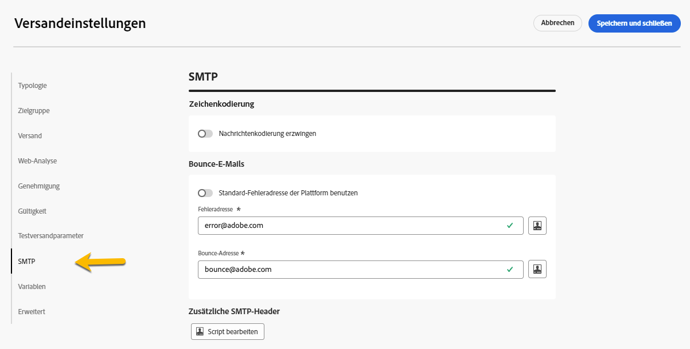
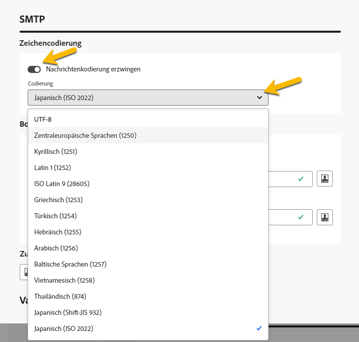
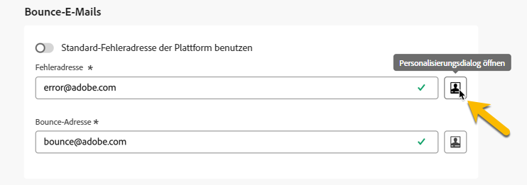
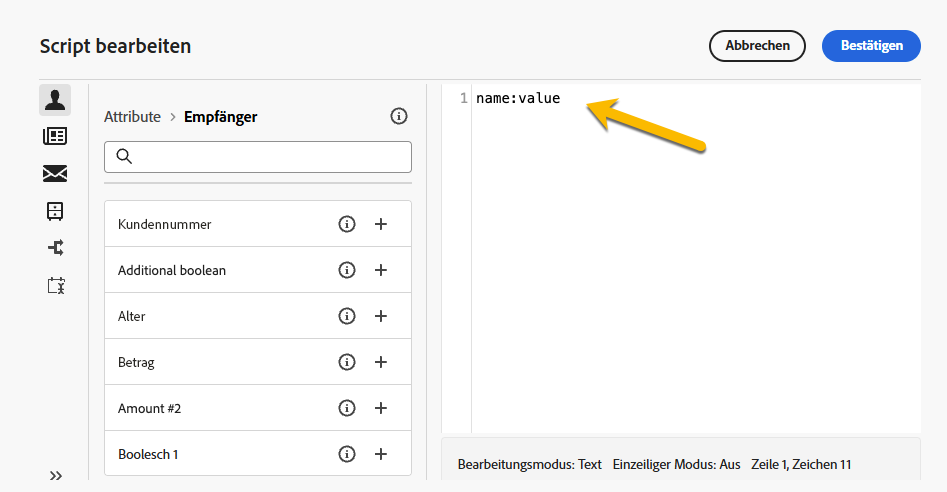
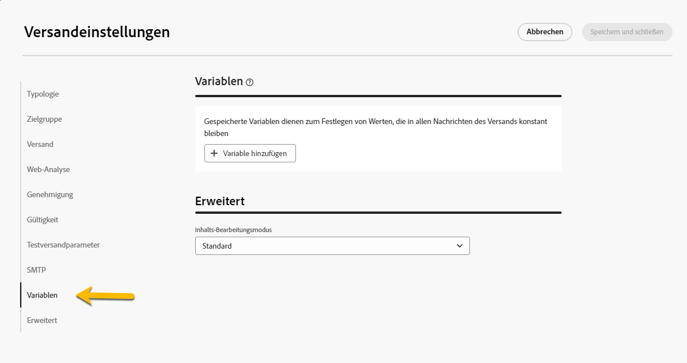

# Konfigurieren der Versandeinstellungen {#del-settings}

Bei den Versandeinstellungen handelt es sich um **technische Versandparameter**, die in der Versandvorlage definiert sind. Sie können bei jedem Versand überschrieben werden.  Diese Einstellungen sind über die Schaltfläche **Einstellungen** verfügbar, wenn ein Versand oder eine Versandvorlage bearbeitet wird.

>[!CAUTION]
>
>Diese Einstellungen werden hier nur zur Information beschrieben. Einige sind von Ihrer Konfiguration und Ihren Berechtigungen abhängig. Sie dürfen in dieser Version des Produkts nicht geändert werden.

## Typologieeinstellungen {#typology}

>[!CONTEXTUALHELP]
>id="acw_email_settings_typology"
>title="Typologie"
>abstract="Typologien ermöglichen es Ihnen, Geschäftspraktiken über alle Sendungen hinweg zu standardisieren. Eine Typologie ist eine Sammlung von Typologieregeln, mit denen der Versand von Sendungen gesteuert, gefiltert und priorisiert werden kann. Profile, die den Kriterien einer Typologieregel entsprechen, werden in der Vorbereitungsphase von den Versandzielgruppen ausgeschlossen."

>[!CONTEXTUALHELP]
>id="acw_delivery_template_settings_typology"
>title="Typologieeinstellungen für den Versand"
>abstract="Typologieregeln ermöglichen es Ihnen, Geschäftspraktiken über alle Sendungen hinweg zu standardisieren. Eine Typologie ist eine Sammlung von Typologieregeln, mit denen der Versand von Sendungen gesteuert, gefiltert und priorisiert werden kann. Profile, die den Kriterien einer Typologieregel entsprechen, werden in der Vorbereitungsphase von den Versandzielgruppen ausgeschlossen."

Typologien sind Gruppen von **Typologieregeln**, die während der Vorbereitungsphase ausgeführt werden, um auf einfache Weise mehrere Filterregeln gleichzeitig auf einen Versand anwenden zu können. Sie ermöglichen es Marketing-Fachleuten, ihre Geschäftspraktiken über alle Sendungen hinweg zu standardisieren, da sie die Durchführung von Sendungen kontrollieren, filtern und priorisieren können. [Erfahren Sie, wie Sie Typologien und Typologieregeln erstellen](../administration/typologies.md).

{zoomable="yes"}

### Druckparameter {#pressure-parameters}

>[!CONTEXTUALHELP]
>id="acw_email_settings_pressure_parameters"
>title="Druckparameter für den Versand"
>abstract="Die Versandgewichtung ermöglicht die Identifizierung von Sendungen mit der höchsten Priorität im Rahmen der Ermüdungsverwaltung. Nachrichten mit der höchsten Gewichtung haben Priorität."

>[!CONTEXTUALHELP]
>id="acw_delivery_template_settings_delivery_weight"
>title="Versandgewichtung"
>abstract="Die Versandgewichtung ermöglicht es Ihnen, im Rahmen der Druckverwaltung diejenigen Sendungen festzulegen, die vorrangig durchgeführt werden sollen. Die Nachrichten mit der höchsten Gewichtung haben Vorrang."

In diesem Abschnitt können Sie mithilfe von Druckparametern einen **Schwellenwert** definieren, um Regeln für die Ermüdungsverwaltung einzurichten, d. h. die maximale Anzahl von Nachrichten, die in einem bestimmten Zeitraum an ein Profil gesendet werden können.

Sobald diese Schwelle erreicht ist, können keine Sendungen mehr durchgeführt werden, bis der Zeitraum abgelaufen ist. Durch dieses Verfahren kann ein Profil aus einem Versand automatisch ausgeschlossen werden, wenn eine Nachricht die festgelegte Schwelle übersteigt. Dadurch wird verhindert, dass ein Profil zu oft angesprochen wird.

Schwellenwerte können konstant oder variabel sein. Das bedeutet, dass unterschiedliche Profile in einem bestimmten Zeitraum unterschiedliche Schwellen aufweisen können oder Schwellen sogar innerhalb desselben Profils variieren können.

Im Feld **[!UICONTROL Gewichtungstyp]** stehen drei Optionen zur Verfügung:

* **[!UICONTROL Konstante]**
* **[!UICONTROL Empfängerabhängig]**
* **[!UICONTROL Wird in jeder Regel definiert]**

Verwenden Sie das Feld **[!UICONTROL Versandgewichtung]**, um die Versandpriorität zu definieren. Jeder Versand verfügt über eine Gewichtung, die die jeweilige Priorität darstellt. Standardmäßig ist die Versandgewichtung auf den Wert 5 festgelegt. Mit Druckregeln können Sie die Gewichtung der Sendungen festlegen, auf die sie angewendet werden. Die Gewichtung kann konstant sein oder mithilfe einer Formel empfängerabhängig berechnet werden. Beispielsweise kann die Gewichtung eines Versands den Interessen eines Empfängers bzw. einer Empfängerin entsprechend bestimmt werden.

Verwenden Sie das Feld **[!UICONTROL Versandmodus]**, um den Zielgruppenauswertungsmodus auszuwählen.

Drei Modi sind verfügbar:

* **[!UICONTROL Zielgruppenschätzung und Nachrichtenpersonalisierung]**
* **[!UICONTROL Schätzung und Validierung der geplanten Zielgruppe]**
* **[!UICONTROL Zielgruppenauswertung]**

>[!NOTE]
>
>Die Ermüdungsverwaltung und Druckregeln werden in der Campaign-Client-Konsole konfiguriert. Weitere Informationen finden Sie in der [Dokumentation zu Campaign v8 (Client-Konsole)](https://experienceleague.adobe.com/docs/campaign/automation/campaign-optimization/pressure-rules.html?lang=de){target="_blank"}.

### Kapazitätseinstellungen {#capacity-settings}

>[!CONTEXTUALHELP]
>id="acw_email_settings_capacity_settings"
>title="Kapazitätseinstellungen für den Versand"
>abstract="Stellen Sie vor dem Versand von Nachrichten mithilfe von Kapazitätsregeln sicher, dass Ihr Unternehmen den Versand, die durch den Versand möglicherweise erzeugten eingehenden Nachrichten und die Anzahl der Anrufe, die beispielsweise an die Abonnentinnen und Abonnenten zu richten sind, verarbeiten kann. Die Kapazitätsregeln sind in der Adobe Campaign v8-Konsole definiert. Wählen Sie in diesem Bildschirm eine Regel aus, die dem Kanal zugeordnet ist."

>[!CONTEXTUALHELP]
>id="acw_delivery_template_settings_recipient_importance"
>title="Wichtigkeit der Empfängerin bzw. des Empfängers"
>abstract="Mit der Wichtigkeit der Empfängerin bzw. des Empfängers wird festgelegt, welche Profile im Falle einer Kapazitätsüberlastung der Typologieregeln beibehalten werden."

In diesem Abschnitt können Sie eine Kapazitätsregel auswählen, die in der Adobe Campaign v8-Konsole definiert ist. Diese Regel ist mit dem Kanal verknüpft.

Das Feld **[!UICONTROL Wichtigkeit der Empfängerin bzw. des Empfängers]** ist eine Formel, mit der definiert wird, welche Profile bei Überschreitung der Kapazitätstypologie-Regeln behalten werden.

>[!NOTE]
>
>Typologieregeln werden in der Campaign-Client-Konsole konfiguriert. Weitere Informationen finden Sie in der [Dokumentation zu Campaign v8 (Client-Konsole)](https://experienceleague.adobe.com/docs/campaign/automation/campaign-optimization/consistency-rules.html?lang=de){target="_blank"}.

## Zielgruppeneinstellungen {#audience}

>[!CONTEXTUALHELP]
>id="acw_email_settings_audience"
>title="Zielgruppeneinstellungen für den Versand"
>abstract="Ein **Zielgruppen-Mapping** unter den verfügbaren Optionen auswählen. Zielgruppen-Mappings werden in der Adobe Campaign v8-Konsole definiert. Außerdem können die Ausschlussparameter für den Versand festgelegt werden."

In diesem Abschnitt können Sie ein verfügbares **Zielgruppen-Mapping** auswählen. Zielgruppen-Mappings werden in der Adobe Campaign v8-Konsole definiert. Zielgruppen-Mapping ist der Datentyp, den ein Vorgang verarbeitet. Es ermöglicht die Bestimmung der Zielpopulation: Empfängerinnen und Empfänger, Vertragsbegünstigte, Benutzerinnen und Benutzer sowie Abonnentinnen und Abonnenten.  [Erfahren Sie mehr zu Zielgruppen-Mappings](../audience/targeting-dimensions.md).

Im Feld **[!UICONTROL Ausschluss]** können Sie Profile ausschließen, die nicht mehr kontaktiert werden möchten oder sich in Quarantäne befinden. [Weitere Informationen](https://experienceleague.adobe.com/docs/campaign/campaign-v8/send/failures/quarantines.html?lang=de){target="_blank"}

## Versand {#delivery}

>[!CONTEXTUALHELP]
>id="acw_email_settings_delivery"
>title="Globale Versandeinstellungen"
>abstract="Versandparameter sind technische Einstellungen, die für Ihren Versand gelten. Sie können den Versand und die Routinemodi ändern, E-Mail-BCC aktivieren, in Schüben senden und auch das Format der gesendeten E-Mail-Nachrichten auswählen. Diese Optionen sind erfahrenen Benutzerinnen und Benutzern vorbehalten."

**[!UICONTROL Versandparameter]** sind technische Einstellungen, die für Ihren Versand gelten.

{zoomable="yes"}

Das externe Konto **[!UICONTROL Integriertes Routing]** wird standardmäßig bereitgestellt. Es enthält die technischen Parameter, die es der Anwendung erlauben, Sendungen zu senden.

Sie können folgende **[!UICONTROL Versandeinstellungen]** definieren:

* **[!UICONTROL Versandpriorität]**: Diese Option ermöglicht es Ihnen, die Versandreihenfolge für Ihre Sendungen durch Angabe der Prioritätsstufe (normal, hoch oder niedrig) zu ändern.

* **[!UICONTROL Kontingentgröße]**: Mithilfe dieser Option können Sie die Anzahl der in einem XML-Versand-Package enthaltenen Nachrichten festlegen. Wenn der Parameter auf „0“ gesetzt ist, werden die Nachrichten automatisch gruppiert. Die Package-Größe wird durch die `<delivery size>/1024`-Berechnung definiert, mit mindestens 8 und maximal 256 Nachrichten pro Package.

  >[!IMPORTANT]
  >
  >Wenn der Versand durch Duplizieren eines existierenden Versands erstellt wird, wird dieser Parameter zurückgesetzt.

* **[!UICONTROL SMTP-Versand testen]** (E-Mail-Kanal): Diese Option wird verwendet, um den Versand über SMTP zu testen. Die E-Mail wird bis zur Verbindung mit dem SMTP-Server verarbeitet, aber nicht gesendet: Für jede Empfängerin und jeden Empfänger der E-Mail stellt Campaign eine Verbindung mit dem Server des SMTP-Anbieters her, führt den SMTP-Befehl RCPT TO aus und trennt die Verbindung vor dem SMTP-Befehl DATA.

* **[!UICONTROL E-Mail-BCC]** (E-Mail-Kanal): Diese Option wird verwendet, um mit der BCC-Funktion E-Mails in einem externen System zu speichern, indem einfach eine E-Mail-Adresse als BCC zu Ihrer Nachrichtenzielgruppe hinzugefügt wird. Weitere Informationen finden Sie in der [Dokumentation zu Campaign v8 (Client-Konsole)](https://experienceleague.adobe.com/docs/campaign/campaign-v8/send/emails/email-bcc.html?lang=de){target="_blank"}.

Wählen Sie im Abschnitt **[!UICONTROL Wellendefinition]** die Option **[!UICONTROL In mehreren Schüben versenden]**, um das gesendete Volumen progressiv in Schüben zu erhöhen. Dadurch wird verhindert, dass Ihre Nachrichten als Spam gekennzeichnet werden, oder Sie können die Anzahl der pro Tag versendeten Nachrichten beschränken. Mit Schüben können Sie Sendungen in mehrere Teilsendungen unterteilen, anstatt große Mengen von Nachrichten gleichzeitig zu senden. [Weitere Informationen](send-using-waves.md)

Bei E-Mails können Sie auch die **[!UICONTROL Mail-Formate]** der gesendeten Nachrichten wie unten beschrieben ändern.

* **[!UICONTROL Empfängereinstellungen verwenden]** (Standardmodus): Das E-Mail-Format wird entsprechend den im Empfängerprofil gespeicherten Daten definiert. Falls eine Empfängerin oder ein Empfänger Nachrichten in einem bestimmten Format erhalten möchte, werden sie in diesem Format gesendet.  Ohne Angabe in diesem Feld wird eine E-Mail vom Typ „Multipart-Alternative“ gesendet, wie im Anschluss erläutert.

* **[!UICONTROL E-Mail-Programm der Empfängerin bzw. des Empfängers das beste Format wählen lassen]**: Die E-Mail enthält sowohl das Text- als auch das HTML-Format. Welches Format beim Empfang angezeigt wird, hängt von der Konfiguration des E-Mail-Programms der Empfängerin bzw. des Empfängers ab (Multipart-Alternative).

  >[!IMPORTANT]
  >
  >Diese Option umfasst beide Versionen der Nachricht. Dies hat Auswirkungen auf die Versandrate, da die E-Mail dadurch größer wird.

* **[!UICONTROL Alle Nachrichten im Textformat senden]**: Die E-Mail wird im Textformat gesendet.  Das HTML-Format wird nicht gesendet, sondern lediglich für die Mirrorseite verwendet, wenn die Empfängerin bzw. der Empfänger auf die Nachricht klickt.

## Web-Analyse {#web-analytics}

>[!CONTEXTUALHELP]
>id="acw_email_settings_webanalytics"
>title="Web-Analyse-Einstellungen für den Versand"
>abstract="Ein Web-Analyse-Konto auswählen. Dieses Konto wird in der Campaign-Client-Konsole konfiguriert. Außerdem können die Tags definiert werden, die für das verwendete Analyse-Tool freigegeben wurden."

In diesem Abschnitt können Sie ein Web-Analyse-Konto auswählen. Dieses Konto wird in der Campaign-Client-Konsole konfiguriert.

Außerdem können die Tags definiert werden, die für das verwendete Analyse-Tool freigegeben wurden.

>[!NOTE]
>
>Web-Analyse-Funktionen werden in der Campaign-Client-Konsole konfiguriert. Weitere Informationen finden Sie in der [Dokumentation zu Campaign v8 (Client-Konsole)](https://experienceleague.adobe.com/docs/campaign/campaign-v8/connect/ac-aa.html?lang=de#external-account-ac){target="_blank"}.

## Weitere Zustellversuche {#retries}

>[!CONTEXTUALHELP]
>id="acw_delivery_template_settings_retries"
>title="Maximale Anzahl der weiteren Zustellversuche"
>abstract="Wenn ein Nachrichtenversand aufgrund eines temporären Fehlers fehlschlägt, werden weitere Zustellversuche bis zum Ende der Versandlaufzeit durchgeführt."

<!--Currently not visible in UI > ??-->

Sendungen von vorübergehend nicht zugestellten Nachrichten aufgrund eines Softbounce oder eines Ignoriert-Fehlers werden automatisch wiederholt. Standardmäßig sind innerhalb der ersten 24 Stunden des Versands fünf erneute Zustellversuche im Abstand von mindestens einer Stunde vorgesehen.

## Genehmigung (E-Mail-Kanal) {#approval}

>[!CONTEXTUALHELP]
>id="acw_email_settings_approval"
>title="Genehmigungsmodus für den Versand"
>abstract="Den Genehmigungsmodus auswählen. Wenn bei der Versandvorbereitung Warnungen erzeugt werden, kann der Versand so konfiguriert werden, dass definiert wird, ob er trotzdem ausgeführt werden soll."

>[!CONTEXTUALHELP]
>id="acw_delivery_template_settings_approval"
>title="Genehmigungsmodus für Sendungen"
>abstract="Wählen Sie den Genehmigungsmodus für Sendungen aus, die auf dieser Vorlage basieren. Wenn bei der Versandvorbereitung Warnungen erzeugt werden, kann der Versand so konfiguriert werden, dass definiert wird, ob er trotzdem ausgeführt werden soll."

Wenn bei der Vorbereitung eines E-Mail-Versands Warnungen erzeugt werden, kann der Versand so konfiguriert werden, dass definiert wird, ob er trotzdem ausgeführt werden soll oder nicht.  Standardmäßig müssen Benutzende den E-Mail-Versand am Ende der Analysephase bestätigen: Hierbei handelt es sich um eine **manuelle** Validierung.

Sie können im entsprechenden Feld einen anderen Validierungsmodus auswählen. Folgende Modi sind verfügbar: 

* **[!UICONTROL Manuell]**: Am Ende der Analysephase muss der Benutzer bzw. die Benutzerin den Versand bestätigen, um die Nachrichten abzuschicken.
* **[!UICONTROL Halbautomatisch]**: Die Nachrichten werden automatisch gesendet, wenn die Analysephase ohne Warnhinweise abgeschlossen wird.
* **[!UICONTROL Automatisch]**: Die Nachrichten werden unabhängig vom Ergebnis der Analysephase automatisch gesendet.

## Gültigkeit {#validity}

>[!CONTEXTUALHELP]
>id="acw_email_settings_validity"
>title="Gültigkeit der Einstellungen"
>abstract="Im Feld **Versandlaufzeit** können Sie die Zeitspanne angeben, während der erneute Zustellversuche unternommen werden. Dies bedeutet konkret, dass Adobe Campaign die Nachrichten ab dem Startdatum versendet und bis zum Ablauf der angegebenen Spanne nicht zustellbare Nachrichten in regelmäßigen Abständen erneut sendet. Das Feld **Gültigkeit von Ressourcen** wird für hochgeladene Ressourcen verwendet, wie etwa die Mirrorseite oder Bilder. Nach Erreichen des Grenzwerts sind keine Ressourcen mehr verfügbar."

>[!CONTEXTUALHELP]
>id="acw_delivery_template_settings_resources_validity"
>title="Gültigkeit von Ressourcen"
>abstract="Das Feld **Gültigkeit von Ressourcen** wird für Ressourcen verwendet, die online verfügbar sind, insbesondere für die Mirrorseite und Bilder. Diese Ressourcen sind für eine begrenzte Zeit gültig: Nach Erreichen des Grenzwerts sind keine Ressourcen mehr verfügbar."

>[!CONTEXTUALHELP]
>id="acw_delivery_template_settings_delivery_duration"
>title="Versandlaufzeit"
>abstract="Im Feld **Versandlaufzeit** können Sie die Zeitspanne angeben, während der erneute Zustellversuche unternommen werden. Dies bedeutet konkret, dass Adobe Campaign die Nachrichten ab dem Startdatum versendet und bis zum Ablauf der angegebenen Spanne nicht zustellbare Nachrichten in regelmäßigen Abständen erneut sendet."

<!--
>[!CONTEXTUALHELP]
>id="acw_email_settings_resources_validity"
>title="Resources validity limit"
>abstract="The Validity limit field is used for uploaded resources, such as the mirror page or images. These resources are valid for a limited time: once the limit is reached, resources are no longer available."
-->

### Gültigkeitszeitraum {#validity-period}

Im Feld **[!UICONTROL Versandlaufzeit]** kann die Zeitspanne angegeben werden, in der erneute globale Zustellversuche unternommen werden. Dies bedeutet konkret, dass Adobe Campaign die Nachrichten ab dem Startdatum versendet und bis zum Ablauf der angegebenen Spanne nicht zustellbare Nachrichten in regelmäßigen Abständen erneut sendet.

Sie können alternativ auch ein genaues Datum angeben. Markieren Sie dazu die Option **[!UICONTROL Gültigkeit explizit festlegen]**. In diesem Fall kann mit den Versand- und Gültigkeitsdaten auch eine bestimmte Uhrzeit konfiguriert werden. Standardmäßig wird die aktuelle Uhrzeit eingesetzt, sie kann jedoch direkt im Eingabefeld angepasst werden.

Das Feld **[!UICONTROL Gültigkeit von Ressourcen]** wird für hochgeladene Ressourcen verwendet, insbesondere für die Mirrorseite und Bilder. Die Gültigkeitsdauer von Ressourcen auf dieser Seite ist begrenzt, um Speicherkapazität zu sparen. Nach diesem Limit sind diese Ressourcen nicht mehr verfügbar.

{zoomable="yes"}

<!--Change screenshot to be consistent with prod > not sure which version is correct-->

Weitere Informationen zur Gültigkeitsdauer von Sendungen finden Sie in der [Dokumentation zu Campaign v8 (Client-Konsole)](https://experienceleague.adobe.com/docs/campaign/campaign-v8/campaigns/send/failures/delivery-failures.html?lang=de#validity-period){target="_blank"}.

### Verwaltung der Mirrorseite (E-Mail-Kanal) {#mirror}

Eine Mirrorseite ist eine HTML-Seite, die über einen Webbrowser online abgerufen werden kann und deren Inhalt mit dem der E-Mail identisch ist. Standardmäßig wird die Mirrorseite automatisch generiert, wenn der entsprechende Link in den Inhalt der E-Mail eingefügt wurde.

Zusätzlich zum Standardmodus stehen die folgenden Optionen zur Verfügung:

* **[!UICONTROL Mirrorseitenerzeugung forcieren]**: Verwenden Sie diesen Modus, um die Mirrorseite selbst dann zu erstellen, wenn in die E-Mail kein Link zur Mirrorseite eingefügt wird.
* **[!UICONTROL Keine Mirrorseite erzeugen]**: Verwenden Sie diesen Modus, um die Erstellung einer Mirrorseite zu vermeiden, selbst wenn der Link in der E-Mail vorhanden ist.
* **[!UICONTROL Von der Nachrichtenkennung aus zugängliche Mirrorseite erzeugen]**: Wenn der Mirrorseite-Link nicht im E-Mail-Inhalt vorhanden ist, verwenden Sie diese Option, um den Zugriff auf den Inhalt der Mirrorseite im Versandlog-Fenster über die Client-Konsole zu aktivieren.

### Tracking {#tracking}

<!--
>[!CONTEXTUALHELP]
>id="acw_email_settings_tracking_validity"
>title="Validity period"
>abstract="This option defines the duration for which the tracking is activated on the URLs."
-->

>[!CONTEXTUALHELP]
>id="acw_delivery_template_settings_tracking_validity"
>title="Gültigkeitszeitraum"
>abstract="Der Gültigkeitszeitraum legt die Dauer fest, für die das Tracking in den Nachrichten-URLs aktiviert ist."

**[!UICONTROL Trackingparameter]** werden im entsprechenden Abschnitt definiert. Mögliche Optionen sind:

* **[!UICONTROL Tracking-Gültigkeit]**: Verwenden Sie diese Option, um die Dauer zu ändern, für die das Tracking für die URLs aktiviert ist.
* **[!UICONTROL Ersatz-URL für abgelaufene URLs]**: Verwenden Sie diese Option, um eine Fallback-URL für eine Web-Seite einzugeben: Sie wird angezeigt, wenn das Tracking abgelaufen ist.

## Testversandeinstellungen {#test-setttings}

>[!CONTEXTUALHELP]
>id="acw_email_settings_testsettings"
>title="Definieren der Testversandparameter für den Versand"
>abstract="Wählen Sie die Ausschlussparameter aus und passen Sie den Titel der Testsendungen an."

<!--Test to be replaced with Proof everywhere - currently not consistent within UI > changed to Proof to reflect UI here but not consistent in documentation either-->

Sie können die Ausschlussparameter in diesem Abschnitt festlegen. Folgende Optionen sind verfügbar: 

* **[!UICONTROL Dubletten beibehalten]**: Ermöglicht es, mehrere Sendungen an Profile zu genehmigen, die mehrere Zielgruppenbestimmungskriterien erfüllen.
* **[!UICONTROL Adressen auf der Blockierungsliste behalten]**: Ermöglicht es, Zielgruppenprofile, die nicht mehr in den Versand eingeschlossen sind, beizubehalten, z. B. nach einer Abmeldung (Opt-out).
* **[!UICONTROL Quarantäneadressen beibehalten]**: Ermöglicht es, Zielgruppenprofile mit einer Adresse beizubehalten, über die keine Reaktion erfolgt.

Sie können auch den Namen der Testsendungen anpassen:

* Verwenden Sie die Option **[!UICONTROL Versandcode für den Testversand beibehalten]**, um den Testversand mit demselben Versand-Code zu verknüpfen, der für den Versand, auf den er sich bezieht, definiert ist.
* Standardmäßig wird dem Betreff des Testversands „TESTVERSAND #“ vorangestellt, wobei # die Nummer des Testversands ist. Sie können dieses Präfix im Feld **[!UICONTROL Titelpräfix]** ändern.

## SMS-Einstellungen (SMS-Kanal) {#sms-tab}

>[!CONTEXTUALHELP]
>id="acw_sms_delivery_settings"
>title="SMS-Versandeinstellungen"
>abstract="SMS-Versandparameter sind technische Einstellungen, die für Ihren SMS-Versand gelten. Sie können die Absenderadresse, Service-Parameter, den Übertragungsmodus und mehr definieren. Diese Optionen sind erfahrenen Benutzerinnen und Benutzern vorbehalten."

SMS-Versandparameter sind technische Einstellungen, die für Ihren SMS-Versand gelten. Sie können die Absenderadresse, Service-Parameter, den Übertragungsmodus und mehr definieren. Diese Optionen sind erfahrenen Benutzerinnen und Benutzern vorbehalten.

<!--

* **[!UICONTROL Sender address]**

  The field is limited to 21 characters by the SMPP specification, but some providers may allow longer values. Note also that very strict restrictions may be applied in some countries (length, content, allowed characters, …), so you may need to double-check that the content you place here is legal. Be especially careful when using personalized fields.

  This optional field allows you to override the sender address (oADC). Its content is placed in the *source_addr* field of the SUBMIT_SM PDU.

  Although the SMPP specification limits this field to 21 characters, some providers may support longer values. Be aware that certain countries impose strict regulations on sender addresses (regarding length, content, allowed characters, etc.), so always verify that your input complies with local requirements. Use extra caution when working with personalized fields.

  If this field is left empty, the value of the Source number field defined in the external account will be used instead. If both values are empty, the *source_addr* field will be left empty.

-->

* **[!UICONTROL Service-Typ]**:

  Dieser Parameter wird unverändert an den Anbieter übergeben.

* **[!UICONTROL Dienst- oder Programm-ID]**

  >[!NOTE]
  >
  >Von der Verwendung dieses Feldes wird abgeraten. Optionale SMPP-Parameter, die in der Client-Konsole verfügbar sind, bieten eine wesentlich flexiblere Implementierung.
  >
  >Dieses Feld kann nicht gleichzeitig mit optionalen SMPP-Parametern verwendet werden.

  Ermöglicht in Kombination mit der entsprechenden Einstellung des externen Kontos das Senden eines optionalen Parameters mit jedem MT. Dieses Feld definiert den Werteteil des TLV.

* **[!UICONTROL Übermittlungsmodus]**

  Dieses Feld definiert den Typ der zu sendenden SMS: ob es sich um eine normale oder eine Flash-Nachricht handelt und ob sie auf dem Mobilgerät oder der SIM-Karte gespeichert werden soll. Diese Einstellung wird im optionalen Feld „dest_addr_subunit“ in der SUBMIT_SM-PDU übertragen.

   * **Flash** setzt den Wert auf 1. Sendet eine Flash-SMS, die sofort auf dem Bildschirm erscheint und nicht gespeichert wird.
   * **Normal** setzt den Wert auf 0. Sendet eine Standard-SMS.
   * **Auf Mobilgerät gespeichert** setzt den Wert auf 2. Weist das Gerät an, die SMS im internen Speicher zu speichern.
   * **Im Terminal gespeichert** setzt den Wert auf 3. Weist das Gerät an, die SMS auf der SIM-Karte zu speichern.

* **[!UICONTROL Priorität, Kommunikationstyp]**

  Diese Felder werden vom erweiterten SMPP-Connector ignoriert.

* **[!UICONTROL Maximale Anzahl an SMS pro Nachricht]**

  Diese Einstellung ist nur wirksam, wenn die Option Nachrichten-Payload deaktiviert ist (weitere Einzelheiten finden Sie in den Einstellungen des externen Kontos). Wenn für die Nachricht mehr SMS als dieser Wert erforderlich sind, wird ein Fehler ausgelöst.

  Während das SMS-Protokoll die Aufteilung von Nachrichten in bis zu 255 Teile ermöglicht, können einige mobile Geräte Probleme haben, Nachrichten mit mehr als 10 Teilen neu zusammenzustellen (die Begrenzung hängt vom Gerätemodell ab). Aus Gründen der Zuverlässigkeit empfiehlt es sich, Nachrichten auf maximal 5 Teile zu beschränken.

  Beachten Sie, dass aufgrund der Funktionsweise personalisierter Nachrichten in Adobe Campaign die Nachrichtengrößen variieren können. Eine hohe Anzahl langer Nachrichten kann zu erhöhten Versandkosten führen, sodass die Verwendung eines sinnvollen Limits hilft, die Kosten zu kontrollieren.

  Wenn Sie diesen Wert auf 0 setzen, wird die Begrenzung deaktiviert.

## SMTP-Einstellungen für den E-Mail-Versand {#smtp}

>[!CONTEXTUALHELP]
>id="acw_email_settings_smtp"
>title="SMTP-Parameter"
>abstract="Sie können Ihrem E-Mail-Versand zusätzliche SMTP-Parameter hinzufügen."

Sie können Ihrem E-Mail-Versand zusätzliche SMTP-Parameter hinzufügen. Dies ist auf der Registerkarte „SMTP“ der Versandeinstellungen möglich.

{zoomable="yes"}

### Zeichenkodierung {#character-encoding}

Im Abschnitt **[!UICONTROL Zeichenkodierung]** können Sie eine bestimmte Kodierung festlegen. Die Standardkodierung ist UTF-8. Sie kann für die meisten Zeichen verwendet werden. Einige E-Mail-Anbieter zeigen Sonderzeichen jedoch möglicherweise nicht richtig an, wenn sie die UTF-8-Standardkodierung nicht unterstützen.

Wenn Sie beispielsweise eine E-Mail mit japanischen Zeichen versenden möchten, ist es besser, eine Kodierung zu verwenden, die gezielt diese Zeichen unterstützt, damit Ihre Zielgruppe in Japan alles korrekt sehen kann.

Aktivieren Sie dazu den Umschalter **[!UICONTROL Nachrichtenkodierung erzwingen (Codepage)]** und wählen Sie die richtige Kodierung aus der Liste aus, die Ihre Sonderzeichen unterstützt.

{zoomable="yes"}

### Bounce-E-Mails {#bounce-emails}

Auf der Registerkarte **[!UICONTROL SMTP]** der Versandeigenstellungen lässt sich außerdem der Umgang mit Bounce-E-Mails konfigurieren.

* **[!UICONTROL Fehleradresse]**: Wenn Sie den Umschalter **[!UICONTROL Standard-Fehleradresse der Plattform benutzen]** aktivieren, werden Bounce-E-Mails im Standard-Fehlerfeld der Plattform empfangen. Wenn Sie sie nicht aktivieren, können Sie eine bestimmte Fehleradresse für Ihren Versand definieren.

* **[!UICONTROL Bounce-Adresse]**: Sie können auch eine andere Adresse definieren, an die die nicht verarbeiteten Bounce Messages weitergeleitet werden. Diese Adresse ermöglicht es, die Gründe für das Bounce-Verhalten zu untersuchen, wenn E-Mails von der Anwendung nicht automatisch qualifiziert werden konnten.

Diese beiden Felder können wie in [diesem Abschnitt](../personalization/gs-personalization.md) beschrieben personalisiert werden.

{zoomable="yes"}

### Zusätzliche SMTP-Header {#smtp-headers}

Auf der Registerkarte „SMTP“ der Versandeinstellungen können Sie Ihrem E-Mail-Versand **[!UICONTROL SMTP-Header]** hinzufügen.

Das in diesem Fenster erfasste Skript muss pro Zeile einen Header im Format „Name:Wert“ enthalten.

Werte werden bei Bedarf automatisch verschlüsselt.

{zoomable="yes"}

>[!IMPORTANT]
>
>Das Hinzufügen eines Scripts für zusätzliche SMTP-Header ist eine Aufgabe für erfahrene Benutzer. Die Syntax des Scripts muss die Anforderungen für diesen Inhaltstyp (keine überflüssigen Leerzeichen, keine Leerzeilen usw.) erfüllen.

## Hinzufügen von Variablen {#variables-delivery}

>[!CONTEXTUALHELP]
>id="acw_delivery_settings_variable"
>title="Variablen"
>abstract="Dem Versand können Variablen hinzufgefügt werden, die für Tracking und Personalisierung nützlich sein können. Der Zugriff auf diese Variablen ist sowohl über den Versandinhalt als auch über die Workflows möglich."

Dem Versand können Variablen hinzufgefügt werden, die für Tracking und Personalisierung nützlich sein können. Der Zugriff auf diese Variablen ist sowohl über den Versandinhalt als auch über die Workflows möglich. Mit gespeicherten Variablen werden Werte festgelegt, die für alle Nachrichten innerhalb Versands konstant bleiben. Sie können auch in Versandvorlagen konfiguriert werden.

Um eine Variable hinzuzufügen, navigieren Sie zur Registerkarte **[!UICONTROL Variablen]**, wie unten dargestellt.

{zoomable="yes"}

Klicken Sie auf die Schaltfläche **[!UICONTROL Variablen hinzufügen]**, um die Details Ihrer Variablen einzugeben. Sie können den zugehörigen Wert direkt hinzufügen oder einen Ausdruck dafür verwenden, indem Sie das Kontrollkästchen **[!UICONTROL Der Wert ist das Ergebnis eines Ausdrucks]** aktivieren. Klicken Sie anschließend auf **[!UICONTROL Bestätigen]**, um Ihre Änderungen zu speichern.

{zoomable="yes"}

Erfahren Sie mehr über [die Verwendung von Variablen für die Personalisierung](../personalization/personalize.md#variables-personalization) und die [Verwendung von Variablen für dynamischen Inhalt](../personalization/conditions.md#variables-conditional).