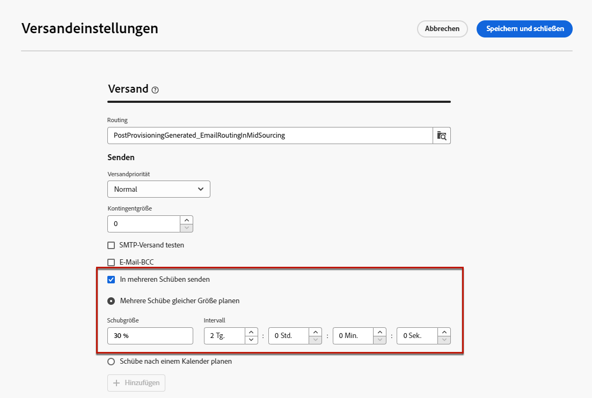
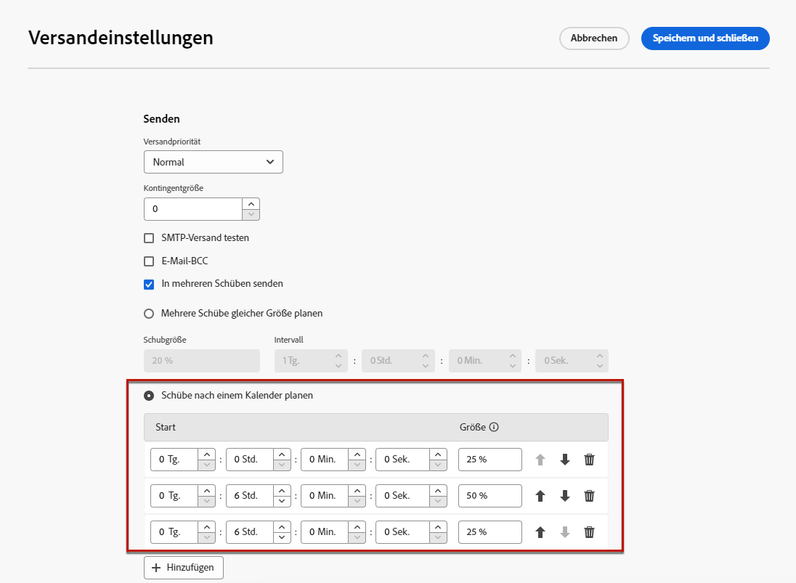
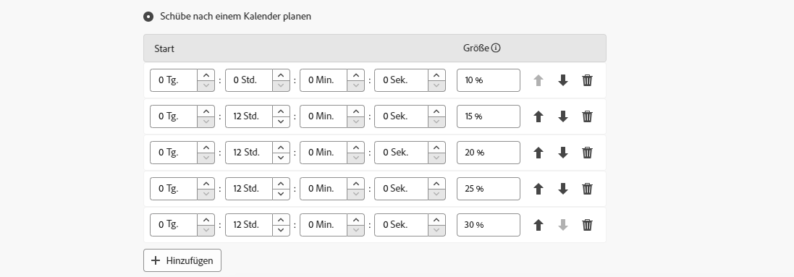

# Versenden in Schüben {#send-using-waves}

>[!CONTEXTUALHELP]
>id="acw_deliveries_waves_definition"
>title="Aufteilen von Sendungen in mehrere Teilsendungen"
>abstract="Schübe erstellen, um Sendungen in mehrere Teilsendungen zu unterteilen, anstatt gleichzeitig große Mengen von Nachrichten zu senden. Es ist möglich, mehrere Schübe derselben Größe zu konfigurieren oder einen Kalender für die verschiedenen Schübe festzulegen, die gesendet werden sollen."

>[!CONTEXTUALHELP]
>id="acw_deliveries_waves_size"
>title="Definieren der Größe jedes Schubs"
>abstract="Sie müssen für alle hinzugefügten Schübe eine Größe eingeben. Geben Sie entweder einen numerischen Wert (Anzahl der Nachrichten für jeden Schub) oder einen Prozentsatz (0–100 %) ein."

Um die Auslastung auszugleichen, können Sie E-Mail-Sendungen in mehrere Teilsendungen unterteilen. Konfigurieren Sie die Anzahl der Teilsendungen und ihren Anteil in Bezug auf den gesamten Versand sowie das Intervall zwischen zwei Schüben.

>[!NOTE]
>
>Sie können nur die Größe und die Verzögerung zwischen zwei aufeinander folgenden Schüben definieren. Die Empfänger-Auswahlkriterien für jeden Schub können nicht angepasst werden.

Gehen Sie wie folgt vor, um Sendungen in Schüben zu versenden.

1. Öffnen Sie die [Versandeigenschaften](delivery-settings.md#retries).

1. Navigieren Sie zum Abschnitt **[!UICONTROL Versand]**.

1. Wählen Sie die Option **[!UICONTROL In mehreren Schüben versenden]** aus.

1. Zur Konfiguration von Schüben haben Sie die folgenden Möglichkeiten:

   * [Mehrere Schübe gleicher Größe planen](#waves-same-size)
   * [Schübe nach einem Kalender planen](#waves-calendar)

1. Bereiten Sie Ihren Versand wie gewohnt vor und senden Sie ihn ab. [Weitere Informationen](../msg/gs-deliveries.md)

   >[!CAUTION]
   >
   >Achten Sie darauf, dass die letzten Schübe nicht die Gültigkeitsdauer des Versands überschreiten, die auf der Registerkarte [Gültigkeit](delivery-settings.md#validity) festgelegt ist. Ansonsten werden manche Nachrichten möglicherweise nicht gesendet. Eine spezifische Typologie-Kontrollregel (**[!UICONTROL Prüfung der Schub-Planung]**) stellt sicher, dass der letzte Schub vor dem Ablauf der Versandgültigkeit eingeplant ist. Weitere Informationen zu Kontrollregeln finden Sie in der [Dokumentation zu Campaign v8 (Client-Konsole)](https://experienceleague.adobe.com/docs/campaign/automation/campaign-optimization/control-rules.html?lang=de)
   >
   >Planen Sie bei der Konfiguration der letzten Schübe auch genügend Zeit für zusätzliche Versuche ein. [Weitere Informationen](delivery-settings.md#retries)

1. Um Ihre Sendungen zu überwachen, navigieren Sie zu den [Versandlogs](../monitor/delivery-logs.md). Die Versandlogs enthalten die bereits in den verarbeiteten Schüben durchgeführten Sendungen (Status **[!UICONTROL Gesendet]**) sowie die in den restlichen Schüben durchzuführenden Sendungen (Status **[!UICONTROL Ausstehend]**).

## Mehrere Schübe gleicher Größe planen {#waves-same-size}

Wenn Sie diese Option wählen, haben alle Schübe dieselbe Größe (mit Ausnahme des letzten Schubs) und die Verzögerung vor jedem Schub ist immer identisch.

{zoomable="yes"}

* Geben Sie die Größe für alle Schübe an, in die Sie den Versand unterteilen. Sie können einen Prozentsatz oder einen numerischen Wert eingeben. Nur der letzte Schub kann variieren, da er die verbleibende Nachrichtenanzahl enthalten muss.

  Wenn Sie beispielsweise **[!UICONTROL 30 %]** im Feld **[!UICONTROL Schubgröße]** eingeben, entsprechen die ersten drei Schübe je 30 % aller im Versand enthaltenen Nachrichten, während der vierte die restlichen 10 % ausmacht.

* Geben Sie im Abschnitt **[!UICONTROL Intervall]** die Verzögerung zwischen dem Beginn von zwei aufeinanderfolgenden Wellen an. Wenn Sie zum Beispiel **[!UICONTROL 2 Tage]** eingeben, startet der erste Schub sofort, der zweite Schub startet in zwei Tagen und der dritte in vier Tagen.

Ein gängiges Anwendungsbeispiel für die Verwendung mehrerer Schübe gleicher Größe ist der Einsatz eines Callcenters. Bei telefonischen Treuekampagnen verfügen Unternehmen oft über begrenzte Kapazitäten für die Verarbeitung der Anrufe an Abonnenten.

Mithilfe von Schüben kann die Anzahl der Nachrichten auf 20 pro Tag beschränkt werden, was der täglichen Verarbeitungskapazität eines Callcenters entspricht.

Wählen Sie dazu die Option **[!UICONTROL Mehrere Schübe derselben Größe planen]**. Geben Sie **[!UICONTROL 20]** als Schubgröße und **[!UICONTROL 1 Tag]** im Feld **[!UICONTROL Intervall]** ein.

{zoomable="yes"}

## Schübe nach einem Kalender planen {#waves-calendar}

Wenn Sie diese Option auswählen, definieren Sie den Starttag/die Startzeit für jeden gesendeten Schub sowie die Größe jedes Schubs.

* Geben Sie in den Feldern **[!UICONTROL Start]** die Verzögerung zwischen dem Start zweier aufeinanderfolgender Schübe an.

* Geben Sie in der Spalte **[!UICONTROL Größe]** eine feste Zahl oder einen Prozentsatz ein.

Fügen Sie so viele Schübe wie nötig hinzu. Ordnen Sie sie entsprechend Ihren Anforderungen neu an.

>[!NOTE]
>
>Wenn Sie Prozentsätze verwenden, sollte die Summe für alle Schübe 100 % nicht überschreiten.

Im folgenden Beispiel entspricht der erste Schub 25 % der Gesamtzahl der im Versand enthaltenen Nachrichten und beginnt sofort. Die beiden nächsten Schübe vervollständigen den Versand und starten in Sechs-Stunden-Intervallen.

{zoomable="yes"}

Ein gängiger Anwendungsfall für mehrere Schübe gemäß Kalender ist der Einsatz während der Anlaufphase.

Wenn E-Mails über eine neue Plattform versendet werden, sind ISPs normalerweise misstrauisch gegenüber den neuen IP-Adressen. Das plötzliche Versenden großer Mengen an E-Mails veranlasst ISPs oft dazu, sie als Spam zu qualifizieren.

Um zu verhindern, dass Ihre Sendungen als Spam eingestuft werden, erhöhen Sie das gesendete Volumen schrittweise mithilfe von Schüben. Dies stellt eine reibungslose Anfangsphase sicher und verringert die Gesamtrate ungültiger Adressen.

Verwenden Sie dazu die Option **[!UICONTROL Schübe in einem Kalender definieren]**. Setzen Sie beispielsweise den ersten Schub auf 10 %, den zweiten auf 15 %, den dritten auf 20 % usw.

{zoomable="yes"}